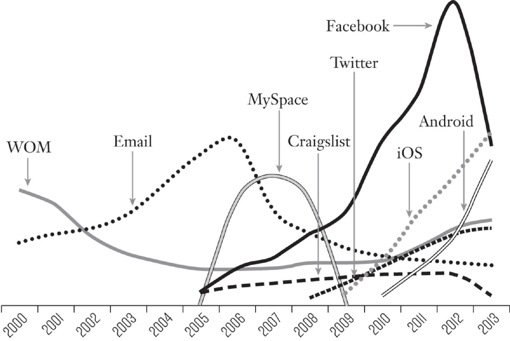

# Introduction

When I (Sean) got a call from Dropbox founder Drew Houston in 2008, I was immediately intrigued by the predicament the one-year-old start-up was in. The company’s cloud-based file storage and sharing service had built up a good early fan base, concentrated primarily among the tech-savvy community centered in Silicon Valley. Even before the product was completely built, Houston had pushed a video prototype online illustrating how the service would work, which had earned him the backing of the powerful Y Combinator start-up incubator and drawn a flood of early adopters.

It became pretty clear that Houston was on to something when the waiting list he was keeping for the beta version grew from 5,000 to 75,000 in a blink of an eye when a second video was posted on news aggregator site Digg and went viral.[1](part0017_split_001.html#itr-fnt1) The next wave of users who signed up after the public launch were happy with the service, but Houston was still running into a wall trying to break out beyond the tech elite. And he didn’t have much time. The competition was fierce. One start-up, Mozy, had a three-year head start, while another, Carbonite, had raised $48 million in funding—versus the $1.2 million in seed capital raised by Houston. Meanwhile, behemoths Microsoft and Google were gearing up to enter the cloud storage arena. How could Dropbox grow their customer base in the shadow of such formidable competitors?

When Houston called me, he wanted to explore what I could do to help them grow beyond their very solid but not-yet-big-enough pool of early adopters. I was just wrapping up an interim VP of marketing role at Xobni, a start-up run by Drew’s good friend Adam Smith, when Adam suggested that we meet to discuss Dropbox’s challenges. I had developed a reputation in Silicon Valley as someone who could figure out how to help companies take off, particularly those facing fierce competition and limited budgets such as Dropbox was. I’d first had success driving growth at the online game pioneer Uproar, growing the site to one of the 10 largest on the Web, with more 5.2 million gamers at the time of IPO in March of 2000, all in the face of an aggressive push into gaming from Sony, Microsoft, and Yahoo2 I’d then moved over to work on growth initiatives at LogMeIn, an innovative service started by the Uproar founder. There I’d managed to help turn the company into the market leader despite a massive marketing campaign waged by its main competitor, GoToMyPC. What was the secret? I worked with the engineers to utilize technology for what was, to them, an unconventional purpose: to craft novel methods for finding, reaching, and learning from customers in order to hone our targeting, grow our customer base, and get more value from our marketing dollars. I knew nothing about software engineering when I started my career in 1994 selling print ad space for a business journal at a time when businesses were just starting to move to the Web. But I saw the promise of the future in Web business, and so when I got to know the founder of Uproar, I decided to invest some of my hard-won sales commissions and hop over to work for the gaming portal, once again, selling ads. It wasn’t long before I caught on to the dangers of relying only on traditional marketing methods—even the newer, Internet-era versions of old methods, like online banner ads—to drive growth. My big wake-up moment was probably when the leading advertising firms I was trying to sell to, such as Saatchi and Ogilvy, declined to recommend banner ads on Uproar to their clients, on the grounds that the site didn’t have a large enough user base. Short on cash and in danger of missing out on much-needed sales commissions, I suddenly found myself tasked by the founder with figuring out how to bring in more users, fast. My first approach was paid advertising on Internet portals, like Yahoo!, and that stoked growth nicely. But it was costly, and, just as Drew Houston later discovered with Dropbox, the ads weren’t bringing in enough bang for the buck. Meanwhile, Sony, Yahoo!, and Microsoft started making their big push, flooding the Web with gaming ads, and as a young start-up, Uproar didn’t have anywhere close to the money needed to compete with them head to head. I knew I had to find another way.

That’s when I got the idea of creating an entirely new type of advertisement that allowed Web proprietors to offer Uproar games for free on their site, meaning the site got fun new features to offer their visitors, and Uproar got exposure to everyone who visited those pages. The founder gave the go-ahead, and within a few weeks, the engineers and I had created a new single-player game that could be added to any website, with just a small snippet of code: one of the first embeddable widgets. The site proprietors would become Uproar affiliates, paid just $.50 for each new game player the company acquired through their sites. The low cost made it highly affordable for us and, because the game was so engaging, the affiliates were happy to feature it. In addition to sending new gamers to Uproar, we experimented with adding an “add this game to your site” link, which made it easy for other website owners to make the game available on their sites, too.

As we saw the game start to take off, we tested different versions of the copy, calls to action, and which free game we offered to find the most potent combination. The result for Uproar was explosive growth; the free games were soon on 40,000 sites and Uproar shot to the top of the online gaming world, beating out the behemoths and their splashy marketing campaigns. Many other companies have since used the same strategy to grow, the most famous example being YouTube, who later supercharged its growth by creating its embeddable video player widget, which landed YouTube videos all over the Web and turned online video into a phenomenon.

It was this success that led the founder of Uproar to ask me to come help grow his next venture, LogMeIn. LogMeIn was an ingenious product that let users access their files, email, and software on their home or work desktop computer from any other PC connected to the Internet. Yet while an aggressive search engine marketing campaign led to a good initial burst of customer sign-ups, they soon plateaued, and I realized that ads were once again proving far too costly for the payoff—especially since, at my suggestion, LogMeIn had pivoted from a paid to a freemium model in an effort to differentiate the service from its fierce competitor, GoToMyPC. At over $10,000 in ad spend per month, the customer acquisition costs no longer generated a positive return on the investment. Despite lots of ad copy testing and playing around with different keywords and advertising platforms, the conversion rate was woefully low—and this for a service that was clearly incredibly helpful, and was free, to boot. So once again I turned to technology to find a novel way to try to solve the problem.

I decided that we should try to get feedback from people who had signed up but had then abandoned the service. We had collected their email addresses as part of the sign-up process, and we sent out an email asking them why they weren’t using LogMeIn. Seems obvious, but it was a radical idea at the time. After just a few days, the collective responses offered an absolutely unequivocal explanation: people didn’t believe the service was really free. At the time, the freemium software model was new and it still seemed too good to be true to lots of people. So with that realization, I got my marketing and engineering teams in a room to brainstorm ideas for how to change the landing page, to better communicate to customers that there was no “catch”—that LogMeIn did, in fact, offer a completely free version of the product. We experimented with many iterations of marketing copy and page designs, and yet even this led to very little meaningful improvement. We then decided to test adding a simple link to buy the paid version to the page. And with that, we found a winning combination of design, message, and offer that led to a tripling of the conversion rate. That was just the start, though. Upon digging into the data, we discovered an even bigger drop-off among users who downloaded the software but then didn’t follow through and use it. We kept experimenting, such as with changes in the install process, the sign-up steps, and more, and ultimately we improved the conversion rate to the point that search ads not only became cost effective again, they could be profitably scaled by over 700 percent. So scale up the company did, and immediately growth took off.

Once again, the solution had been found in just weeks, using a recipe that included healthy doses of out-of-the-box thinking, cross-company collaboration and problem solving, real-time market testing and experimentation (conducted at little or no cost), and a commitment to being nimble and responsive in acting on the results. These are the very ingredients that I later codified into the growth hacking methodology you’ll read about in the pages that follow.

Of course, Uproar and LogMeIn weren’t the only start-ups in town combining programming and marketing know-how with the emerging characteristics of the Web to drive growth. Hotmail, for example, was one of the first to tap into the viral quality of Web products—and their ability to “sell themselves”—when it added the simple tagline “P.S.: Get Your Free Email at Hotmail” at the bottom of every email that users sent, with a link to a landing page to set up an account.[3](part0017_split_001.html#itr-fnt3) At the same time, PayPal had demonstrated the extraordinary growth potential in creating the synergy between a product and a popular Web platform—in their case, eBay. When the team noticed auction owners promoting the PayPal service as an easy way for winners to pay, they created AutoLink, a tool that automatically added the PayPal logo and a link to sign up to all of their active auction listings. This tool tripled the number of auctions using PayPal on eBay and ignited its viral growth on the platform.[4](part0017_split_001.html#itr-fnt4) LinkedIn, which had struggled to gain traction in its first year, saw their growth begin to skyrocket in late 2003, when the engineering team worked out an ingenious way for members to painlessly upload and invite their email contacts stored in their Outlook address book, kicking network effects growth into high gear.[5](part0017_split_001.html#itr-fnt5) And in each of these cases, growth was achieved not with traditional advertising, but rather with a dash of programming smarts and on a shoestring budget.

Approaches like these to building, growing, and retaining a customer base that relied not on traditional marketing plans, a pricey launch, and a big ad spend, but rather on harnessing software development to build marketing into products themselves, were proving both extraordinarily powerful *and* incredibly cost effective. Perhaps more important, companies’ growing ability to collect, store, and analyze vast amounts of user data, and to track it in real time, was now enabling even small start-ups to experiment with new features, new messaging or branding, or other new marketing efforts—at an increasingly low cost, much higher speed, and greater level of precision. The result was the emergence of a rigorous approach to fueling rapid market growth through high-speed, cross-functional experimentation, for which I soon coined the term *growth hacking*.

After the success of my growth strategy at LogMeIn, I decided to focus on helping early stage companies accelerate their growth through experimentation. So when Drew Houston reached out to me to discuss how I could work with Dropbox, I couldn’t wait to implement the method that I’d developed. My first step was to get Houston’s buy-in to conduct a simple survey of the current users to calculate what I called (and what you’ll read about in more detail later in the book) the product’s must-have score. The survey asked the simple question “How would you feel if you could no longer use Dropbox?” Users could respond “Very disappointed,” “Somewhat disappointed,” “Not disappointed,” or “N/A no longer using the product” (I wrote the question this way because I found that asking people if they were satisfied with a product didn’t deliver meaningful insights; disappointment was a much better gauge of product loyalty than satisfaction). Having already run this survey at numerous start-ups, I had found that companies where more than 40 percent of respondents said they would be “very disappointed” if they could no longer use the product had very strong growth potential, where those that fell under that 40 percent threshold tended to face a much harder path in growing the business (due to user apathy). When I saw the results of the survey, though, even I was blown away. Dropbox’s score was off the charts, particularly for users who had fully explored the features of the product.

This indicated that there was enormous potential for growth here, and the next challenge was to figure out how to tap into it. So I proposed to Houston that we experiment with finding alternate ways to ignite it other than more paid ads. Houston agreed, and brought me in as interim head of marketing for a six-month term. An engineering graduate of MIT, Houston had already put his skills to good use in building the Dropbox product; now we would apply that prowess to helping put the product in front of many more customers—and ensure they loved it.

Then came the second step in the growth process: a dive into Dropbox’s user data. One discovery this yielded was that a full third of Dropbox users came from referrals of current users of the product. That meant word of mouth was strong, even if it wasn’t yet driving growth fast enough. In other words, Houston had created a product people truly loved, and that they were raving about to their friends, and yet it wasn’t coming close to its potential for signing up new customers. This was a striking example of the *Field of Dreams* fallacy, still too popular in the start-up community; that is, the belief that all that’s needed is to build a standout product and “they [the customers] will come.”

What if, I wondered, Dropbox could find a way to harness and amplify their strong word of mouth, making it easy and appealing for the early fans to evangelize to many more of their friends? Drew and I brainstormed with an intern Drew had roped into the effort, Albert Ni, and together we decided to create a referral program like the one PayPal had implemented to great success. The only catch was that the PayPal program had offered to deposit $10 into the user’s PayPal account, in exchange for referrals, and though the total cost had not been disclosed (cofounder Elon Musk has since revealed that it amounted to some $60 to $70 million), there was no way Dropbox could afford to “buy” users to achieve the level of growth they were looking for.[6](part0017_split_001.html#itr-fnt6) Then it hit us: What if we could offer people something else they clearly valued highly—more storage space—in exchange for referrals? At the time Dropbox was using Amazon’s low-cost S3 Web servers (which launched a couple of years earlier) for its data storage, which meant that it would be pretty simple (and cheap) to add more space to their infrastructure. Using PayPal’s program as a template, our small team quickly crafted a referral program that offered users an extra 250 megabytes of space in exchange for referring a new friend to the service, who would also get 250 megabytes added to their own account. At the time, 250 megabytes was the equivalent of offering a whole hard drive of storage for free, so as far as incentives go, it was pretty powerful.

Once the referral program went live, we immediately saw invites flooding out via email and social media, resulting in a 60 percent increase in referral sign-ups. The plan was working, no doubt about it, but we didn’t stop there; determined to make the most of the opportunity, our team worked furiously for weeks to optimize every element of the program, from the messaging, to the specifics of the offer, to the email invites, to the user experience and interface elements. Implementing a method I call high-tempo testing, we began evaluating the efficacy of our experiments almost in real time. Twice a week we’d look at the results of each new experiment, see what was working and what wasn’t, and use that data to decide what changes to test next. Over the course of many iterations, the results got better and better and by early 2010, Dropbox users were sending more than 2.8 million invites *per month* to their friends—and the company had grown from just 100,000 users at the time of launch to more than 4,000,000. All this in just 14 months, and all achieved *with no traditional marketing spend,* no banner ads, no paid promotions, no purchasing of email lists, and, in fact, Dropbox didn’t even bring in a full-time marketer for another 9 months after I left at the end of my engagement with them in the spring of 2009.[7](part0017_split_001.html#itr-fnt7)

As all this was going on, this new approach to market growth and customer acquisition—one that discarded the old model of big marketing budgets and unscientific, unmeasurable tactics in favor of more cost-effective, consistent, and data-driven ones—was spreading across Silicon Valley. Innovators at other companies began developing similar approaches that involved rapidly generating and testing inventive growth ideas. In late 2007, Facebook set up a formal growth team of five people, called The Growth Circle, bringing together experts in product management (including their most tenured product manager, Naomi Gleit), Internet marketing, data analytics, and engineering. The team was run by a hard-charging executive and former head of product marketing on the Facebook Platform and Ads products named Chamath Palihapitiya, who recommended to Mark Zuckerberg that he refocus his efforts on helping the site grow its number of users. Though Facebook, who had by this time about 70 million users, had already achieved remarkable growth, it looked like the company might be hitting a wall. So Mark Zuckerberg tasked the team to focus exclusively on experimenting with ways to break through that plateau. As the team racked up success after success, Zuckerberg saw that the investment in the new unit was paying off, and continued to add more manpower, enabling the team to experiment more and grow the site even faster.[8](part0017_split_001.html#itr-fnt8)

One of their biggest breakthroughs, the creation of a translation engine to spur international growth, provides a sharp contrast as to how the growth hacking method is so different from the traditional marketing approach. At the time, the majority of Facebook’s 70 million users lived in North America, making it clear that drawing in international users was one of the biggest growth opportunities. But that would require translating the product into every conceivable language—a daunting task. The old way would have been to identify the 10 most spoken languages and hire local teams to do the translation, country by country. Instead the growth team engineers, led by Javier Olivan, built a translation engine that allowed Facebook’s own users to translate the site into any language via a crowdsourcing model. As Andy Johns, who is a leading authority on growth hacking and worked on the growth team at Facebook, said of the effort, “Growth was not about hiring 10 people per country and putting them in the 20 most important countries and expecting it to grow. Growth was about engineer[ing] systems of scale and enabling our users to grow the product for us.” Johns has called it one of the most significant levers in scaling Facebook to the massive reach it enjoys today.[9](part0017_split_001.html#itr-fnt9)

As Facebook’s user base was spreading, so was the growth hacking method (albeit on a much smaller scale). This was in part due to the number of Facebook employees who moved to new start-ups, including Quora, Uber, Asana, and Twitter, bringing these methods with them. And while I was implementing growth hacking with great success at two more start-ups—Eventbrite and Lookout—a number of other companies including LinkedIn, Airbnb, and Yelp, were adopting similar experiment-driven approaches.

Take the case of Airbnb. Its founders struggled so much to attract customers that they launched the site *three times* before growth started to take off. In the meantime, they were so strapped for cash that at one point, during the 2008 presidential election, they resorted to selling boxes of cereal—cleverly branded as “Obama O’s” and “Cap’n McCain’s”—to make ends meet (their cash situation became so dire that Brian Chesky and Joe Gebbia actually lived off the unsold cereal until they could raise more money). The team tried all sorts of ideas to grow the user base, all of which proved unsuccessful. That is, until they finally hit upon an untapped-growth gold mine with a brilliant growth hack, which has since become Silicon Valley legend. Using some sophisticated programming, and lots of experimentation to get it right, the team figured out a seamless way to cross-publish Airbnb listings on Craigslist, free of cost, so that whenever someone searched the popular classifieds site for a vacation rental, listings for properties on Airbnb popped up.

The cleverness of this hack cannot be understated. Because Craigslist did not offer any sanctioned way for Airbnb (or anyone) to post new listings, the team had to reverse engineer how Craigslist managed new listings, and then re-create those steps with their own program. This meant understanding how the Craigslist posting system worked, which categories vacation rentals were posted in in different cities, figuring out the limitations of what could be posted on Craigslist, such as rules around images and formatting the listings, and much more. As Andrew Chen, who leads rider growth at Uber, commented when analyzing the hack, “Long story short, this kind of integration is not trivial. There’s many little details to notice, and I wouldn’t be surprised if the initial integration took some very smart people a lot of time to perfect.” He concluded, “Let’s be honest, a traditional marketer would not even be close to imagining the integration above—there’s too many technical details needed for it to happen. As a result, it could only have come out of the mind of an engineer tasked with the problem of acquiring more users from Craigslist.”[10](part0017_split_001.html#itr-fnt10)

This intricate integration meant that Airbnb listings flowed quickly onto Craigslist, where millions clicked over to Airbnb, and (without a dime spent on advertising) room bookings skyrocketed. Once they had the integration built, the team worked to capitalize on the uncontested “blue ocean,” measuring and optimizing the response to the listings, including how they looked on Craigslist, the headlines used, and more.[11](part0017_split_001.html#itr-fnt11) Though eventually Craigslist blocked the unauthorized access, Airbnb had generated powerful momentum, and the team continued to experiment with additional ways to fuel their growth. The company continues to do so today, and we’ll introduce some of their more recent successful experiments in later chapters.

By breaking down the traditional business silos and assembling cross-functional, collaborative teams that bring together staff with expertise in analytics, engineering, product management, and marketing, growth hacking allows companies to efficiently marry powerful data analysis and technical know-how with marketing savvy, to quickly devise more promising ways to fuel growth. By rapidly testing promising ideas and evaluating them according to objective metrics, growth hacking facilitates much quicker discovery of which ideas are valuable and which should be dismissed. It is the solution to the misplaced, often quite stubborn, devotion to features or marketing approaches that don’t work, replacing wasteful, outdated, and unproven approaches with market-tested and data-driven alternatives.

## **WHO CAN BECOME A GROWTH HACKER?**

Growth hacking is not just a tool for marketers. It can be applied to new product innovation and to the continuous improvement of products as well as to growing an existing customer base. As such, it’s equally useful to everyone from product developers, to engineers, to designers, to salespeople, to managers.

Nor is it just a tool for entrepreneurs; in fact, it can be implemented just as effectively at a large established company as at a small fledgling start-up. Indeed, if you work for a large company, you don’t need some big corporate mandate to implement growth hacking. It is designed to work on the largest scale (company-wide) or the smallest (a single campaign or project). What that means is that any department or project team can run the growth hacking playbook by following the process we’ll outline in the coming chapters.

This method is the engine that’s driven the phenomenal success not only of all of the companies you just read about, but many other of the fastest-growing Silicon Valley “unicorns,” including Pinterest, BitTorrent, Uber, LinkedIn, and dozens more. The popular mythology about the breakout growth of these companies is that they simply came up with a business idea that was “lightning in a bottle”—one idea that was so brilliant and transformative that it took the market by storm. Yet that version of history is patently false. Mass adoption was achieved neither quickly nor easily for all of these powerhouses; far from it. It wasn’t the immaculate conception of a world-changing product nor any single insight, lucky break, or stroke of genius that rocketed these companies to success. In reality, their success was driven by the methodical, rapid-fire generation and testing of new ideas for product development and marketing, and the use of data on user behavior to find the winning ideas that drove growth.

If this iterative process sounds familiar, it’s likely because you’ve encountered a similar approach in agile software development or the Lean Startup methodology. *What those two approaches have done for new business models and product development, respectively, growth hacking does for customer acquisition, retention, and revenue growth*. Building on these methods was natural for Sean and other start-up teams, because the companies that Sean advised and others that developed the method were stacked with great engineering talent familiar with the methods, and because the founders were inclined to apply a similar approach to customer growth as the engineers applied to their software and product development. Central to agile development is increasing the speed of development, working in short “sprints” of coding, and regularly testing and iterating on the product over time. The Lean Startup adopted the practice of rapid development and frequent testing, and added the practice of getting a *minimum viable product* out on the market and into the hands of actual users as soon as possible, to get real user feedback and establish a viable business. Growth hacking adopted the continuous cycle of improvement and the rapid iterative approach of both methods and applied them to customer and revenue growth. In the process, the growth hacking method broke down the traditional walls between marketing and engineering in order to discover novel methods of marketing that are built into the product itself, and can only be tapped with more technical know-how.

The growth hacking practices innovated by these early practitioners and others who have followed have been honed into a finely tuned business methodology—and spawned a powerful movement with hundreds of thousands of practitioners (and growing) across the globe. This vibrant community of growth hackers includes entrepreneurs, marketers, engineers, product managers, data scientists, and more, not just from the tech start-up world but from all walks of industry, from technology, retail, business-to-business, professional services, entertainment, and even the political arena.

And while the details of how it is implemented vary somewhat from company to company, the core elements of the method are:

• the creation of a cross-functional team, or a set of teams that break down the traditional silos of marketing and product development and combine talents;

• the use of qualitative research and quantitative data analysis to gain deep insights into user behavior and preferences; and

• the rapid generation and testing of ideas, and the use of rigorous metrics to evaluate—and then act on—those results.

Yet despite growth hacking’s proven effectiveness, growing ubiquity, and the ease with which it can be applied and adopted in almost any field or industry, no definitive, authoritative, step-by-step playbook has yet existed to walk practitioners at companies of all shapes and sizes through the process.

This book is designed to be just that.

## **A DEFINITIVE GUIDE**

We decided to write this book because we saw both the enormous potential for growth hacking to serve all of these purposes, for all types of businesses, and because we perceived the pressing need for a better understanding of the process and a guide to the best practices for implementing it. Growth hacking is a fundamental new approach to market development with enormous power, but the truth of how it should be managed for optimal effect is as of yet poorly understood.

Not only has Sean been one of the leading innovators of the practice, he’s also the founder of the GrowthHackers.com website, which is the leading source of information about growth hacking and has become the home of a thriving community, with members from all over the world, attracting millions of visitors. The fact that we are barraged every day with questions about best practices is clear indication about just how much confusion there is about how growth hacking works and how exactly to implement it. So we decided to write the definitive guide, one that marketers, managers, project developers, founders, and innovators at businesses of all stripes can follow to put growth hacking to work within their teams or companies.

Along the way we share insights into the process from Sean’s experiences at Dropbox, Uproar, LogMeIn, and many other hugely successful companies, as well as in growing both the GrowthHackers.com community and his own start-up, Qualaroo, a user research and survey company that achieved rapid growth and resulted in a successful acquisition. We have also canvassed the insights of the growth team innovators responsible for the surging growth of many of today’s other fastest-growing firms, including Facebook, Evernote, LinkedIn, Yelp, Pinterest, HubSpot, Stripe, Etsy, BitTorrent, and Upworthy, and draw on the interviews we have conducted with the leaders who are bringing growth hacking to a number of the largest established firms, including Walmart, IBM, and Microsoft. We synthesize our own experiences with the wisdom of all of these expert practitioners and their stories to offer a “playbook” of growth hacks that readers can draw inspiration from and tailor to their own business goals.

The result is the first practical, accessible, step-by-step playbook to hacking growth—written by one of its founders in collaboration with one of its most expert practitioners, that can be adopted by any team, department, or company of any stripe.

## **AN UNSTOPPABLE GROWTH MACHINE**

There is no question that stalled growth is one of the most pernicious and pressing problems for today’s businesses, and that’s not just true for start-ups, but for just about any business, large or small, in just about any industry you can think of. A *Harvard Business Review* article about growth stalls reported that 87 percent of the companies in a large study had run into one or more periods in which growth slowed dramatically, and that “on average, companies lose 74 percent of their market capitalization…in the decade surrounding a growth stall.” What’s more, the authors emphasized that the problem will be getting worse in the future, writing that “all signs point to an increasing risk of stalls in the near future,” due to the “shrinking half-life of established business models.” Among the causes of stalled growth they cite are problems “in managing the internal business processes for updating existing products and services and creating new ones,” and “premature core abandonment: the failure to fully exploit growth opportunities in the existing core business.”[12](part0017_split_001.html#itr-fnt12) Growth hacking is a powerful solution to both of these problems.

Put simply, every company needs to grow their base of customers in order to survive and thrive. But growth hacking isn’t just about how to get new customers. It’s about how to engage, activate, and win them over so they keep coming back for more. It’s about how to adapt nimbly to their ever-changing needs and desires and turn them not only into a growing source of revenue, but also passionate ambassadors and an engine of word-of-mouth growth for your brand or product.

A core mandate for growth teams is to find every last bit of growth potential through a laserlike focus on continuous testing of lots of tweaks to a product, its features, the messaging to users, as well as the means by which they’re acquired, retained, and generate revenue. Intrinsic to the method is also the search for new opportunities for product development, whether by assessing customer behavior or feedback, or perhaps experimenting with ways to capitalize on new technologies such as machine learning and artificial intelligence.

At many of the firms that pioneered the method, it has been so instrumental to their success that growth teams have evolved to well over a hundred members, often broken down into subteams focused on specific missions, such as customer retention or building a mobile following. Different companies have even formed subteams of different sizes and have modulated the mix of personnel and the breakdown of responsibilities to best fit their specific business needs. At LinkedIn, for example, the growth team has evolved from an initial 15-person unit to comprise 120-plus members, broken down into five units dedicated to: network growth; SEO/SEM operations; onboarding; international growth; and engagement and resurrection of users.[13](part0017_split_001.html#itr-fnt13) At Uber, by contrast, the growth team is divided into groups, including those who focus on adding more drivers, growing the pool of riders, expanding internationally, and more.[14](part0017_split_001.html#itr-fnt14)

No company today has any reason *not* to establish a growth team—or multiple teams as the case may be—and doing so doesn’t require abandoning traditional organizational structures or traditional marketing strategies. Growth teams don’t necessarily replace more traditional departments, but rather complement them, and help them optimize their approaches. At early stage start-ups, avoiding these silos from the start is advised, but as a start-up grows, more traditional marketing groups can be established alongside a dedicated growth team. And at larger, established firms, teams can complement the existing product, marketing, engineering, and business intelligence groups, collaborating with them and helping to open up more effective communication across them.

As Sean’s experience with Dropbox shows, the process can be implemented by even the smallest of teams, which for many start-ups, especially in the early growth phase, should be run by the founder and comprise the entire company. For larger firms that must contend with existing structures and cultures resistant to change, small teams can be set up independently and even for finite projects, like perhaps the launch of a new product or a specific marketing channel, such as mobile. Teams can range from dedicated units built from the ground up, to groups made up of existing staff from different parts of the organization, to ad hoc groups that form as needed. Many evolve in size, scope, and responsibility over time to meet the specific needs of the company at any given moment.

Growth hacking is a method designed to be easily tailored and adapted to the specific needs of any team or company, large or small, at any stage of growth. And its rewards are many. Here are a few benefits of growth hacking and why they are so essential now, more than ever.

## **SURVIVING DISRUPTION**

Every kind of company must today be implementing the growth hacking method, from the scrappiest start-ups to the most established firms. If they don’t, they risk being disrupted by a competitor who has.

It is telling that even large legacy companies like IBM and Walmart are beginning to see growth hacking as a critical tool for survival. All companies today are, after all, in some sense Internet tech companies, even if their Web involvement is limited to marketing and sales rather than product development. In addition, in today’s business landscape, where market leaders are being disrupted seemingly overnight, the need for rapid adoption of new technological tools and continuous experimentation with product development and marketing is rapidly spreading from the domain of digital products to business of all kinds.

This process will only be accelerating with the advent of the fast-developing Internet of Things, as more and more products are being made “smart” through connectivity to the Web and to other products. With the worlds of physical products and software rapidly merging, it will soon not only become possible to continuously monitor and update products, in real time, it will be vital to do so in order to remain competitive. General Electric CEO Jeffrey Immelt recently said that “every industrial company will become a software company,” and the same can be said for consumer goods companies, media companies, financial services firms, and more.[15](part0017_split_001.html#itr-fnt15) Leading business strategy analyst Michael Porter and his coauthor James Heppelmann, CEO of software firm PTC, argue in a *Harvard Business Review* article that the ability of companies to stay connected to their products after sale “shifts the focus of a company’s customer relationship from selling—often a predominantly onetime transaction—to maximizing the customer’s value from the product over time.” They emphasize that this shift leads to “the need to coordinate across product design, cloud operation, service improvement, and customer engagement.” In our experience, building a cross-functional growth team is the best—and most cost effective—way to do so.[16](part0017_split_001.html#itr-fnt16)

One company that is smartly using technology to continuously test and update and improve its product—and fend off new market entrants in the process—is electric car pioneer Tesla Motors. The company doesn’t put model years on its cars, sending regular updates to the cars’ software, upgrading cars’ capabilities (such as adding self-driving technology) in real time rather than waiting for a new model release. The company also monitors cars’ performance and sends word to owners when repairs are advised. With plans to greatly expand sales in the coming years, the company has brought in talent from both the Facebook and Uber growth teams, and has announced, “We’re building a growth team from scratch to design, build and optimize scalable solutions to accelerate adoption.”[17](part0017_split_001.html#itr-fnt17)

## **THE NEED FOR SPEED**

Growth hacking is also the answer to the urgent need for speed experienced by all businesses today. Finding growth solutions *fast* is crucial in today’s ever-more-competitive and rapidly changing business landscape. By revolutionizing the long-established business processes for developing and launching products, institutionalizing continuous market testing, and systematically responding to the demands of the market in real time, growth hacking makes companies much more fleet-footed. It enables them to seize new opportunities and correct for problems—fast. This gives those who adopt the method a powerful competitive advantage, one that will become even more powerful as the pace of business continues to accelerate.

The need today for great agility in adapting to new technologies and platforms cannot be overestimated. In the traditional business model that still prevails at most companies, product management, marketing, sales, and engineering are siloed in respective business units with different priorities and limited cross-functional interaction. Product teams do the market research, develop the product specifications, and assess the market size. Then, only once the product is properly defined, do they turn it over to the production side of the house—engineering or manufacturing—who then return the finished product ready for market. At the same time, marketers begin working on marketing plans once they’ve received the research and specs from the product team—often contracting with outside agencies, who are even further removed from key personnel, to plan the advertising and promotion. Only once the product ships does the company work to maximize sales, and sales reports from the field are fed back to the product and marketing teams to guide the next product release. This highly inefficient cycle can take quarters or even years to complete, creating a debilitating lag in both responding to changing consumer demands or technological developments, and in rolling out the new capabilities, product improvements, and marketing channels through which to reach customers.

Start-ups and established companies alike, in other words, simply can’t afford to be slowed down by organizational silos. By breaking down those barriers growth hacking enables teams and companies to become more nimble and responsive to the ever-changing demands in the market, accelerating the rollout of new products and features as well as the crafting and implementation of marketing and sales strategies critical to attracting, activating, and monetizing customers. This need for speed is why a key feature of growth hacking is to experiment at the fastest possible tempo. As Facebook’s vice president of growth Alex Schultz puts it: “If you’re pushing code once every two weeks and your competitor is pushing code every week, just after two months that competitor will have done 10 times as many tests as you. That competitor will have learned 10 times, an order of magnitude more about their product [than you].”[18](part0017_split_001.html#itr-fnt18)

## **MINING DATA GOLD**

Indeed, yet another way growth hacking gives companies a vital competitive edge is by helping them make good use of the mountains of customer data that today’s new tech tools make it easier than ever to gather. Within all of that data is growth gold waiting to be mined, yet today’s companies from big to small are struggling mightily to capitalize on its potential by extracting the valuable nuggets buried deep in those mountains of information. For the most part, companies have yet to develop methods for collecting data from customers in an *integrated* way. Product managers may conduct surveys and run tests in isolation from marketing departments, who are often gathering their own data and using it independently of other teams. Advertising agencies are hired to run campaigns and collect data without input from other departments on what information is most useful to collect. Meanwhile, programming teams are spoon-fed requirements based on yesterday’s data, which meet outdated customer needs.

As a result, companies are either acting on the wrong data, relying on surface level, vanity metrics (like page views), or have such internal fragmentation that the most powerful growth ideas and opportunities are missed because dots can’t be connected.

Growth hacking provides a method for more effectively tapping into data, and using it to extract specific, relevant, real-time insights into user behavior that can be used to inform strategy and craft more effective and targeted growth initiatives.

A great case in point is the Savings Catcher mobile app by Walmart, which arose from assessing user behavior around the company’s price matching policy. To capitalize on the boom in ad matching, a practice whereby retailers agree to match the lowest price on the market for an item, Walmart’s growth team enlisted the engineers to build an app that could allow customers to upload their receipts from shopping at Walmart via their phone’s camera and automatically receive cash refunds from the company if another chain had advertised any of their purchases for less. In addition, the engineering team realized that it could marry the data Walmart was collecting as part of its price matching program with the ad campaigns being run by their paid search teams, leading to big savings in ad spend by only bidding aggressively on items where they were the clear price leader.

Recognizing that Walmart’s greatest asset is its data, Brian Monahan, the company’s former VP of marketing, pushed forward a unification of the company’s data platforms across all divisions, one that would allow all teams, from engineering, to merchandising, to marketing, and even external agencies and suppliers, to capitalize on the data generated and collected. Growth hacking cultivates the maximization of *big data* through collaboration and information sharing. Monahan highlighted the business need this approach solves: “You need marketers who can appreciate what it takes to actually write software and you need data scientists who can really appreciate consumer insights and understand business problems,” he explained.[19](part0017_split_001.html#itr-fnt19)

## **THE RISING COSTS AND DUBIOUS RETURNS OF TRADITIONAL MARKETING**

The techniques of traditional marketing—both print and television advertising, and the newer online versions that have become essential parts of the traditional marketing toolkit—are in crisis, as markets are becoming more and more fragmented and ephemeral, while advertising is becoming both more expensive and less viewed. One key problem is that the growth of the Internet audience in major markets, particularly the US and Europe, is plateauing: with nearly 89 percent of the US population online and 93 percent of the UK’s population connected, the audience is growing barely faster than the population.[20](part0017_split_001.html#itr-fnt20) Even in the fast-growing mobile space, 64 percent of the US population has mobile Internet connectivity.[21](part0017_split_001.html#itr-fnt21) This means that as more ad dollars continue to shift online, each ad has more competition for the same eyeballs, and that’s been driving prices up at an alarming rate.

At the same time, increasingly tech-savvy consumers are tuning out. In fact, 69.8 million Internet users in the US (up 34 percent year over year), including nearly two out of three millennials, report using ad blocking software.[22](part0017_split_001.html#itr-fnt22) Add to that the fact that due to the ubiquity of streaming services like Netflix, Hulu, and Amazon Prime that are now a staple in 50 percent of American homes, not to mention TiVo and other DVR technology, the notion of watching TV—and by extension TV commercials—has become as quaint and old-fashioned as the 1950s-era Swanson TV dinner.[23](part0017_split_001.html#itr-fnt23) In short, ads have become, at worst, completely invisible, and at best, little more than white noise.

How bad has the crisis of traditional marketing become? A recent McKinsey study of publicly traded software companies showed absolutely no correlation between marketing investment and growth rates. Zero.[24](part0017_split_001.html#itr-fnt24) Another study, of CEOs’ views of traditional marketing, conducted by the Fournaise Marketing Group, reported that “73 percent of CEOs think marketers lack business credibility and are not effectiveness-focused enough,” and 72 percent of CEOs agreed with the statement that marketers “are always asking for money but can rarely explain how much incremental business this money will generate.”[25](part0017_split_001.html#itr-fnt25)

Growth hacking empowers companies to achieve breakout growth without pouring money into outdated and horribly expensive marketing campaigns of questionable business value. Devising features that get consumers to love a product or service and spread the word to their friends, and creative hacks to reach customers in new, measurable ways, is taking the place of cash-guzzling marketing and ad plans, and the upside is enormous.

## **GETTING THE JUMP ON NEW TECHNOLOGY**

The ways in which consumers discover new content and products are evolving at a dizzying pace. This reality is perfectly captured in the following graph of the rise and fall of digital marketing channels created by venture capitalist and growth expert James Currier. In a world where new online platforms are springing up (and disappearing) virtually overnight, early adoption of new technology and new online platforms is of vital importance for companies looking for a growth edge.

VIRAL CHANNEL EFFECTIVENESS

Seizing these opportunities requires tech and marketing teams to work closely together. Yet most companies are far too slow to adopt promising platforms, trapped by legacy planning, budgeting, and organizational norms. By the time they are ready to act, evanescent early advantages are long gone. And the pace of change is only accelerating.

## **MYTH BUSTING**

Before we delve into what exactly a growth team is, and how to build one, we’d like to correct a number of misconceptions that exist about growth hacking. First, the process is not, as it’s been misunderstood by some, about discovering one “silver bullet” solution. The press coverage of many of the widely celebrated growth hacks, such as the Dropbox customer referral program and Airbnb’s integration into Craigslist, has encouraged this notion that one great hack is all you need to ignite growth. But while finding such big breakthrough ideas—like Dropbox’s referral program—is absolutely a goal of the process, in truth, most growth is due to an accumulation of small wins. Like compounding interest in a savings account, these gains stack on top of one another to create liftoff. And the best growth teams continue to experiment with improvements even once growth takeoff has been achieved. Later in the book we’ll profile how leading growth teams, such as those at Facebook, LinkedIn, Uber, Pinterest, and the team at Dropbox, continue to work furiously every day on generating, testing, and refining ideas for new growth hacks.

Second, many companies believe they can simply hire a single Lone Ranger to be *the* growth hacker, who will swoop in with a bag of magic tricks to bring growth to their business. This, too, is badly misguided. Throughout the book we show that, in reality, growth hacking is a team effort, that the greatest successes come from combining programming know-how with expertise in data analytics and strong marketing experience, and very few individuals are proficient in all of these skills.

Growth hacking is also too often thought to be all about devising clever work-arounds that break the rules of existing websites and social platforms. But despite what the well-publicized story of Airbnb’s Craigslist hack would have you believe, flouting rules is by no means required and in fact plays no part in most growth success. That *was* a stroke of genius, but such “backdoor” tactics are not core to the method; and most growth professionals groan at the mention of the case. The real story in the Airbnb case is that they ran a host of experiments to find growth, most of which failed, before they came up with the Craigslist hack, and they have continued to grow the business through rigorous experimentation and testing with strategies that are completely aboveboard.

When I (Sean) coined the term *growth hacking* for the method, I did so in the broader and positive sense that it’s now come to be understood—as in “hack space,” “hackathon,” and in the address of Facebook headquarters, 1 Hacker Way—meaning creative, collaborative idea generation and problem solving to thorny challenges that are the essential characteristics of growth hacking.

One final misconception must be addressed. Growth hacking is often characterized as being specifically about bringing in new users or customers. But in fact, growth teams are, and should be, tasked with much broader responsibilities. They should also work on *customer activation,* meaning making those customers more active users and buyers, and figuring out how to turn them into evangelists. In addition, growth teams should work on finding ways to *retain* and *monetize* customers—that is, both keeping them coming back and increasing the revenue generated from them—in order to sustain long-term growth. So often, too much effort is focused only on acquisition of new users and customers, who then, in so many cases, quickly disengage. Much too much dumb money is spent this way. For example, a 2012 *Econsultancy* report revealed that for every $92 spent on acquiring more Web traffic, only $1 was spent on converting those visitors into actual paying customers.[26](part0017_split_001.html#itr-fnt26) Customer disengagement and flight, known as *bounces* for website visitors, and *churn* for paying customers, are two of the biggest problems for start-ups and established firms alike and consequently represent some of the best immediate opportunities for growth.

Then there is the misconception that growth hacking is all about marketing. As we mentioned earlier, growth teams should also be involved in new product development, to analyze whether or not a product is optimized for its intended market—whether it’s offering what we call a must-have experience, and whether it has figured out how to deliver that experience to the right customers, what is often referred to as achieving *product/market fit*. They should then work on generating a wealth of ideas for continuous product improvements, prioritizing which to try and implementing tests to see which are driving growth and revenue, and which are not. Growth teams may even be instrumental in the strategic development of the business. For example, at Facebook the growth team has steered the company toward strategic acquisitions to fuel growth, such as that of Octazen, which had developed services for importing users’ contacts from whatever email they used. Indeed it was the Facebook growth team who initially recognized that Octazen’s technology would make it easier for users to invite their contacts to the social network.[27](part0017_split_001.html#itr-fnt27)

In short, growth teams should be involved in all stages and all levers of growth, from attaining product/market fit to customer/user acquisition, activation, retention, and monetization. In the chapters that follow, we’ll offer specific instruction on how.

## **HOW THE BOOK IS ORGANIZED**

We have divided the book into two parts. The first, titled “The Method,” offers a general introduction to the process, showing how to set up growth teams, who is needed on a team and what skills are required, how they should be managed, and how the high-tempo growth hacking process used by these teams creates the idea generation and testing that produce such quick and powerful results. We’ll present the highly effective process I (Sean) and other growth team leaders have developed for facilitating smooth-running and cross-divisional collaboration to create growth, demystifying it and showing how easy it is to adapt to the specific needs of any business. In short, Part I details the method and makes the business case for implementing it.

The second part, titled “The Growth Hacking Playbook,” offers a detailed set of tactics for how exactly to implement the method, with individual chapters on how to acquire, activate, retain, and monetize users or customers—and how to sustain and accelerate growth once it has been achieved. We will share stories demonstrating how growth teams from a wide variety of companies and industries—ranging from unicorn companies like Pinterest and Twitter, to consumer apps like Spotify and Evernote, to business software companies like HubSpot and Salesforce.com, to Web portals like Hotels.com and Zillow, to e-commerce retailers like Amazon and Etsy, to brick-and-mortar retailers like Walmart and a grocery chain—have used these various methods to drive growth. And we will also point readers to a set of online tools for teams to use, including GrowthHackers Projects, which enables growth teams to manage the growth process outlined in the first half of the book, as well as customer survey tools, templates for prioritizing hacks to try to keep track of results, guidelines for running growth meetings, and scores of testable experiments in each area of focus, continually updated by the GrowthHackers.com community.

Businesses of all shapes and sizes, in every industry and all around the globe, are struggling mightily to find ways to grow. Growth hacking provides a rigorous methodology for driving the discovery of opportunities through collaboration across functions and at a rapid-fire pace. It insists upon data-driven analysis and experimentation, providing the answer for how companies can systematically tap the power of the wealth of data they have invested so heavily in accumulating. As we’ll demonstrate throughout the course of this book, businesses of all kinds can implement these strategies, whether they start small or decide to incorporate the method company-wide. Growth hacking is a new fundamental business methodology that all companies, and every founder, every corporate team leader, and every department head and CEO who wishes to meet high expectations, produce meaningful results, and achieve their business goals with limited investment and maximum return on their marketing dollars must adopt. In the coming pages we’ll show you exactly how to do so.

