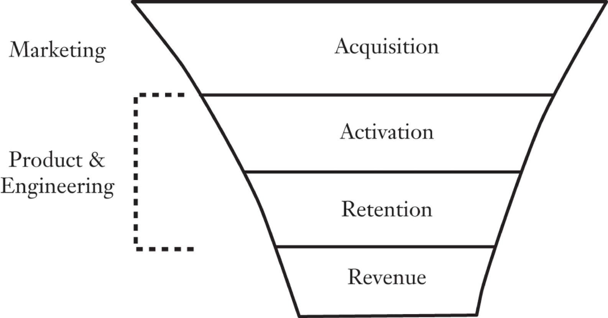
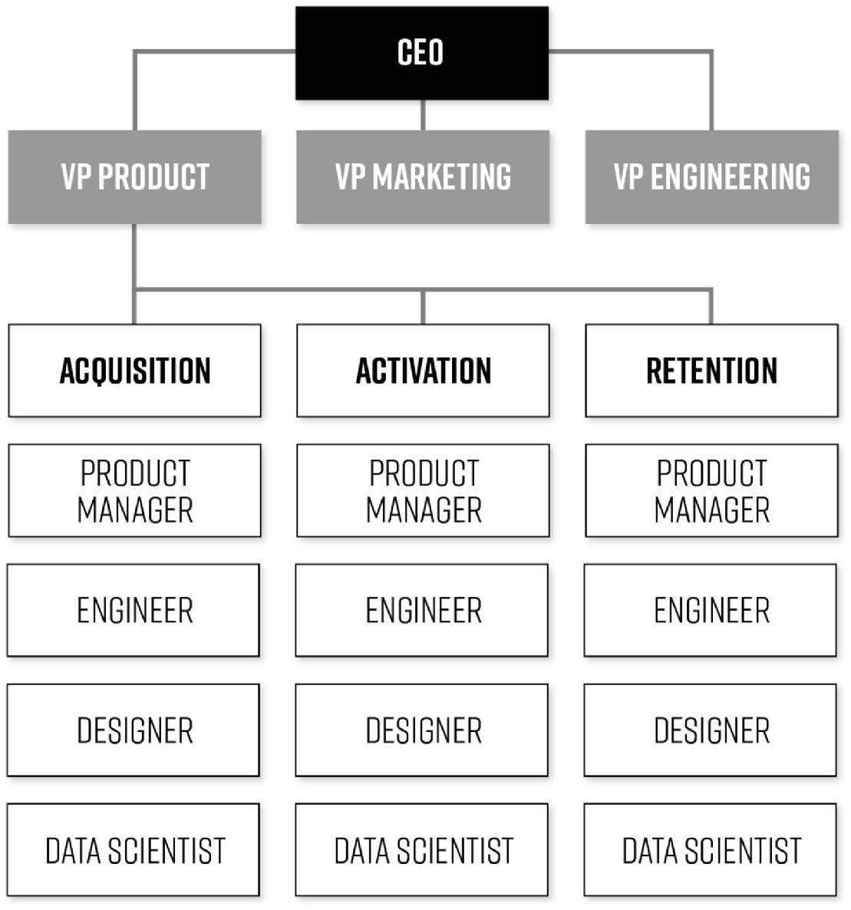
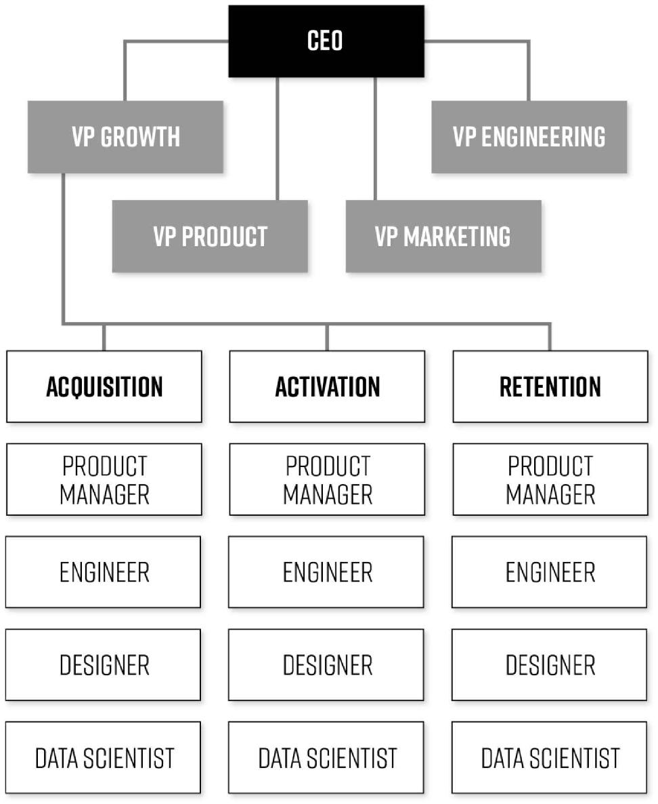

# Chapter One: Building Growth Teams

When Pramod Sokke joined BitTorrent as the new senior director of product management in 2012, the once-red-hot start-up was at a crossroads. Growth of their popular desktop software, which lets users find and download files from all around the Web, had stalled. More worrisome was the fact that the company had no mobile version of the product—a huge disadvantage at a time where people were rapidly migrating away from their desktops to their smartphones. Making matters worse, YouTube, Netflix, and other streaming services were gobbling up users’ time and attention both on their phones and across other devices, leaving BitTorrent behind. Pramod was brought in to build the mobile product and reignite growth.

The 50-person company was organized around the traditional silos of marketing, product management, engineering, and data science. The product team and engineers were divided up into subgroups dedicated to different products, such as the desktop versions for Mac and Windows, and now the newly minted mobile team. Both the data team and the marketing group served all of these product groups, and as is typical at all kinds of businesses, the process of product development was completely separated from marketing. The product managers would inform the marketers about upcoming launches or releases and all marketing efforts were then conducted by the marketing group—with no collaboration from those actually making the product.

THE CUSTOMER FUNNEL & TYPICAL DEPARTMENT OWNERSHIP

As is also typical for many companies, the BitTorrent marketing team was focused on efforts exclusively at the “top of the funnel” (depicted above), meaning raising customer awareness and bringing users to the products through branding, advertising, and digital marketing with the goal of acquiring new customers. At most software or Web-based companies, the work of increasing the activation and retention of those who’ve visited a website or app is done not by marketers but by the product and engineering teams, who focus on building features to make users fall in love with the products. The two groups rarely collaborate with each other, with each focused on their own priorities and often having little or no interaction. Sometimes they’re not even located in the same building—or even the same country.

Per this standard organizational playbook, once the BitTorrent mobile app was ready for launch, the marketing group crafted a launch plan, which, as usual, included a range of traditional marketing activities, with an emphasis on social media, public relations, and paid customer acquisition campaigns. The app was solid, the plan was strong, and yet, adoption was still sluggish.

Pramod decided to ask the marketing group to hire a dedicated product marketing manager (PMM) to help stoke acquisitions. These marketing specialists are often described as being the “voice of the customer” inside the company, working to gain insights into customers’ needs and desires, often conducting interviews, surveys, or focus groups, and helping to craft the messaging in order to make the marketing efforts more alluring and ensure they are conveying the value of the product most effectively. At some companies, these specialists might also be tasked with contributing to the product development, for example, by conducting competitive research to identify new features to consider, or assisting with product testing.

An experienced PMM, Annabell Satterfield, joined the BitTorrent marketing team to assist in boosting adoption of the newly minted mobile product. In addition to focusing on the awareness and acquisition efforts she was charged with, she requested that she be allowed to work with the product team on driving growth throughout the rest of the funnel, including user retention and monetization strategies, rather than being restricted to just efforts at the very top of the funnel. The head of marketing granted her permission to do so, but only after she first focused on user acquisition programs and only once they’d achieved their marketing team objectives.

Yet upon conducting some customer research—which included both customer surveys and analysis of the company’s data on user behavior—in order to generate ideas for new marketing campaigns, she discovered something that seemed directly at odds with her boss’s instructions: many of the best growth opportunities appeared to lie farther down the funnel. For example, she knew that many users of the mobile app, which was a free product, had not chosen to upgrade to a paid Pro version, so she conducted a survey to ask those who had not upgraded why that was. If the team could get more users to do so, she knew that would be a big revenue generator, which could be as important—if not more so—as getting more people to download the app. As the results rolled in, it became clear to her that the most promising strategy for growth wasn’t to focus exclusively on building the company’s customer base, but also on *making the most of the customers they already had*.

She took the insights she’d uncovered to the product team, thinking they could work together to find ways to improve the app. In doing so, she caught the product team a bit off guard; this was the first time a marketing person at the company had ever come to them with such input. But Pramod, who believed in a data-driven approach to product development, was impressed, and he quickly gave her free rein to continue mining the user research for product insights, and to keep communicating those insights across the divisional sand lines of the then-siloed company.

One of the discoveries from Annabell’s surveying stunned the product team, and led to a rapid increase in revenue. The team had lots of theories about why many users hadn’t upgraded to the paid, Pro version of the app, but the most frequent response to the question of why a customer hadn’t purchased the paid version took them completely by surprise. The number one answer? The users had no idea there *was* a paid version. The team couldn’t believe it. They thought they had been aggressively promoting the Pro version to those using the free app, but apparently they were missing the mark. Even their most active users hadn’t noticed the attempts to get them to upgrade. So the team prioritized adding a highly visual button to the app’s home screen encouraging users to upgrade, and, almost incredibly, that one simple change resulted in an instant 92 percent increase in revenue per day from upgrades. It cost virtually nothing, took virtually no time to execute (the time from the discussion of the survey data to deployment of the button was just days), and resulted in immediate, significant gains. And all from an idea they likely would never have come up with if not for the input and feedback from their customers.

Another success came from what Annabell and Pramod called their “love hack.” Looking into user data to try to identify the drivers of increases and decreases in the number of downloads of the app day to day, Annabell noticed a clear pattern. The app was only available from the Google Play store, and she noticed that whenever the first several reviews of the app in the store were negative, the daily installs of the app would dip. She experimented with pushing up positive reviews into those top positions, and found that it instantly improved the number of installs. So she and Pramod decided to encourage users to write reviews, right after they had downloaded their first torrent, when they had seen how easy the app was to use. They expected that this would be a moment when users would be most happy with the app and most inclined to write a favorable review, if asked. They ran an experiment to test the hypothesis, having the engineers program a request that would pop onto the user’s screen right after the first torrent was downloaded. Sure enough, positive reviews came flooding in. They went ahead and deployed the prompt to all new users based on the initial strong results, and that led to a 900 percent increase in four- and five-star reviews, followed by a huge boost of installs. Her credibility officially established, it wasn’t long before one engineer came to her and said, “Do you have any more ideas? What else can we do?”

This kind of collaboration between marketing and product teams is woefully uncommon. Generally, the product team is in charge of the process of building the product, as well as of making updates, such as improving the sign-up experience or adding a new feature, and the team establishes a schedule, commonly referred to as a roadmap, for making those improvements. Often, ideas for changes that aren’t part of the preestablished roadmap are met with resistance. Sometimes it’s because timing is already tight for making the planned enhancements, and sometimes because the changes being asked for are poorly conceived, much more difficult, time-consuming, and therefore costly, to enact than the person making the requests is aware of. Yet other times the product team might also determine that a request isn’t aligned with the strategic vision for the product (or some combination of all these factors and others).

Even if you don’t work for a tech company, you may be familiar with this kind of tension between departments, maybe with marketing teams pushing back on suggestions from sales, or the R&D team resisting a request to build a prototype for a new product that marketing has recommended. This is one of the chief problems with the practice of siloing responsibilities by departments, and it’s primarily why, as you’ll learn more about in a minute, growth teams must necessarily include members across a range of specialties and departments. As the BitTorrent team soon realized, often the best ideas come from this type of cross-functional collaboration, which, again, is why it’s a fundamental feature of the growth hacking process.

## **SILOS BREACHED AT LAST**

Buoyed by the successes they were seeing, everyone on the BitTorrent mobile team eagerly began brainstorming about more hacks to try. One hack they tested could only have been thought up by a bona fide techie: stopping the app automatically to save the phone’s battery life. The team discovered this opportunity through another survey targeted specifically at the power users of the free app—ones who were using it all the time but who had yet to upgrade to the paid Pro version. The survey revealed that these users had a major pain point around the drain of the phone’s battery power from their heavy use of the app. So the engineers quickly proposed they build a feature for just the Pro version, one that would turn off battery-draining background file transfers when the app detected that the user’s battery had less than 35 percent charge remaining. They cleverly promoted the feature in the app to free users when their phone battery started to dwindle, enticing them to upgrade on the spot. The feature proved so popular that it resulted in a 47 percent increase in revenue.

This string of hits didn’t go unnoticed around the rest of the company. For one thing, Annabell was officially moved from marketing to the mobile team, reporting to Pramod, and eventually her title was changed to Senior Product Manager for Growth. At the same time, other engineers working on other projects were fascinated by how the team continued to churn out big wins, leading two of the more senior engineers on other product teams to leave their posts just for the chance of working on a high-performing, growth-oriented team. Annabell explains that “[f]rom speaking to our engineers this was because, besides the fact that we seemed to be having fun and enjoying each other so much, they saw us as ‘doing things right,’ being ‘data-driven.’ ”

As the team continued to hack their way to growth, they leaned more and more heavily on data analysis (provided by a member of the data group), to both set up and evaluate the results of their experiments. The data analyst worked with the engineers to ensure that they were tracking the *right* data about customers’ response to their experiments—and providing the most useful reports on that information as it rolled in. The analyst had the expertise to know when they had enough data to call the experiments either winners or losers, and worked with the team to review results and to help plot their next steps for follow-up experiments. The team relied so heavily on the analysis that eventually the analyst was also moved over full-time to the team, just as Annabell had been.

The success of this data-driven approach to growth and product development prompted the BitTorrent executives to invest more heavily in data science and staff up its analytics team. At the same time, word of how the mobile team was growing prompted other product teams to start tapping the data analysts more frequently, and collaborate with them more closely to develop experiments and insights of their own.

The mobile team went on to discover dozens of other high-impact improvements that rocketed the product to 100 million installs through its two and a half years of rapid-fire growth hacking. With that mission accomplished, the team was reorganized and put to work on other company product priorities. It’s hard to understate the impact that this small team had on the previously growth-challenged company. It wasn’t just that their efforts boosted their teams’ revenue by 300 percent in a single year, but also, and perhaps more important, that the team fundamentally altered the culture at BitTorrent from one constricted by traditional marketing and product silos to an open and collaborative one in which everyone, from marketers, to data analysts, to engineers and executives, was aligned around the fast-paced, collaborative growth hacking process. Annabell fondly recalls how faith in the growth process rippled out across the organization, describing how “two of my favorite moments were seeing our old tech lead present a growth experiment at Palooza [which is BitTorrent’s term for regular hackathons it holds], and meeting with an old engineering colleague who wanted to dive into the process with me. He’s an ambassador for the approach now.”

This collaborative approach is unfortunately the exception, rather than the rule, at companies of all types and sizes. The all too common practice of siloing business units into isolated groups that rarely talk, share information, or, God forbid, actually collaborate, has been a widely acknowledged organizational Achilles’ heel at many companies for many years. As highlighted by a McKinsey report, one of the most damaging effects of departmental silos is that they slow innovation that drives growth. But while, as the authors explain, “research shows that the ability to collaborate in networks is more important than raw individual talent to innovativeness,” a survey McKinsey conducted found that “only 25 percent of senior executives would describe their organizations as effective at sharing knowledge across boundaries, even though nearly 80 percent acknowledged such coordination was crucial to growth.”[1](part0017_split_002.html#c01-fnt1)

Similarly, a team of Harvard Business School professors who conducted a study of communication across business units reported that they were “taken aback” by how little interaction there was among units they uncovered. Even more shocking: they reported that “two people who are in the same SBU [strategic business unit], function, and office interact about 1,000 times more frequently than two people at the company who are in different business units, functions, and offices, but are otherwise similar. Practically speaking, this means that there is very little interaction across these boundaries.”[2](part0017_split_002.html#c01-fnt2)

One specialist on the silo problem, Professor Ranjay Gulati of Northwestern University’s Kellogg School of Management, notes that this lack of cross-departmental communication impedes efforts to make product development and marketing more customer focused—an increasingly important mandate as technology and social media facilitate, even demand, ever more substantive and continuous interaction with customers. Put simply, engineers and product designers are quite capable of coming up with marvelous ways to satisfy customers’ needs and desires, but they most often are simply not privy to what those needs and desires are. Gulati reports that in a survey of executives he conducted, over two-thirds of them identified the need to make product development more customer-centric as a priority in the coming decade, but he also writes that his research shows that companies’ “knowledge and expertise are housed within organizational silos, and they have trouble harnessing their resources across those internal boundaries in a way that customers truly value and are willing to pay for.”[3](part0017_split_002.html#c01-fnt3)

Creating cross-functional growth teams is a way to break down these barriers. Cross-functional teams not only smooth and accelerate collaboration between the product, engineering, data, and marketing groups, they motivate team members to appreciate and learn more about the perspectives of the others and the work they do. So how, exactly, does one set up a growth team to meet the strategic needs and priorities of a specific project or initiative? We’ll address the key steps in the pages that follow.

## **THE WHO**

Growth teams should bring together staff who have a deep understanding of the strategy and business goals, those with the expertise to conduct data analysis, and those with the engineering chops to implement changes in the design, functionality, or marketing of the product and program experiments to test those changes. Of course, the specific makeup of growth teams varies from company to company and product to product. The size of teams also varies widely, as does how narrow or broad-ranging the scope of their work is. They can be as small as four or five members or as large as one hundred or more, as is true at LinkedIn. Regardless of size, the personnel they comprise should include many, if not all, of the following roles.

### THE GROWTH LEAD

In every case, a growth team needs a leader, who is like a battalion commander, with her boots on the ground, both managing the team and participating actively in the idea generation and experimentation process. The growth lead sets the course for experimentation as well as the tempo of experiments to be run, and monitors whether or not the team is meeting their goals. Growth teams should generally convene once a week, and the growth lead should run those meetings (which we’ll offer guidance on how to do shortly).

Regardless of specialty or background, he or she plays a role that is part manager, part product owner, and part scientist. A key responsibility for the growth lead is choosing the core focus area and objectives for the team to work on and for what period of time. As we’ll explore more fully in subsequent chapters, focusing experiments on a main goal is vital to optimizing results. A growth lead might establish a monthly, quarterly, or even annual focus area, such as to get more users to upgrade from a free version of a product to a premium version, or to determine which would be the best new marketing channel for a product. The growth lead then ensures that the team is not derailed by pursuing ideas that don’t contribute to their stated goal, tabling those for when the focus changes and those ideas will serve the new objective.

The growth lead also ensures that the specific metrics the team has chosen to measure and work to improve are appropriate to the growth goals established. Often, marketing and product teams are not systematically tracking data on key user behavior that can lead to discoveries of improvements to make or can be early warning signals that users are becoming less active or defecting from the product altogether. Too many companies focus lots of attention on vanity metrics that might look good on paper (like number of eyeballs to a website), but ultimately do not indicate actual growth, whether in product use or revenue generated. We go into detail about how to choose the right metrics to measure in Chapter Three.

All growth leads require a basic set of skills: fluency in data analysis; expertise or fluency in product management (meaning the process of developing and launching a product); and an understanding of how to design and run experiments. Every lead must also have familiarity with the methods for growing adoption and use of the type of product or service the team is working on. A social network, for example, should have a growth lead who understands the dynamics of viral word of mouth and of network effects—that is, how the value of the network keeps improving as more people join it—which are key mechanisms by which many (though of course not all) social products grow. He or she should also have the relevant industry or product expertise: a growth lead for an online retailer, for example, should have a keen grasp on shopping cart optimization, merchandising, and pricing and marketing strategy. Strong leadership skills are also needed to keep a team focused and to push to accelerate the tempo of experimentation moving forward, even in the face of the (entirely to be expected) regular failure of growth experiments. Dead ends, inconclusive tests, and abject duds are a part of the reality of growth experimentation. A strong growth lead keeps enthusiasm going, while providing air cover for the team to be experimental and fail without undue scrutiny and pressure from management to deliver more wins.

There is no one best career background for a growth lead. Some people are now specializing in the role, most of whom have moved into the job from some other area of specialty, such as engineering, product management, data science, or marketing. People with expertise in each of these areas are good candidates for the role, because they each bring strengths key to the growth hacking process. For start-ups, especially in the early stage of growth, often the founder should play the role of growth lead. Or, if not to run the team, the founder should appoint the growth lead and make him or her a direct report. At larger companies, which may have one growth team or multiple teams, the growth leads should be appointed by an executive with authority over the work of the team, to whom the growth lead should report.

The role may sound daunting, and simply too much for one person to manage, but with the tools and formal methods for prioritizing experiments, tracking, and sharing results that we will introduce in the following chapters, the process can be managed with great efficiency.

### PRODUCT MANAGER

The ways in which businesses organize product development teams vary, and this will affect the personnel who are assigned to work on a growth team, and may also determine how the team fits into the organizational structure of a company, which we’ll discuss more later in the chapter. In general product managers oversee how the product and its various features are brought to life. As venture capitalist Ben Horowitz put it simply, “A good product manager is the CEO of the product.”[4](part0017_split_002.html#c01-fnt4)

In most types of company, the role is well suited to assisting in the growth hacking mission of breaking down the silos between departments and identifying good candidates in engineering and marketing to help start the growth team. This is in large part because product managers’ experience with customer surveying and interviewing, as well as with product development, allows them to make vital contributions to the idea generation and experimentation process. If you have this role at your company, this person should absolutely be on your growth team.

Depending on the size of a company, the functions of product management may be filled by other staff, and at start-ups, especially in the early stages of growth, the role may be played by the founder. But at larger companies, there may be multiple levels of staff within product management, from product manager, director of product management, VP of product management, or chief product officer. The level of product management staff appointed to a growth team can vary, but as we’ll discuss more fully in a moment, at many software companies, the product manager who oversees the particular product that a growth team is formed to work on should be assigned to the team and reports to the head of the product group, often a VP of product management.

### SOFTWARE ENGINEERS

The people who write the code for the product features, mobile screens, and webpages that teams experiment with making changes to are cornerstone members of a growth team. Yet all too often they are left out of the ideation process as companies work to plan new products and features, or are relegated to simply taking orders, implementing whatever product and business teams have come up with. Not only does this sap morale of some of your most highly skilled and precious staff, it also stunts the ideation process by failing to tap into the creativity engineers can bring as well as their expertise about new technologies that might drive growth. Recall that at BitTorrent, the engineers were invaluable in recommending the development of the lucrative battery saver feature. The very essence of growth hacking is the hacker spirit that emerged out of software development and design of solving problems with novel engineering approaches. Growth teams simply don’t work without software engineers being a part of them.

### MARKETING SPECIALISTS

While we should be clear that some growth teams operate without a dedicated member who is a marketing professional, we advocate including a marketing specialist for optimal results. The cross-pollination of expertise between engineering and marketing can be particularly fruitful in generating ideas for hacks to try. The type of marketing expertise the team needs may vary depending on the type of company or product. For example, a content growth team, working to build readership, would clearly benefit from having a content marketing specialist onboard. For example, at Inman News, a trade journal for real estate professionals, where Morgan is COO, the growth team includes the email marketing director, because the company’s growth is heavily reliant on email as a channel for acquiring, monetizing, and retaining customers. Other companies may rely heavily on search engine optimization and elect to have a specialist in that field on the team. Teams might also include several marketing specialists to cover a wide range of expertise. Marketers can also be brought in for stints focusing on an area of their expertise and then leave the growth team once the goal is achieved.

### DATA ANALYSTS

Understanding how to collect, organize, and then perform sophisticated analysis on customer data to gain insights that lead to ideas for experiments, is another of the cornerstone requirements for teams. A growth team might not include an analyst as a full-time member, but rather have an analyst assigned to it who collaborates with the team but performs other work for the company as well. That was the case in the beginning for the BitTorrent team. But if a company can afford to appoint an analyst full-time to the team, that’s ideal.

A team’s data representative needs to understand how to design experiments in a rigorous and statistically valid way; how to access your various customer and business data sources and connect them to one another in order to draw insights into user behavior; and how to quickly compile the results of experiments and provide insights into them. Depending on the degree of sophistication of the experiments a team is running, it might be possible for the marketing or engineering team member to play this role, as in both of those fields, a certain level of data analytics aptitude has become important. At more technically advanced companies, analysts with expertise in reporting of experiments as well as data scientists, who are mining for deep insight, should both play a role.

What is essential is that data analysis not be farmed out to the intern who knows how to use Google Analytics or to a digital agency, to cite extreme but all too frequent realities. As we will discuss in detail coming up in Chapter Three, too many companies do not place enough emphasis on data analysis, and rely too heavily on prepackaged programs, such as Google Analytics, with limited capacity for combining various pools of data, such as from sales and from customer service, and limited ability to delve into that data to make discoveries. A standout data analyst can make the difference between a growth team squandering its time and mining data gold.

### PRODUCT DESIGNERS

Here again the job titles and specific functions vary according to the type of business. In software development, the specialty field of user experience designer is responsible for developing the screens and sequences that users experience with the software. For manufactured goods, this designer might be responsible for the product drawings and specifications, while at other companies, designers might be chiefly involved in graphic design of advertisements and promotions. Having design experience on a team often improves the speed of execution of experiments, because the team has a dedicated staff person to immediately produce whatever design work may be involved. User experience designers can also offer important insight into user psychology, interface design, and user research techniques that can help to generate great ideas for testing.

## **THE SIZE AND SCOPE**

At start-ups and small established companies, a growth team might comprise only one staff member in each of the abovementioned areas, or even just a few people, each of whom takes charge of more than one of these roles. At large companies, growth teams may include many engineers, marketers, data analysts, and designers. The composition of growth teams and the mandates they are charged with must be tailored to your company: its size, its organizational structure, and its specific challenges and priorities. The scope of a growth team’s work might also be quite general, such as to work on growing all areas of the business, or highly specific, such as to oversee improvement of a specific part of the product, such as the shopping cart feature. Some growth teams are permanent fixtures, like those at Zillow and Twitter, and others are formed for specific tasks, such as a product launch, and are disbanded after goals are achieved. Some companies have created multiple growth teams with different areas of focus, such as at LinkedIn and Pinterest, which has four teams dedicated to new user acquisition, viral growth, engagement of users, and activation of newly acquired users. Other companies have just a single growth organization responsible for many initiatives, such as at Facebook and Uber.

If you’re just starting to form a growth team, then bringing over one or two individuals from different departments to get the team started may be a good way to get the ball rolling, and the size of the team can grow over time. In some cases, as the process is learned, additional teams can be formed. At IBM, for example, a growth team was formed to work specifically on growing the adoption of its Bluemix DevOps product, a software development package for engineers, by assigning five engineers and five other staff, from business operations and marketing, to make up the team. At Inman, Morgan comprised his growth team of a data scientist, three marketers, and their Web developer to start the growth hacking process. Morgan is also the head of product development, and he fills the spot for product management on the team. As COO he is also the highest-ranking executive on the team, but he is not the growth lead. Rather a marketing manager runs the process, and Morgan plays a contributing and guiding role.

## **THE HOW**

Once you’ve chosen your team members, what, exactly, should they do? The growth hacking process provides a specific set of activities that growth teams should undertake to find new, and amplify existing, growth opportunities through rapid experimentation to find the top performers. The process is a continuous cycle comprising four key steps: (1) data analysis and insight gathering; (2) idea generation; (3) experiment prioritization; and (4) running the experiments, and then circles back to the analyze step to review results and decide the next steps. At this stage the team will look for early winners and invest further in areas of promise, while quickly abandoning those that show lackluster results. By continuing to move through the process, the growth team will compound wins big and small over time, creating a virtuous cycle of ever improved results.

THE GROWTH HACKING PROCESS

The team keeps the process on track by coming together for a regular growth meeting. Team meetings, which should generally be held once a week, provide a rigorous forum for managing the team’s testing activity, reviewing results, and determining which hacks to try next. The standing meeting practice, which is a well-established part of the agile software development method, can be easily adapted for growth hacking. Much like in agile software development, where the team uses sprint planning meetings to organize their upcoming work, growth meetings allow the growth team to similarly review progress to date, prioritize experiments to try, and maintain their experiment velocity.

During the meeting, ideas identified for experiments are assigned to various team members to take charge of implementing, analyzing, or researching to garner more information about whether an idea is worth trying. The team lead stays in regular communication with each team member in between meetings, checking in on the progress of their work and helping to deal with any problems or delays that might come up.

This weekly meeting keeps the team on track and focused, and ensures the high level of coordination and communication required to keep up the high-speed nature of the process; think of it speeding along like a Formula One racing car making precision adjustments, in contrast to a runaway truck whose brakes have gone out. In addition, the deeply collaborative nature of the meeting leads to a 1+1=3 dynamic, where the expertise of the various members is amplified to turn promising ideas into powerhouse winners and often generate unpredictable ideas that team members couldn’t possibly have come up with on their own.

So, for example, an in-depth analysis of customer churn (meaning identifying those who recently abandoned the product) might reveal that the people who are defecting haven’t made use of a particular feature of the product that is popular with avid users. That discovery might lead the team to experiment with ways to get more people to try that specific feature out. Or take another example from the work of our growth team at GrowthHackers.com. In looking at our user data, we found that content submitted by the community that included rich media (such as presentation decks from conferences and videos from YouTube) sparked greater engagement and led to more repeat visits from viewers than posts that simply link to stories elsewhere on the Web. So growth team members came up with a series of ideas for adding more rich media items, such as podcasts and videos, to the site. This course of action seemed obvious and predictable enough; that is, until the engineer on the team chimed in to explain that not only could we support many, many more types of media on the site with a simple plug-in, but that we could also build in code to automatically recognize links from popular media sites like YouTube, SoundCloud, and SlideShare and instantly embed that content into the discussion pages on the website. Rather than simply adding video from one or two additional media sources, we were now able to support more than a dozen, while making the process for adding that media to GrowthHackers dramatically easier. After this discovery, one that likely would not have been made without the input of the engineer in the group, the experiment was redesigned and it proved even more powerful in growing the community than we had initially expected. We will introduce specific procedures for running meetings for the greatest efficiency in Chapter Four, including a recommended meeting agenda.

## **WHO DOES WHAT**

In terms of the tasks that team members are charged with, team members will still take on specialty tasks according to their area of expertise, sometimes working independently at least at first. For example, the engineers will take charge of any coding needed for an experiment; the designer will craft any design elements needed; the data analyst will work on selecting the sets of users with whom a change will be tested; and the marketing member will take charge of implementing any experiments with promotional channels, such as with a new Facebook ad campaign. If there is a user experience designer on the team, that person might be charged with collecting and evaluating user feedback about the types of features they find most valuable, and bringing that qualitative information back to the team. That research might lead to an idea for a change to a feature or to a new feature to experiment with. An engineer might be asked to program a change to the shopping cart page if research indicates that users are finding it difficult to navigate, as an example.

Yet other initiatives will require close collaboration among all team members, such as the creation of a new product feature, which should involve cross-functional agreement about how it will be designed and implemented, how it will be messaged or delivered to customers, and how its success will be measured. For example, the team responsible for a business mobile app may decide that an improvement in the rate at which new users become regular, successful customers is their key priority, and they might decide that an experiment consisting of a substantial redesign of the first several screens that greet users and the messaging on those should be conducted.

Throughout the rest of the book we’ll describe specific experiments conducted by actual growth teams, and we will introduce tools for keeping track of the results and establishing priorities for which experiments to run, as well as for designating the follow-up steps to take once experiment results are in hand.

## **EXECUTIVE SPONSORSHIP REQUIRED**

Growth teams must be worked into the organizational reporting structure of a company with total clarity about to whom the growth lead reports. It is imperative that a high-level executive is given responsibility for the team, in order to assure that the team has the authority to cross the bounds of the established departmental responsibilities. Growth cannot be a side project. Without clear and forceful commitment from leadership, growth teams will find themselves battling bureaucracy, turf wars, inefficiency, and inertia. At start-ups, if the founder or CEO isn’t personally leading the growth efforts directly, then the team or teams should report directly to him or her. In larger companies, which may have multiple growth teams, the teams should report to a vice president or C-level executive who can champion their work with the rest of the C-suite. Support for these methods at the highest rungs of the organization is critical to the team’s sustained success.

Mark Zuckerberg is an outstanding model of the leadership required. He was relentlessly focused on growth in the early days of Facebook, and his enthusiasm hasn’t waned since. In 2005, two years before Facebook formally established the growth team, Noah Kagan, a digital marketer who was employee number 30, brought a revenue generating idea to Zuckerberg. Kagan was concerned that the social network needed to prove to investors that it could make serious money. Standing in a company conference room, Zuckerberg stopped Kagan mid-pitch, stood up, picked up a marker, and wrote on the whiteboard in big letters one word, “Growth.” He would not entertain any ideas outside of growing the total number of users on Facebook. His crystal clear prioritization of growth over all other business concerns—even revenue—in the early days was the linchpin of Facebook’s incredible success.[5](part0017_split_002.html#c01-fnt5)

Even today, as the company invests in future technologies such as virtual reality and artificial intelligence, the understanding is crystal clear that the health of its core customer base is what creates the opportunity to invest in the future. As Mike Schroepfer, Facebook’s CTO, told *Fast Company:* “I have one hand in the day-to-day and one hand in the future. It’s a little bit crazy-making at times, but it’s important that our core business continues to do well. Because that is what allows us to aggressively invest in these longer-term things.”[6](part0017_split_002.html#c01-fnt6)

Another founder who has been a fervent champion of the growth process is Spencer Rascoff, CEO of Zillow, the world’s largest real estate site. Nate Moch, employee number 40, who is now the Vice President of Product Teams, recalls that Rascoff and his executive team made growth a priority from day one, and as the company has grown, Zillow has built a dedicated team around Moch to ensure that the company is constantly keeping its sights on sustaining that growth. Moch’s team works in a similar fashion to Facebook’s, focusing on the core company KPIs and working with other product teams to drive customer acquisition and retention and hit their respective business goals.

Rascoff has rallied the whole company around the growth mission by establishing a focus for growth efforts that he calls Zillow’s “Play,” a recurring nine-to-twelve-month growth initiative that the entire company aligns around. In 2008, for example, the company realized that it was losing traffic to a rival upstart, Trulia, largely due to Trulia’s smart use of search engine optimization to rank its home listing data higher than Zillow’s in Google search results. So the Zillow executive team decided that SEO would be that year’s Play, and every team in the company was mandated to make becoming world class at search a priority. This involved a major cultural shift, as the company had previously ignored SEO in favor of other tactics. But in the end every team managed to find ways to improve their SEO efforts, and as a result Zillow was able to catch and surpass Trulia, ultimately buying the competitor in 2015 for $3 billion.[7](part0017_split_002.html#c01-fnt7)

## **THE REPORTING STRUCTURES FOR TEAMS**

There are two common reporting structures for growth teams, as a survey of Silicon Valley firms by researchers Andrew McInnes and Daisuke Miyoshi revealed.[8](part0017_split_002.html#c01-fnt8) The first, which McInnes and Miyoshi call the functional (or product-led) model, is to create teams that report to a product management executive, in charge of the product or set of products that the growth team will be working on.

THE PRODUCT-LED MODEL

A product-led team, for example, might be dedicated entirely to growing the user base for the company’s mobile app, while another might be assigned to helping to drive readers of an online news service to upgrade to a paid subscription. In some cases the mandate of teams dedicated to a particular product will be limited to improving the performance of one aspect of the product, such as activating new users of an online learning software by optimizing the *onboarding process,* the term for orienting new users on how to use a product. At Pinterest, John Egan runs a growth team that is dedicated entirely to testing the frequency, content, and calls to action in the email messages and mobile push notifications aimed at getting users to come back more frequently. That scope might sound impossibly narrow, but this intense focus allows the team to really drill down on a key component of the company’s growth. For example, in one of their recent growth efforts, the team built Copytune, a highly sophisticated machine learning algorithm, which allowed them to rapidly test dozens of variants of notifications sent to users, across more than 30 languages, and have the software pick winning versions and tee up subsequent tests in search of even better performance. The results of the program have been extraordinary, adding additional people to the site’s monthly active user (MAU, pronounced “mao”) count.[9](part0017_split_002.html#c01-fnt9)

A product-led team might also be asked to experiment with a range of ways to drive growth across all levels of the growth funnel, from attracting more customers, to improving retention, to increasing the amount of revenue being made from them.

Typically in organizations that use this model, each product manager runs a small product team that includes engineers, user experience designers, and data analysts, and it’s not uncommon for a product group to have a handful of such small teams. This model is easier to implement in an established firm or a later stage start-up because it fits into the already existing management structure. This not only means that less reorganization is required, but it helps to mitigate friction in scheduling growth experiments into the existing roadmap for testing product features in development.

In addition to Pinterest, companies that follow this model include LinkedIn, Twitter, and Dropbox.

The other structure is that of a stand-alone team—so not part of an existing product development team—with the growth team lead reporting to a VP of growth, who typically reports directly to senior management, such as the CEO or other executive leader. The VP of growth role itself is often created to assure that an executive level employee has ownership of the team’s results, such as at Uber and Facebook. In contrast to product-led teams’ specific dedication to a particular product, independent teams have the authority to conduct experiments across the full range of the company’s products, and even to look for strategic opportunities for growth outside of the scope of the current product lineup. An example of the latter is the Facebook growth team’s role in advising the company to purchase Octazen once the team recognized that Octazen’s technology would help the performance of the social network’s friend referral product. And in fact the Facebook growth team has worked on an incredibly broad range of growth initiatives, from helping to optimize existing products and features, such as improving the sign-up flow for new users, to even building some of its own products, such as Facebook Lite, which was designed to run on a globe with poor data connectivity. The team has also provided support to product teams, acting as both an internal analyst group and a SWAT team that can parachute in to help identify optimization and growth opportunities and show them how to deploy the growth experimentation process.

THE INDEPENDENT-LED MODEL

Independent teams are most easily established early in a company’s development before corporate structures have crystallized and ownership battles over resources and reporting formalize. When the turf isn’t yet claimed, there are fewer complaints against redistributing responsibility and headcount to a growth team. That said, it’s not impossible to introduce independent growth teams in established, larger companies. One approach is that taken by Walmart, which created its stand-alone growth operation in 2011 by acquiring an innovation center in the well-regarded Silicon Valley start-up Kosmix, which became @WalmartLabs.[10](part0017_split_002.html#c01-fnt10) Run as an independent division focused on e-commerce, this team focuses on digital innovation initiatives for Walmart websites and mobile applications, like the successful Savings Catcher app we described in the introduction. It also leads the acquisition of promising digital start-ups, such as mobile fashion search app Stylr, and social recipe aggregator Yumprint, and works to integrate their technology and talent into Walmart’s digital offerings.

It’s important to emphasize that even when teams are given independent authority, they need the strong backing of top management in order to navigate the internal sensitivities and frictions that can arise between product, marketing, design, and engineering specialists who have their own notions of what’s important and the “right way” to do things.

## **MELDING MINDS AND DISMISSING LORE**

It’s not unusual for someone setting up a growth team for the first time within a company to encounter some initial resistance. For most companies—the exception being the earliest stage start-ups where organizational silos and norms have yet to crystallize—setting up a growth team, or set of teams, will involve either a significant realignment of personnel and reporting structures or a rededication of some of people’s time and shifting of their responsibilities, either in an ongoing capacity or for the duration of a specific growth mission. As anyone who’s worked in any kind of organization knows, making such changes can be quite a challenge, for a few reasons.

At their heart, most of these sources of friction are cultural. Many people in marketing, product development, and software engineering have preconceived notions about the ownership of initiatives: what teams are “supposed” to do—and how they are supposed to do it. At BitTorrent, marketing’s original intent was to concentrate solely on user acquisition. Data analysis was done by the company’s data team, specifically at the request of the product teams, and experimentation had no home and had mostly fallen by the wayside. So when the growth team came in and knocked down these divisional silos, it took some adjustment.

Stories of such friction caused in the process of establishing growth teams abound. After Josh Schwarzapel joined Yahoo! to create and lead a growth team tasked with growing the company’s mobile products, he recalls that when his team began running experiments to promote Yahoo!’s apps to visitors, they got pushback from the brand team because they had departed from the established style and voice guidelines in some of their experimental messaging. The product managers were also leery because of the broad reach and implications of what the growth team was building; their messaging would be seen by every single person who came to the Yahoo! site on a mobile device. Overcoming this resistance required lots of cross-team collaboration and trust building. “We had to do a lot of work to get support from the partner teams,” he recounts.[11](part0017_split_002.html#c01-fnt11)

Another source of friction is the fact that growth experiments—and the resources needed to pull them off—can interfere with, or come at the expense of, time or resources needed to deliver on already established projects and priorities. For example, some friction was created at BitTorrent when Annabell’s work designing tests and analyzing results took her time away from more immediate acquisition efforts. In addition, as the data demands from the team increased, strain on the resources of the data team became an issue until the executive team decided to expand the data analytics group.

A final cause of potential strife lies in the fact that when you bring together people from such a diverse range of fields and backgrounds, there are almost certain to be differing and sometimes conflicting perspectives and priorities. Engineers tend to be most interested in working on the most technically challenging jobs, whether or not the solutions they come up with will have a meaningful impact on growth. Product managers are typically obsessed with product development and launches and can be infuriated by marketing and sales teams making last-minute requests for changes with poor business rationales. User experience designers often resist the introduction of experimental features for testing because they don’t want to upset happy users with annoyances. Marketers can become focused on vanity metrics such as the number of website visitors or leads and lose sight of the need to drive up the performance indicators in other parts of the funnel (such as user retention).

Moreover, these perspectives tend to be deeply ingrained among members of each of these groups, not only in terms of the design of organizations, but also in people’s training for their jobs as well as in their individual psychologies and the incentives that drive them. Thus even at early stage start-ups, getting people to work collaboratively across these specialties can be a mighty challenge.

Growth teams can ease these tensions if they are managed correctly and if the whole team is incentivized, and rewarded, for achieving shared goals that create meaningful results for the company. Another way to mitigate conflict is to ensure that the decisions about which growth hacks to prioritize (and the evaluation of how successful they are) are made strictly on the basis of hard data rather than assumptions, or what Chamath Palihapitiya, the original leader of the Facebook growth team, calls the “lore” that holds sway about how products should be designed or what customers want. Every company, large or small, has entrenched lore that should be blasted away by data-driven experimentation. At Qualaroo, for example, growth was held back for a time by company lore that maintained we couldn’t raise our prices and still succeed. Yet when we conducted pricing tests, the data showed that we could raise prices by more than 400 percent and still grow by attracting a new type of clientele.

When data analysis provides a strong rationale for trying a hack, dissent is much easier to counter. The results of well-crafted experiments are also extremely difficult to disagree with, which helps to defang the emotional commitment people often feel to their particular vision or strategy. And when experimentation is data driven, team members also generally respect the rigor of the learning process and appreciate the latitude it gives them to rack up a string of failures in order to achieve a win.

Finally, few things are more effective for squashing conflict and dissent than success. Many growth team members have described how enthusiasm for the method built not only within their teams but all around their companies as they began to see the method working, and leading to impressive gains.

## **TEAMS EVOLVE**

As companies grow and evolve, so should their growth teams. At Facebook, the growth team has exploded from its early days of five people to a now sprawling unit with multiple focus points such as international and emerging markets phone units.

The composition and focus of growth teams will generally change over time as well, as the company develops and brings on more staff. When this happens, growth teams might add more people from specific departments, create new departments, or spin off into separate teams to focus on more specific growth initiatives in various parts of the business, as the Pinterest growth team did when it evolved from one independent team into the four subteams within the product group that are now focused on different parts of the user experience.[12](part0017_split_002.html#c01-fnt12) At Twitter, Josh Elman’s initial onboarding team morphed into a larger growth team with greater responsibility for growth beyond just new user activation.[13](part0017_split_002.html#c01-fnt13) Other specialists can also be pulled in to provide expertise in a specific area, whether permanent members from within the company, or temporary ones through outside consultants or agencies. Retaining, and even continuing to grow the team or teams as the company scales, assures that the fixation on growth stays in its DNA. Even the most inspired products and ideas can, and often do, stall out and ultimately crash and burn due to the failure to continuously improve them. Growth teams are the best hedge against this painful potential outcome.

For early stage start-ups, for whom growth teams will almost certainly be small, bringing in outside experts who are specialists in one area of user growth (such as acquisition or retention) to add bench strength to the team can pay big dividends, as Dropbox found in hiring Sean. Such small growth teams can reap great rewards by combining their deep internal knowledge of the product and company with external expertise. One cautionary note is that it’s vital not to outsource the core responsibility for growth, at this or any stage. The fact is, growth is too important to delegate, and consultants often lack the organizational authority, time, or intrinsic motivation to get the hard work done that results in sustainable growth.

## **A GROWTH HACK TO START GROWTH HACKING**

Implementing the growth hacking process can seem daunting. Creating a cross-functional team can be tricky, as managers of groups may push back about rededicating the time of some of their staff. The notion of so much experimenting can also be uncomfortable for people. Inevitably, there will be naysayers and resisters. The good news is that there is also a virtuous growth cycle in the adoption of growth hacking. A small team with a narrow focus that begins running the growth hacking process and generates a series of wins can spark growing enthusiasm for the process around a company. Once people see the power of the data-driven approach to experimentation—and the growth ideas that come out of it—enthusiasm for the process tends to be infectious.

Implementing growth hacking across a company or even a department won’t happen overnight; so think about starting with a team working on just one product, and perhaps even just one important aspect of how it is being adopted, such as the sign-up page on your website. Or you could create a team to work on optimizing the company’s customer acquisition in a single channel, such as Facebook, or improving the readership of the company’s blog, or the performance of the company’s email marketing. Or you can launch the growth team with a sole focus in one metric, such as on improving conversion rates in activation, or shoring up your customer retention. As successes are achieved, the growth team can take on a wider range of initiatives, or more growth teams can be created.

If you are the head of a small team and want to give the process a try, it’s best to set your team up for success by getting buy-in first, even if it is just with a few peers and a supervisor. You will make mistakes, experiments will fail, webpages will break—it’s an inevitable part of the experimentation process. Having the support of higher-ups can alleviate the blowback from such eventualities. Lauren Schaefer, who was the growth hacking lead on the Bluemix DevOps team at IBM, launched a test early in the process of experimenting with growth hacking that crippled the product’s home page. But her boss was a supporter of the effort, and she and her growth team got past that stumble.[14](part0017_split_002.html#c01-fnt14)

It’s just as important that the growth team machine not be put into drive too early. Because all the rapid experimentation in the world won’t ignite lasting growth if the product isn’t loved by the people who use it. While plenty of companies manage to eke out enough sales or user loyalty to stay alive with products that are merely satisfactory, or even sometimes clearly inferior, they’re on a trajectory to fail sooner or later.

This is why, as we’ll discuss more fully in the next chapter, no overly ambitious growth scaling plans should be instituted until a company has determined whether the product it’s bringing to market is a “must-have” or a “just okay but can live without.” So now that you know how to set up a growth team, let’s move on to the next step in the process: how the team can use customer feedback, rigorous experimentation and testing, and a deep dive into data to evaluate if a product has in fact achieved product/market fit.

All fast-growth companies share one thing in common. Regardless of who their customers are, their business model, and the type of product, industry, or region of the globe they’re operating in, they all make a product that a large group of people love. They’ve built products that, in the eyes of their customers, are simply *must-have*.

While creating a must-have product alone is not sufficient for breakout success, it *is* the baseline requirement for rapid and sustainable growth. Of course, building a must-have product isn’t easy, and one result is that too often those launching new businesses or products put the cart before the horse, pouring resources and staff into trying to drive more customers to a product that isn’t actually loved, or sometimes even understood, by its target market. This is one of the most common, and deadly, mistakes start-up founders make, and it’s also a huge problem that often surfaces when established firms, even those known for their innovation prowess, launch new products. Just think of Google Glass and Amazon’s Fire Phone—both innovative products…that nobody wanted. Or the infamous Microsoft Zune media player, launched in November 2006, which Microsoft reportedly spent at least $26 million to promote but which never generated more than a tepid response.[1](part0017_split_003.html#c02-fnt1) The Zune was not a bad product; many critics considered it quite well designed. But it added no “wow factor” to make it more appealing than Apple’s already ubiquitous iPods. Despite continued efforts to stoke sales, including the release of an improved version, the Zune HD, in 2009, the Zune was never able to garner more than a single-digit share of the market and was discontinued in 2011.[2](part0017_split_003.html#c02-fnt2)

One of the cardinal rules of growth hacking is that you must not move into the high-tempo growth experimentation push until you know your product is must-have, why it’s must-have, and to whom it is a must-have: in other words, what is its core value, to which customers, and why. (The exception to this rule being businesses such as social networks, where the core value is the people on the platform.) This may sound blindingly obvious, but the fact is that it can sometimes take enormous patience, because the pressure to start pushing for growth is intense. For start-ups, that’s often due to demands from taking venture capital or, on the flip side, because the company needs to prove itself in order to raise capital, or generate revenue to keep the lights on. Even in established firms, where products are generally assigned a target revenue contribution by a specified date, there is pressure to start demonstrating growth, yesterday. And as this pressure mounts, the belief that growth can be forced, usually by increasing spending on marketing, becomes increasingly alluring.

But the hard truth is that no amount of marketing and advertising—no matter how clever—can make people love a substandard product. If you haven’t created and identified core value *before* you make your growth push, you’ll either end up with illusory growth at best or market rejection at worst. Sure, a glitzy launch can create some initial interest, but if your product doesn’t wow people, all the celebrity spokespeople and multimillion-dollar ad campaigns in the world won’t result in sustainable growth.

The opportunity costs of pushing for growth too soon are twofold. First, you’re spending precious money and time on the wrong efforts (i.e., on promoting a product that no one wants); and second, rather than turning early customers into fans, you’re making them disillusioned, even angry, critics. Remember that viral word of mouth can work two ways; it can supercharge growth or it can stop it in its tracks.

A pernicious misconception about growth hacking is that it is primarily about building virality into products. That is indeed one of the key tactics, but like other growth efforts, it must only be deployed *after* the product has been determined a must-have. As Chamath Palihapitiya, the original head of the Facebook growth team, recalls stressing in launching the team’s growth efforts, “I don’t want you to give me any product plans that revolve around this idea of virality. I don’t want to hear about it.”[3](part0017_split_003.html#c02-fnt3)

Growth teams need to adopt rigorous methods for probing into user behavior in order to discover the core value of their product or service, and we’ll introduce these methods shortly. Additionally, growth teams need to recognize that sometimes establishing what the core value is, or should be, isn’t about the features of the product or service itself, but rather a matter of connecting with the right core market, which, again, as we’ll explore, might be quite different from the originally envisioned one.

Finally, it’s important to note that identifying core value does not necessarily follow directly from having created it. Often those of us building and marketing new products *think* we know what aspect of our product consumers will love—and often we are wrong. Sometimes it’s a feature or user experience that was built into the product that is quite different from what was hypothesized in the original product vision as the core value; other times it’s one that was built into the product somewhere along the way as almost an afterthought. Whichever the case, it’s up to the growth team to find out. In this chapter we’ll learn how.

