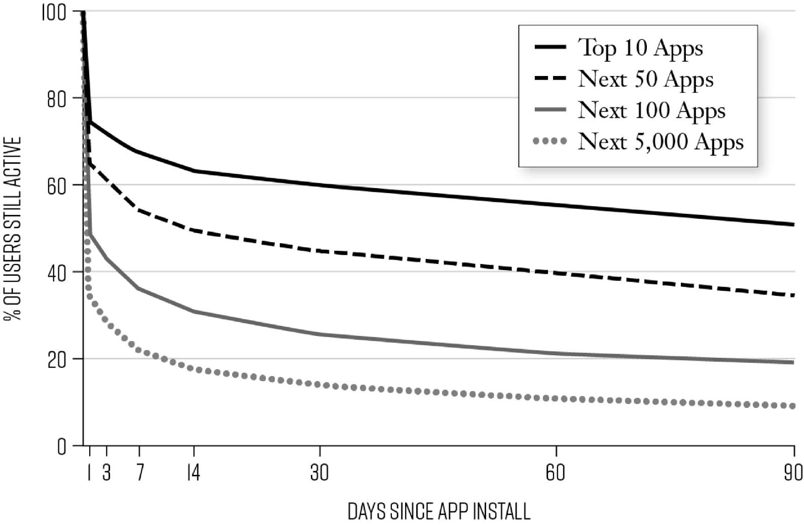

# Chapter Two: Determining If Your Product Is Must-Have

All fast-growth companies share one thing in common. Regardless of who their customers are, their business model, and the type of product, industry, or region of the globe they’re operating in, they all make a product that a large group of people love. They’ve built products that, in the eyes of their customers, are simply *must-have*.

While creating a must-have product alone is not sufficient for breakout success, it *is* the baseline requirement for rapid and sustainable growth. Of course, building a must-have product isn’t easy, and one result is that too often those launching new businesses or products put the cart before the horse, pouring resources and staff into trying to drive more customers to a product that isn’t actually loved, or sometimes even understood, by its target market. This is one of the most common, and deadly, mistakes start-up founders make, and it’s also a huge problem that often surfaces when established firms, even those known for their innovation prowess, launch new products. Just think of Google Glass and Amazon’s Fire Phone—both innovative products…that nobody wanted. Or the infamous Microsoft Zune media player, launched in November 2006, which Microsoft reportedly spent at least $26 million to promote but which never generated more than a tepid response.[1](part0017_split_003.html#c02-fnt1) The Zune was not a bad product; many critics considered it quite well designed. But it added no “wow factor” to make it more appealing than Apple’s already ubiquitous iPods. Despite continued efforts to stoke sales, including the release of an improved version, the Zune HD, in 2009, the Zune was never able to garner more than a single-digit share of the market and was discontinued in 2011.[2](part0017_split_003.html#c02-fnt2)

One of the cardinal rules of growth hacking is that you must not move into the high-tempo growth experimentation push until you know your product is must-have, why it’s must-have, and to whom it is a must-have: in other words, what is its core value, to which customers, and why. (The exception to this rule being businesses such as social networks, where the core value is the people on the platform.) This may sound blindingly obvious, but the fact is that it can sometimes take enormous patience, because the pressure to start pushing for growth is intense. For start-ups, that’s often due to demands from taking venture capital or, on the flip side, because the company needs to prove itself in order to raise capital, or generate revenue to keep the lights on. Even in established firms, where products are generally assigned a target revenue contribution by a specified date, there is pressure to start demonstrating growth, yesterday. And as this pressure mounts, the belief that growth can be forced, usually by increasing spending on marketing, becomes increasingly alluring.

But the hard truth is that no amount of marketing and advertising—no matter how clever—can make people love a substandard product. If you haven’t created and identified core value *before* you make your growth push, you’ll either end up with illusory growth at best or market rejection at worst. Sure, a glitzy launch can create some initial interest, but if your product doesn’t wow people, all the celebrity spokespeople and multimillion-dollar ad campaigns in the world won’t result in sustainable growth.

The opportunity costs of pushing for growth too soon are twofold. First, you’re spending precious money and time on the wrong efforts (i.e., on promoting a product that no one wants); and second, rather than turning early customers into fans, you’re making them disillusioned, even angry, critics. Remember that viral word of mouth can work two ways; it can supercharge growth or it can stop it in its tracks.

A pernicious misconception about growth hacking is that it is primarily about building virality into products. That is indeed one of the key tactics, but like other growth efforts, it must only be deployed *after* the product has been determined a must-have. As Chamath Palihapitiya, the original head of the Facebook growth team, recalls stressing in launching the team’s growth efforts, “I don’t want you to give me any product plans that revolve around this idea of virality. I don’t want to hear about it.”[3](part0017_split_003.html#c02-fnt3)

Growth teams need to adopt rigorous methods for probing into user behavior in order to discover the core value of their product or service, and we’ll introduce these methods shortly. Additionally, growth teams need to recognize that sometimes establishing what the core value is, or should be, isn’t about the features of the product or service itself, but rather a matter of connecting with the right core market, which, again, as we’ll explore, might be quite different from the originally envisioned one.

Finally, it’s important to note that identifying core value does not necessarily follow directly from having created it. Often those of us building and marketing new products *think* we know what aspect of our product consumers will love—and often we are wrong. Sometimes it’s a feature or user experience that was built into the product that is quite different from what was hypothesized in the original product vision as the core value; other times it’s one that was built into the product somewhere along the way as almost an afterthought. Whichever the case, it’s up to the growth team to find out. In this chapter we’ll learn how.

[*OceanofPDF.com*](https://oceanofpdf.com)

## **THE FLAMEOUT OF BRANCHOUT**

One of the fastest-growing Facebook apps of all time serves as a cringe-inducing reminder of the danger of pushing too hard, too soon, for growth. Founded in 2010, and designed to let Facebook users build up a professional network on the site by connecting them with business contacts, BranchOut was hailed in the press as a LinkedIn killer.[4](part0017_split_003.html#c02-fnt4) After all, the pundits posited, once you had your professional network in place on Facebook, what would you need LinkedIn for? To hasten the app’s viral growth, the team, led by Zack Onisko, devised a brilliant hack of Facebook’s invite system to get more users to share the app with their Facebook friends.

At the time, Facebook allowed users who installed a new app to invite other friends to use it, too (and, in fact, many of the apps that grew virally on Facebook took advantage of this mechanism, such as the wildly popular game Farmville). But the base invite mechanism in Facebook only allowed you to invite a maximum of 50 friends at once, and the BranchOut team knew that the conversion rate for Facebook invites was extremely low. The only sure way to drive viral growth, they decided, was simply to prompt users to send more invites. Onisko says they tried hundreds of experiments for how to do so, until they “stumbled upon” a solution. The team had figured out how to allow users to overcome the 50-invite limitation by repeatedly clicking the Next button in a specially designed window, which triggered Facebook’s invite system to suggest another 50 of the user’s friends, and then yet another 50. The tactic supercharged referrals, and BranchOut grew from four million users to twenty-five million in about three months.[5](part0017_split_003.html#c02-fnt5)

The only problem was, it turned out that when people tried to use the app, they were generally disappointed to find that there wasn’t much they could do with it. Pretty soon, the tidal wave of new users turned—turned, that is, into an equally rapid deluge of users leaving. At one point, the app was losing more than 4 percent of its monthly active users every day, prompting ERE Media, a recruiting intelligence publication, to describe the app as nothing more than a digital Ponzi scheme.[6](part0017_split_003.html#c02-fnt6)

BranchOut’s founder, Rick Marini, conceded in a 2012 talk that the company had erred in trying to rush user acquisition without delivering on the product experience. “Often people think there’s a silver bullet to getting traffic and going viral,” he said. “What we’ve learned is that there are times when you can get some spike of virality, but if you really want that long-term major user growth it’s got to start with a good product. We realized, OK, we’ve got to really enhance the product and get users back every day. Don’t be an episodic utility, be a community. And now we’ve got to make that shift.”[7](part0017_split_003.html#c02-fnt7)

But that desire to shift turned out to be little more than wishful thinking. Despite raising nearly $50 million in venture capital, BranchOut never became more than a viral one-hit wonder; its wild ride ended in a resounding thud when the company sold its assets to a relatively obscure human resources company, 1-Page, for $2 million in cash and some stock.[8](part0017_split_003.html#c02-fnt8)

Many other products that achieved rocket-like growth by pushing too hard too soon for adoption have flamed out in similarly spectacular fashion. Which is why all growth hackers must always keep in mind that, as the growth team at Airbnb says, “love creates growth, not the other way around.” And for there to be love, there needs to be that aha moment.[9](part0017_split_003.html#c02-fnt9)

[*OceanofPDF.com*](https://oceanofpdf.com)

## **WHAT’S THE AHA MOMENT?**

Having reached a $2 billion valuation as a publicly traded company in 2016, Yelp’s success might today seem preordained. But in fact its growth was sluggish at first as Yelp struggled against stiff competition from the much larger Citysearch, which in 2005 was a top 50 site on the Web and enjoyed the backing of its massive parent company, media mogul Barry Diller’s InterActiveCorp. Yelp, by contrast, which had launched as a proof of concept in October of 2004, was barely getting its feet under itself. Even founder Jeremy Stoppelman thought the service was of questionable value. Then Stoppelman’s team discovered, by poring through user data, that a surprisingly large number of users were taking advantage of a feature buried almost laughably deep within the site—a feature that allowed users to post reviews of local businesses.

The team ran some tests to see how visitors would respond when reviews were put front and center, and when they saw good results, they pivoted from the original business model of friends asking friends for business recommendations and put the reviews at the heart of the experience. But they didn’t stop there. The team then created 20 million profiles for small businesses in the Bay Area on the site and encouraged users to add their reviews. Growth took off. Meanwhile Citysearch is now little more than a footnote, having been folded into CityGrid Media in 2010.[10](part0017_split_003.html#c02-fnt10)

Yelp had found its *aha moment*. This is the moment that the utility of the product really clicks for the users; when the users really *get* the core value—what the product is for, why they need it, and what benefit they derive from using it. Or in other words, why that product is a “must-have.” This experience is what turns early adopters into power users and evangelists. For Yelp, that experience was the ability to discover promising local restaurants and businesses through trusted community reviews. For eBay, the aha moment was finding and winning one-of-a-kind items at auction from people all over the world. For Facebook, it was instantly seeing photos and updates from friends and family and sharing what you were up to. For Dropbox, it was the concept of easy file sharing and unlimited file storage. Or take Uber’s aha moment, which Uber cofounder and CEO Travis Kalanick explained as, “You push a button and a black car comes up. Who’s the baller? It was a baller move to get a black car to arrive in 8 minutes.”[11](part0017_split_003.html#c02-fnt11) An aha experience is a necessary ingredient of sustainable growth because it is one that is simply too remarkable *not* to value, to return to often, and to share.

Thus the key to knowing when it’s time to start the high-tempo push for growth is simple: Can you identify an aha moment that users love? New products are generally built on the premise of delivering an aha experience that customers will find irresistible and that fills a meaningful need for a big audience. Sometimes things are going very much according to plan, and as soon as people begin using a product, they have the aha moment and then they tell two friends, and word of mouth takes off from there. But many times, delivering a standout aha experience takes extra work beyond just offering the product and hoping for the best.

Sometimes a product isn’t yet offering a true aha experience and more product development is needed to create it. But in others, the product already has what it needs to give people an aha experience, and the work is in leading them more effectively to it. Often, people have to use a product a certain amount of time before they truly have this experience with it, or perhaps they have to use a certain feature to really get the full-force aha hit. For example, Twitter struggled to sustain growth in its early days until it learned (from doing extensive analysis of its user data) that users who quickly started following at least 30 other users were much more engaged and likely to continue using the service. Digging into why following 30 people seemed to be the tipping point, the Twitter growth team found that getting a steady stream of news and updates from people they were interested in was the aha moment for people. Following 30 people created a stream of updates that made the service “must-have.”

Similarly, at Qualaroo, the website survey company where Sean and Morgan worked together, we identified that trial users who received 50 or more responses to one individual survey were three times as likely to pay for their subscription at the end of their trial when compared with users who did not get a survey with 50 responses during the same period. Here, 50 responses was what it took to deliver the aha moment of seeing how the product delivered new and valuable feedback. At Slack, a team chat and messaging product designed to eliminate internal corporate email threads (and one of the fastest-growing business applications of all time), data showed that once team members had sent and received 2,000 messages to one another, the team became far more likely to make Slack a core part of their communication workflow and upgrade to a paid plan with premium features. This number of messages seemed to be the threshold at which Slack’s value in improving team communication over email became profoundly clear to them.

Identifying what a product’s aha moment is can sometimes be quite tricky. It’s entirely possible to launch a product and conclude, because you’re experiencing anemic growth, that the product simply doesn’t have any aha magic when, in fact, certain users might already be wildly enthusiastic about it. So a vital step in determining whether your product has the aha potential is to seek out truly avid fans by mining user data and feedback, and then to search for any similarities in the ways these people use the product for hints about what value they get from your product that less enthused users perhaps aren’t. Sometimes this will surface a pattern such as the 30 people being followed on Twitter, but at other times your discoveries will point the way to further product development or even a substantial product pivot or rebuild.

The good news is that while discovering *how* to make a product deliver an aha moment can be very difficult, determining *whether* or not your product meets the baseline requirement generally doesn’t require elaborate diagnostics. We advise a simple two-part assessment.

[*OceanofPDF.com*](https://oceanofpdf.com)

## **THE MUST-HAVE SURVEY**

The first step is a simple survey Sean designed, one that he has found again and again throughout his career in Silicon Valley to be a remarkably reliable means of measuring whether customers love a product or not. This Must-Have Survey begins with the question:

How disappointed would you be if this product no longer existed tomorrow?

a) Very disappointed

b) Somewhat disappointed

c) Not disappointed (it really isn’t that useful)

d) N/A—I no longer use it

Interpreting the results is simple enough; if 40 percent or more of responses are “very disappointed,” then the product has achieved sufficient must-have status, which means the green light to move full speed ahead gunning for growth.

Many products won’t hit the 40 percent threshold, however, and in that event, the growth team’s first efforts must be focused on determining *why* the product isn’t getting a better response. If 25 to 40 percent of respondents answer “very disappointed,” then often what’s needed are tweaks either to the product or to the language used to describe the product and how to use it. If less than 25 percent answer “very disappointed,” it’s likely that either the audience you’ve attracted is the wrong fit for your product, or the product itself needs more substantial development before it’s ready for a growth push.

In these cases, a set of additional questions on the Must-Have Survey will help to point you toward your next steps:

What would you likely use as an alternative to [name of product] if it were no longer available?

I probably wouldn’t use an alternative

I would use:

What is the primary benefit that you have received from [name of product]?

Have you recommended [name of product] to anyone?

No

Yes (Please explain how you described it)

What type of person do you think would benefit most from [name of product]?

How can we improve [name of product] to better meet your needs?

Would it be okay if we followed up by email to request a clarification to one or more of your responses?

The question about alternative products can help identify your chief competition for customers, and often point to features or aspects of the experience those products are offering that lead those customers to prefer them over others. This feedback can be used to determine the features that you should be adding, refining, touting more assertively, or making more prominent in order to win over those customers. Answers about the primary benefit may help uncover features that you might add to deliver this benefit; or if you already do, it could point you toward experimenting with new marketing messages that might better communicate it. From the responses to the question about whether users have recommended the product, teams can gauge whether the product has word-of-mouth marketing potential, and if so, what you can do to make the most of it. More important, the language they use to describe the product to their friends can unearth benefits, features, and language to use in your own product promotion.

The question about which type of person users think can benefit the most from the product can help the team focus on a better-defined customer niche and thus target those potential users more effectively. For example, at Inman, where Morgan works, they asked the question of users of a training product for real estate professionals that the company had recently launched, and the answers pointed to it being particularly well suited for new agents. Morgan’s team used this feedback to improve the marketing and advertising targeting to focus on this group of potential customers.

The product improvement question can identify both glaring issues with the product that make it a nonstarter for broad adoption and opportunities to enhance the product that the company might not have thought of on its own.

### WHOM TO SURVEY?

Clearly, the larger the user base when you conduct the survey, the more reliable and informative the information will be. You’re looking to get at least a few hundred responses to the first question to be a reliable guide for this kind of survey.

If you don’t have a large enough base of beta users to get about that number, you should be relying more on customer interviews instead, as having just a handful of survey responses can lead to false signals.

Somewhat ironically, it’s best if you target the survey at active users rather than those who have gone dormant. This is because the answers you’ll get from those who aren’t using the product will generally not be particularly informative, likely just saying they haven’t benefited and haven’t recommended the product, for example, if they respond at all. Active users, by contrast, will be much more familiar with the product or service and as a result will often have much more specific and detailed responses.

One caveat: the Must-Have Survey isn’t recommended much beyond the stage of determining whether you’ve achieved core product value. For one thing, once your growth has taken off, it’s not a good idea to even suggest to your customer base that the product might be discontinued by asking them how they’d feel if it were no longer available. Can you imagine the panic if Facebook sent its users a survey suggesting it might go away? Moreover, once you have moved past this early diagnostic stage, your surveying and testing of the quality of the customer experience can and should become progressively more refined and your assessments more quantitative in nature, because you’ll have more data to work with. You’ll dive into more specific aspects of the user experience that people love and don’t love, based on the data you’ll accumulate about how people are using the product, in order to determine how you can continue to test improvements.

[*OceanofPDF.com*](https://oceanofpdf.com)

## **MEASURING RETENTION**

The second measure to use in assessing whether or not you’ve achieved must-have status is your product’s *retention rate,* which is simply the number of people who continue to use your product over a given time. More details of how to use the analysis of retention rates to guide growth experimentation are covered later in the book, but the general rule of thumb for making this determination is that you want to achieve a comparatively high rate vis-à-vis your competitors and for that rate to be stable over time. In order to evaluate whether you’re achieving a stable rate, the team should be frequently tracking the number of users who churn, usually on either a weekly or monthly basis. Frequent monitoring provides early warning about defections, which can otherwise be hard to detect, especially if new user acquisition is strong. A company can be acquiring lots of new users but also be starting to lose some of its earlier adopters all at the same time, and those defections can be masked by the new user growth. Achieving stable retention should not be viewed as a benchmark that once passed can be assumed has been accomplished and that the team is done with; teams must expect to continue to work on sustaining retention. And, in fact, they should keep working to improve the retention rate. This is one of the most effective means of supercharging growth, and we’ll be introducing a powerful set of methods for doing so. But what’s critical at this early stage is that you have at least seen the retention rate stabilize, which indicates that you have a set of users who sees the product as worthy of continuous use.

The retention rate is simply calculated as the percentage of users who continue to use or pay for your product, generally tracked month to month. For products that are designed to be used very frequently, such as mobile apps and social networks and even visits to fast-food restaurants and convenience stores, teams may want to measure retention on a weekly, or even a daily, basis as well. The shorter time horizon helps you deduce how many users are making the use of the product a habit, making it a regular part of their lives, versus how many are only sporadically checking in.

Different types of businesses or products have different retention rates, so it’s best to see if you can find benchmarks in your industry for successful products that are fairly comparable and, if possible, come up with an average rate in order to determine if you’re doing better or worse. According to data published by mobile intelligence company Quettra, most mobile apps, for example, retain just 10 percent of their audience after one month, while the best mobile apps retain more than 60 percent of their users one month after installation.[12](part0017_split_003.html#c02-fnt12)

RETENTION CURVES FOR ANDROID APPS

*User retention for Android apps from Quettra*

Business products, such as software as a service, fare much better, with annual retention rates north of 90 percent, according to a study of private SaaS companies done by Pacific Crest in 2013.[13](part0017_split_003.html#c02-fnt13) And fast-food restaurant chains see month-over-month retention of customers ranging from 50 to 80 percent. For example, McDonald’s saw 78 percent of their customers come in every month to their restaurants in 2012.[14](part0017_split_003.html#c02-fnt14) A 2013 study concluded that credit card companies in the US see annual churn rates of roughly 20 percent, while European cellphone carriers see churn of anywhere between 20 and 40 percent.[15](part0017_split_003.html#c02-fnt15)

[*OceanofPDF.com*](https://oceanofpdf.com)

## **GETTING TO MUST-HAVE**

If your product passes these tests, providing a clear indication that a significant number of customers have experienced the aha moment, it’s time to move into high-tempo experimentation for growth. If you’ve determined the product *hasn’t* made the grade, the first thing to do is to stop yourself from doing something that feels all too natural: guessing at what the elusive feature might be that may make your product more appealing to your customers. Sitting in an office with your smartest lieutenants and a whiteboard to hash out ideas for improvements may feel like exactly the right way to solve the problem, but trust us, that instinct is a head fake. It’s essential that you instead talk to users (on a deeper level than achieved through the aforementioned survey) to understand what the true objections and barriers are to your product’s success. If you don’t, you run the risk of investing your very limited resources and time in a costly false start, such as shipping a feature that doesn’t move the needle at all. In fact, while the addition of features seems the most obvious solution to improving a product, all product developers must be keenly aware of the danger of *feature creep*; that is, adding more and more features that do not truly create core value and that often make products cumbersome and confusing to use. In many cases, improvement comes from what you remove, not what you add on, as was true for Yelp, which pared down to focus on reviews.

So it’s vital to take an analytical approach to finding out why that aha moment hasn’t been achieved—and how to achieve it—rather than relying on conjecture. For this there are three key methods, all of which should be employed in concert.

• Additional customer surveying, including interviews and getting out in the marketplace to talk to customers and prospective customers;

• Efficient experimental testing of product changes and messaging;

• A deep plunge into analysis of your user data.

The team should divide up responsibilities according to the specialized talents of each member of the growth team to conduct these diagnostics: The marketing and product design specialists on the team have the necessary expertise in conducting interviews and surveys; engineers know how to implement product changes and to set up experimental tests within the product; and data analysts know how to dig deeper into user behavior, providing insights beyond those offered by basic metrics that off-the-shelf programs track. Let’s look at how to go about each of these discovery processes.

[*OceanofPDF.com*](https://oceanofpdf.com)

## **GETTING OUT AND ABOUT IN THE ANALOG WORLD**

As Steve Blank, one of the leading innovators in the field of customer development, stresses, no matter what business you’re in, you need to get out of the building to find out what your customers really want from you and your product. Many resources for conducting customer interviews are available online. Whichever you choose, the most important principle to remember when conducting them is to be dispassionate about your product. The feedback will be worthless if you’ve spent the whole time selling. You’ve got to be listening and observing, not pitching.

Also important is the principle that actions speak louder than words. The best practice is to take the product, or a prototype, out into “the wild” so that you can actually *see* exactly how prospective users respond to it. This may reveal that features you *think* you’ve designed to be a breeze are actually too complicated or just of no interest, or make you aware of a problem users need solved that you hadn’t at all anticipated. Users may even point to invaluable ideas for changes to the product you and your team would never think of.[16](part0017_split_003.html#c02-fnt16)

Such was the case for the online marketplace Etsy. Now that the company has had a successful IPO, in which it raised more than $287 million, and is valued at more than $1 billion, the founders’ idea to create a site for the buying and selling of handcrafted products by individuals or small, artisanal firms seems to have filled an obvious need. But that need wasn’t always so apparent. In fact, the early growth of the company was fueled largely by a great deal of legwork. As Danielle Maveal, who is Etsy’s brand and community hacker, explains, Etsy “did something that works and is often overlooked. We got off the Internet.”[17](part0017_split_003.html#c02-fnt17)

By sending a team of people out to attend craft fairs all around the country and meet with prospective sellers to bring onto the site and with their customers, Etsy discovered the network power of “Stitch ’n Bitch” groups, comprised of feminist crafters who were a key force in the growth of the craft movement. Etsy smartly singled out influential artists, crafters, and vintage collectors and actually took them to lunch to understand their motivations, i.e., what aspect of the selling experience they considered most important, and what kind of aha moment it would require to convince them to shift that experience to Etsy. Not only did Etsy convince many of these crafters to open stores on the site, but it facilitated the creation of community that those same influencers had expressed as being of critical importance. Upon learning that many groups of crafters had coalesced around publications, like the feminist magazine *Bust,* as well as a host of blogs, Etsy decided to host online message boards that contributed to community building. Etsy’s community forums not only acted as a place for sellers to get tips on how to improve sales, they acted as recruiting boards for new sellers and as hubs of discourse around the feminist crafting movement.

This early “boots on the ground” market development not only was vital to Etsy in discovering how to become must-have, it also led the way to the strategies they would subsequently use to fuel growth, which was driven primarily by promoting organic, word-of-mouth and online community building, rather than big traditional (i.e., expensive) marketing campaigns. Guided by this *early adopter feedback,* the team spent their time building tools and resources to make sellers successful, such as the aforementioned forums, the *Seller Handbook* blog, and developing tools and partnerships to help sellers with customer communication, order management, and more. They also ensured that their seller stores and item pages were laden with social sharing hooks to make it easy for the sellers and potential customers to share their bespoke wares on their Facebook pages, blogs, and Pinterest boards.

The result was that, as one analyst wrote, the company spent “next to nothing” on customer acquisition to achieve the growth that brought it to its IPO, and that even in recent years, organic channels, such as social media, email marketing, and organic search traffic, have represented 87 to 91 percent of Etsy’s traffic, while paid ads have been responsible for between just 2 and 7 percent of traffic.[18](part0017_split_003.html#c02-fnt18) All of this “getting out of the building” worked: at the end of 2014, just prior to their IPO, Etsy had grown to over 54 million members and $1.93 billion in sales.[19](part0017_split_003.html#c02-fnt19)

Another product group that smartly harnessed the growth power of a preexisting network by actually going out to meet with those target users in the real world is dating app Tinder, which, despite stiff competition from many other popular dating sites, managed to skyrocket to 24 million monthly active users in just 30 months.[20](part0017_split_003.html#c02-fnt20)

Yet Tinder faced a unique challenge in gaining early adopters that wasn’t an issue for Etsy—people are only interested in finding dating prospects who are fairly close by, whereas crafters and their customers can do business over great distance, even all around the globe. If Tinder’s users were localized then, so, its team smartly decided, would be its initial growth push. The Tinder team decided to focus on college fraternities and sororities because they are tightly networked with one another, which would speed word of mouth, and also because their members are social influencers; they would make not only instructive research subjects but also appealing early adopters who could help to establish the brand as *the* place for hot dating prospects. Whitney Wolfe, an earlier team member, did the legwork to actually go out and visit college campuses, making presentations to sororities, getting members onboard, and getting instant, face-to-face feedback about the app from real live users. When Wolfe would then walk across the street to neighboring fraternities and show their members all the new sorority members recently added, it wasn’t, as you can much imagine, particularly difficult to get them signed on as well, quickly building the local dating pool in the process.[21](part0017_split_003.html#c02-fnt21)

Adoption was strong, and then, as founder Sean Rad recalls, growth broke out of this initial market organically. “It happened around January. We had been picking up on college campuses, then everyone went home and told their cousins and older brothers and friends about it, and all of a sudden Tinder started growing like a virus.”[22](part0017_split_003.html#c02-fnt22) The company did not have to spend heavily on advertising or acquisition of email lists, and by focusing on a core group of users, it was able to deftly fine-tune the product with many ongoing improvements that its users loved. But it couldn’t have happened had they not gone out into the world to gain a deep understanding of a core initial market.

[*OceanofPDF.com*](https://oceanofpdf.com)

## **FINDING A COMMUNITY TO SURVEY**

Preexisting communities to target for insight into how to achieve the aha moment can also, of course, be identified digitally. This was the case with PayPal and eBay, as just one prominent example. When PayPal first launched, the team noticed that some of its earliest regular adopters were people who bought and sold items on eBay and decided to set out to understand how exactly they were using PayPal and how to get it into the hands of more of these avid users. A request from a seller for permission to use the PayPal logo on their auction listing piqued the PayPal team’s interest, and they began to investigate how people were using PayPal on eBay. At the time, eBay sellers couldn’t accept credit cards for payment, and because they understandably much preferred receiving funds instantly instead of waiting for a check or money order, they were more than happy to promote PayPal as the preferred method of purchase to potential buyers. The PayPal team scoured eBay auctions to understand how sellers were using PayPal, including how they displayed and spoke about it in their listings. They also pored over feedback from sellers in the eBay discussion forums, who shared feedback and insights the team used to better understand their needs. As a result, the PayPal team built AutoLink, the tool we mentioned earlier, to add the PayPal logo and a small snippet of text encouraging buyers to sign up and pay with PayPal to all of their auctions.[23](part0017_split_003.html#c02-fnt23) It turned out to be so effective that eBay, acknowledging how valuable PayPal was for its own growth, ultimately purchased the company.[24](part0017_split_003.html#c02-fnt24)

These days, the variety of online platforms with which to find the core audience for your product is almost limitless, from the large social networks like Facebook and Instagram, to the Apple and Google app stores, to WordPress and Meetup groups of all shapes and sizes. Tapping into these targeted platforms can help you find early adopters who are likely to have the problem your product solves and can give feedback into whether what you’ve built for them delivers an aha experience.

Conducting surveys and interviews may seem prohibitively time consuming but, in fact, crystal clear insights can often be gained with quite moderate numbers of survey responses and very few interviews. Nor do you necessarily need to ask an elaborate set of questions. Often just a few basic questions are all you need. Josh Elman, for example, highlighted just four questions that the Twitter team asked users who had gone dormant and subsequently returned: (1) Can you tell us why you signed up in the first place?; (2) What didn’t work for you? Why’d you bail?; (3) What caused you to come back and try it again?; and (4) What worked this time?

And while it’s true that research has shown the costly process of conducting focus groups to be largely ineffective and time consuming, simple user surveys of the kind Sean made use of to discover that users didn’t believe LogMeIn was really a free service can be deployed very rapidly and easily, with no technical know-how required. And in most cases just a couple hundred survey responses are needed in order to get a good bead on the underlying motivations behind the behaviors you uncovered in your data dive, revealing deep insight into what your true growth opportunities are, and in turn where you should begin to focus your growth experimentation efforts.

[*OceanofPDF.com*](https://oceanofpdf.com)

## **EFFICIENT EXPERIMENTATION**

The growth of low-cost and easy-to-use data analytics and online marketing technology has made it incredibly easy to experiment with both product and messaging to find the right combination of customer base and feature set you need to pass the must-have threshold. Some testing is remarkably easy and quick to do, requiring little to no technical ability and involving little or no cost, while more substantial experiments can involve considerable time and money, particularly if they require engineering staff to build a new feature or implement a substantial redesign. Decisions about what experiments to run must be made rigorously, and most growth teams have adopted the practice of a *minimum viable test (MVT),* the least costly experiment that can be run to adequately vet an idea. If the MVT is successful, the team will invest in a more robust follow-on test or more polished implementation of the concept.[25](part0017_split_003.html#c02-fnt25)

In order to keep the experiment velocity high—which is always a mandate in growth hacking—the team should run a mix: tests of the more complicated product changes they want to try with the much-easier-to-run testing of the messaging and marketing. In the next two sections we’ll look at each type of test in more detail.

[*OceanofPDF.com*](https://oceanofpdf.com)

## **IS IT BETTER THIS WAY OR THAT?**

As Sean discovered in working to help grow LogMeIn, sometimes what’s holding you back from achieving growth is not a matter of lack of value in the product or service itself, but rather of how you are communicating that value to existing and potential customers. Luckily, the rise of online marketing has made honing messaging a readily adopted science, enabling growth teams to alter and test messaging—even for non-Web-based products—extremely rapidly and at low to no cost.

One particularly powerful and typically inexpensive method is *A/B testing,* by which two different messages—say, two different headlines in an online newsletter, or two different designs of a landing page, are tested on two or more randomly targeted groups of people to determine which elicits the better response. Sometimes these tests can reveal that the simplest of tweaks, such as using a different subject line on an email, altering the copy on a button, or changing the wording on an online form, can lead to huge gains. Take the case of Highrise, a customer relationship management product that the firm Basecamp launched to complement its popular project management software, for whom an A/B test of the copy on the sign-up page revealed that simply changing the language from “Sign Up for Free Trial” to “See Plans and Pricing” netted 200 percent more sign-ups.[26](part0017_split_003.html#c02-fnt26) That might seem like a rare case, but it’s not; in the companies we’ve worked with we’ve seen hundreds of examples of other equally simple changes—revealed through A/B testing—that have led customers to the aha moment and in turn driven massive increases in adoption.

As the value of this type of experimentation has become more apparent, software companies such as Optimizely and Visual Website Optimizer have built tools that make it easier and cheaper than ever for companies to set up experiments on their websites without much help from the engineering team. These products empower any team member who manages parts of a website to run rapid sequential A/B tests on headlines, taglines, images, videos, buttons, and more—which enables them to be swifter and more nimble in their testing while also freeing up the engineers to work on building more substantial tests.

One caution about A/B testing tools is that for all their ease of implementation, the data they provide is somewhat limited, because these tools rely on surface-level metrics, such as which button gets more clicks, rather than whether the people clicking the button ultimately become lasting users. Anyone who has clicked on an irresistible news headline only to be disappointed by the article can understand how a “click” is a poor indicator of long-term customer loyalty. In order to solve this problem, it’s essential that your data analytics can track the participants in any given A/B test from click-through to long-term use.

A/B testing should also go far beyond the language and design of landing pages and marketing promotions. Remember that a core tenet of growth hacking is experimentation all through the customer experience funnel: not just customer awareness and acquisition but also activation, retention, revenue, and referral. At Inman News, for example, when Morgan’s team A/B tested the pricing and length of their paid news subscription, they were able to significantly improve retention rates by replacing a month-by-month plan with a new three-month subscription.

Engineers can be powerful sources of ideas for additional kinds of test opportunities farther down the funnel, which tend to be more technically complicated and can often be beyond the vision of the nontechnical team members. Recall from the last chapter, for example, how the engineers on the Pinterest engagement growth team built the Copytune machine learning program in order to supercharge speed of experimentation with copy in 30 languages in numerous emails used to retain existing Pinterest users. This is an example of what’s called a *multivariate test,* which goes beyond comparing two alternatives to comparing every possible combination of each element of a message to find the highest-performing permutation. Or, take what’s called *multi-armed bandit,* a more sophisticated testing scheme used by companies to find winning results faster. We’ll introduce more types of tests that can be run and explain them in more detail later in the book.

[*OceanofPDF.com*](https://oceanofpdf.com)

## **EXPERIMENTS WITHIN THE PRODUCT**

The more complicated tests that require significant engineering time are usually those that are changes to the products themselves. While this type of experimentation is common in Web and software products, it’s equally applicable to physical products as well. Building the simplest possible prototype and asking users to test it, or creating video or computer demos showing how a new feature would work and seeing how customers respond, are just two ways teams working on physical products can take advantage of experimental learning.

Adjustments that have historically proven to improve results and enhance the user experience should be prioritized, such as speeding up the response time of a Web shopping cart or improving the sign-up process. But other, less-battle-tested changes such as substantial redesigns or building of new product features should be done only on the basis of a strong hypothesis, formed through the analysis of user research and data. In other words, for tests that are time- and labor-intensive, teams should minimize the risk of this investment of effort with sound reasoning first, and mix bigger, riskier initiatives in with more sure things. In doing so the team will ensure that it strikes the right balance between big, moonshot bets and incremental improvements that lead to consistent growth.

[*OceanofPDF.com*](https://oceanofpdf.com)

## **TAKING A DATA DIVE**

There is more data available to growth teams than ever before, but all this data is essentially useless without the ability to parse it for useful insights. What that means is that it’s not about simply reviewing data provided by the various tools and dashboards out there; to uncover what makes (or will make) your product a must-have, you need to collect the right data for your business, and build the connective tissue between various sources, such as your email marketing database and your point of sale system, so you can create a complete data picture. Then you need a data analyst who can mine those sources of data for patterns and rich insights that can lead to growth ideas to experiment with. These days most companies, even the most nascent, shoestring start-ups, are keeping close track of basic analytics for their websites and products, such as those captured by Google Analytics. But while metrics like page views, visits, and bounce rates are important to collect, they barely begin to tell the whole story about how customers interact with your product. That’s because these are very surface level metrics that don’t tend to reveal deeper insights into what customers truly value about what you are selling and whether you have achieved product/market fit.

It’s essential that your team have data on each piece of the customer experience—well beyond just how often they visit your website and how long they stay there—so that it can be analyzed at a granular level to identify how people are actually using your product versus how you have planned for them to use it. What this means is that the marketers, data scientists, and engineers must work together to add the proper tracking to websites, mobile apps, point of sale systems, email marketing, and customer databases. Once the proper tracking is in place, the multiple sources of user information must be stitched together to give you a detailed and robust picture of user behavior that your data team can analyze.

What you want to create is what’s often called a *data lake* or *data warehouse*: a single location where all customer information is stored and where you can really dive in and uncover distinctive groupings of users who may be using the product differently from other groups. This also empowers you to explore product use at the individual user, or “atomic,” level, examining, for example, how, say, an extraordinarily active user is spending her time on your website or with your app, or what a user who was about to make a substantial purchase but then didn’t follow through to hit the Buy button did instead. Maybe you see that she got lured away by a special promotion feature for an item that popped up just as she was about to finalize the purchase; though this information is anecdotal for one user, it can steer you toward areas ripe for additional analysis and growth experimentation. When the data is properly collected, it will also make it that much easier for data analysts to share the results of the rapid-fire experiments you run as part of your growth push.

[*OceanofPDF.com*](https://oceanofpdf.com)

## **WHAT ARE ACTIVE USERS DOING?**

The first step in collecting the data to then pan for nuggets of insight is to track the key actions of your users or customers. This is done through the process of event tracking. Most analytics platforms allow you to identify key events within your system such as when a user clicks a button, watches a video, downloads a document, fills out a form, plays a song, adds a friend, shares a file, and more. Again, growth teams must set up event tracking for the activities customers are engaging in all the way through the customer experience, as they go from a visitor to a new customer and from a new customer to a regular, loyal one. Can you track the complete path of what a customer does starting when they first visit your physical store or website all the way up through making their first purchase and then subsequent ones? If there are gaps there, those are the events worth tracking first.

The key mission at this stage is to look for the behaviors that differentiate those customers who find your product must-have—that is, those who use or buy repeatedly—from those who don’t. Specifically, analysts should be looking for features that are most used by the most avid users and any other distinctive aspects of their behavior in interacting with the product. By dividing your customer data up by many different customer attributes, such as demographic info including location, age, or gender, and additional attributes such as their job title, industry, or mobile device they use, as well as by the ways in which they are using your product, such as whether they are power users or only intermittently use it, and examining the choices they are making, including which products they are shopping for or the services they are availing themselves of, you will discover correlations between those attributes and behavior and greater levels of purchasing, higher engagement, and longer-term use. For example, at Netflix, by examining the movies and shows that customers were watching, the company found that Kevin Spacey films and political drama series were both hugely popular with their customers. That insight gave the company confidence to green-light the development of *House of Cards,* which became not only a huge hit, but also a must-have experience for many subscribers.[27](part0017_split_003.html#c02-fnt27)

Similarly, at RJMetrics, a business intelligence company, the team found that users who edited a chart in the software during their free trial period were twice as likely to convert to paying customers as those who didn’t and that that number went up even higher when a trial user edited two charts. So what did RJMetrics do? They made the editing of a chart a key step in their new user orientation.[28](part0017_split_003.html#c02-fnt28)

[*OceanofPDF.com*](https://oceanofpdf.com)

## **PIVOTING TO THE UNEXPECTED**

These distinctive behaviors and preferences can be hard to uncover, in part because sometimes they are so unexpected; paradoxically, you often don’t know what you’re looking for until you find it. Take how Yelp discovered that its most avid users were drawn to the site because it allowed them to write reviews: they didn’t know they were looking to tie review activity to repeat use; it was an insight that emerged by sifting through reams of website data. Such unexpected discoveries are the rationale for investing in data collection up front and the rapid and relentless experimenting growth hacking calls for; the more you test, the more data you have to analyze, and the more data you analyze, the more patterns are bound to emerge.

Instagram is another instructive case. The popular photo-sharing app originated as Burbn, which was meant to be a location-based social network, named after founder Kevin Systrom’s favorite alcoholic beverage (short a few vowels). But Systrom admits that even he knew the product itself was initially too complicated, or as Keith Sawyer notes in his book *Zig Zag: The Surprising Path to Greater Creativity,* “a jumble of features that made it confusing.” But Systrom kept poring over the data to understand how users were using the product. And what he found was that people weren’t using many of the product features at all, except for one: the photos. Systrom and cofounder Mike Krieger realized that taking and sharing photos was the aha experience they should redesign around. As Sawyer writes, “Mike and Kevin saw an opportunity to slip in between Hipstamatic [a popular photo-editing app] and Facebook, by developing an easy-to-use app that made social photo-sharing simple. They chopped everything out of Burbn except the photo, comment, and like features.” After refining the product down to that essence, they relaunched the service with the name Instagram, and 400 million users and a $1 billion sale to Facebook later, the company is still growing strongly, doing more than $1 billion per year in advertising revenue as of Q1 2016.[29](part0017_split_003.html#c02-fnt29)

Instagram isn’t the only successful company that made a virtual 180 in its early days, based on close analysis of the data that revealed its aha moment. Pinterest, which in its original incarnation was Tote, a mobile commerce app, pivoted to relaunch as a discovery and sharing site when Ben Silbermann saw that Tote users weren’t making purchases as intended, but instead were stockpiling massive collections of things they coveted on the app. With this knowledge, Silbermann changed course to design a product that made it easy to display these valued collections on the Web. Brian Cohen, Silbermann’s first investor, said the pivot was the “direct outgrowth of what he learned from the first business,”[30](part0017_split_003.html#c02-fnt30) made possible by examining the behavior of how active users were deriving value from the product.

The early iteration of Groupon, too, was on the brink of extinction when a close analysis of user behavior pointed founder Andrew Mason to a crucial pivot. Initially conceived as a fundraising site for causes and groups of all kinds called The Point, where people could fund campaigns that would only unlock when enough people joined in, the service was doing so poorly that Mason nearly gave his investors all their money back. That is, until in looking at their data, the company found that the campaigns that gave a group of users buying power to get a better deal were the ones having the most success, and so the team jumped on this promising insight to set up daily deals, for which he coined the phrase “Get Your Groupon.com.”[31](part0017_split_003.html#c02-fnt31) The company took off from there.

Similarly, though it is hard to believe today, YouTube started as a video dating site, pivoting to be the home for all video online only once the founders saw that users weren’t only uploading video profiles to find dates, but rather sharing videos of all types. Cofounder Jawed Karim said, “Our users were one step ahead of us. They began using YouTube to share videos of all kinds. Their dogs, vacations, anything. We found this very interesting. We said, ‘Why not let the users define what YouTube is all about?’ By June, we had completely revamped the website, making it more open and general. It worked.”[32](part0017_split_003.html#c02-fnt32)

All of these pivots speak to the importance of collecting and analyzing both qualitative and quantitative data about customers’ use of your product and their thoughts about its strengths and weaknesses before investing extensive time and resources in pushing for growth. Had these companies pushed to drive adoption before making their pivots, it’s likely that we would’ve never heard of any of them. Instead of finding breakout success, they would have wasted precious cash and time on trying to sell products that simply were not yet a must-have.

Of course, deep data analysis into customer behavior may also provide confirmation that it’s not the product or service, or even the messaging, that’s the problem—but rather how the product is being introduced to its target market. Such was the case for HubSpot, which sells enterprise level customer relationship management and marketing software. By rigorously analyzing user data, it discovered that customers who went through up-front product training were retained much longer than those who didn’t. So the company changed its sales policy to make paid product training a mandatory part of the new customer experience.

The idea that customers should be asked to pay an additional sum for training for software they’d already purchased ran counter to what was considered best practice at the time. Companies feared that adding that much overhead to the software cost would be a barrier to entry to price-conscious customers. But the HubSpot team trusted the data and enforced up-front training.[33](part0017_split_003.html#c02-fnt33) This is a great example of what Chamath Palihapitiya means when he says that a growth team’s responsibility is to “invalidate lore” about products and markets and pursue growth efforts backed by empirical evidence. The result for HubSpot was a rapidly growing customer base that powered the company to a successful IPO in 2014.

[*OceanofPDF.com*](https://oceanofpdf.com)

## **DRIVING TO THE AHA**

Remember that all of this experimentation and analysis should be focused on discovering the aha moment you are offering, or can offer, customers. Once the conditions that create that magical experience have been identified, the growth team should turn its attention to getting more customers to experience that moment as fast as possible. Recall that at Facebook, once the growth team realized that the aha moment for their users was the thrill they got from connecting with more and more friends in their network (based on data revealing that people who added at least seven friends within their first ten days of joining were most likely to stay active users), all of its efforts were directed at tweaking the site in order to motivate people to friend more people. One of the most important changes they made was updating the *new user experience (NUX)* to focus heavily on helping users find friends; whereas in the original version of the NUX, the find-friends step was just one part of the overall orientation to how to use Facebook, now it was made the primary one. The growth team ran numerous experiments that stripped away more and more extraneous information from the new user starting pages and focused their attention on ways to help that new member quickly build his or her network, such as importing one’s email contacts to find friends already using the service and by stripping away other information that only distracted new users from finding friends. The team also leveraged ad space on Facebook to get users to find and connect with new friends by using that space for messages suggesting people whom they were likely to want to connect with.

Twitter boosted its initial growth by using a similar tactic to get users to experience what they had determined to be the core value of the service. When the data revealed that the aha moment for Twitter users was discovering news from friends and people they respected, such as celebrities and politicians, Josh Elman and the team designed a whole new first-time-user experience aimed at getting people to follow 30 Twitter users as quickly as possible. They implemented a feature that made suggestions of people to follow a primary part of the sign-up process, making recommendations of specific accounts based on the interests that users chose while signing up, such as recommendations about celebrities and athletes they might be interested in. Similarly, at Qualaroo, having discovered that people who received at least 50 responses to the surveys they set up were more likely to become active, paying users, we began suggesting survey types and placements to trial users that had a higher likelihood of reaching that 50-response threshold.

Companies deploy many additional tactics to drive users to the aha, such as product tours, email communication, special offers, and more, and we’ll cover when and how to implement each type more fully in the later chapters.

Because getting users to the aha moment is so critical to building up a strong foundation for all further growth, companies often invest a massive amount of time and effort to get this right. James Currier, a successful entrepreneur and growth expert turned venture capitalist, suggests that one-third of a company’s engineering time goes to getting the new user experience down just right. Facebook, Twitter, and Pinterest even treat these new user experiences as different products from their main product offering, and have dedicated teams of designers, product managers, engineers, and growth leads just to perfect this one user experience.

Once you have discovered a market of avid users and your aha moment—i.e., once product/market fit has been achieved—then you can begin to build systematically on that foundation to create a high-powered, high-tempo growth machine. The rest of the book will offer specific hacks and strategies for doing just that.

[*OceanofPDF.com*](https://oceanofpdf.com)

Making a product compelling enough to pass the must-have test is the prerequisite for fast and sustainable growth, but in itself it’s not sufficient. Even truly great products that are loved by a core group of early adopters will almost surely fail without a well-focused effort to vigorously drive growth. So much media coverage of failed products is devoted to ones that professed to be “the next big thing” but that, with hindsight, clearly failed to offer a compelling core product value to a large enough market beyond their early adopters, like the aforementioned Google Glass or the much-hyped Segway scooter. There is less coverage about the more perplexing failures: those of products that *do* offer a very appealing core value and for which there is a large potential market that isn’t yet dominated by incumbents. Here the problem is often the lack of a well-designed and -executed strategy for driving growth.

Take the case of Everpix, which was one of the most highly regarded photo apps in recent memory. Designed for users who were tired of the hassles involved with managing large collections of photos on their devices, the service made the process effortless. Brilliantly designed, and praised by critics, the app was a snap to get the hang of and also boasted an average 4.5-star user rating. TechCrunch raved, “The best part about Everpix may be its ‘set it and forget it’ nature. After the onetime installation and configuration, there’s nothing else you have to do.”[1](part0017_split_004.html#c03-fnt1) The product’s initial base of 55,000 users were also highly active; about half of them returned to the app at least once a week. The founders chose a freemium business model—the basic version of the app was free, with the option to upgrade to a paid pro version for a $49 annual subscription, and the conversion rate to the paid version was an extraordinary 12.4 percent, far above most freemium product conversion rates, which hover around 1 percent.[2](part0017_split_004.html#c03-fnt2) The founders did so much right. But they made one fatal mistake: they failed to focus on finding a way to leverage the enthusiasm of their early adopters in order to drive much faster growth.

Though the enthusiasm for the product and the high rate of conversion might have seemed sure indicators that Everpix was on its way to great success, the start-up was in fact a ticking time bomb. The founders needed to dramatically ramp up the number of paid subscribers, and they needed to do it fast. A year and a half after launch, the company’s operating expenses totaled $480,674 while the revenue coming in from subscriptions totaled only just over $250,000. And the founders had spent almost all of the $1.8 million in seed capital they had raised on building the product features. The coffers had run dry, and with a bill estimated at $35,000 soon to come in from Amazon Web Services, the founders had no time left to do anything but try to raise more cash—and, when that failed, close up shop.

They had considered employing several growth hacks to drive more adoption. For example, they thought about requiring people to whom users sent photos to also sign up for the app in order to download the photos. But they decided against that because they were afraid it would annoy people. But remember that growth hacking involves more than picking from a menu of hacks; it is, rather, a process of continuous experimentation to ensure that those hacks are achieving the desired results. If they were truly practicing growth hacking, they would have run a test to determine whether or not their assumption was true. Instead they kept focusing on improving the product; for example, by offering a feature that sent users an email with photos they’d taken on the same day the prior year. That greatly increased the number of users who started to visit the app daily. But with their goal to generate more income, increasing daily active use wasn’t the metric they needed to be focusing on. Their urgent requirement was to increase the number of *subscribing* users, not to make the users they already had more active.

They had hoped to get out of their cash crunch by raising more capital. But without stronger growth metrics, pitch after pitch fell short. When they were finally able to secure a $500,000 loan, they hired a traditional marketing specialist who crafted a new tagline, “Solving the Photo Mess,” hoping that would ignite growth, but it didn’t do the trick.[3](part0017_split_004.html#c03-fnt3)

The Everpix tragedy demonstrates the importance of focusing not just on growth but on the *right levers of growth* at the right time. The conversion rate and positive feedback were clear indicators that they already had a great product and a solid base of active users; what the Everpix founders needed to do was shift attention from making the product pleasing to making it more profitable—i.e., channel their considerable design and engineering talent toward the mission of turning more customers into paying ones. Had they done so, it may well have become a lucrative business.

[*OceanofPDF.com*](https://oceanofpdf.com)
