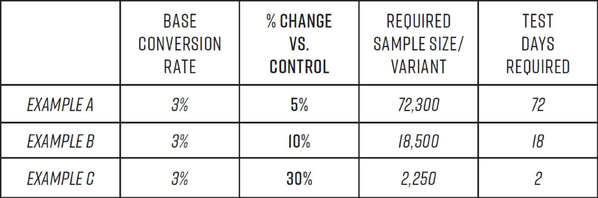
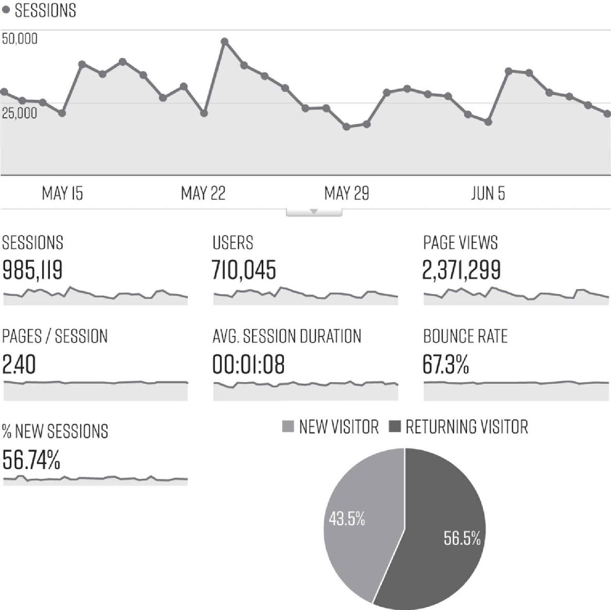
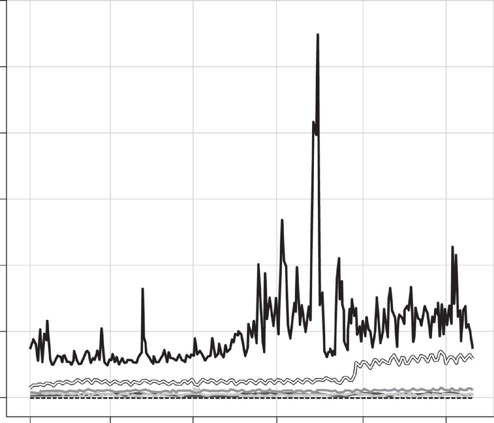
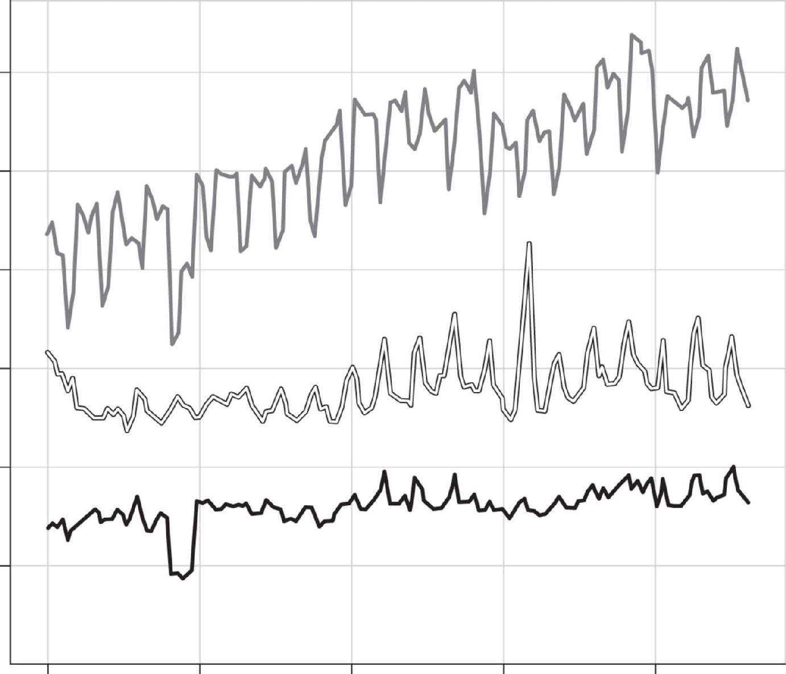
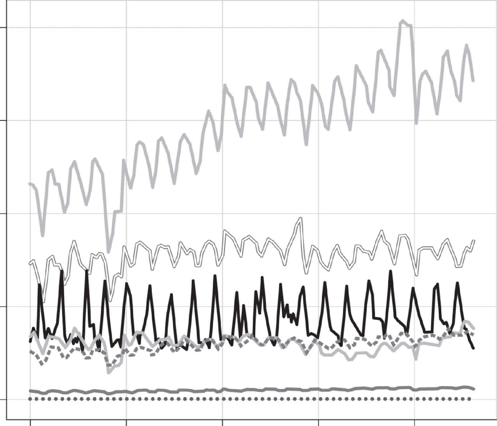
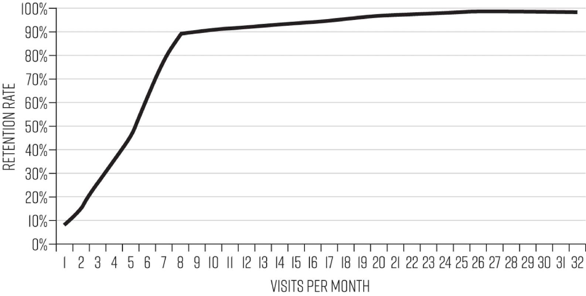

# Chapter Three: Identifying Your Growth Levers

Making a product compelling enough to pass the must-have test is the prerequisite for fast and sustainable growth, but in itself it’s not sufficient. Even truly great products that are loved by a core group of early adopters will almost surely fail without a well-focused effort to vigorously drive growth. So much media coverage of failed products is devoted to ones that professed to be “the next big thing” but that, with hindsight, clearly failed to offer a compelling core product value to a large enough market beyond their early adopters, like the aforementioned Google Glass or the much-hyped Segway scooter. There is less coverage about the more perplexing failures: those of products that *do* offer a very appealing core value and for which there is a large potential market that isn’t yet dominated by incumbents. Here the problem is often the lack of a well-designed and -executed strategy for driving growth.

Take the case of Everpix, which was one of the most highly regarded photo apps in recent memory. Designed for users who were tired of the hassles involved with managing large collections of photos on their devices, the service made the process effortless. Brilliantly designed, and praised by critics, the app was a snap to get the hang of and also boasted an average 4.5-star user rating. TechCrunch raved, “The best part about Everpix may be its ‘set it and forget it’ nature. After the onetime installation and configuration, there’s nothing else you have to do.”[1](part0017_split_004.html#c03-fnt1) The product’s initial base of 55,000 users were also highly active; about half of them returned to the app at least once a week. The founders chose a freemium business model—the basic version of the app was free, with the option to upgrade to a paid pro version for a $49 annual subscription, and the conversion rate to the paid version was an extraordinary 12.4 percent, far above most freemium product conversion rates, which hover around 1 percent.[2](part0017_split_004.html#c03-fnt2) The founders did so much right. But they made one fatal mistake: they failed to focus on finding a way to leverage the enthusiasm of their early adopters in order to drive much faster growth.

Though the enthusiasm for the product and the high rate of conversion might have seemed sure indicators that Everpix was on its way to great success, the start-up was in fact a ticking time bomb. The founders needed to dramatically ramp up the number of paid subscribers, and they needed to do it fast. A year and a half after launch, the company’s operating expenses totaled $480,674 while the revenue coming in from subscriptions totaled only just over $250,000. And the founders had spent almost all of the $1.8 million in seed capital they had raised on building the product features. The coffers had run dry, and with a bill estimated at $35,000 soon to come in from Amazon Web Services, the founders had no time left to do anything but try to raise more cash—and, when that failed, close up shop.

They had considered employing several growth hacks to drive more adoption. For example, they thought about requiring people to whom users sent photos to also sign up for the app in order to download the photos. But they decided against that because they were afraid it would annoy people. But remember that growth hacking involves more than picking from a menu of hacks; it is, rather, a process of continuous experimentation to ensure that those hacks are achieving the desired results. If they were truly practicing growth hacking, they would have run a test to determine whether or not their assumption was true. Instead they kept focusing on improving the product; for example, by offering a feature that sent users an email with photos they’d taken on the same day the prior year. That greatly increased the number of users who started to visit the app daily. But with their goal to generate more income, increasing daily active use wasn’t the metric they needed to be focusing on. Their urgent requirement was to increase the number of *subscribing* users, not to make the users they already had more active.

They had hoped to get out of their cash crunch by raising more capital. But without stronger growth metrics, pitch after pitch fell short. When they were finally able to secure a $500,000 loan, they hired a traditional marketing specialist who crafted a new tagline, “Solving the Photo Mess,” hoping that would ignite growth, but it didn’t do the trick.[3](part0017_split_004.html#c03-fnt3)

The Everpix tragedy demonstrates the importance of focusing not just on growth but on the *right levers of growth* at the right time. The conversion rate and positive feedback were clear indicators that they already had a great product and a solid base of active users; what the Everpix founders needed to do was shift attention from making the product pleasing to making it more profitable—i.e., channel their considerable design and engineering talent toward the mission of turning more customers into paying ones. Had they done so, it may well have become a lucrative business.

[*OceanofPDF.com*](https://oceanofpdf.com)

## **HACKING YOUR GROWTH STRATEGY**

Creating an aha moment and driving more people to it is the starting point for hacking growth. The next step is to determine your growth strategy. You have to understand exactly how you’re going to drive growth—what your growth levers are and whether they are the right ones to achieve desired results—before you move into high-tempo testing of growth ideas. Doing so will make the difference between strong sustained growth that is of real, revenue-generating value and illusory growth that sputters out.

You must be rigorously scientific in identifying the kind of growth you need and the levers that will drive it. Especially in the early phase of growth, you must set a highly disciplined course for experimentation that focuses intensely on the most important levers to achieve your goals. Speed of testing alone isn’t the goal; scattershot experimentation is a sure way to waste time and effort, and that’s true even if you’re testing at high tempo. Growth hacking is not about throwing ideas against the wall as fast as you can to see what sticks, it’s about applying rapid experimentation to find and then optimize the most promising areas of opportunity.

In the early phase of growth, you want to craft a strategy for running the experiments that will have the greatest impact on growth in the least amount of time. The more focused efforts are at the start, the more intentional your experiments will be, and the more impact you’ll achieve. While large companies can afford to deploy test after test to tiny slivers of their massive audiences, for smaller companies, each experiment has a significant opportunity cost, and so you must be aiming for high impact per test. Of course you can’t know ahead of time whether you’ll achieve that impact, but you should have a strong rationale for why a proposed experiment is the best one to run next.

In addition to the potential for bigger wins, high-impact tests will also produce definitive results faster. This can be a little tricky to appreciate. Andy Johns, former growth team member at Facebook and Twitter, created the example below to illustrate the point. He lists the results for three different experiments all aimed at improving the conversion rate of new visitors to a product into users, starting at a rate of 3 percent.[4](part0017_split_004.html#c03-fnt4)

EXPERIMENT IMPACT AFFECTS SPEED

Let’s say experiment A is testing a small change, such as the color of the sign-up button. As results start coming in, it becomes clear that the increase in the number of new visitors signing up is very small—garnering just 5 percent more sign-ups than the original button color. Besides the obvious assumption that changing the color of the sign-up button may not be the key factor holding back new users from signing up, it’s also an indication that you’ll have to let the experiment run quite a long time in order to have enough data to make a solid conclusion. As you can see from the chart above, to reach statistically significant results for this test, you’d need a whopping 72,300 visitors *per variant*—or, in other words, you’d have to wait 72 days to get conclusive results. As Johns put it in an interview with *First Round Review,* “That’s a lifetime when you’re a start-up!” In a case like this what a start-up really ought to do is abandon the experiment quickly and move on to a next, potentially higher-impact, one.

Running lots and lots of tests of small changes, like button colors, isn’t the way to start practicing the growth hacking process. Instead, small teams must focus on those tests that promise to have the highest potential for impact first. Johns is emphatic on this point: “Seriously. Be dramatic. Don’t just move a button on a page. You may run that experiment, given that you have small traffic sizes, and because of the small lift, you may run that test for months or years. Produce dramatic lifts if you’re a young start-up.”[5](part0017_split_004.html#c03-fnt5) Then, as your user or customer base grows you can afford to experiment in more niche areas at once. As the number of customers grows, shifting toward a higher volume of tests of even the smallest changes can create big wins.

So how do you figure out how to strategically focus your efforts on the experiments likely to have the greatest impact? That is precisely what we’ll address in this chapter.

[*OceanofPDF.com*](https://oceanofpdf.com)

## **THE METRICS THAT MATTER**

The first step in determining your growth strategy and figuring out where to focus is to understand which *metrics* matter most for your product’s growth. The best way to do this is to craft what Johns dubbed a company’s *fundamental growth equation*. This is a simple formula that represents all of the key factors that will combine to drive your growth; in other words, your core set of growth levers. This equation is different for every product or business. Here’s an example for the company Morgan runs, Inman News, which is a subscription business:

(WEBSITE TRAFFIC × EMAIL CONVERSION RATE × ACTIVE USER RATE × CONVERSION TO PAID SUBSCRIBER) + RETAINED SUBSCRIBERS + RESURRECTED SUBSCRIBERS = SUBSCRIBER REVENUE GROWTH

For eBay the formula is:

NUMBER OF SELLERS LISTING ITEMS × NUMBER OF LISTED ITEMS × NUMBER OF BUYERS × NUMBER OF SUCCESSFUL TRANSACTIONS = GROSS MERCHANDISE VOLUME GROWTH

Johns even created this equation for Amazon to illustrate the value of these formulas:[6](part0017_split_004.html#c03-fnt6)

VERTICAL EXPANSION × PRODUCT INVENTORY PER VERTICAL × TRAFFIC PER PRODUCT PAGE × CONVERSION TO PURCHASE × AVERAGE PURCHASE VALUE × REPEAT PURCHASE BEHAVIOR = REVENUE GROWTH

While all products will share common drivers of growth, such as new user acquisition, higher activation, and better retention, each product or business has a more specific combination of factors that are uniquely its own. For Uber, for example, one crucial factor is the number of drivers, because there must be enough of them in any given location to ensure the aha moment of a ride showing up quickly. The number of riders is also crucial, not only for generating revenue, but for assuring that there’s enough demand for drivers so that those who do sign on keep driving. This is why the growth team at Uber is tasked specifically with improving these two core metrics. For Yelp, core factors are the numbers of businesses reviewed and the number of reviews for each. For Facebook, the amount of items being shared by users and the time spent looking through the News Feed are key factors because newly shared content populates the News Feed, and results in more time spent browsing it, which in turn is vital to attracting advertisers and charging them a lucrative premium. So while the basic metrics that are tracked through traditional marketing and prepackaged data dashboards—such as the number of Web visitors, page views, the count of new and returning users, the number of new people signing up, and the time they spend on your website—are valuable, it’s of greater importance to identify the specific metrics unique to the product or business you are attempting to grow.

The way to determine your essential metrics is to identify the actions that correlate most directly to users experiencing the core value of your product, such as, for Facebook, how many people users invite to join their friend circle, how frequently they visit the site, how many posts and comments they make, and how much time they spend on the site. You want to track, at a minimum, the metrics for each of the steps users must take to reach the aha moment and how often they are taking those steps. Take Uber, whose essential metric for riders is rides completed. So in addition to the number of new people downloading the app, the company would want to track in the number of rides being booked, the number of riders who return and rebook, and the frequency with which they are booking new rides.

[*OceanofPDF.com*](https://oceanofpdf.com)

GOOGLE ANALYTICS DASHBOARD

*The metrics that appear in Google’s default dashboards aren’t necessarily the most important for your growth.*

[*OceanofPDF.com*](https://oceanofpdf.com)

The equations above may seem overly simplistic. Clearly many more factors go into making a business work, such as R&D investment, cost of materials, shipping expenses, inventory management, and more. But the stark simplicity of the growth equation is the point. The sheer volume of data that is now available about customer behavior, even using the most basic analytics program, is daunting, with screen after screen of extraordinary detail. Google Analytics, for example, provides hundreds of charts and data points, which, while robust, can create confusion if it isn’t used in service of tracking the most important metrics specifically for your growth. Reducing the complexity of your business operations down to a basic formula is immensely helpful in allowing the growth team to focus on the *right* signals in this vast sea of data noise.

Doing this can be tricky. Sometimes metrics that would intuitively seem to be crucial levers for you, including some of those that become the “it” metric for a period of time, such as daily active users, can in fact have very little impact on real sustained growth. Josh Elman explains that if you’re a travel service, like Airbnb, for example, then daily active users—though it may look good on paper—is nonsensical as a metric for you. Why? No matter how much they love the service, no one is going to search and make vacation bookings every day. Even Airbnb’s most active users are probably going to book a stay only maybe three or four times a year. Even for a review site, like Yelp, daily use is also unlikely. Searching the site perhaps once or twice a week might represent strong, regular use. These products simply have a built-in ceiling when it comes to how often a single customer needs their services. Whether you sell mattresses or mortgages, or offer fine dining or business services, regular use has a different meaning that is specific to your product.

Yet for some businesses, like Facebook, for example, daily active users is a hugely important metric because (a) as you may know from experience there is virtually no (or at least an alarmingly high) limit to the number of times one can visit Facebook in a single day; and (b) its advertising-based revenue model is premised on having lots of users who spend considerable time on the site. A metric that means nothing for one company, in other words, may be another’s core growth lever. For example, Josh Elman also worked at LinkedIn in its early days; he highlights that total sign-ups was a crucial metric for the professional networking site. For many companies, total sign-ups can be misleading, because if those who sign up aren’t really active, they’re of no real value. But for LinkedIn, the large pool of people who have simply filled in their work profiles, even if they hardly ever visit the site, is the fundamental basis of the site’s value. That’s because LinkedIn’s revenue was derived from job postings and premium subscriptions paid for by recruiters who wanted upgraded features to find and connect with potential job seekers, and the best way of hooking more recruiters—and thus creating more revenue growth—was making sure that enough people had posted their digital résumés. In addition, the more profiles on the site also resulted in more traffic coming from Google for people searching for professional contacts, driving even more people to the aha moment of making an important connection or finding a potential hire.[7](part0017_split_004.html#c03-fnt7)

By contrast, for eBay, one of the metrics that matters most is not daily users *or* new users but the number of items listed for sale. This is because the more items on the site, the more potential buyers will experience the aha moment of seeing exactly what they want to bid for; and in turn, the more sellers will experience the aha of making a sale. The more of each of those moments the site delivers to people, the more regularly users are likely to return, and the more merchandise will be sold. So while eBay clearly wants to increase the number of potential buyers who come to its site, getting sellers to list lots of items is arguably at least as, if not more, important, and thus should be where the bulk of their growth experiments are focused. And indeed, eBay determined that number of items sold is such an important metric for its growth that it designated *gross merchandise volume (GMV)* as the most important one to follow,[8](part0017_split_004.html#c03-fnt8) or what’s commonly called in the growth hacking community *the North Star metric*.

[*OceanofPDF.com*](https://oceanofpdf.com)

## **CHOOSING A NORTH STAR**

To hone your growth equation and narrow your focus, it’s best to choose one, key metric of ultimate success that all growth activity is geared toward. This is hugely helpful in keeping teams focused on the most productive use of their time and avoiding the wasting of resources that generally results from haphazard, scattershot approaches to growth experiments.

Some in the growth community refer to this one key metric as the One Metric That Matters, while others call it the North Star. We prefer the latter because it emphasizes that this metric becomes a guiding light to keep the team’s eyes on the ultimate goal of the growth hacking process, rather than becoming too fixated on a short-term growth hack they’re overly enamored of; one that may be wonderfully clever, or even create a temporary or illusory growth boost, but doesn’t actually contribute to long-term sustainable growth.

The North Star should be the metric that most accurately captures the core value you create for your customers. To determine what that is you must ask yourself: Which of the variables in your growth equation best represents the delivery of that must-have experience you identified for your product? To consider eBay again, the gross merchandise volume is a great bellwether of customer satisfaction, for both buyers and sellers. The more items that are sold, the more buyers have had the aha of finding something they want to bid for, and the more sellers have found buyers for their goods.

Let’s consider some other cases. For WhatsApp, the aha moment is the ability to send unlimited messages to friends and family no matter where they are in the world without worrying at all about the cost. WhatsApp’s North Star was therefore the number of messages sent, rather than, say, daily active users, because even if a user is active with the app every day, but is only sending one message, it’s unlikely that WhatsApp is their preferred choice for communicating with their network. Daily active users, therefore, doesn’t represent the delivery of the core value to customers. For Airbnb, the North Star was nights booked. No matter what the team did, from getting more email subscribers or registering more users, if it didn’t improve the number of nights actually booked, it wasn’t increasing the number of aha moments users experienced, which for guests was staying in a place they were happy with, and for property listers was making money from their home.

[*OceanofPDF.com*](https://oceanofpdf.com)

## **SETTING NEW SIGHTS**

The North Star may change over time as the company grows and initial goals are achieved. As Facebook learned how to engage users more actively, their initial metric of monthly active users became obsolete and daily active users became the better yardstick. At Zillow the Play is its North Star, and a new one is selected for each year, according to the shifting needs of the business.

As companies grow, they also create more product and growth teams, which have their own North Stars, even while the company may still have its one overridingly important metric. Recall that LinkedIn now focuses on initiatives in five areas: network growth; search engine optimization/search engine marketing; onboarding; international growth; and engagement, with a team dedicated to each. For Facebook, while the initial strategy was to focus all effort on getting new users to quickly friend at least seven friends in ten days, it evolved as the company grew and priorities shifted, including building the number of advertisers using the site and the international user base through initiatives like the translation engine and Facebook Lite.

[*OceanofPDF.com*](https://oceanofpdf.com)

## **ILLUMINATING THE BEST BETS**

In the movie *An American Werewolf in London,* two young Americans backpacking through the English countryside are warned by a man they meet in a local pub (colorfully named The Slaughtered Lamb) to “keep to the road, stay clear of the moors, and beware the full moon.” Not long after setting off down the road, the two friends are so engaged in conversation that they veer off onto the moor (ragged grassland) on the night of a full moon and, of course, one of the two is soon attacked by a werewolf. In the movie, hilarity (albeit of somewhat ghoulish flavor) ensues. In launching products, the result of veering off course is far from amusing.

When you’re gunning for growth, it’s easy to find yourself in the moors, working madly on improving a metric that ultimately doesn’t matter*.* Picking the right North Star helps to reorient growth efforts to more optimal solutions, because it helps illuminate when the focus of your experiments isn’t producing the results you need.

Deciding to abandon a course of action or an experiment can be very difficult, especially if team members have become quite committed to a direction they’ve championed. When you’re committed to an idea, pressure and emotions can all too easily bias judgment. As Facebook’s original growth team lead, Chamath Palihapitiya, wisely cautioned in one talk, “If you can’t be extremely clinical and extremely unemotionally detached from the thing that you’re building, you will make these massive mistakes and things won’t grow because you don’t understand what’s happened.”[9](part0017_split_004.html#c03-fnt9)

To clarify how dedication to improving a North Star metric helps make difficult decisions about how to spend time and resources, let’s look at how the Airbnb founders decided to conduct an experiment they thought might generate more nights booked—their North Star.

To begin, they looked at their data to identify markets where bookings were lagging and, to their surprise, discovered that New York City was underachieving. Clearly, New York is a major tourist destination, so they dug in, with early investor Paul Graham of Y Combinator, to analyze why bookings weren’t stronger. Reviewing the apartment listings for the city, cofounder Joe Gebbia recalls that “the photos were really bad. People were using camera phones and taking Craigslist-quality pictures. Surprise! No one was booking because you couldn’t see what you were paying for.” Graham recommended that the two experiment with a hack to improve bookings that was low tech and high effort—but it was fast to execute on and wound up incredibly effective. The cofounders and Graham wrapped up the meeting and booked a flight to New York. Gebbia and his cofounder Brian Chesky rented a $5,000 camera and went door to door, taking professional pictures of as many listings in the city as possible. Then they compared the number of bookings for the listings with the improved photos versus the rest of the New York listings, and found that the new photos led to between two and three times more bookings, instantly doubling the revenue they were seeing from New York.[10](part0017_split_004.html#c03-fnt10)

With their hypothesis that photo quality impacted bookings proven, they quickly extended higher-quality photography efforts to other major cities that were also underperforming: Paris, London, Vancouver, and Miami. The uptick remained consistent, and so to ensure the highest number of bookings Airbnb decided to create a photography program that allowed hosts to schedule a professional photographer to come and photograph their listing.[11](part0017_split_004.html#c03-fnt11) Launching in the summer of 2010 with 20 photographers, it grew to include more than 2,000 freelance photographers, taking photos of 13,000 listings on 6 continents by 2012. Was it cheap? No, but the improved listings led to a two-and-a-half-times-better booking rate that held up all around the world.

Gebbia and Chesky could have tried to ramp up bookings by instead focusing on greatly driving up the number of people searching for listings in New York. They might have sent more promotional emails featuring popular New York destinations, or paid for search ads to appear when people Googled destinations. Maybe that would have increased traffic to the site somewhat, but the number of bookings would still have been limited by the lack of the appeal of the photos. By keeping their focus on improving the ultimate goal of increasing the number of nights booked, they not only improved the rate at which people booked, but also made any future increase in traffic they drove to the site more lucrative.

Just as it’s easy to lose your North Star and find yourself veering onto the moors in pursuit of vanity or irrelevant growth metrics, it’s equally easy to get lost in the weeds of data analysis and lose the sense of urgency to start experimenting with ways to actually drive growth. Alex Schultz notes that the team at Facebook’s early charge to improve one key metric, which Mark Zuckerberg decided was monthly active users, helped the growth team break out of “analysis paralysis.” Doing more and more data analysis can be an especially alluring trap; because delving into data is scientific, we can convince ourselves that we’re just being rigorous and don’t want to experiment without sufficient evidence of likely success. One of Schultz’s favorite quotes when he talks about the growth process is of US World War II commander General George Patton, who said, “A good plan violently executed now is better than a perfect plan tomorrow.”[12](part0017_split_004.html#c03-fnt12) The clarity of the North Star goal helps to keep data analysis tightly focused so you can get your high-impact experiment off the ground as quickly as possible.

[*OceanofPDF.com*](https://oceanofpdf.com)

## **THE DATA IMPERATIVE**

In order to determine your growth equation and establish your North Star metric, of course the prerequisite is the ability to both gather data on customer behavior and measure product performance and the results of experiments. Only then can you know if your assumptions about both map to the reality of how people are using your product. Jack Dorsey, founder of Twitter, refers to getting your data tracking set up to be able to do so as “instrumentation.” Much as an airplane can’t fly without instruments providing information about altitude, air pressure, and wind speed constantly being monitored, without the right data at your fingertips, your growth team will be flying blind.[13](part0017_split_004.html#c03-fnt13)

Just as you have to determine the specific set of metrics that matters most to your growth based on your particular growth equation, you should take the time to pool your data resources and tailor your analytics capability so that you can do more refined analysis of customer/user information and behavior. Again, this often involves more than what the standard, off-the-shelf data apps like Google Analytics allow you to do. While those tools serve their purpose, when you’re starting to make your aggressive growth push, it’s important to be able to track every user from first visit all the way through all of that person’s interactions with the product, from how they discover it, to experiencing the aha moment, to when they stop using it. Most start-ups and established firms alike use multiple software programs to collect, store, and analyze customer data. They’ll have a Web analytics program to track user behavior on their website and within the product (if it’s Web-based) as well as a customer relationship management program to measure engagement with emails and mobile notifications and a system to track payments, among others.

As discussed in Chapter Two, combining all of your data so that you can do detailed tracking of customers throughout the experience funnel is essential to learning how to make your product must-have. If you haven’t pooled all your data at that stage, then it’s imperative to take the time to do it now.

Having this unified data store not only helps point you toward areas in which to experiment, as discussed in Chapter Two, it also allows you to design better experiments specifically focused on improving what you have identified as your key growth levers. The best growth teams take the time to get their data collection and analysis right. The Facebook growth team decided that better data insights were so important that in January of 2009, they took the dramatic step of stopping all growth experiments and spending one full month on just the job of improving their data tracking, collection, and pooling. Naomi Gleit, the first product manager on Facebook’s growth team, recalls that “in 2008 we were flying blind when it came to optimizing growth.” After the project, the data picture was complete and they could see what each and every user on the site was doing; they gained a much more comprehensive view of how people used Facebook, and of where problems in the experience of the product were occurring. This enabled the growth team to come up with many more focused experiments for testing and driving growth.[14](part0017_split_004.html#c03-fnt14)

The good news is that while for a large company, as Facebook was by that time, or Walmart when it engaged in this process, the effort to combine all data is quite a chore, it can be done more easily in smaller companies or projects thanks to the availability of a host of tools and services that make it easier to collect data and combine it from multiple sources. In fact, marketing specialist Rob Sobers has outlined a simple method using off-the shelf tools that creates a data tracking system that (at time of writing) costs just $9 a month. (While we won’t go into the details of how to do this here, you can find a link to it in the book’s endnotes.)[15](part0017_split_004.html#c03-fnt15)

[*OceanofPDF.com*](https://oceanofpdf.com)

## **IT’S NOT ALL ABOUT THE NUMBERS**

That said, user data does have limits, even remarkably detailed data. After all, even the most sophisticated analysis can really only tell you definitively *what* users are doing, not *why* they’re behaving that way. Sometimes patterns of behavior allow you to easily conjecture a reason for user behavior. For example, if you see a significant number of people fleeing from your website when they try to use a certain feature—say, a video player—often you’ll be able to readily identify a glitch in how it’s working: what product designers refer to as a usability problem. Maybe in the case of the video player, when you dive into the data, you discover that this happens more frequently for users who are coming to the product via an Android phone, and realize that problems in how the video player functions on Android devices are leading to videos taking a long time to load. Such usability problems are low-hanging fruit. Other issues that are holding people back from avidly using your product can be much more difficult to understand, and figuring out the why behind what’s going on requires conducting some user surveys or interviews, or both.

While the practice of talking to users in the early development stage of testing a prototype has become widespread, at far too many start-ups and established companies, it falls by the wayside once the product has been launched. Continuing to tap this vital resource as you move into the high-tempo experimentation process is extremely important, as the feedback garnered leads the way to many of the most powerful experiments you can run. Much of the quantitative analysis you do, in other words, should be complemented with this qualitative probing.

[*OceanofPDF.com*](https://oceanofpdf.com)

## **DESIGN ACCESSIBLE REPORTING**

One last point on data: the critical importance of reporting the results of your data discovery (and then from the experiments you’ll be running) in the most simple and accessible way possible. After all, even if you’ve looked at all the right metrics and crunched all the right numbers, if no one on the team (outside of the data analysts) can understand your findings, they are unlikely to result in meaningful action. Massive spreadsheets of user data, database queries, and highly technical displays, which can be enormously valuable for data analytics professionals, may be daunting if not downright paralyzing to other team members. That’s why it’s so valuable to take the time to create reports that vividly illustrate your progress as it relates to your growth levers and your North Star metric—using what are generally referred to as *dashboards*.

We are huge fans of dashboards because (a) they help focus team members’ attention on key trends or metrics; and (b) they allow you to share findings with the whole company, which encourages more participation in the growth effort. When Sean invited everyone in the company at GrowthHackers (and also trusted advisers and board members) to participate in the process of generating ideas for how to grow the community, we received a flood of great new ideas, many of which worked out to boost growth nicely.

By making the data more accessible across the organization you also keep the North Star and other important metrics top of mind with the entire company and encourage more data-driven behavior in all teams, not just the growth team. When Willix Halim, the former senior vice president of growth at Freelancer.com, actually tested how displaying dashboards in work areas impacts the performance of their teams, he discovered that constant visibility to the numbers the team is responsible for increases their ability to positively impact the metrics they’re responsible for significantly.[16](part0017_split_004.html#c03-fnt16)

To get a good sense of how valuable accessible reports can be, take a look at how complex the spreadsheets that growth teams typically create to track the metrics that matter can get. The figure below was shared by Dan Wolchonok, a senior product manager at HubSpot. It’s a trove of invaluable information, but it can be daunting for those not schooled in reading such reports to parse and take action with this kind of data presentation.

TYPICAL GROWTH TRACKING REPORT

Now consider how easy it is to spot significant trends in the following graphs created by Pinterest, presented by Pinterest growth engineer John Egan in a post on his eponymous blog about the 27 key metrics that Pinterest tracks.

SIGN UPS BY REFERRER TYPE

RESURRECTIONS BY PLATFORM

RESURRECTIONS BY REFERRER

*Pinterest Growth Dashboards*[17](part0017_split_004.html#c03-fnt17)

[*OceanofPDF.com*](https://oceanofpdf.com)

Clear trends are immediately discernible in each, though we can’t know precisely what they are because Egan has, for reasons of confidentiality, withheld the specifics in the versions you see here. Sharing data must be done judiciously, for sure, and you’ll want to be careful about which reports you send out beyond the confines of the growth team, and certainly which you share outside the company.

Creating such simple dashboards is not, pardon the phrase, rocket science. There exist numerous tools to create sharp data visualizations, from simple tools designed for small start-ups such as Geckoboard and Klipfolio, to enterprise solutions such as Tableau and Qlik Sense and dozens more. Whichever you choose, your reports should be insightful and actionable. Too many reports are nothing more than “data puking,” as Google Analytics expert Avinash Kaushik calls it.[18](part0017_split_004.html#c03-fnt18) Just disseminating metrics helter-skelter does little more than create confusion. The goal instead is to bring clarity to the metrics that matter most. To do so, dashboards should report only on the most important metrics that map to your growth levers. After narrowing the reporting to what really matters, the next step is to present information in a way that is actionable. For one, metrics should be presented as ratios rather than static numbers. For example, reporting on the total number of users acquired is static and tells you little, but new users acquired per day or week is much better, because it can be compared with previous time periods to see if the rate is rising or falling. Numbers also need to be accompanied by an indicator if they are above trend, below, or on par with past performance. This can be done by showing the percentage change over the previous period or using an indicator such as color to let the team know when a number is ahead or behind of where it typically should be.

Numbers can also be compared with a goal. For example, at Inman the team measures their subscriber growth metrics against the targets outlined in their quarterly goals to see if they are ahead of or behind pace. Dashboards should help team members grasp the health of the business growth, and answer questions quickly and clearly with the information they provide. While data visualization design is an intricate skill, a talented data analyst working with the growth lead can create a set of insightful and actionable dashboards for the team to keep track of the metrics that matter most.

[*OceanofPDF.com*](https://oceanofpdf.com)

## **PUTTING IT ALL TOGETHER**

To illustrate how identifying growth levers, conducting in-depth analysis and reporting, and supplementing it with customer queries can be used to unlock and then optimize an opportunity for growth, let’s look more closely at the way Josh Elman and the growth team at Twitter discovered that people who were following at least 30 other users became avid, long-term fans. Elman made an initial discovery by doing what’s called *cohort analysis,* which is dividing your customers or users into distinctive groups by a common trait. For Twitter, a basic division of users might be by the month they joined the service. This can be determined fairly effortlessly, but with a large and detailed data cache, you’d be able to create much more refined cohorts, such as people who look at Twitter up to five times a day but never tweet, people who tweet only on weekends, people who add ten or more new followers a week, and so forth.

At the time Twitter’s problem was retention of users; lots of people were signing up but then leaving, while at the same time a much smaller group were becoming quite active. So Elman and the team started by dividing up users into cohorts based on the number of days they visited Twitter in a month. Then they compared the number of visits made by those same users for the next month. They made a striking discovery: those who visited at least seven times in one month were retained in the next month at a very high rate, between 90 and 100 percent.

RETENTION RATE BASED ON TIMES USED IN MONTH ONE

He then divided users up into three cohorts: core users, who visited at least seven times a month; casual users, who visited less often; and cold users, who never came back after a first visit. That allowed the team to determine that only 20 percent of those who visited became core users. So the team dove into the data further, conducting a correlation analysis, which looks for any similarities of behavior within one group of users that are not found in other groups. The analysis of the highly retained users who came back at least seven times a month revealed that these people were generally following a number of other users that hovered around 30; some were following many more, but 30 seemed to be a “tipping point” number that hooked people to coming back for more.

But Elman and the team didn’t stop there. They knew that, as the mantra in statistical testing goes, correlation does not equal causation. Now, at that point they might have started just trying to boost the number of people that users were following and left it at that. And indeed that might have produced appreciable results. But what if the sheer desire to follow a significant number of people wasn’t the underlying reason that following 30 people made the product sticky? So the growth team dug further into the data and soon found another correlation. Whether or not people became active users also had to do with how many of those 30 or more people they were following were following them back. But contrary to what you might expect, it wasn’t that the more people followed a user back, the more likely they were to stick with Twitter; rather, those who were being followed by just a third of those they followed were the ones who became loyal users. But why? Here’s where collecting insights by interviewing Twitter users came in. By calling users and interviewing them the team discovered that if much more than a third of those you were following were following you back, then Twitter seemed pretty much like just another social network. The distinctive value of the product wasn’t clear. If *less* than a third of the people you were following were following you back then Twitter seemed more like a news site, of which there were already a plethora of other options. The unique product value of Twitter as a place for people to find out what’s happening in their world became clear to people when they had the one-third to two-thirds ratio.

The team also used interviews to learn about the behavior of another distinctive cohort of users: those who had gone “comatose,” disappearing for a time, and who then suddenly returned and became active. By actually picking up the phone and calling these people, the team learned exactly what was going on: when these people had first started using Twitter, they had thought of it as mainly about sending tweets, as a form of broadcasting, especially for promotional purposes. They didn’t have an interest in that, and so they checked out. But then someone they knew had told them about someone they were following, maybe a celebrity or someone they respected in their career or community, and these Twitter refugees realized the value of the site as a tool for connecting with and learning from others. The conclusion was clear: the number of people following and being followed by a user was the key lever they would need to focus on to drive growth. And they used this information to further refine their ways of suggesting people for users to follow.[19](part0017_split_004.html#c03-fnt19)

As the example from Twitter shows, identifying your growth equation and the key metrics to improve, along with establishing the proper instrumentation, data collection, and reporting that includes customer feedback, to discover and monitor your core growth levers, is an essential and powerful first step for successful growth hacking. Now you are ready to put your growth engine in motion. It’s time to introduce the step-by-step process we’ve developed for: honing the best set of ideas to test; getting tests done as efficiently as possible; running a highly disciplined growth meeting; and continuing to learn from and building on your findings in order to kick your growth engine into high gear.

[*OceanofPDF.com*](https://oceanofpdf.com)

In 2007, the Baylor University football team placed last in the Big 12 South college football conference once again. The team hadn’t gone to a bowl game in over a decade. Then Art Briles took over as head coach, and soon the Baylor Bears were averaging a remarkable 64 points a game and heading to bowl games every year as one of the top-ranked teams in the nation. Key to the turnaround was a new high-tempo, no-huddle offense that caught opponents off guard, leaving them breathlessly struggling to keep up with the pace of play. One sports journalist dubbed Baylor’s offense an “unstoppable system.” The speed of Baylor’s offense not only allows the team to outhustle its opponents: each game teaches the team more about how to win.

By running plays faster and shortening the time between plays, Baylor was able to run about 13 more offensive plays per game than their competitors. Those 13 extra plays amount to a 20 percent increase over the average number of plays for college teams per game, which, over the course of a 10-game season, adds up to the equivalent of nearly 2 full extra games.[1](part0017_split_005.html#c04-fnt1) That translates into much more experiential learning, in the actual heat of battle, about which plays work best and in what circumstances.

Learning more by learning faster is also the goal—and the great benefit—of the high-tempo growth hacking process.

The companies that grow the fastest are the ones that learn the fastest. The more experiments you run, the more you learn. It’s really that simple. The high volume is ideal, because most experiments fail to produce the results you’re hoping for. Others produce some indication of success but are inconclusive, not producing results significant enough to support making the change tested. Some produce small but not earth-shattering wins. Only very few tests produce dramatic gains. Finding wins, both big and small, is, in other words, a numbers game.

Remember that, generally, big successes in growth hacking come from a series of small wins, compounded over time. Each bit of learning acquired leads to better performance and better ideas to test, which leads to more wins, ultimately turning small improvements into landslide competitive advantages.

To illustrate the power of small gains, Peep Laja, a renowned expert in conversion rate optimization—the science of getting more visitors to a website or app to become customers—loves to point out that a 5 percent improvement in conversion rate every month nets an 80 percent improvement in a year due to the compounding nature of wins. If you were generating visitors through search ads, that increase in conversions would cut your costs of advertising per customer just about in half. This same principle applies everywhere in a company. In fact, small increases in retention can be even more powerful. As a team of researchers from Bain & Company and Harvard Business School discovered, a 5 percent increase in retention leads to an increase in profits of between 25 and 95 percent, because just small gains in retention lead to compounding revenue growth the longer customers stick around.[2](part0017_split_005.html#c04-fnt2)

This chapter will discuss how to run the kinds of rapid-fire experiments that will produce these kinds of compounding wins.

[*OceanofPDF.com*](https://oceanofpdf.com)
