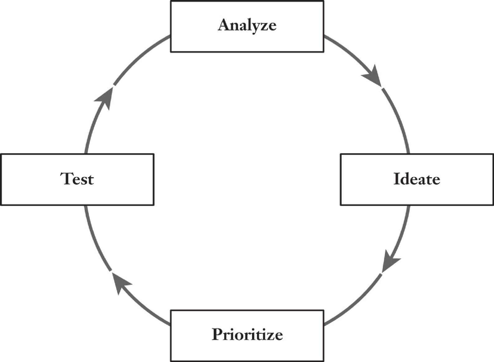
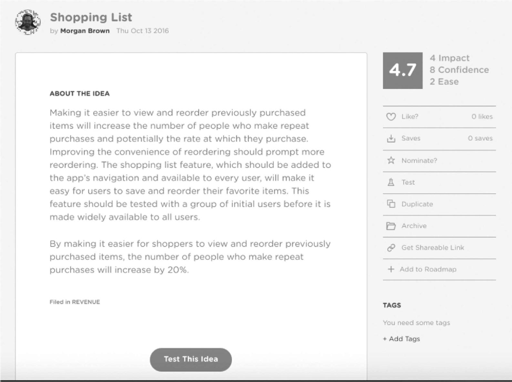
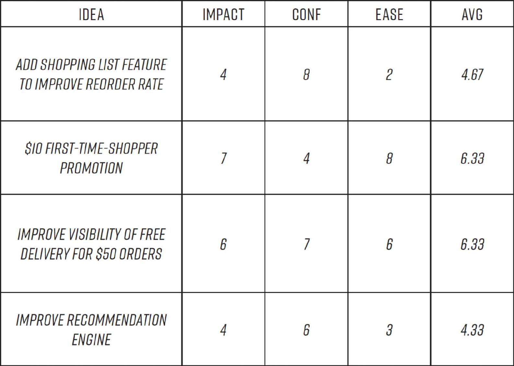
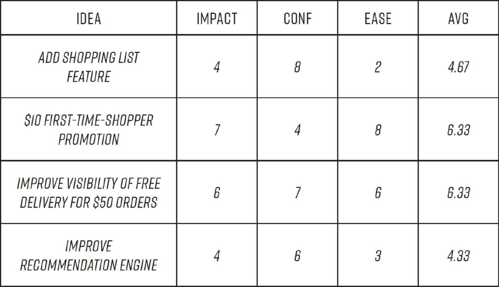

# Chapter Four: Testing at High Tempo

In 2007, the Baylor University football team placed last in the Big 12 South college football conference once again. The team hadn’t gone to a bowl game in over a decade. Then Art Briles took over as head coach, and soon the Baylor Bears were averaging a remarkable 64 points a game and heading to bowl games every year as one of the top-ranked teams in the nation. Key to the turnaround was a new high-tempo, no-huddle offense that caught opponents off guard, leaving them breathlessly struggling to keep up with the pace of play. One sports journalist dubbed Baylor’s offense an “unstoppable system.” The speed of Baylor’s offense not only allows the team to outhustle its opponents: each game teaches the team more about how to win.

By running plays faster and shortening the time between plays, Baylor was able to run about 13 more offensive plays per game than their competitors. Those 13 extra plays amount to a 20 percent increase over the average number of plays for college teams per game, which, over the course of a 10-game season, adds up to the equivalent of nearly 2 full extra games.[1](part0017_split_005.html#c04-fnt1) That translates into much more experiential learning, in the actual heat of battle, about which plays work best and in what circumstances.

Learning more by learning faster is also the goal—and the great benefit—of the high-tempo growth hacking process.

The companies that grow the fastest are the ones that learn the fastest. The more experiments you run, the more you learn. It’s really that simple. The high volume is ideal, because most experiments fail to produce the results you’re hoping for. Others produce some indication of success but are inconclusive, not producing results significant enough to support making the change tested. Some produce small but not earth-shattering wins. Only very few tests produce dramatic gains. Finding wins, both big and small, is, in other words, a numbers game.

Remember that, generally, big successes in growth hacking come from a series of small wins, compounded over time. Each bit of learning acquired leads to better performance and better ideas to test, which leads to more wins, ultimately turning small improvements into landslide competitive advantages.

To illustrate the power of small gains, Peep Laja, a renowned expert in conversion rate optimization—the science of getting more visitors to a website or app to become customers—loves to point out that a 5 percent improvement in conversion rate every month nets an 80 percent improvement in a year due to the compounding nature of wins. If you were generating visitors through search ads, that increase in conversions would cut your costs of advertising per customer just about in half. This same principle applies everywhere in a company. In fact, small increases in retention can be even more powerful. As a team of researchers from Bain & Company and Harvard Business School discovered, a 5 percent increase in retention leads to an increase in profits of between 25 and 95 percent, because just small gains in retention lead to compounding revenue growth the longer customers stick around.[2](part0017_split_005.html#c04-fnt2)

This chapter will discuss how to run the kinds of rapid-fire experiments that will produce these kinds of compounding wins.

## **TEMPO PICKS UP OVER TIME**

The volume and tempo of experiments that growth teams can run vary greatly depending on the size of the company and the resources available to support testing. Many of the leading growth teams regularly run 20 to 30 experiments a week, and some run many more. Early stage start-ups might be able to launch only one or two tests per week and then steadily build up to a higher volume, while later stage start-ups and large, established firms might well be able to start out with a much higher number. Whatever the size of the company or team, in order to maximize the number of experiments you can run and the gains you achieve from them, it’s essential to follow a highly disciplined process that allows you to create a pipeline of good ideas and efficiently prioritize them. This assures that you can maintain continuous testing at the highest possible speed you can manage without getting sloppy in your execution, collecting invalid test results, or getting bogged down in time-consuming brainstorming and debate about which ideas to try next.

We advise that teams start slow and build to a faster tempo after the team gets its footing with the new process; trying to launch too many experiments right off the bat can lead to poor test implementation, team confusion, and discouragement as targets are missed. Running careless or poorly designed tests can do more harm than good. Just as you shouldn’t try to run a triathlon without proper training and warm-up, neither should you jump into the growth hacking process at breakneck speed. That is a sure recipe for failure.

We’ve developed a four-part cycle and a set of simple but powerful tools for making sure a growth team operates as a well-trained, finely tuned, fast-tempo experimenting machine, which we’ll introduce in this chapter.

## **THE GROWTH HACKING CYCLE**

Recall that the stages of the process are: data analysis and insight gathering, idea generation, experiment prioritization, running the experiments, and then returning to the analyze step to review results and decide next steps, in a continuous loop. No matter what your product or what aspect you are testing, each turn through this cycle should be completed on a consistent interval, preferably in one or two weeks (at GrowthHackers we use a one-week cycle). The cycle is managed by a one-hour weekly growth team meeting to review results and agree on the next week’s set of experiments to implement.

THE GROWTH HACKING PROCESS

To illustrate how the process works from start to finish, we’ll use a hypothetical case of a growth team that has just been created at a large brick-and-mortar grocery retail chain, but as we hope will soon become clear, this is a process that can work for any team or company—large or small—and for any product or project—anything from a new software tool, to an online retailer, to a media product, to a hardware business, and even to a blog or single ad or PR campaign. We’ll describe what all of the members of the team should be doing in each of the stages, and we’ll introduce a model agenda detailing exactly how the crucial growth meeting should be run.

## **PREPARING FOR LIFTOFF**

Before you launch into the cycle, you’ll want to hold an initial team meeting, to explain to everyone on the team how the process will work. Here the growth lead should clarify the role to be played by each team member and how they are expected to work both individually and collaboratively to support the team’s work. The methods for generating and prioritizing ideas, which we will introduce later in the chapter, should be explained. The growth lead should then ask the data analyst to share the results of the initial analysis done, and the growth lead should present the key growth levers, the North Star metric, and the area of focus or objectives for the team. The team should then set the goal for the volume and tempo of experiments to launch each week; i.e., how many tests they think they can reasonably manage to design and implement. Generally, the data analysts and engineers will have the expertise to make an initial assessment, and adjustments will almost inevitably be made as the process proceeds.

Let’s say the growth team of the hypothetical grocery chain has been assigned the task of driving more sales through the company’s new mobile app. Launched with a big traditional marketing push several months ago, the app has attracted a good number of early adopters, with 100,000 people having downloaded it to their phones. But so far, sales coming from orders placed through the app have been sluggish. Rather than make another big acquisition push, the company has decided to try growth hacking.

The product team did a good job of building the app. They set it up with the proper analytics instrumentation to provide the most useful feedback on users’ behavior as they move through the app. They also tested the app with likely users during the development phase, and the feedback indicated that it is well designed. It offers lots of appealing features, like item search, recommended items, stock levels and availability, healthy recipes and the option to purchase the ingredients for them with one click, as well as a calorie counter that lets shoppers get a quick read on the calorie count for any given item, and also for a whole meal. The product team also thought shoppers would appreciate a feature that offers the ability to search by gluten-free, kosher, and organic options only. All in all, the app is an impressive piece of work. So it’s perplexing that it isn’t generating more sales.

To get at the bottom of this puzzling problem, the company has brought in an experienced growth team leader. Her first step is to pull staff from the marketing, engineering, product, and data science groups to create a team. Next, the team will need to uncover what the aha moment is for people who are using the app, and what it is about them and their usage that differs from those who don’t. Let’s say the team’s initial research shows that the aha moment is the convenience of ordering groceries on your phone and having them arrive at your door the next day. To prepare for the first growth team meeting, the growth lead works with the marketing and data team members to think through the app’s growth equation, and they determine it is:

NUMBER OF INSTALLS × NUMBER OF MONTHLY ACTIVE USERS × NUMBER OF PURCHASERS × AVERAGE ORDER SIZE × REPEAT PURCHASE RATE = AMOUNT OF GROWTH

They determine that their North Star should be monthly revenue per shopper. This is because the end goal, after all, is to generate sales. They want not only to engage more people in using the app but to build a large base of highly active shoppers who make substantial purchases on a regular basis. With the aha moment in hand, the data tracking in place, the core metrics identified, and the team assembled, it’s time to kick off the high-tempo growth hacking process.

In the very first growth meeting, you won’t yet be making decisions about which tests to run. Rather, team members will take the next week to brainstorm and percolate ideas for what experiments to run in the first cycle; these will be discussed and selected from at the next week’s growth meeting. We’ll continue on with the grocery app team throughout the chapter to see what ideas they come up with and exactly how the testing process should be run.

### STAGE 1: ANALYZE

In this stage, the growth lead works with her data analyst to dive into the data available from the initial wave of users to identify distinctive groups, starting by separating the regular shoppers from those who have barely ever, or never, used the app after downloading it. To start probing for areas of growth opportunity, they formulate a set of questions to guide their analysis, as follows:

WHAT ARE MY BEST CUSTOMERS’ BEHAVIORS?

• What features do they use?

• What screens in the app do they visit?

• How often do they open the app?

• What items do they buy?

• What is their average order size?

• What time of day do they shop and on which days?

WHAT ARE THE CHARACTERISTICS OF MY BEST CUSTOMERS?

• What sources were they acquired from? Was it an ad, a promotional email to the chain’s customer base, or some other place?

• What devices do they use?

• What is their demographic background, including age, income, and more?

• Where do they live?

• How close are they to the store or other stores?

• What other apps do they use?

WHAT EVENTS CAUSE USERS TO ABANDON THE APP?

• What screens have the highest exit rates?

• Are there bugs that are preventing users from taking a particular action?

• How are the products priced relative to other services?

• What actions don’t they take that users who purchase do?

• What is their path through the app, and how much time do they spend in the app before they abandon it?

While the data analyst works on crunching the numbers, the marketing expert on the team conducts a set of user surveys and a set of interviews. With one survey, the goal is to obtain a good set of demographic and psychographic information about users. In another, users are asked about their online and offline shopping habits. Lastly, users are asked about their favorite apps and mobile device usage.

All of the data analysis and responses from user surveys and interviews are summarized in a set of reports from the data analyst and marketing member and are sent to the team prior to the first growth meeting, which is scheduled for a week later. In preparation for that meeting, the growth lead writes a summary of the findings so far, in which she highlights several interesting shared characteristics of the regular shoppers versus those who have never shopped or have only made a purchase or two.

The first is that the group of avid shoppers have an average order of more than $50, which is just above the purchase threshold for free delivery. In addition, a large number of the regular shoppers purchase many of the same items each time, which are clearly staples for them. Finally, a large portion of the most active shoppers come to the app from the grocery store’s mobile website.

The team has a good number of growth ideas already in mind based on the analysis, and is now prepared to come together for their first meeting, in which they will discuss the findings thus far, review the initial ideas to leverage those findings, and plot a course to begin experimenting with ways to drive increased revenue from the app’s users from a first set of tests to run.

### STAGE 2: IDEATE

Ideas are the rocket fuel of growth. And you need a pipeline of them delivering a steady flow. As Linus Pauling said, “The best way to have a good idea is to have lots of ideas.” This is why unbridled ideation is key to the growth hacking process. This doesn’t mean that you’ll also engage in unbridled *testing* of them; your testing will be rigorously prioritized. But you want to encourage the growth team to tap into their creativity and not hold back in suggesting ideas. This ensures you’ll generate the volume of ideas that you’ll need to find the few diamonds in the rough.

Over the four days following the team meeting, all members should submit as many ideas as possible for hacks to try to improve the revenue from the app users. Self-censorship is discouraged, and nothing should be considered too crazy to put out there. The team members should be tasked with contributing ideas based on their specific expertise, though they shouldn’t be limited to ideas in that domain. The user experience designer might, for example, propose changes to the design of certain screen displays, while the marketing member might focus on different ways to encourage users to make their first purchase, and the engineers might come up with ideas to enhance the product’s speed of performance.

The growth lead should set up a project management system to coordinate the submission and management of ideas, as well as the tracking and reporting of results. Remember that cross-functional collaboration and the sharing of information are key tenets of growth hacking; that’s why it’s critical that everyone on the growth team have access to the growing bank of ideas, and be able to add to it at any time. At GrowthHackers, we created our own software program, called Projects, which allows anyone who is given access to it to both submit ideas and track, comment, and review experiments and their results. Any number of project management software packages can be used to facilitate the management of experiments and communication among team members about the status of experiments.

Ideas should be submitted to an *idea pipeline,* following a templated format by which they should be submitted. It’s important to standardize the format so that ideas can be quickly evaluated, without the team needing to ask lots of questions. Instead of vague suggestions like “Our sign-up form is too hard; we should make it easier to sign up,” submissions must articulate exactly what change is to be tested, the reasoning behind why that change might improve results, and an explanation of how results should be measured.

To illustrate the proper style in which ideas should be submitted, let’s return to the team working on the grocery mobile app. Ideas generated in that first week between the first and second growth meeting might be directed at any one of several methods of driving more buying. Some ideas might be aimed at enticing people who’ve downloaded the app but haven’t purchased yet to take the plunge and make their first purchase. Other hacks might be aimed at people who’ve already made a purchase, whether by trying to get them to buy more frequently, or increase their average order value on subsequent purchases. Lastly, the team might try some efforts to drive even more new shoppers to the app from the company website, since their data showed that those who come from the site tend to be the best purchasers.

Let’s say the product manager on the grocery app team comes up with the idea to build a “shopping list” feature that will store a list of shoppers’ prior purchases so that they can easily reorder them. The idea should be submitted in this format:

IDEA NAME: We’ve found that giving each idea a brief name makes the discussion of them easier and more efficient. At GrowthHackers, to force brevity and clarity, we limit them to under 50 characters. For the purposes of this example, let’s call this feature idea “Shopping List.”

IDEA DESCRIPTION: The best way to think about what the idea description should look like is along the lines of an executive summary. It should address the who, what, where, when, why, and how of the idea. *Who* is being targeted? For example, all visitors, new users only, returning users, or users from a particular traffic source? *What* is going to be created, such as new marketing copy or a new feature? *Where* will the new copy or feature be implemented: Will it be on the app’s home screen or elsewhere? *When* will it appear during the customer’s use, such as on the landing page when a visitor first comes to the site? In addition, the description must include the *why—*the rationale behind the idea—and the *how*—a recommendation of the type of test to be done, such as an A/B test, or new feature to be built, or a new ad campaign to be launched.

For the shopping list, the product manager’s description might look something like:

Making it easier to view and reorder previously purchased items will increase the number of people who make repeat purchases and potentially the rate at which they purchase. Improving the convenience of reordering should prompt more reordering. The shopping list feature, which should be added to the app’s navigation and be available to every user, will make it easy for users to save and reorder their favorite items. This feature should be tested with a group of initial users before it is made widely available to all users.

HYPOTHESIS: Like in any other type of experiment, the hypothesis should be a simple proposition of expected cause and effect. Again, broad strokes and vague outcomes are not going to cut it here; the statement “Not enough people are coming back and making repeat purchases; we should incentivize them to do so” is simply a statement of a problem and general direction for making improvement. Instead, a hypothesis might be: “By making it easier for shoppers to view and reorder previously purchased items, the number of people who make repeat purchases will increase by 20 percent.”

Some teams may elect to state an expected gain in their hypothesis while others will not. The pro of doing so is that it gives the team a clear idea of what success looks like. If they’re expecting a 40 percent gain and the win is 5 percent, then they still have work to do. On the other hand, predicting the results of a test ahead of time is an inexact science at best, and so some teams forgo it. At GrowthHackers we state an expected lift, which is calculated from past, similar experiments, benchmark data available online, and rough estimations based on the amount of people who are likely to see the experiment and its expected impact on their current behavior.

METRICS TO BE MEASURED: The metrics that should be tracked in order to evaluate the outcome of the test must be specified. Most experiments should measure more than one metric because sometimes, improvements in one metric come at the expense of others. Say that you’re testing a new sign-up form to your landing page. You may find that the new design increases the number of new people signing up, because you made it easier to do so, *but* that those sign-ups are less engaged than previous new users because they didn’t understand exactly what they were signing up for. Ultimately, that might be a serious impediment to growth.

Identify metrics to be tracked by looking at the metrics “downstream” from the experiment that will be impacted. For example, for the shopping list, the metrics to be measured are the number of customers who use the shopping list feature, the number of items saved to each list, the number of repeat order purchases, the rate at which people reorder, and the average order size of each order. These metrics will help the growth team assess the experiment and its impact on the metrics that matter to them. The scope of measurement includes how many people use the new feature and also the feature’s impact on their purchasing behavior, which gives the team insight into whether the experiment improved their key metric—namely, the revenue per shopper—and whether the experiment’s hypothesis was correct or not, such as whether it increased the repeat order rate of those app users who used the feature.

A GROWTH IDEA IN “PROJECTS”

Remember, the more ideas that go into your pipeline the better your chances of finding winners that spur growth. In the next phase of the cycle you’ll implement a process for sifting through the (hopefully) massive volume of ideas being generated and prioritize which to test now, later, or not at all.

One final note. With the goal being to generate as many ideas as possible, you ultimately want ideas coming in not only from the members of the team, but from people all around the company. The sales team might have valuable insight about customer pain points, and the marketers may have learned about a new promotional platform to experiment with for customer acquisition. While your initial efforts should leverage the creativity of people within the company, over time you should consider opening the call for ideas to outside suppliers and partners. Outsiders can offer surprisingly helpful suggestions that help teams break out of preconceived notions about the types of things they should be trying. In particular, advisers who have worked with a similar business to yours may have knowledge about a tactic that had great effect elsewhere. Asking your customers to share ideas can also be enormously enlightening, especially your most passionate users. They’re often thrilled to be asked and may have a good deal more experience with actually using your product than (sadly) your team does.

At GrowthHackers, we at first kept the ideation process to the members of our growth team. But we found ourselves getting stuck in a rut of similar tests. So we turned to our colleagues and asked for their ideas. At first, we made the mistake of not sharing the growth levers and target metrics with them, which resulted in lots of vague responses like “What do you guys need help with?” or “I’ll let you know if I think of anything.” But when we shared our focus, a wealth of great ideas flooded in. The result was so positive that we then opened up the ideation to our investors and advisers as well, and then ultimately also to trusted members of the growth hacking community.

We started off taking ideas via email and putting them into the right format ourselves for adding to our pipeline. Once we created our Projects software, we allowed all those we’d invited to submit ideas to log in and add their ideas themselves.

And indeed, some of the best ideas the team has ever tested came from outside the company. One of our most active community members, for example, recommended we do question-and-answer sessions on the site with well-known growth experts, which have since become important traffic and engagement drivers for the site. And after one of our advisers shared some search engine optimization tactics that worked well on his site, we found that when we deployed them they worked powerfully to drive our search rankings up on Google. These are just two of dozens of winning ideas that came from outside the team.

The final step before submitting an idea is to give it a numerical score to help the rest of the team prioritize it against other experiment ideas in stage 3. We’ll go over the scoring system and how it’s used to rank and choose hacks in this next stage.

### STAGE 3: PRIORITIZE

Before an idea is ready to be considered by the team, it must be scored. This scoring helps the team rank ideas against one another to determine what to test and when. Ideas are scored by the individual submitting the idea, prior to the idea going into the pool of available hacks to consider for testing.

At GrowthHackers, Sean developed the *ICE score system,* with ICE standing for Impact, Confidence, and Ease, as a way to organize all the ideas generated in the ideation process of the cycle. Here’s how it works.

#### *THE ICE SCORE*

When submitting ideas, the submitter should rate each idea on a ten-point scale, across each of the following three criteria: the idea’s potential impact, the submitter’s level of confidence in how effective it will be, and how easy it will be to implement. Then those ratings are averaged to provide an aggregate score for each idea. The entire bank of ideas are then ranked by their scores, and the team begins experimentation with the highest-scored ideas in the area of focus chosen by the growth team. For example, a highly rated customer acquisition idea will be passed on in favor of a lower-scored idea around retaining users if the growth team is currently focused on improving customer retention.

Here’s an example of the style of ranking we create, listing the results for the grocery app team’s ideas. This ranking can be done in a spreadsheet or in your project management software. You can see how the scoring has led to clarity about which two are the best ones to try first. Though the aggregate score of an idea may not always be the ultimate arbiter of which are selected in what order, because the team may decide after discussion in the team meeting that there are reasons to go with a lower-scoring option, you’ve got a great starting point.

It’s true that scoring your own ideas can be challenging, as they do require relative subjectivity and some degree of trying to predict the future. But with experience and practice, you’ll soon learn how to use data, previous experiment findings, and industry benchmarks to estimate your idea’s value. In addition, your “feel” for the potential return of a given idea will improve the more ideas you see tested and observe the results they deliver. But it also helps to have a good handle on what exactly these three criteria are and how to evaluate them. So let’s look at each a little more closely.

IMPACT: This is the expectation about the degree to which the ideas will improve the metric being focused on, which, in the case of the grocery app, is the revenue per user. You might think that only ideas that are very high impact are worthy of being submitted, but remember that a team should be selecting a mix of potentially high-impact experiments, which will generally require more work, and some that are easier to implement but also have a good, if not great, chance of producing meaningful results. The goal is to privilege as many high-impact tests as possible, but if some of them will take several weeks, or longer, to prepare for launch, then some easier tests should be slotted into the schedule—which is why ease of testing is also a component of the ICE score.

CONFIDENCE: This is a measure of how strongly the idea generator believes the idea will produce the expected impact. This rating should be based not just on conjecture, but on empirical evidence of some kind, whether from data analysis, review of industry benchmarks, published case studies, or knowledge of previous experiments.

Confidence should be higher if a test is an iteration of a previously successful test, which is a good practice and is commonly referred to in the growth hacking community as doubling down. Say, an email sign-up form offering a free product demonstration on a landing page promoted via a Facebook ad brought in a lot of new email addresses. You might next try promoting that same landing page through other sources, such as Google. Your confidence in the first experiment might have been relatively low, say, a score of 4, because you thought the sign-up form would deter people from wanting the demo. But for the next test, you might up the score to an 8 because of its success in the first experiment. A high confidence score might also come from knowledge that an experiment was successfully performed by another team, whether within your company or not.

EASE: Ease is the measure of the time and resources needed to run the experiment. Ideas such as substantially redesigning the new user experience or revamping the shopping cart in the checkout process might be high impact, but they are usually not easy undertakings, requiring weeks or months of work to launch. The ease score both provides the growth team a reality check about overly ambitious ideas and helps identify some “low-hanging-fruit” tests to run each time through the growth hacking process.

Before the team meeting, the initial scores should be reviewed by the growth lead, who might see issues that the submitter of the idea hadn’t seen or appreciated. The growth lead may suggest modifications to the score based on her past experience and consultation with other team members. It’s important that the team not get bogged down in trying to fine-tune the score too much. The score is to be used for relative prioritization and will not be perfect. A growth meeting can devolve quickly if team members squabble over a test’s impact score, for example. It’s better for the team to use the score as a valued guide, rather than the be-all and end-all for test prioritization. When there is uncertainty or concern about a score, the growth lead should use her best judgment and act decisively to keep the team moving.

This scoring system is clearly not fail-safe, and the results of tests will often defy expectations. Some of the lowest-rated experiments can—and have—turn out to be the biggest winners. At GrowthHackers, we once ran a simple experiment that involved moving the location of a sign-up form to receive our weekly “Top Posts” email newsletter. We had originally put the form at the bottom of our home page because we thought that users would want to evaluate the content on the site—i.e., scroll through the feed of trending posts that we feature on the home page—before they could decide whether they wanted to sign up to get the newsletter. Then Morgan had the humble idea to move the invite from the bottom to the top, giving it more visibility. Truth be told, he wasn’t sold on the impact the change would have, assigning it a score of 4 out of 10. But we decided to test it nonetheless because he gave the experiment a 9 for ease based on feedback from the engineering team, who said it was relatively easy to implement, and on his confidence that it would improve email sign-ups to some degree by being more visible, giving it a confidence rating of 8 that it would do so. The results were staggering. Much to our surprise, we saw a 700 percent jump in sign-ups, far exceeding our humble assumptions about the experiment’s potential impact on our growth.

We don’t tell this story to boast about Morgan’s ability to come up with good test ideas—he’s recommended his share of duds—but rather to show that our own expectations for our ideas aren’t foolproof, and to warn against tossing away all ideas that don’t have high scores.

While we like to use the ICE system, many other scoring systems have been created by fellow growth hackers. Bryan Eisenberg, considered the godfather of conversion optimization, recommends his *TIR system,* which stands for Time, Impact, and Resources.[3](part0017_split_005.html#c04-fnt3) Another system is PIE, for Potential, Importance, and Ease.[4](part0017_split_005.html#c04-fnt4) Many teams also develop their own systems to suit their particular needs. Though the specifics may differ, all scoring methods achieve the same overarching goal—assessing ideas in a quantitative way that makes it easier to sift through the options and decide what to test next.

Even after going through the scoring process and narrowing down a list of experiments you know you want to try, you’ll likely still end up with more ideas than you can test during the coming week. Some ideas will also require more preparation than can be done in one week, such as those that require extensive software development or design work. Those should be assigned a target future test date under the advisement of those who will be most involved in getting the experiment from idea to launch. So if the work involves software engineering, the engineer and product manager should give the growth team an estimate of the timeline, whereas if the experiment involves testing a new customer acquisition channel, the marketing team is responsible for advising the growth team on the schedule.

All ideas that can’t be launched during the current week should be stored in the experiment pipeline. You may decide to slate some of them for the following week, and others you might wait to revisit farther down the line. What’s key is that the team prioritize their efforts for the optimal use of their time and resources directed at the most pressing needs for the business in the area of focus identified by the growth lead.

To see how the selection process works, let’s return to our grocery mobile app team, who you’ll recall have a goal of increasing the revenue per user. Out of their set of ideas that follows, let’s say they reach a consensus and select the first-time-shopper promotion and the improved visibility of the free delivery offer for testing due to their high scores for both impact and ease.

The marketing team member is most likely to be put in charge of managing the first-time-shopper promotion and the product designer is charged with owning the free delivery test.

Say the team also decides that the shopping list experiment is worth a try, but because creating the feature will be fairly complex, the growth lead might task the product manager with consulting the product team about when they can slot the work into their schedule. The growth team will consider when to slate the experiment once that information is available.

We recommend making experiment selection a collaborative process. One day prior to the growth meeting, the growth lead should notify the team that it’s time to review the idea pipeline and nominate the experiments they think are the most promising candidates (which might include not only the new set submitted but some already in the pipeline). These nominations will determine the set of ideas to be discussed in the growth meeting, where the team will come to a collective decision about which experiments to launch, and when. Nominations can be done either over email or, if the system you’re using allows for this, by highlighting them in the pipeline. In GrowthHackers Projects, for example, team members “star” ideas, which then get pulled into a separate queue where the growth lead can view them all for review and debate in the upcoming meeting. To keep the number of ideas for discussion manageable, we limit each team member to a maximum of three test candidates for the week.

These “finalist” ideas will be presented and reviewed at the growth meeting, where the experiments to be run will be chosen by the growth team. The next section describes how.

### STAGE 4: TEST

Once the experiments for the next week’s testing cycle have been chosen, they are moved to what we call the Up Next queue (this can be as simple as a new spreadsheet if you’re tracking manually, or if you’re using project management software, these experiments can be moved to a special work queue or list within the system). Now it’s time for those in charge of the experiments to work with the other members of the growth team, and/or with colleagues in the departments who must contribute work, to prepare and deploy the experiments.

This is where the cross-functional collaboration really comes into play. Using our trusty example of the shopping app, the marketing team member might work with the graphic design and email teams to create the first-time-shopper-promotion graphics and marketing copy. She’ll also collaborate with the data analyst to identify both the control group—the group of users who won’t be exposed to the experiment—and the experiment group, and to ensure that results can be tracked properly.

Once the experiments are ready to go, the growth lead will send a notification around the company that they are being launched so that there are no surprises for other teams also working on the product. If roadblocks to launching certain experiments are encountered (e.g., the engineers are working on another big initiative and won’t have time to code the growth hack for another number of weeks), the team member in charge must inform the growth lead right away so that other experiments in their Up Next queue can be considered for deployment in their place.

#### *TESTING RULES OF THE ROAD*

Each experiment run comes at the expense of another candidate. Therefore it’s important that care is taken in the selection of the idea and the way the idea is tested. A poor test is one less opportunity to learn, slowing the team down, and bad data can send the team down a very wrong path. That’s why it’s critical that every experiment be designed to produce statistically valid results. Guidelines for ensuring reliable results should be well established, and the data analyst on the team should be responsible for applying these rules to experiments being run. The details of test design are outside the scope of this book, but we’d like to offer two rules of thumb for testing that we’ve found particularly helpful.

USE A 99 PERCENT STATISTICAL CONFIDENCE LEVEL: Many tools automatically set, or let you set for yourself, the confidence levels for tests. Common levels are 95 percent and 99 percent. While the difference of four percentage points may not seem like much, it is actually quite significant from a statistical point of view. A 95 percent confidence level means that a “winning” test can still be wrong 5 percent of the time. That means that 1 out of 20 tests that come back as winners could actually be losers. At 99 percent confidence, however, that number of false-positive tests drops to 1 out of 100: a much more valid result. Therefore, when in doubt, go with 99 percent confidence to greatly reduce the risk of mistakenly choosing a winning experiment on the basis of a false-positive result.

CONTROL ALWAYS WINS: When an experiment clearly fails, it’s usually easy for a team to look at the data and come to quick agreement about that fact. Reaching consensus is dicier when the results of a test are neither clearly positive nor negative, especially if running it involved a good deal of time and effort. No one likes to have wasted good work, and team members may want to let a test run much longer than is cost effective in the hopes that a larger sample size will change the current trend. While we understand why this is tempting, when results are inconclusive, the best course is to stick with the original, or control, version. That’s because even though the results may be inconclusive, the new variant could actually be a loser in the long term, a potentially costly risk. Think of it this way: in case of a “tie,” the “win” should go to the control.[5](part0017_split_005.html#c04-fnt5)

### BACK TO STAGE 1: ANALYSIS AND LEARNING

The analysis of the test results should be conducted by either the analyst or the growth lead, if he or she has the expertise. The results should be written up in a test summary, and this document should include

• The name and description of the test including the variants used and the target customers (for example, was the test run in a marketing channel, only toward mobile users, or to paid subscribers, etc.?)

• The type of test run: was it a test of a product function, a change to marketing copy on a website page or screen in a mobile app, a creative test, or a new marketing tactic deployed?

• Features it impacted: this could include the screenshots of where the test was run on the site, or on the screen of a mobile app, or include a copy of the creative from a particular billboard ad, TV, or radio ad experiment

• Key metrics: what were the metrics that you were trying to improve with the test?

• Test timing, including start and end dates of the test including day of week

• The hypothesis of the test and the results, including the original ICE score, sample sizes, statistical confidence, and statistical power

• Potential confounding issues, such as the time of year the test was run, or if there were other promotions that may have skewed visitor behavior

• The conclusions drawn.

This summary should then be shared with the growth team via email along with a memo offering a brief synopsis of what’s been learned. It should also be added to a database where you store all test summaries, which we call the *knowledge base*. That can be as simple as a special folder that is accessible to everyone on the team on a shared file server, or perhaps a page in the company wiki or intranet. In GrowthHackers Projects, the knowledge base is a special part of the software that has a feature to indicate whether the test was a winner, was a loser, or was inconclusive. No matter how the reports are stored, the essential requirement is that the results of all experiments are easily searchable so that teams can revisit them and consider variations, and also so that they can assure that they are not repeating tests, which is all too easy to do, especially when operating at high tempo.

In addition to creating a knowledge base, many teams send out regular communications far and wide within the company or, if more appropriate, the department to keep employees up to speed on the growth process. Your company culture and norms will determine what style of communication works best for you, but here are a few examples that you might want to try:

• Create a “Wins” email distribution list, so that recipients can get regular updates on which experiments have won, and the impact on the business. We’ve done this at Inman, and it goes to 20 people, all of whom have expressed interest in being kept informed. Some companies also send an email that lists *all* of the tests run, and shares the results for failed and inconclusive tests as well.

• For teams using instant messaging software (like Slack), you could consider creating a channel or chat room dedicated to the sharing of test results and discussion about them. We have a testing channel at Inman in our company Slack account that we use only for communicating new tests being launched and the results of recently concluded tests—both wins and losses.

• Publish test results to company dashboards. If the company doesn’t use dashboards, then simply printing and posting test results in common areas around the office is an effective low-tech way to spread the word.

## **THE GROWTH MEETING**

Since much of the process described above takes place around the cadence of the growth meeting, it’s useful to have a template for how that meeting should be conducted. We advise holding a growth meeting once a week, but some teams might want to hold them once every two weeks, depending on the time they can devote to the process. The goal of the meeting is to focus rigorously on the set of nominated ideas and agree on the plan for experimentation. It’s vital that this meeting not be used for brainstorming ideas; ideas should be brainstormed well before using the process described above. Teams may also want to hold additional brainstorming meetings, for example, perhaps once a month.

The following is the protocol for running the meeting that we developed at GrowthHackers that has proven highly effective. Feel free to tailor the specifics to your own team’s needs, but the overarching process is designed to work for any team or company, large or small.

The growth meeting is held on Tuesdays, which provides the team with a day at the beginning of the week to finish some of the requisite prep work. On Monday, the members check in on experiments in progress to identify any that can be concluded, or to collect data to update the team on during the meeting. The growth team lead does a review of the activity from the prior week, including:

• look at the number of experiments successfully launched and compare it to the velocity goal of the team

• confer with the data analyst to update all of the key metrics they’re following so that she can brief the team about them, perhaps distributing reports

• gather the data about any tests that were concluded

• conduct a high-level assessment of the previous week’s activity and results, including a summary of findings about both the positive and negative effects on growth discovered from the experiments

• compile this information and include it with the meeting agenda, which acts as a living document and is shared with the team beforehand. Some teams keep this document as a file that lives in the cloud, such as in Google Docs or Dropbox, while others use an internal wiki page in software such as Google Sites, Confluence, or the corporate intranet.

On the day of the meeting the growth team comes together for an hour and marches through the following standard agenda. Remember that the growth lead is responsible for keeping the team on track with this agenda as well as running the meeting more generally.

### 15 MINUTES: METRICS REVIEW AND UPDATE FOCUS AREA

The growth lead reviews the latest data for the North Star metric and the other key growth metrics, such as progress on short-term growth objectives in the team’s area of focus. The grocery app team, for example, might review the week’s average revenue per shopper, number of shoppers completing purchases, and so on. This helps get everyone clear on whether things are going well or not, what is working in the business, and what could be better.

Additionally, the growth lead will highlight the following set of information:

KEY POSITIVE FACTORS: Improvements in metrics resulting from experiments, or perhaps from other factors outside the scope of the team’s work, such as improved reorder rates observed after implementing the shopping list idea in the grocery app or an influx of new app users brought in by an in-store promotion run by the marketing team.

KEY NEGATIVE FACTORS: Drop-offs in performance and a review of issues that are holding back growth, such as if the number of people using the grocery app dropped measurably, or if the purchase rate dipped, or if a planned marketing push for the app was underperforming or delayed.

GROWTH FOCUS AREA: What part of the user experience or growth lever is the team focused on? Are there any short-term objectives that the team needs to work toward? If the focus is staying the same, this is a simple confirmation. If it’s changing: say, a shift from user acquisition to retention or monetization, a discussion of the new focus area and the reasoning behind the change should take place. Short-term objectives in service of these goals should also be noted, such as a short-term goal to get a certain percentage of app users saving items to their shopping lists.

### 10 MINUTES: REVIEW LAST WEEK’S TESTING ACTIVITY

A review of the results of efforts of the previous week, to include an assessment of the:

TEMPO: the number of experiments launched in the previous week as compared with the team’s tempo goal.

HOW MANY TESTS “UP NEXT” WERE NOT LAUNCHED IN THE LAST WEEK: This discussion should explain about why tests were delayed.

### 15 MINUTES: KEY LESSONS LEARNED FROM ANALYZED EXPERIMENTS

The growth lead and data analyst, in conjunction with any specific experiment owners, such as the product manager leading the development of a new feature, go over the preliminary results from the tests launched, as well as the conclusive results of experiments for which full analysis has been conducted. They answer any questions, take suggestions for further analysis, and codify the team’s assessment of the experiment and its implications for further action, or not.

### 15 MINUTES: SELECT GROWTH TESTS FOR CURRENT CYCLE

The team discusses the nominations for the next set of tests to launch. The growth lead asks each member to give a brief overview of the ideas they’ve nominated, which is followed by a brief discussion among the team about the merits of those experiments. The aim is to reach consensus, but if there is disagreement, the growth lead makes the final call. The experiments are then assigned to team members as “owners” of each experiment, responsible for getting the test launched. The growth lead will assign owners based on the expertise of the member who is best suited to manage the experiment. For example, a new product feature will be assigned to a product manager, while a new video ad campaign may be assigned to the marketing member, and so on. Any experiments that are deemed worthy of testing but will not feasibly be ready for next week’s cycle are slated for a future date, pending information from the relevant teams on how long they will need to ready the test for launch.

### 5 MINUTES: CHECK GROWTH OF IDEA PIPELINE

The growth lead reports about the number of ideas waiting for consideration or tagged for future launch. If the ideation volume is down, the growth lead should spur the team to add more ideas in the coming week. Recognizing top contributors from the previous week is a great way to inspire the team to keep the flow of fresh ideas coming.

## **GROWTH WITHIN WEEKS**

The speed with which the growth hacking process can produce significant improvements is astonishing. Sometimes a hack can go from germ of an idea to growth driver with just two weeks or so of work, including time spent on the preparatory data analysis and the first team meeting.

For example, the team working on the grocery mobile app might well get conclusive results from the two experiments selected for its first week of testing, one of which might support implementing a significant improvement to the app that can be designed and implemented almost immediately. Let’s say that the number of visitors who were converted to first-time shoppers increased by about 15 percent due to the $10 special offer for making a first purchase. This strong result leads the growth team to make the $10 incentive a part of every new user’s first experience in the app, and the 15 percent improvement in conversion holds up, leading to hundreds of thousands of dollars in new revenue from first-time app shoppers.

Through the success of this simple experiment, the team might also make a significant discovery that would lead to another good hack to test. Perhaps in closely reviewing the results, the team notes that the average order size for the new shoppers was smaller than the overall average for users. So the team might decide to try some experiments aimed at increasing the value of purchases made by these first-time buyers. For example, they add to the pipeline the idea of offering a scaling discount, which is larger the more the first-time shopper purchases.

One of the great things about growth hacking is that even failed experiments can lead to significant learning over an incredibly short time frame. Let’s say the other experiment proves a failure: increasing the visibility of the $50 free delivery offer was found to lead to no increase in volume of merchandise purchased. The team might hypothesize that perhaps $50 is too high a threshold and decide to add a test to the pipeline to be run the next week of a free-delivery offer starting at orders of $40. Perhaps that doesn’t drive an appreciable increase in order size either, but if they keep testing, they might discover in another week that a minimal order of $35 does the trick. Within just two more weeks, the team would have learned about a second powerful way to drive the growth of the app.

Now that you have the data puzzle solved, the team assembled, and the growth hacking process down, it’s time to move into the playbook section of *Hacking Growth.* In Part II we’ll devote a chapter to each major lever for growth—user acquisition, activation, retention, and monetization—and share with you the strategies and hacks that growth teams can use to unlock new growth in each area. Along the way we’ll also share more stories from successful growth teams and how they discovered and solved for big wins in each area, as well as follow the progress of our grocery app team to take you step by step through applying the growth hacking process in each.

