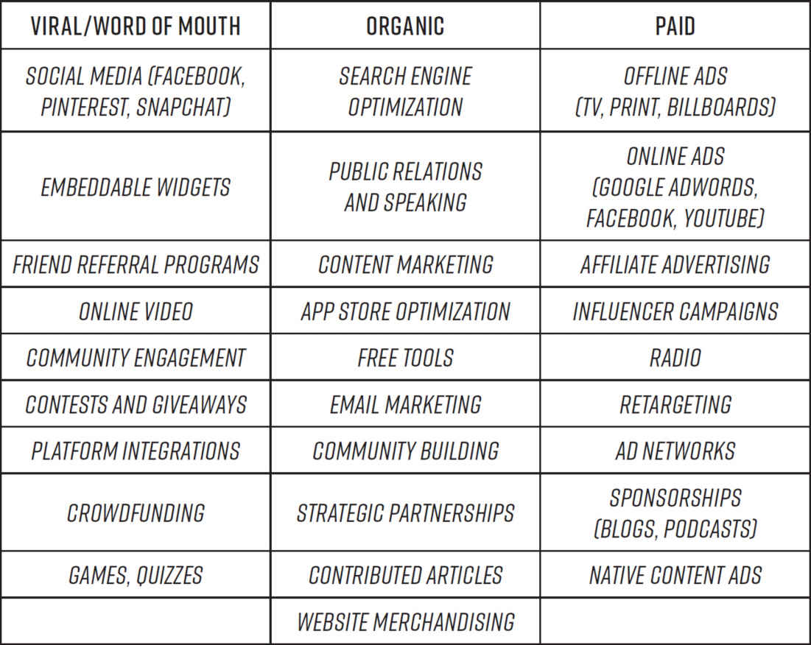
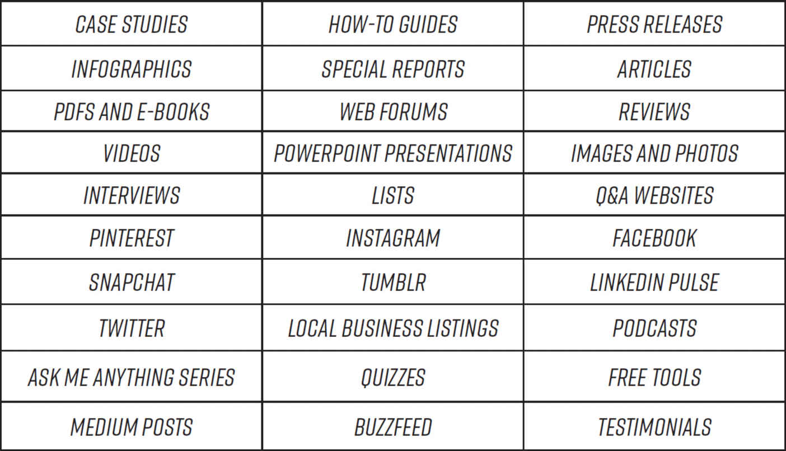
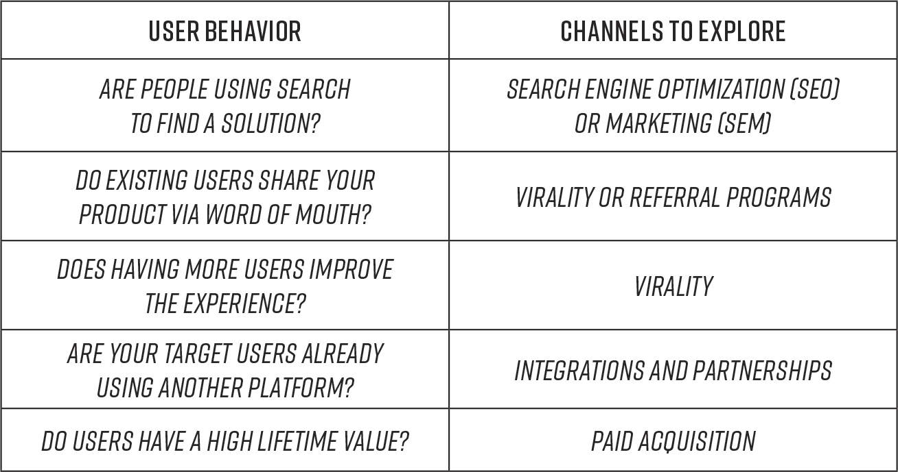
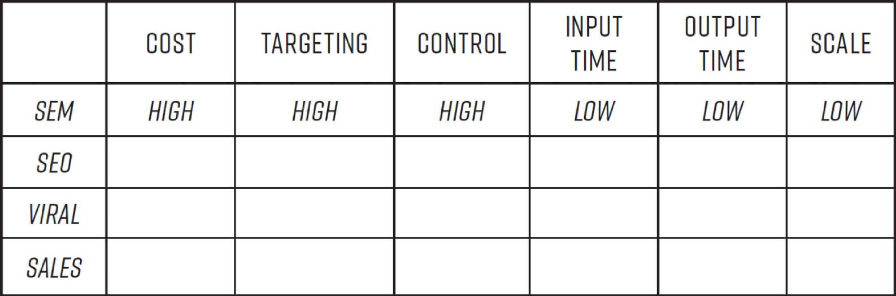
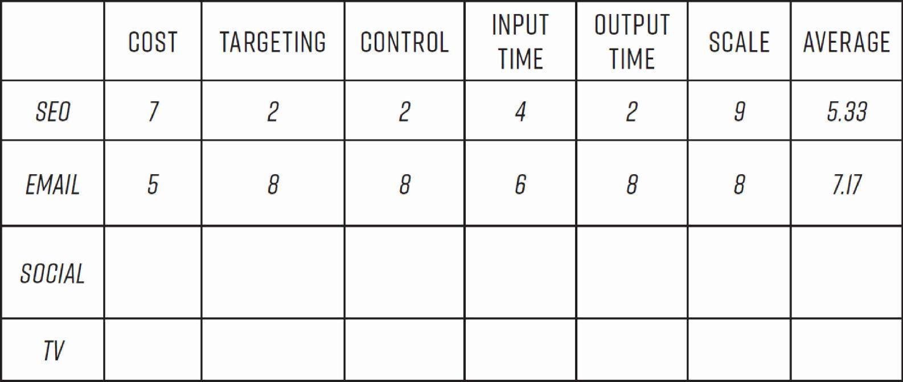
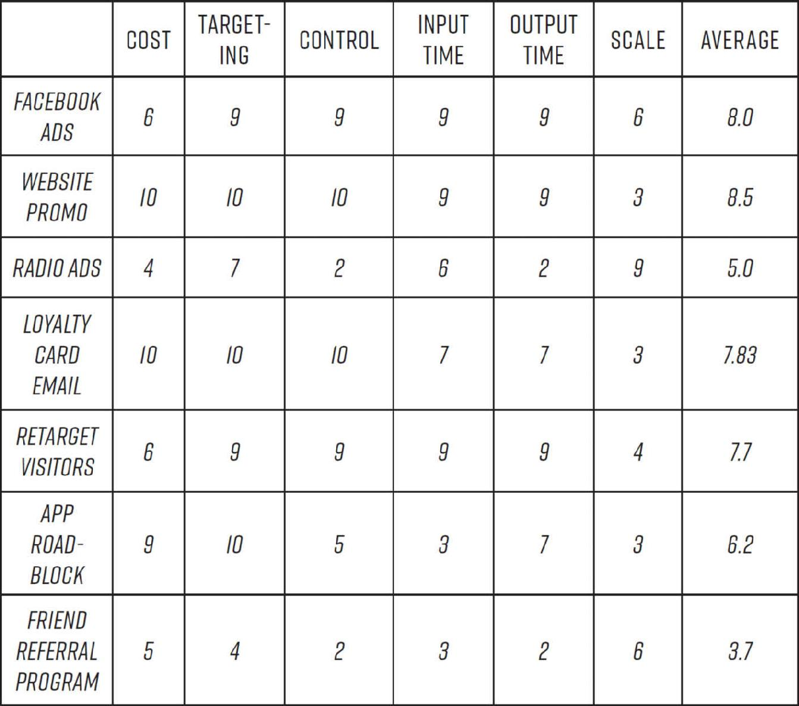

# Chapter Five: Hacking Acquisition

To be sure, gaining new customers is hugely important for any company. But if acquiring those customers is costing you more than you stand to make from them, well, we’d say you have a bit of a problem. Yet far too many companies fall into the trap of spending way too much to lure potential new customers. And it appears it’s only going to get worse: spending on online ads in the US has doubled since 2010,[1](part0017_split_006.html#c05-fnt1) and what’s more, in the US, Canada, and Western Europe at least, the growth of the Web audience is slowing, which essentially means companies are spending (and will continue to spend) more money to chase fewer potential customers.[2](part0017_split_006.html#c05-fnt2)

Before Sean and the team at Dropbox implemented the referral program, the company was spending nearly $400 to acquire each new user and the premium subscription price was just $99. Drew Houston smartly recognized that the expense-to-payoff ratio was unsustainable, but unfortunately, not every company comes to that realization in time. Take, for example, Fab, a flash-sale site for specialty designer goods. Once lauded as the “Amazon for design,” and feted as the latest Silicon Valley unicorn, the company was growing its customer base at breakneck speeds; the only problem was, it was spending $40 million a year on advertising and customer acquisition costs to do so—more than 35 percent of its revenue.[3](part0017_split_006.html#c05-fnt3) Suffice it to say, excessive spending quickly caught up with them, leading to the start-up’s dramatic implosion and sell-off at a fire-sale price.

This is not to say that spending lots of cash, even many millions of dollars, to stoke customer acquisition is always misguided. A business-to-business software company, for example, may have to invest a great deal up front in hiring a large salesforce in order to make any headway in lining up customers. Or a business in a “winner take all” situation, where it’s likely that one firm will become overwhelmingly dominant (as is often true for network effect businesses such as LinkedIn or WhatsApp), spending a great deal up front to make a land grab and try to lock in dominance may be a brilliant strategy. Or, if a company is running neck and neck with a strong competitor, as is the case with car-service providers Uber and Lyft, there may be no choice but to spend heavily on acquisition efforts. That’s assuming, of course, that the company has the cash on hand to sustain that up-front spending and a solid plan to recoup it down the line.

The amount a company should spend on customer acquisition is not a matter of any preordained formula; it’s a function of many variables specific to each company’s business model, competitive situation, and stage of growth. Mature businesses with deep cash reserves, for example, can obviously afford to employ more expensive customer acquisition tactics like television and print advertising, while cash-strapped start-ups must utilize scrappier methods that may have more limited reach but cost next to nothing. All that said, making acquisition efforts as cost effective as possible is always good business, and all companies should always be striving to spark strong word of mouth in order to reduce the expense of acquiring new customers. The growth hacking process is designed to help discover the most cost-effective ways to acquire new customers—and then optimize those efforts to drive growth.

Once you’ve put together your growth team, determined your key growth levers, and done sufficient testing to establish that your product is a must-have, you’re ready to start hacking the first stage of the growth funnel: acquiring customers. We advised earlier that you should not launch into a full-court press for large-scale customer acquisition until you’ve achieved product/market fit—i.e., until you’ve determined not only that you have a good product, but that your product is compelling to its target market. (Though for network effect businesses the push for user acquisition typically must go hand in hand with product development.)

The first phase of work in scaling up your acquisition of customers should be devoted to achieving two additional types of fit: *language/market fit,* which is how well the way you describe the benefits of your product resonates with your target audience, and *channel/product fit,* which describes how effective the marketing channels are that you’ve selected to reach your intended audience with your product, such as paid search advertising or viral, or content, marketing.

In this chapter we’ll show you how to use the growth hacking process to find those fits by using rapid-fire testing to identify the more effective and cost-efficient methods to both reach and engage your target market. First we’ll look at how to hone your marketing language to best communicate what is not just valuable, but special, about what you have to offer. Then we’ll talk about how to identify a core channel or two to focus on, and ways to leverage that channel for optimal growth. Next we’ll explore how to come up with clever hacks for acquiring customers through viral mechanisms, like referral programs, built into the product itself.

[*OceanofPDF.com*](https://oceanofpdf.com)

## **CRAFTING A COMPELLING MESSAGE**

The term *language/market fit* was coined by James Currier (who we met in the introduction) to refer to how well the language you use to describe and market your product to potential users resonates with them and motivates them to give it a try. This includes the language used in all aspects of the marketing campaign—from emails, to mobile notifications, to print and online advertisements—as well as, in the case of Web- and mobile-based products, the messaging used within the product itself: not just the tagline and value proposition on the landing page, but also the text accompanying the product’s every feature or screen or page. This is critical for customer acquisition for all businesses, not just Web-based ones, because today every product must have a Web presence and with users finding their way to yours through so many different routes, the first page they encounter might well not be the one you’ve specifically designed as a greeting for them.[4](part0017_split_006.html#c05-fnt4)

No matter how a potential customer discovers your product—whether via ads, articles and reviews, or word of mouth—the first text they see must send the right message fast; and in fact, it must do so a good deal faster today than just a few years ago. Research has shown that the average attention span (the amount of time we focus on a new piece of information online) of humans is now eight seconds, which is down from twelve seconds in 2000, and confers on us the dubious distinction of having an attention span shorter than that of goldfish.[5](part0017_split_006.html#c05-fnt5) With so little time to impress people, it is imperative that they understand almost immediately how your product can benefit them. This means that the language you use must *directly and persuasively* connect with a need or desire they have in order to hook them—in eight seconds or less!—into giving you a few more heartbeats to convince them of why they should come on board. In other words, you must craft language that very concisely communicates your product’s core value—conveying the aha moment—and answers the simple question foremost in every consumer’s mind: “How is this thing you’re showing me going to improve my life?”

One of the best examples of an enormously compelling product description is the language Steve Jobs used to introduce the original iPod. When the product was unveiled in 2001, the market was full of MP3 players, and it would have been tempting for Jobs to fall back on messaging explaining why his version was different and better. Instead, he brilliantly chose not to resort to any of the language being used to describe MP3 players and their utility whatsoever. Instead he completely reframed how people thought about the appeal of portable music players with the simple and captivating phrase “1,000 Songs in Your Pocket.” Rather than spend his time trying to differentiate his product from others on price or features, in other words, Jobs understood that the core value, the magical aha experience, was carrying your entire music library around with you anywhere, all the time, totally hassle free. Of course we’re not all such brilliant marketing minds as Steve Jobs—but with the right testing strategies in place, we can come close!

For most of us mere mortals, crafting appealing language is extremely difficult. The human response to language is highly emotional, and largely subconscious. Words that resonate for some people may have no particular appeal to some, or even be off-putting to still others. Marketers agonize endlessly trying to come up with brilliant taglines and advertising copy, and even so their messages often fall flat. This is what makes famous slogans like “It’s the Real Thing” and “Just Do It” so impressive. Each of those phrases is so simple—there is nothing particularly poetic or even distinctive about the language—and yet they are both powerful and memorable. Why did they resonate so well? Advertising experts and business scholars could no doubt write long papers positing answers, but it’s likely that no two of them would agree completely. Writing marketing copy is not an exact science. This is why growth hacking is designed to bring the rigor of scientific experimentation to the creative process. What this means is that you don’t *need* to be a marketing savant like Jobs to get language/market fit right; the growth hacking process will get you there.

Another reason the up-tempo growth hacking process is so perfectly suited to this challenge is the fact that language is a breeze to run A/B tests on. Website copy can be swapped out and tested relatively easily with tools like Optimizely and Visual Website Optimizer, which install a small piece of code on your website or app that randomly displays different versions of copy to your visitors and then measures and compares their responses. Most email marketing systems, such as Salesforce Marketing Cloud and MailChimp, make it easy to test specific pieces of your email copy, such as the subject line or call to action. And online advertising platforms like Facebook and Google also let you test many different versions of ads. None of these services require technical expertise, though if you have the engineering talent at your disposal, you can even devise your own system, as Upworthy, the viral news publisher, did.

Now one of the largest media sites on the Web, Upworthy grew at a lightning-fast clip, thanks in large part to their dedication to seeking language/market fit for every story they publish—their genius is in repackaging content they find on the Web with headlines so catchy they often go immediately viral. But it’s not that Upworthy’s editors are necessarily the most naturally brilliant or creative; their brilliance is that they don’t leave creativity up to chance. Instead, they hack it. The process of selecting headlines begins with a staffer writing at least 25 different possible headlines for each story. Out of these 25, a curator chooses a handful of favorites, and then the managing editor green-lights a set of those for testing. And their testing method couldn’t be simpler. The only tools necessary are Facebook, Bitly (a free online site that generates trackable URLs for Web content), and an old-fashioned timer. Here’s how they do it.

They pick two promising headlines for the same story and give each its own Bitly URL. Next, they segment their Facebook fans to find two cities with similar demographics and populations, such as one group of people in Minneapolis and another in Milwaukee, and they share one Bitly link with each group. Then they simply set a timer and wait, tallying the clicks and shares that roll in. When the time is up, the headline with the most clicks and reshares wins. And in addition to the viral boost this gives that specific article, all of their testing contributes to a growing body of knowledge about the most appealing words and phrasings that staffers can draw on for every subsequent headline they write. Given that, according to Eli Pariser, the site’s founder, “a good headline can be the difference between 1,000 people and 1,000,000 people reading,” this extra work is well worth it.[6](part0017_split_006.html#c05-fnt6)

Whether your product is a news article or a mobile app or a retail site, you can use this same method to optimize your messaging. And if you think you need a team of seasoned marketing minds who can generate dozens of potentially viral taglines out of thin air, think again; as your growth team works to craft copy for experiments, there are several sources you can tap to find words and phrases that have a good chance of resonating strongly. One is to adopt the language that your customers are using to describe your product and its benefits in social media posts and in online reviews. Another is to draw on comments from the customer surveys you hopefully conducted when determining if your product is a must-have. You can even pick up the phone and call customers directly; simply asking them how they describe your product and its value to their friends or colleagues will inevitably elicit some potentially powerful language or phrasings. Talking to customer support team members can also be very enlightening, as can reading the transcripts of customer support calls and scouring forums and online product reviews to get a sense of the kind of language your target customer is using.

[*OceanofPDF.com*](https://oceanofpdf.com)

## **START SMALL**

Often it’s the smallest changes in language that can have the most outsize impact on bringing in customers, which is why the most efficient experimentation process is one that lets you quickly test many different iterations. Consider how Tickle, a start-up James Currier founded in 1999, achieved two breakthroughs by experimenting with small changes to the language describing its social networking and photo-sharing products. When the response to the original webpage language that described the photo service as a way to “store your photos online” was “anemic,” Currier hypothesized that users weren’t spreading the word because they didn’t see a storage vault of images as a particularly share-worthy product. So Currier and his team experimented with a small change in language, to “Share Your Photos Online.” The test took almost no time to implement and the results were instant and staggering. The change of one word, from “store” to “share,” completely altered users’ perceptions of what the product was and how they should use it. Suddenly they were uploading and sharing photos like crazy, and in just 6 months, Tickle added 53 million users to the service.

Buoyed by this success, the team pulled off a similar feat shortly thereafter with a dating app. The original app featured the tagline “Find a Date,” and once again, growth was sluggish. They thought that maybe they could once again ignite growth by positioning the app as a social product, not just for people to use simply to find a date, but as a hub for connecting singles to one another through their friends’ networks. So they changed the tagline to “Help People Find a Date,” and sure enough, users started sharing invites with their friends, even sending them to married people because, after all, they can help their single friends with finding dates, too. The service added 29 million users within 8 months of making the single change.[7](part0017_split_006.html#c05-fnt7)

So as you plan your first hacks to test, start with language, and then go from there.

[*OceanofPDF.com*](https://oceanofpdf.com)

## **LANGUAGE FIT HELPS HONE YOUR PRODUCT, NOT JUST YOUR BRANDING**

Sometimes the changes in wording you arrive at will lead you to additional changes to make, not only in your copy, but in your overall branding and maybe even in the nature of your product itself—one of the reasons why growth hacking teams should consist of product developers and engineers as well as marketers, sharing data freely among them. Because while it’s possible that tweaking a few words in an ad or one on a webpage will yield amazing results as they did for Tickle, it’s equally possible that they won’t have any impact—in which case it’s time to dig deeper, and experiment with more substantial changes. It’s entirely possible that during this process you’ll find that a whole overhaul of your positioning is necessary. But don’t worry; keep in mind that many great products have required such overhauls to take off. Procter & Gamble’s Febreze, for example, was an honest-to-goodness breakthrough product: a chemical mixture that truly eliminates odors rather than just masking them with a pleasant scent. So when P&G launched it, they understandably touted this unique feature in their messaging, with the line “Febreze cleans bad smells out of fabrics for good.”[8](part0017_split_006.html#c05-fnt8) Yet sales remained sluggish until P&G realized, through market research that included videotaping how avid buyers use the product, that the better positioning was as another product to use as part of your regular cleaning routine, in part to fill a freshly cleaned room with a pleasing scent.[9](part0017_split_006.html#c05-fnt9) So P&G added scent and then repositioned the product in a major ad campaign showing women loving the way it smelled, and using language such as “for freshness that surrounds you like never before.”[10](part0017_split_006.html#c05-fnt10)

Sophia Amoruso, the founder of Nasty Gal, a women’s fashion brand that soared to popularity among millennials in its early years, recounts how learning what language resonated with her target customer was crucial not just for bringing in new business, but for the development of her brand’s whole identity. When she started her business by selling secondhand clothes on eBay, she would spend hours scouring the Web for the most enticing descriptions of similar items. To get ideas, she researched popular search terms to learn about current trends, which she then used for inspiration in defining her brand. As *New York* magazine reporter Molly Young recounted in a story about Amoruso’s success, “[*B*]*atwing, lamé,* and *lumberjack* were big in 2007; *studded* and *architectural* and *origami* in 2008”; with this knowledge she scoured rag houses, with their stockpiles of secondhand clothes, to resell on eBay. She crafted a unique, always on-trend brand that resonated with millennial fashionistas.[11](part0017_split_006.html#c05-fnt11) Amoruso recalls in her book *#GIRLBOSS* that “[e]ach week I grew faster, smarter, and more aware of what women wanted.” The words shoppers responded to best helped her realize that her brand should be about empowerment, about helping women enhance their personal image and sense of self-worth. That was what made the brand so distinctive and fueled extraordinary growth. Unfortunately, the company couldn’t sustain the growth that Amoruso found early on and, after a series of poor business decisions, filed for bankruptcy in late 2016.

[*OceanofPDF.com*](https://oceanofpdf.com)

## **FINDING CHANNEL FIT IS NOT LIKE PORTFOLIO MANAGEMENT**

In stock market investing, experts agree that it’s best to spread your money across a wide swath of diverse types of businesses and sectors. But this is not the right strategy when it comes to finding the channels for marketing and distributing your product (which in Web business are often one and the same). Marketers commonly make the mistake of believing that diversifying efforts across a wide variety of channels is best for growth. As a result, they spread resources too thin and don’t focus enough on optimizing one or a couple of the channels likely to be most effective. Most often it’s better, as Google founder and CEO Larry Page has said, to put “more wood behind fewer arrows.” Or as Peter Thiel, cofounder of PayPal, Palantir, and the first outside investor in Facebook, tells start-up founders, “It is very likely that one channel is optimal. Most businesses actually get zero distribution channels to work. Poor distribution—not product—is the number one cause of failure. If you can get even a single distribution channel to work, you have great business. If you try for several but don’t nail one, you’re finished.”[12](part0017_split_006.html#c05-fnt12)

At the same time, too many companies get caught in the trap of following the herd, using the same channels as everyone else, such as Google paid ads or Facebook advertising, and not experimenting with options that might be more effective for their specific product, *and* less expensive. It’s understandable; finding the right channels to focus on can be a truly daunting task not only because it is hard to know without extensive testing which channels will be the best ones for your particular business, but because there are so many different channels to choose from now, and new ones emerging all the time. Experimenting through the growth hacking process allows you to discover your optimal channel or two relatively quickly, ideally before your competition does.

[*OceanofPDF.com*](https://oceanofpdf.com)

## **NARROWING THE FIELD**

There are two phases in which to home in on your best channels: *discovery* and *optimization*. In the discovery phase, the growth team should experiment with a range of options, and this does not mean trying all sorts of things haphazardly to see what sticks. Channels must be researched thoroughly, then prioritized down to a few to target for experimentation, and we’ll introduce a simple but hugely helpful method for doing that in just a moment. Once you have found those one or two with the right fit, you can move to the second phase, optimization, in which you should be working to maximize both the cost-effectiveness and the reach of your channels as you keep scaling up. But first let’s see how the prioritization process works.

To get started, you’ve first got to get a fix on all of the channels that might make sense for you to consider. Almost surely, some will be very obviously inappropriate for your product and can be quickly eliminated: if you are selling enterprise business development software, for example, advertising on popular entertainment sites won’t make sense; rather you’ll likely want to focus on channels directed to business professionals, such as business news periodicals. In order to impose some order on the ever-expanding set of options, growth experts like Justin Mares, Gabriel Weinberg, Andrew Chen, and James Currier have helpfully sorted leading channels into three basic categories: *viral/word-of-mouth,* *organic,* and *paid*. We’ve drawn on their categorizations to compile the following (representative, but not exhaustive) set of options.

THE THREE CATEGORIES OF CHANNELS

Of course, within each of these channels many specific tactical options are available. For content marketing, for example, GrowthHackers member Pushkar Gaikwad compiled this helpful list of just some of the types, which of course are always proliferating:

THE LEADING TYPES OF CONTENT MARKETING

Listing all of the specific options for each of the channels and discussing the ins and outs of each is beyond the scope of possibility here—that would require many books. But a wealth of detailed information about best practices for all of these options is available online, from the experts mentioned above and many others, and our point is that exploring them should be your first step in the prioritization process. Then you should focus on choosing a few to efficiently experiment with, using the following method.

[*OceanofPDF.com*](https://oceanofpdf.com)

## **MAKING A FIRST CUT**

An initial winnowing can usually be done readily by considering the particular demands of your business model. For example, if you are selling a product to other businesses (i.e., business-to-business), you will often need a sales team and sales support operation to gain traction, a presence at trade shows, where sales staff can meet with prospective clients, and a content marketing strategy, which helps establish a company’s expertise; therefore, content marketing, trade shows, and sales are likely to be among the most effective channels for reaching your target customer. An e-commerce store’s business model revolves around driving the highest volume of potential shoppers to its site, and so search ads and SEO are obviously vital channels, while marketplace businesses like Uber and eBay must divide efforts between channels for bringing in suppliers and those aimed at shoppers (or riders).

This doesn’t at all mean that businesses of each type should limit themselves strictly to these most obvious channels, especially as they continue to scale. A growing e-commerce company, for example, might discover that building a community, which is a viral channel, is also a good lever for driving growth; just think about Amazon’s purchase of the book lovers’ community Goodreads. Or a booming social network that has pioneered in new terrain, and that has attracted hefty venture capital, as Instagram and Snapchat both did, might decide to invest in TV, radio, and print ads to solidify its ownership of the territory, rather than relying only on viral mechanisms. But you’ve got to first focus on optimizing the channels that are most cost effective for you.

A next step in narrowing options is to consider the characteristics and behaviors of your users, and this means identifying the behaviors that they’re *already* engaged in, such as the types of Google searches they are doing, the places they are shopping, and the social networks they are using. For example, does your product fill a need or solve a problem that people are currently searching for solutions to? Then channels where people are actively looking for answers (like search engines) are good bets. If you can’t verify that there’s a good volume of people looking (or searching) for what you offer, building awareness in other ways will be needed. That was the case with Dropbox. Services to help people easily share and store files online were brand-new when the company launched, so people weren’t searching Google for the solution Dropbox was offering, which was a key reason that the effectiveness of paid search ads was so limited. The referral program solved this problem. If you know that your target customers are big purchasers of a certain product that is complementary to yours, a brand partnership or cross-promotion may be another solution.

Aatif Awan, the Vice President of Growth & International Products at LinkedIn, who helped take the company from 100 million users to more than 400 million, created this handy chart of types of user behavior that you can use as a guide in making these decisions.[13](part0017_split_006.html#c05-fnt13)

Once your growth team has selected a few channels to experiment with using the steps we outlined above, it’s time to propose a set of specific tactics for each channel to experiment with, and prioritize them for testing.

[*OceanofPDF.com*](https://oceanofpdf.com)

## **EXPERIMENTING TO GET CHANNEL/PRODUCT FIT**

We advise a prioritization method based on one devised by Brian Balfour, HubSpot’s former head of growth, who created a simple scheme for ranking channels according to a set of six factors:

• Cost—how much you expect to have to spend to run the experiment in question.

• Targeting—how easy it is to reach your intended audience and how specific you can be in whom your experiment reaches.

• Control—how much control you have over the experiment. Can you make changes to the experiment once it’s live? Can you stop it easily or adjust it if it’s not going well?

• Input time—how much time it will take the team to launch the experiment. Filming a television ad, for example, has a much longer input time than setting up a Facebook ad.

• Output time—how long it will take to get results out of the experiment once it’s live. For example, search engine optimization experiments or social media may have longer output times than a radio ad does.

• Scale—how large an audience can you reach with the experiment? Television has a much larger scale than advertising on topical blogs.[14](part0017_split_006.html#c05-fnt14)

Balfour suggests giving each channel a high, medium, or low score for each of the factors, as in the figure that follows. He notes that different channels will rank higher or lower on these factors depending on your product or business. For example, if the search words that you want to use for an SEM campaign are highly competitive, you’ll have to pay more for them, which means that SEM will rank relatively high in cost for you in contrast to someone whose product is new enough that competition has yet to build up. If your product appeals to a very specific demographic of people who are highly networked, say, college age men, then targeting ability will be high for you for viral efforts, whereas if you’re selling a product meant to appeal broadly to the masses, targeting could be a challenge, and therefore rated on the low end.

PRIORITIZING DISTRIBUTION CHANNELS

We built on Brian’s method to create a prioritization process for channel experimentation. We score each channel the growth team proposes for testing on a scale of 1 to 10, with 10 being the best possible score and 1 being the least favorable score (note that lower cost, input, and output time will receive higher, not lower, numbers, since low cost and input and output times are obviously more favorable). We then simply average the scores, rank them, and prioritize our experiments accordingly. Here’s an example of the grid we use for the ranking, a template of which is available for download at [growthhackers.com/resources](http://growthhackers.com/resources):

To illustrate how this method can work, let’s pick back up with the team working on the grocery store mobile app you read about in previous chapters, and see how they used it to both prioritize and optimize their first round of channel experiments.

You might remember that to drive initial adoption, the grocery chain, which has deep pockets, ran an aggressive radio and print ad campaign that generated an impressive 100,000 initial app downloads. But because not all that many of those people were *buying* much with the app, the growth team pivoted to focus on generating more revenue per user rather than on attracting more potential shoppers. Let’s say that they’ve now succeeded in improving the average revenue brought in per active app user, so they’re now turning their attention back to acquiring more users, and the mission (as it always should be) is to find more profitable channels.

First, they do another analysis of their user data. They’ve been monitoring the data continuously, of course, keeping a close eye on the metrics that matter most, but whenever a team shifts focus to a new growth lever, it’s important to dive into the data with fresh eyes looking for insights specific to their new mission. Recall that they had discovered earlier that a large number of their best customers were coming from the grocer’s main website, and that’s still true. So they decide that they will focus on organic ways of leveraging the website more powerfully as one key channel, and will also experiment with new channels to help them cast their net wider and bring in more users who aren’t regular visitors to the website, as was done at the initial launch. Facebook and Google advertising are obvious possibilities, so they conduct research to see how much of their existing user base is on those platforms, and how many similar types of users can be reached through advertising. They find that most of their users are quite active on both, so they dig deeper, scouring industry reports for benchmark data about where exactly their potential shoppers are spending time online and what other competitors have spent on Google and Facebook ad campaigns of what kinds, and what their relative success has been.

Armed with knowledge about their users’ online behavior, they hypothesize that Google AdWords might not be such a great opportunity after all because people aren’t searching on the wider Web for grocery items; they’re searching on grocery retailers’ websites. Facebook, on the other hand, allows them to target especially well by demographic groups and their interests, and they’ve got lots of demographic data about their customers, so they decide to put Facebook ads on their prioritization grid.

The team decides to also do some additional market research, running some feedback surveys on the company’s main website and on the app, and also interviewing some existing customers. From those shoppers who visit the website, they want to learn whether they downloaded the app and if not, what held them back; for the existing app users they ask what would make them likely to refer the app to their friends. From these surveys, they learn that a significant number of the website visitors didn’t know about the app, and those who did were happy ordering from their laptop and didn’t see the need to use it. They also learn that a good portion of the app’s users say that they would recommend it to others and would be even more likely to if they were given a discount off their next order or a coupon.

The team comes up with the following hacks to consider:

ORGANIC

• Improve app merchandising on main website

• Email regular shoppers who have loyalty cards but haven’t downloaded the app with messaging about the benefits of shopping via the app

• Add a full page promoting the mobile app that pops up for website visitors when they access the site on their phones, also known as an app-install-roadblock page

PAID

• Run Facebook app install ads

• Run a set of radio ads based on the success from their initial launch campaign

• Retarget website visitors with ads to download the app, meaning: run a Web ad campaign shown only to previous website visitors

VIRAL

• Create a friend referral program for existing app shoppers that leverages their desire for additional discounts in exchange for inviting friends

So, which to try first? These all have strong rationales given the team’s user research, and each has led to great successes for lots of companies. What’s more, team members are quite partial to their own ideas, making objective prioritization a challenge. Here’s where the scoring system is invaluable. The team members who made suggestions each provide an initial score on his or her own idea, and then, in the growth meeting, the team uses the scores as a guide to determine which ideas to try first. Disagreements about the scoring of one idea over another should be moderated by the growth lead. Again, the team should not use scores as the be-all and end-all but rather as a guide and one data point to base their decisions upon.

Let’s say the scores come out as follows:

It’s easy to see they’ve got a set of clear front-runners. Their best shots for immediate acquisition growth come from two organic channel ideas: better website merchandising of the app and emailing their loyalty card members about downloading the app; and two paid channels: Facebook ads and retargeting ads to website visitors, urging them another time to download the app.

But what about the others? In discussing the scores in the weekly growth meeting, the team debates the value of experimenting with a referral program because the survey responses suggest it might be quite successful. But its total score is quite low, in part because it will take a relatively long time both to get up and running and to then get results. So the team decides to slot it into the development roadmap, aiming to launch it in eight weeks.

The radio campaign, too, gets relegated to the pipeline; its score is low because despite the advantage of the relatively good demographic targeting that radio advertising allows, and the fact that radio advertising the chain has done was initially quite effective, the team wouldn’t be able to do detailed analysis of the results the way they’ll be able to with the Facebook ads and retargeting ads. Radio is also relatively expensive and takes a good deal of time and up-front work to launch a new campaign. The team is also worried about the negative effect the full-page ad-overlay idea may have for their search engine rankings and the irritation it may provoke. It has a fairly high score, though, so it, too, will go high in their idea pipeline.

[*OceanofPDF.com*](https://oceanofpdf.com)

## **OPTIMIZING YOUR EXPERIMENTS**

Fast-forward as the team conducts the first set of experiments and learns that the Facebook ads were especially effective with two demographic groups out of the six they targeted: one being new mothers, and the other shoppers in their twenties living in two specific cities. Of those urban dwellers, the data indicates that twentysomethings making $75,000 a year or more who got to the app through the ads went ahead to download and install it at a particularly high rate. The retargeting ads, on the other hand, showed disappointing results, so the growth team concludes that they will need to revisit their retargeting strategy and move on to optimizing the Facebook advertising effort, experimenting with additional ads, one set aimed specifically at new mothers nationally and the other at twentysomethings who make more than $75,000 per year in the 20 most populous cities.

As for the organic efforts, the promotion to loyalty card members turns out to be a major hit, with nearly 4 percent of all email recipients installing the app, while the new promotion on the website produced an interesting pattern: it generated lots of click-throughs, but a disappointing number of subsequent app downloads. So they decide they will also prioritize optimizing and expanding the loyalty card member promotion, and they will begin experimenting with new optimizations to better motivate downloads after people click through on the website promotions.

The process has helped them quickly identify two very promising promotion efforts to drill down on and has set a course for continuing to experiment. They are well on the way to identifying successful approaches to acquiring new customers.

[*OceanofPDF.com*](https://oceanofpdf.com)

## **KEEP TRYING NEW THINGS**

As the number of possible channels for reaching users is multiplying, so are the potential strategies for *leveraging* those channels to attract people to your product. The ideation stage of the growth hacking process should provide a fountain of new ideas for making the most of the most promising channels. The recent trend of offering free online tools is a great example of how the tactics for optimizing existing channels—in this case, content marketing—are continually evolving. Take, for example, HubSpot’s Website Grader, a free online tool by which customers can enter a URL and automatically get insight about which aspects of a particular website were performing well and which should be improved. New tools like these—and there are countless other examples—enable companies to grab attention despite the cacophony of free content, from blogs and whitepapers to infographics and video tutorials, that saturates the Web these days. In addition to standing out, one of the beauties of tools is that they can be “evergreen,” requiring little continual upkeep to remain an effective new customer magnet, sometimes for many years. Other new tactics one could try could include building a community, as we have done with GrowthHackers.com, or getting the first user advantage on one of the hot new platforms—like the next Snapchat—that are popping up all the time.

The point is that even if you have found an established channel or set of tactics that work, new options are always emerging, and you should always be looking for which innovative ones to experiment with. In fact, it is precisely because there are so many new options, both for channels and for specific acquisition tactics, to choose from, that the growth hacking method is so efficient and effective; the data-driven, prioritized, and experimental approach helps you wade through that vast sea of options and smartly focus your efforts, and your marketing dollars.

Adding additional channels will be even more important as your growth takes off. One reason is that you will almost inevitably reach a natural ceiling with any given channel, after which you just won’t be able to squeeze enough new customers from it to make it worthwhile. After all, you can only show so many ads to the same audience on Facebook before they tune you out, sending your click-through rates through the floor and your costs soaring, and there are only so many times you can hit up your loyalty card members with promotions before they start relegating your emails to their spam folders. When you reach these maximum capacities, you need to layer on additional channels to achieve additional growth.

As we’ve said, growth teams should periodically shift their focus to the next stage of the customer funnel, moving on from acquisition to activation and then on to retention, and we’ll move on shortly ourselves, to activation, in the next chapter. But first, it’s important to take a good look at the subject of viral user acquisition, which has become closely associated with the growth hacking process. Sometimes growth hacking has even been described, mistakenly, as being all about creating “viral loops” for bringing in users, meaning mechanisms such as referral programs. Such viral mechanisms can be remarkably powerful, as we saw with Dropbox, but there are a number of misunderstandings about both how to create them and the kind of growth to expect from them.

So before we move to the next step and talk about how to activate this new customer base you are building, we want to share the truth versus the hype and show you what the various kinds of viral loops look like, and how to experiment with making them best work for you.

[*OceanofPDF.com*](https://oceanofpdf.com)

## **DESIGNING CUSTOMER LOOPS**

The rapid success of growth hacks that involve viral loops—like the Hotmail email signature line that encouraged recipients of emails to sign up and the Dropbox incentive program that offered free storage space in exchange for referrals—might suggest that creating such powerful incentives for users to share your product within their personal networks is a good deal easier to do than it usually is. One of the myths about a viral loop is that you can “set it and forget it,” and let the word of mouth do all of your acquisition work for you. But the reality is much less idyllic. It’s important to realize that not all viral loops are created equal. Creating effective loops is simply much easier for some products than others. At the easy end is a product like Venmo, a mobile payments app owned by PayPal. A product that is delivering money to people clearly has the edge; who’s not going to sign up in order to receive the cash waiting for them? For most other products, though, incentivizing users to send out and accept invites is a good deal trickier, and most often, triggering anything even approaching truly viral growth requires a great deal of initial experimentation and then lots of continuous optimization.[15](part0017_split_006.html#c05-fnt15) Unfortunately there is no magic formula, but there are methods for finding strategies that work for you.

Here it’s important to remember what we learned in Chapter Two about building a must-have product—if your product isn’t delivering value, if it doesn’t deliver the aha moment—then no viral loop strategy is going to help you. Remember, earlier, we described the news site Upworthy’s skill for generating virality through brilliantly catchy headlines? A big part of their success comes from their recognition that the articles’ content is equally important to creating viral attention. “We don’t mind tricking people into seeing content they’ll love,” says founder Eli Pariser. “If they don’t love it, they’re not going to share it. Virality is a balance of how good the packaging is and how good the content is.”[16](part0017_split_006.html#c05-fnt16) The takeaway is that while finding the right words to appeal to people is vital, offering true value is a necessary ingredient for achieving viral growth.

Another subject of much misunderstanding when it comes to viral growth is the very meaning of the term itself. For one thing, it’s important to distinguish between the different types of virality, one being the traditional *word-of-mouth* variety and the other being a feature built into a product that provides a mechanism for users to hook in more users, which is often referred to as *instrumented virality*. A product can absolutely grow through both types, and, as remarked earlier, even some products that *seem* to have grown primarily through instrumented virality—Facebook being a leading case in point—in fact grew largely through word of mouth. As Chamath Palihapitiya at Facebook reminds us, he’d told the growth team not to even think about instrumenting virality at first and to focus instead on building a great product. Which brings up a key point: when you do focus on instrumenting virality, it’s important that you follow the same basic principle as for building your product—you’ve got to make the *experience* of sharing the product with others must-have—or at least as user friendly and delightful as possible. Hotmail’s email signature link, for example, was the epitome of a good user experience; one click and a very brief sign-up process and you’ve got free email. Similarly, Sean worked intensively with the Dropbox team on their referral program to make the steps fun and easy, from the welcoming design of the program to the ease of sending and accepting invites. All in all, the design of the program made it not only easy to invite friends, but even a joy. As a result, in both cases the viral loops were so effective that people not only took part, they felt good about the experience and raved about it to whoever would listen.

Another common misunderstanding about viral growth stems from the definition of a viral product as it’s generally understood in the growth hacking community, which is that to be truly viral, the product must have a *viral coefficient* (or *K-factor*) of greater than 1. This means that each new user who signs up brings in one or more new people to the product. Yet achieving this degree of virality is extremely rare, and when achieved it’s often for only very brief periods of time. To appreciate how unrealistic it is as a goal, let’s just briefly look at how the viral coefficient is calculated. Don’t worry, it’s determined by a very simple equation:[17](part0017_split_006.html#c05-fnt17)

VIRAL COEFFICIENT (K) = INVITES SENT OUT BY CUSTOMERS × THE PERCENTAGE OF THOSE INVITED WHO ACCEPT THE INVITE

Let’s say you have 25,000 users and you launch a referral program, and 25 percent of your users go ahead and take you up on the offer. The average number of people they send invites to is 5, and, on average, 10 percent of people invited go ahead and accept the invite. That would mean that you bring in 3,125 new users, which is 50 percent growth with just one pass through the viral loop. Such a response to any marketing effort would constitute a huge success, and yet the viral coefficient of this referral program would be 5 × 10% = .5, a far cry from the 1.0 definition of true virality.

But enough with the inside baseball about viral growth definitions. The takeaway isn’t that growth teams *shouldn’t* try to kick-start viral growth; rather, they need to be more practical in their assessment of viral potential. We encourage teams to experiment with creating viral engagement loops, and in fact to work on creating a number of them for any given product. But in doing so, teams should set and communicate realistic expectations, both within the team and with management.

Rather than worry about your viral coefficient (which we’ve shown is fleeting, and also fails to account for key factors that determine viral growth), you can come up with a helpful assessment of the degree of virality you’re much more likely to be able to achieve by using a very simple formula devised by Sean Parker, cofounder of Napster and former president of Facebook. He taught early employees at the social network that the virality of any product is controlled by three factors: *payload,* *conversion rate,* and *frequency,* which can be expressed by the simple rule:

VIRALITY = PAYLOAD × CONVERSION RATE × FREQUENCY

Payload is the number of people to whom each user will likely send the promotion (or link, widget, etc.) at a time. So, for example, in Hotmail’s case, most users sent emails to just one recipient, with a much smaller number sending emails to small groups, and only very few personal emails going to a long list. So the payload for Hotmail’s email signature sign-up link was low. The second factor is the conversion rate of the invite, which for Hotmail was very high because at that time free email was unheard of and very appealing. The final factor is the frequency with which people will be exposed to the invites (i.e., how often emails will be sent). In Hotmail’s case, this was again high because most people email some group of friends, family, and people they’re doing work with quite often. So even with low payload, the high conversion rate and frequency made Hotmail’s link extremely viral. Your goal in creating a viral loop is to optimize the three variables to create growth.

As you begin considering what sort of viral loop to experiment with, you’ve got to make a couple of key decisions. First, you need to choose how invites will be delivered. In the best viral loops, the delivery is a natural result of using the product, as was the case for Hotmail, where users didn’t have to do anything in addition to sending their emails; the invitation to join was embedded in the email itself so the referrals were completely passive. Asking so little of users is not always possible, though; you’ll often need to offer users an *incentive*. The best way to do this is to create a *double-sided incentive,* that is, one that offers something to both the sender and the recipient. If you have a high payload, you may not need as compelling an incentive in order to get good results because even a fairly small percentage of responses will add up nicely. But if your payload is low, you’re likely going to need a more compelling incentive, for both parties, to drive up your conversion rate and frequency.[18](part0017_split_006.html#c05-fnt18)

A common trap companies fall into when trying to optimize a loop is to engineer ways to ratchet up the number of people being sent referrals to the point that users, and those they’ve made referrals to, are annoyed. Anyone who has accidentally sent an invite to download an app to their phone’s entire contact list can appreciate how enraging this can be. User experience experts call tricks to get users to take an action they normally would not take *dark patterns,* and while some of these dark patterns may work in the short term, the backlash from users is a long-term drag on growth. The negative press and bad feelings these kinds of tricks stir up can even be enough to torpedo the best products—we’ve seen it happen.

Here are a number of best practices for experimenting with creating loops that will help you avoid such pitfalls.

### CONSIDER THE POTENTIAL TO TAP NETWORK EFFECTS

The best loops are ones in which users are motivated to help sign up more users because doing so will improve their own experience of the product, such as with Facebook or LinkedIn. Network effect products have a great natural advantage with viral growth for this reason; they get better the more people are using them, so people are inclined to urge others to come on board. Social networks and messaging apps are obvious examples, as are big marketplaces that connect buyers directly with sellers, like eBay and Etsy, because more people using the site quite simply means: more potential customers for me as a seller and selection for me as a buyer.

Some products simply don’t have this characteristic, such as the grocery chain’s mobile app. For example, if you refer your next-door neighbor to the app, that will have no impact on your own user experience. But many companies have some degree of network effect potential that they can and should tap, even if it’s not obvious on the surface. For example, with Dropbox, the more files I have stored, the more likely I will invite people to join Dropbox to collaborate on them, while the more people I know who use Dropbox, the easier file sharing is going to be.

That’s why doing the legwork to learn about how your customers use your product and where potential loops can be created and optimized is essential for tapping into viral growth driven through network effects.

Eventbrite is a company that has created a powerful viral loop by tapping its network effect potential. The company is a hub for event promotion that makes money from taking a cut of ticket sales made through the site, and quite cleverly built in a social-driven loop by encouraging ticket buyers to share with their friends that they’re going to an event. This clearly is a way to bring in more users and to drive more ticket sales, but it also offers an upside for ticket buyers, because having more friends attend an event you’re going to usually (depending on the friends) enhances the experience. This loop has also helped Eventbrite attract more event organizers because it has been able to leverage these sharing loops to help organizers sell more tickets. In fact, Eventbrite found that each new share of an event generated $3.23 in incremental revenue for event organizers.[19](part0017_split_006.html#c05-fnt19)

### CREATE AN INCENTIVE THAT’S IN SYNERGY WITH YOUR PRODUCT’S CORE VALUE

If there is no inherent incentive to share built into the user experience, you may have to create that incentive, generally by offering a reward of some kind. But it’s critical that whatever reward users receive for making the referral be relevant to the core value of the product. If the grocery store app offered a free flower vase for making at least three referrals, for example, while some shoppers might find the incentive appealing, for many it would seem odd, an outlier to what they’re expecting from a grocery store. But if the grocery chain were launching florist services, clearly that offer would be right in alignment with the product being promoted. We talked earlier about language/market fit and product/channel fit; think of this as product/incentive fit.

This was the genius of the Dropbox referral program. The product was about both storing files and easily sharing them with others. So not only was getting more people using the Dropbox service entirely in keeping with users’ interests, getting more storage space for free was an incentive also totally in line with the core value of the product. A good rule of thumb is: whether you are selling a service, or a physical product, or some kind of information or content, the value of your incentive should be as closely aligned to that as possible.

Cash offers can work also, but for the best effect, it’s important that they’re also related to the core value of the product. Airbnb offers a $25 incentive for both inviters and invitees to use toward a future stay booked through Airbnb. Here, using messaging tied to the product or brand matters; in Airbnb’s case they use language suggesting that customers share the great experience of living like a local that Airbnb delivers, rather than just blatantly offering the cash.

Similarly, for our grocery app team, offering a referral program where each shopper using the app gets a $10 discount on their next grocery order makes good sense, as it acts as a onetime discount on their purchase. The downside of offering cash, even in the form of discounts, is that it’s very easy to calculate its value in relation to what you are asked to do to receive it, and this can make it hard to motivate people to act without larger sums to stir action. Contrast offering $10 to someone versus 250 free megabytes of space on Dropbox. How much is that space worth? It’s hard to set a value on it as a user—it *feels* highly valuable—but for Dropbox the incremental cost is exceptionally low.

### MAKE THE INVITE TO SHARE AN INTEGRATED PART OF THE USER’S EXPERIENCE, NOT AN ADD-ON

There’s a fine line to walk when it comes to inviting users to share with others: you don’t want the prompt to be obtrusive, which can be irritating and perceived as too pushy, but you *do* want your users to see it. The best way to toe this line is to integrate the prompt as seamlessly as possible with the user experience. Too many companies add referral programs into their products as afterthoughts (another reason why the product managers, designers, and engineers should be involved in growth team efforts, so they can take these considerations into account when building the initial product) and include them on webpages or screens that are rarely visited; unfortunately, this low visibility all but guarantees that there is never enough critical mass to kick-start the viral loop. Far better to integrate the prompt into the more highly trafficked areas, like the new user experience, or on the home screen. At ScoreBig, a live event ticketing platform Morgan worked for, the team saw a massive spike in friend invites sent out when they integrated the referral program into the new user experience, whereas before it had only been accessible from a small link tucked into the corner at the top of the website home page.

If you start to pay attention to this on the websites and apps you visit, you’ll quickly notice which do and don’t do this effectively. LinkedIn prompts you as soon as you join to see who you are connected with and to import your email contacts to build your network. Uber prominently promotes an incentive to invite your friends right on the screen that details the status of the ride you’re currently taking. Under close scrutiny, you’ll find that most companies that have generated some word-of-mouth growth have gone through great pains to make their instrumented viral loops visible within plain sight, while at the same time appealing and intuitive to their customers.

### MAKE SURE THE INVITEES ARE GIVEN A GOOD EXPERIENCE

Another common mistake is neglecting to optimize the experience that invitees receive when they *respond* to an invite—for example, abruptly hitting them with a request to create an account on the service before they even know what the site is about and why they should bother joining.

Contrast this to the masterfully appealing experience Airbnb has created for new invitees. First, the invite includes the name and a picture of the person who invited you, along with a personalized message about the incentive, which at the time of this writing was: “Your friend Morgan gave you $25 off your first trip on Airbnb, the best way to travel. Be sure to say thanks!” The call to action is also prominent and simple—a large box labeled “Claim Your Credit.” The benefits are twofold here. Not only will invitees be more inclined to respond, they’ll also be more receptive to sending referrals themselves because they now know they aren’t spamming their friends with a shoddy or overly pushy invite.

### EXPERIMENT, EXPERIMENT, EXPERIMENT

Remember, most “instant successes” have required extensive experimentation, and successful viral loops are no different. The brilliant strategies you’ve read about in this chapter didn’t emerge out of thin air, but rather through a great deal of testing and optimization, which has involved plenty of surprises for growth teams along the way. At Dropbox, Sean and the team were surprised to find, for example, that if invites to share a file also promoted the value proposition of online storage space, it actually hurt the conversion rate! When the page that greeted invitees instead emphasized how the service facilitated collaboration and file sharing, however, the conversion rate spiked up. Why? Those invitees hadn’t yet experienced the desire to get online storage space, but the beauty of being able to share files so easily with the people who had referred them, and anyone else of course, was immediately appealing. In hindsight it makes sense, but chances are the growth team would have never uncovered this insight, had they not experimented.

LinkedIn was equally surprised to discover that its invite program was more effective if inviters were prompted to send *more* invites than the original prompt had suggested—but not too many. At first, the prompt suggested that users invite two other people. But rather than just leave it at that, the team experimented with asking users to send a few more invitations, and they did. But when they got up to six invites, the response started to drop off. The growth team ultimately discovered that the optimal number of invites to recommend users to make was four.[20](part0017_split_006.html#c05-fnt20)

The point is: many of the best hacks are unanticipated discoveries. The methods you read about in this chapter are designed to help you find them—strategically, efficiently, and at low cost.

Okay, having explored how to bring in loads of new users, let’s now take a close look at how to make sure they become active once you’ve hooked them.

[*OceanofPDF.com*](https://oceanofpdf.com)

Now that you’ve worked so hard to attract all these potential customers, how do you engage them in actually using your product, or, in growth hacking parlance, to get them activated? Unfortunately, this is something many companies get wrong; in fact, 98 percent of traffic to websites does not lead to activation, and most mobile apps lose up to 80 percent of their users within three days.[1](part0017_split_007.html#c06-fnt1)

Improving activation is at its core about increasing the rate at which you get new users to your aha moment. The more visitors who experience what makes your product a must-have, the more of them will stick with you. The growth hacking process provides a rigorous set of steps for probing into the impediments to the aha experience, and then experimenting with hacks for improving activation. There is no one formula for improving activation; your efforts must be tailored specifically to your product, and your ideas for experimentation should be inspired by analysis of your specific data. Luckily, the growth hacking process offers the playbook to help get you there.

In this chapter, we will first introduce the three essential steps every growth team must take in order to identify the highest-impact activation experiments to run. Then we will introduce a set of best practices for increasing activation that have been implemented to great effect by fast-growth companies. A closing section takes a special look at one of the most effective, but also most often abused, tactics: the use of triggers, which are prompts to users that urge them to reengage with a product. We’ll introduce the ins and outs of the sticky business of getting triggers right.

[*OceanofPDF.com*](https://oceanofpdf.com)
