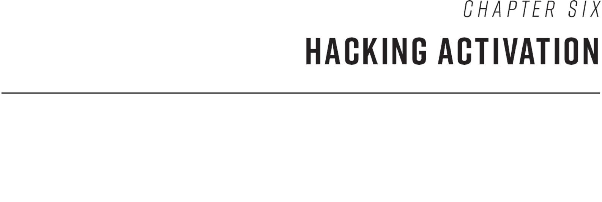
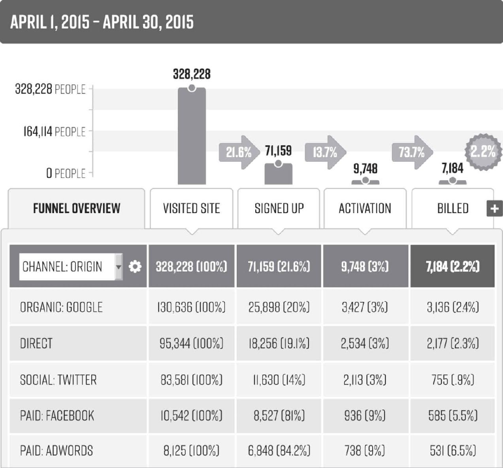
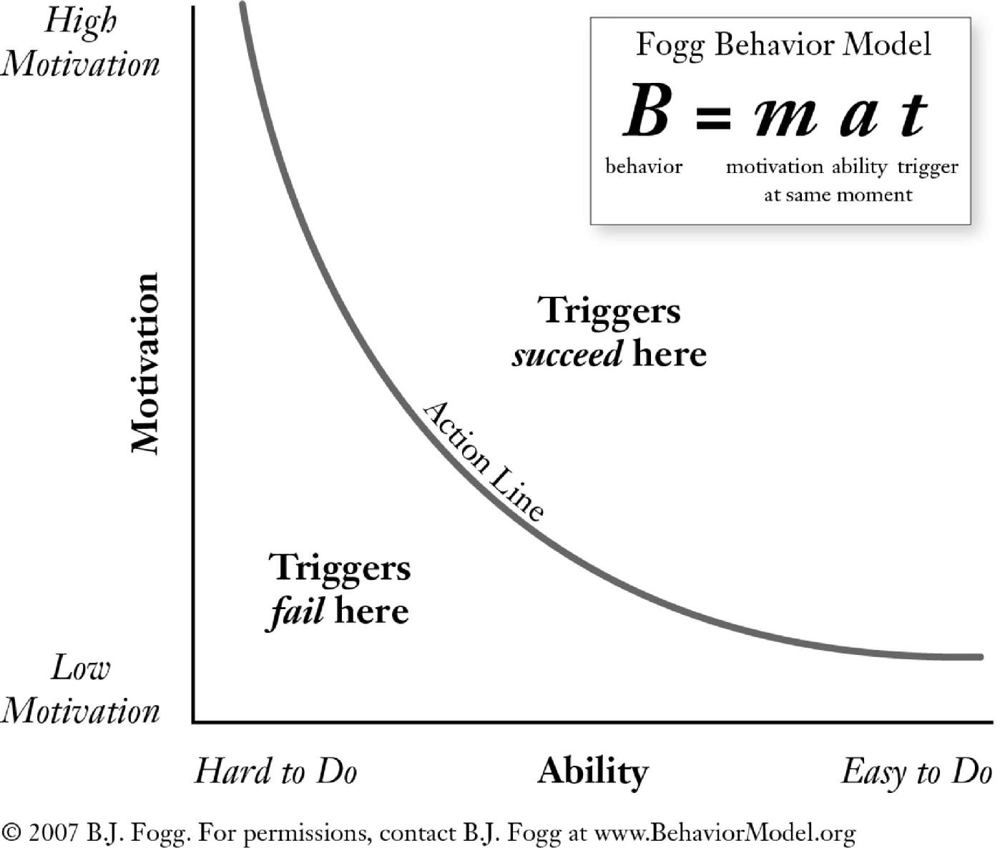
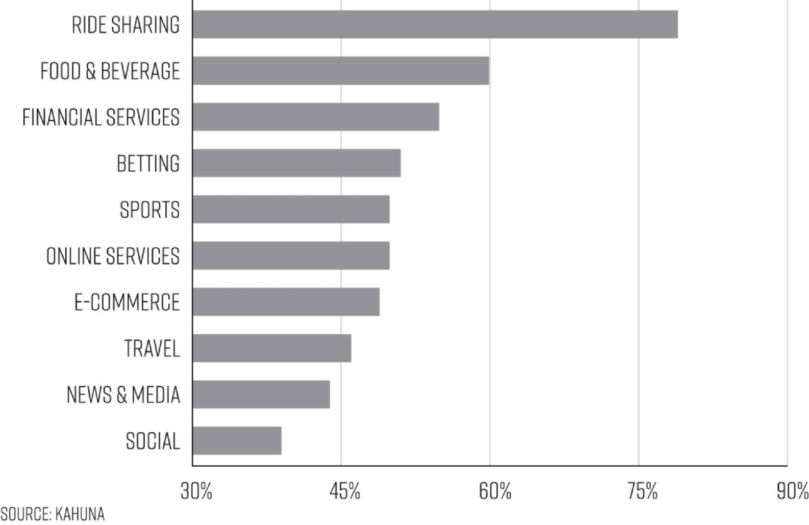
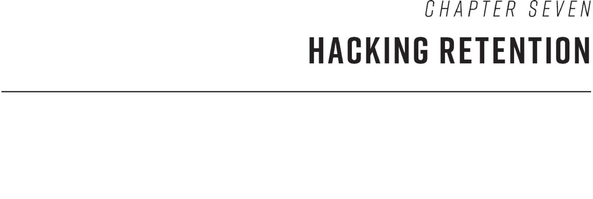

# Chapter Six: Hacking Activation

Now that you’ve worked so hard to attract all these potential customers, how do you engage them in actually using your product, or, in growth hacking parlance, to get them activated? Unfortunately, this is something many companies get wrong; in fact, 98 percent of traffic to websites does not lead to activation, and most mobile apps lose up to 80 percent of their users within three days.[1](part0017_split_007.html#c06-fnt1)

Improving activation is at its core about increasing the rate at which you get new users to your aha moment. The more visitors who experience what makes your product a must-have, the more of them will stick with you. The growth hacking process provides a rigorous set of steps for probing into the impediments to the aha experience, and then experimenting with hacks for improving activation. There is no one formula for improving activation; your efforts must be tailored specifically to your product, and your ideas for experimentation should be inspired by analysis of your specific data. Luckily, the growth hacking process offers the playbook to help get you there.

In this chapter, we will first introduce the three essential steps every growth team must take in order to identify the highest-impact activation experiments to run. Then we will introduce a set of best practices for increasing activation that have been implemented to great effect by fast-growth companies. A closing section takes a special look at one of the most effective, but also most often abused, tactics: the use of triggers, which are prompts to users that urge them to reengage with a product. We’ll introduce the ins and outs of the sticky business of getting triggers right.

## **MAPPING THE ROUTE TO THE AHA MOMENT**

The first step in hacking activation is to identify each point in your customers’ journey toward the aha moment. We are assuming that you have already determined, in the process of making the product must-have, what constitutes this magical moment. To see how to create your map of points along the way, let’s use the case of the grocery app. As you might recall from Chapter Three, the team has determined that the aha experience comes when shoppers realize they can use the app to easily and quickly order their groceries on the fly, in those in-between moments when they’ve got a bit of spare time, or as they randomly think of or remember an item they need as they are running around and going about their daily lives.

The next thing the team needs to do is list all of the steps that new users must take in order to have this experience: they need to download the app; find items they want; add them to their carts; create an account by adding in their name, credit card, and delivery information; then make the purchase itself. And, to truly make the experience must-have, they’ve got to receive their complete order as expected at home.

Just reading through these steps you can think of many ways in which users might lose interest or become frustrated and exit the app rather than making a purchase. The app might be annoyingly slow; users might find searching for items cumbersome; creating an account might be overly complicated. But in growth hacking, it’s crucial that you never assume why users are behaving as they are; rather, you’ve always got to study hard data about their behavior and then query them on the basis of observations you’ve made in order to focus your experimentation efforts most efficiently on changes that will have the greatest potential impact. Even if you *think* you understand what the barriers to activation are, the true story can be quite surprising.

Once you’ve identified the steps that lead up to the aha moment, the next step toward homing in on stumbling blocks for customers and figuring out what’s causing them to flee is to calculate the conversion rates for each of the steps on the way to the aha moment, or, in other words, the percentage of all visitors who are taking each of those steps along the path to success.

## **CREATING A FUNNEL REPORT OF CONVERSIONS AND DROP-OFFS**

One of the best ways to measure conversion rates is through a *funnel report,* a tool that displays the rates at which people who come to your product are moving on to each of the key steps in the customer journey (and by the same token, where they are dropping off). Here’s a very basic hypothetical one created by Kissmetrics, which shows a quite common drop-off between first visit and sign-up.

A SIMPLE FUNNEL REPORT

*Funnel Report from Kissmetrics*

Of course the steps for which you calculate percentages will be specific to your product. For this hypothetical product, they were: initial visit, sign-up, activation, and billing. For another company—let’s say Uber—the funnel report might display the rate at which people are downloading the app, then the opening of the app, then the number who proceed to create a new account, the rate at which people book a ride, and the rate at which they rate their driver, and so on. For other businesses, steps might include, for example, inviting friends, downloading a whitepaper, watching a video, or visiting a retail store. The point is that whatever your product is, you should be tracking all essential steps of the customer journey to that moment of activation.

In addition to tracking the conversion rate of key action steps, the report should track the visitors according to the route or channels by which they’ve come to the product, whether from Google search or AdWords, from Facebook or Twitter, from online banner ads, from customer referrals, etc. Surprising differences in activation rate by channel can lead to high-impact discoveries that may cause you to go back and reexperiment with some of the acquisition channels you isolated following the steps in the last chapter. Once this data is available, you will look for differences between active customers, those who activated but then went cold, and those who never activated, or have “bounced.” In essence, this report gives you a detailed overview of what the sticking points are for customers coming through each of your channels, which can be used to improve the rate at which you turn new customers into active ones.

Let’s see how the grocery app team proceeds at this stage in the process. The data analyst on the growth team will create a funnel report that calculates the rates for downloading and opening the app, the rates at which people are searching for items to buy, the rate at which people are adding items to the shopping cart, and, finally, creating an account and purchasing. In addition, they’ll also track key additional steps such as the rates at which people activate on any special offers or promotions, like the $10 off a first purchase offer we described them experimenting with earlier. Let’s say that the team had gone ahead with creating the shopping list feature, which, as we noted earlier, was an experiment they put into their schedule for development, and that it’s been available for a couple of months now. They are going to also want to calculate the rate at which people are adding items to their lists and also the rate at which they are then going ahead and purchasing the list of items.

Often, these activation funnel reports can be very straightforward, providing that your team has taken the steps outlined in Chapter Three to properly define metrics and establish ways to track them. Many analytics packages such as Kissmetrics, Mixpanel, Google Analytics, and Adobe Omniture SiteCatalyst offer the ability to create these funnels based on specific events and provide a variety of creative and useful funnel visualization and tracking tools. Other times, things can get a bit more complicated, especially if your activation funnel may need to be created by combining multiple sources of data. But a data expert will be able to identify the proper data sources to query and build the funnel report even if data lives in additional places (yet another reason why every growth team needs a data analyst!).

In sitting down to look at the data, the team now makes a set of intriguing observations. They learn that a large number of app users are adding items to their shopping carts and then leaving before they add their credit card information. They also see that quite a number of users aren’t searching for many items, and also that the shoppers who are the most active in the first week after downloading the app browsed quite a few items on their first visit. Finally, they observe that a large percentage of visitors who use the shopping list feature to add items to it proceed to purchase them, and that many of those purchasers go on to become repeat purchasers.

Armed with this data it is clear that one major stumbling block is the checkout experience. So the team will want to consider experiments with making it easier to check out, perhaps by trying a new payment form design that’s easier or quicker to complete. Since search volume is low among new users, they should also consider experiments aimed at encouraging first visitors to browse more items, perhaps by making it easier to search for items from the app home screen, or by making searching more enticing by highlighting special offers for various products, or by prominently recommending sections of the app (say, a screen for “most popular products”) to explore.

So they’ve got lots of options to choose from. But before they start experimenting, there is one more step in data discovery. They must “get out into the wild” and conduct some surveys and interviews to probe into the reasons for the user behavior the data has revealed. This will greatly help them to narrow their focus and come up with the highest-potential hacks to try.

The growth team at Qualaroo, the online survey company Sean founded, followed this same process for coming up with ideas for possible hacks to boost activation. By deeply analyzing our user data, looking for differences in the experiences of people who used Qualaroo for free and then purchased versus those who tried the product but ultimately didn’t buy, we learned that most people who ultimately purchased had run trial surveys that elicited at least 50 responses. Knowing that the aha moment for the product was getting actionable user feedback from surveys, we determined that 50 survey responses was the tipping point after which the value of surveys became clear.

So to get more users to experience the aha moment, we tried many experiments aimed at increasing the likelihood that new trial users would get at least 50 responses on a survey. These included a number of efforts to improve customer education about which surveys to run, through new email copy we wrote and also through tutorial videos about the types of surveys to run in order to get information about specific sorts of issues and suggestions about where to run them. We also changed the set of recommended surveys shown to new users to ones that would be run in broader uses and attract greater response rates, such as Net Promoter Score surveys. Finally, I (Sean) tasked the customer success team with doing proactive outreach to visitors in order to give them tips about deploying surveys. All of these experiments combined led to a dramatic increase in customer activation rate, even as we tripled the cost of the product!

## **SURVEY DOS AND DON’TS**

You’ve probably had the experience of customer survey pop-ups on an app or website you were using just as you were in the middle of browsing, or on your way to buying something. These can be very effective discovery tools for growth hackers, but they can also be quite annoying to users. To get the most useful responses, while at the same time assuring a survey is not a turn-off to customers, it should be very brief, and should be delivered to users under two main conditions: (1) when their activity indicates confusion, such as lingering on one page for too long, or leaving the screen or page on the app or site; or (2) right after they’ve gone ahead and taken the step that many others *aren’t* taking, such as creating an account or making a purchase. Both can also yield valuable insights about why that customer decided to take the next step—or not.

We advise asking one or two questions at maximum, which either can be open-ended or can offer a set of answers to select from. We have a preference for open-ended questions because they don’t shoehorn people into your preconceived notions of what the problems users are encountering are. Letting them respond with whatever they feel like sharing allows them to surprise you. For example, maybe the grocery app team thought the obvious reason why shoppers weren’t checking out might be that the payment form was too complex. But survey feedback may reveal that a bigger factor was that shoppers weren’t sure if they were going to be charged for delivery or not, or perhaps that they forgot the code to enter to get their first-time-shopper discount. This is the type of qualitative information that can’t be gleaned from hard data alone, which is why surveying customers is such an important piece of the process.

To get this information, if you have these customers’ contact information, you can simply email or call them, to ask them these questions “voice to voice.”

For those who’ve browsed and bounced without giving you any contact info, a survey can be programmed to pop up right as browsing patterns indicate that they’re about to leave a page or screen (companies like Bounce Exchange, Qualaroo, Qualtrics, and others offer tools that can do this). You’d be surprised by how many people will stop and answer your questions before they leave (and keeping it as short as possible will only improve the rate of response). In this case you want to ask what has stopped them from moving forward, with questions such as:

• Is there anything preventing you from signing up at this point?

• What concerns are keeping you from completing your order?

• If you did not make a purchase today, can you tell us why not?

• What information would you need to feel comfortable signing up today?

Perhaps somewhat counterintuitively, some of the best information you will get about reasons people are abandoning your product at any given step will come from people who *didn’t* give up. For example, to probe into why so many people visiting the grocery app aren’t completing their purchases, the team should survey people who *just* completed a purchase. After all, these shoppers will also have encountered whatever obstacles are stopping other shoppers up—and may have insight on why they chose to continue along anyway while others did not. So the team might display a brief survey on the order confirmation screen that asks shoppers “What’s the one thing that nearly stopped you from completing your order?” We’ve found this “one thing” question elicits a high number of responses, and ones that are very eye-opening. Of course the questions you ask will depend upon the drop-off point you’re asking about. Others might be:

• What were you hoping to find on this page?

• Does this page contain the information you were looking for?

• What did you come to our site/app to do today?

• What convinced you to complete your purchase today?

• On this screen, it seems like I should be able to…

• Was there anything about the checkout process we should improve?

Once the grocery team has done all this, they now have both the data and the color commentary from customers they need to evaluate a first set of ideas for experiments. Let’s say they decide to prioritize two experiments to start. Since surveys revealed that customers often left before making a purchase because they couldn’t remember their discount code, the team could try automatically adding the visitor’s first-time discount code on the checkout page. Not only would this change be likely to improve results, it would also be significantly faster and less expensive than a complete redesign of the app’s shopping cart.

Additionally, the data showing that so many of those who added items to the new shopping list proceeded to purchase them may lead them to experiment with promoting the shopping list feature more prominently on the app home screen after installation.

And with that they’re off and running. But they’ll likely have to try many experiments for each of these ideas, and others as well, in order to optimize activation. Always remember that there are no silver bullets in growth hacking, and that even what seem like slam-dunk ideas can fail.

## **BE PERSISTENT AND YOU’LL GET THE PAYOFF**

To illustrate how surprising the discoveries you can make through this process will often be, let’s take a close look at the set of experiments that the growth team at HubSpot ran to try to stoke adoption for its new Sidekick product, a tool that allows salespeople to track the effectiveness of their email outreach. At the time, Sidekick was facing a problem common to newly launched products: they saw strong organic adoption via word of mouth, but activation was sluggish. To get to the bottom of the flagging activation rates, the Sidekick team first dug into the data to find the differences between users who tried the product and stuck with it, and those who installed Sidekick and disappeared.

They began by segmenting their users into buckets of people with similar attributes, starting with the general set of common differences, including the different traffic sources they were coming from, such as Google and Facebook. Then they went deeper, analyzing new users by job role, the type of email that they sent, whether they used Sidekick for sales prospecting or public relations outreach or other uses, and the email service they used, such as Gmail or Outlook. One discovery they made was that users who signed up using their work email address as opposed to their personal email account had a higher activation rate. So their first step was to experiment with getting people to use their work emails instead of their personal email addresses. (At Qualaroo, we found similar results with nonwork email addresses, so we used language on the sign-up form instructing users to use their work email addresses and would not let people sign up when they entered in an email ending in @gmail.com, [@hotmail.com](https://www.hotmail.com/), and so on.)

Another discovery they made was that most people who didn’t go on to become active users never sent more than a single email after installing the application. To probe into why, the team started to collect feedback from users who stopped using the product. And when they did, they were rather shocked to discover that people were saying that they jumped ship because they didn’t understand how to use it. The team had been certain that the app was a breeze to understand and use; in fact, once installed, Sidekick simply worked in the background—but the data told another story. So they concluded that they should run experiments with ways of educating visitors on how to use the email tracking add-on.

The team tried adding various types of explanation on the landing page visitors arrived at once they had installed the app, and experimented with videos that demonstrated how to use the product and also tried showing a sample of the kind of report users receive about the activity seen on their sent emails. But to their surprise, every one of those tests failed to improve adoption. The team ultimately ran *11* separate experiments, and still, nothing took. At this point the bewildered growth team decided they needed to step back and take another dive into the data. Maybe more education wasn’t the issue, but perhaps instead the key was to get people to the aha moment faster. What if, rather than sending people to the app’s landing page after installation, they simply showed them a message that told them that the application had installed successfully and that they were ready to start sending email? Finally, this experiment worked. That message seemed to be a much-needed trigger to get people to go ahead and actually use the app. Then the beauty of its utility would quickly hit them. So the growth team added the messaging, and the activation rate dramatically improved.

But the team didn’t stop there. They went on to run another *68 experiments;* some worked, some didn’t, and many yielded more surprises, but they all produced insights that led to significant increases in activation, a perfect model of doing growth hacking right.[2](part0017_split_007.html#c06-fnt2)

The key takeaway here is that you cannot know ahead of time which experiments are going to be most effective. The best you can do is stay nimble and data-driven: continuously tailoring experiments according to the discoveries you make and then being ready to quickly adjust and try other approaches if experiments aren’t working as hypothesized.

While there is most definitely a core set of best practices for improving activation, which we will now introduce, you must consider these as less of a playbook to follow and more as a set of examples and sources of ideas as you consider experiments to try. Remember that every product is different, and you won’t get far by simply focusing on problems that are common but that aren’t at the crux of what is getting in the way of activation for your particular customers.

The bottom line is: there are no shortcuts. But if you follow the three steps we have outlined above, you will rapidly discover ideas and insights that will produce dramatic gains in activation for your product. To recap, those steps are: map all of the steps that get users to the aha moment; create a funnel report that profiles the conversion rates for each of the steps and segments users by the channel through which they arrive; and conduct surveys and interviews both of users who progressed through each step where you’re seeing high drop-offs, and those who left at that point to understand the causes of drop-off. You can then use this information to create new, highly targeted, and high-impact ideas to experiment with to improve your results.

Now let’s look at the most common obstacles to activation, and how to design experiments for hacks to avoid them.

## **ERADICATING FRICTION**

In user experience design, *friction* is the term used to refer to any annoying hindrances that prevent someone from accomplishing the action they’re trying to complete, such as ads that pop up in the middle of an article you’re reading or overly distorted letters in a CAPTCHA that force you to make repeated attempts at entering them successfully before submitting a form. For a physical product, such as a coffeemaker, it might be an annoyingly complicated procedure for setting an automatic brew time. The incredible irritation of friction is well understood; who hasn’t experienced it? But what’s tricky is that while we certainly notice the friction in the products we use, we often don’t recognize sources of friction in the ones we’ve been involved in creating or marketing. Perhaps this is because we know how they work so intimately that our brains just can’t see the impediments. Designers who watch people stumble in trying to use products they’ve worked on are often shocked to see how much difficulty people are having. A great deal of attention has been focused on the need to remove friction from the user experience of online products, and yet it is everywhere, from the e-commerce checkout forms that require you to create an account before making your purchase, to pop-ups that ask you to rate or review an app before you’ve even had the chance to experience using it, to zip code fields that don’t recognize alphanumeric Canadian postal codes.

With every irritating hoop a new user has to jump through she’s thinking to herself, “Is it worth it?” and if the value of your product isn’t clear and compelling enough, even the slightest irritation can send people away, often for good.

Sean devised a simple formula to help keep the importance of continuously looking to reduce friction top of mind:

DESIRE – FRICTION = CONVERSION RATE

As the formula implies, the more visitors desire your product, the more friction they will generally be willing to work their way through. This is why early adopters are such a godsend for new or nascent products; they’re often willing to use, and even pay for, your product even when it has some serious glitches. Morgan has an enviable Gmail email address because during Gmail’s early beta period, he was willing to go to eBay and bid on a coveted invite to the service just so he could get the Gmail address he wanted. Customers with that level of desire (it might also be considered a form of insanity) are going to be willing to tolerate the inconvenience of bugs and annoyances, but the rest won’t.

In order to improve activation, you can either increase your customers’ desire or reduce the friction they experience—and making a product more desirable is generally a good deal harder than discovering and eliminating sources of friction. Eliminating friction, in other words, is the lower-hanging fruit, which is why many of the most successful growth teams have dedicated a great deal of effort to it.

Think of your funnel conversion report as your roadmap to the sources of friction in your customer journey. Sometimes just scrutinizing big drop-off points alone will reveal the impediments to begin experimenting with removing or redesigning. Slow download times and glitchy shopping carts are common examples, but perhaps the most problematic friction point is often right at the beginning of the customer journey, in the new user experience (NUX).

## **OPTIMIZING THE NEW USER EXPERIENCE**

The first rule of designing and optimizing your NUX is to treat it as a unique, onetime encounter with your product; as such, you should think of it as a product of its own. This means that you will need to craft a special experience for it, one that entices users to engage with the product and appreciate what it has to offer. A great benefit of creating these separate experiences—which means a separate series of pages or screens either within the product if it is a Web product, or on the company or brand site if it is not—is that it makes experimentation with the NUX easier for a growth team because they don’t have to worry about their tests interfering with the experience of the current users.

The second rule is that the first landing page of the NUX must accomplish three fundamental things: *communicate relevance, show the value of the product,* and *provide a clear call to action.* Bryan Eisenberg, who is widely considered the godfather of conversion optimization, refers to these three factors as the *conversion trinity*. Relevance stands for how well the page matches the intent and desire of the visitor—is this what they came for? Showing value is immediately answering the visitor’s question “What’s in it for me?” clearly and concisely. Lastly, the call to action provides a compelling next step for visitors to take. Doing all of these things may seem intuitive, but unfortunately most landing pages are lacking in one or another, if not all, of these must-haves.

Optimizing these pages generally requires running many experiments with the language: again, not just the taglines and call to action, but the text that accompanies images and that appears on subsections or farther reaches of the page. As much as the messaging here matters, so do the aesthetics. So you’ll want to also experiment with size, positioning, and ratios of both the text and imagery. Experimenting with simplifying the page, stripping out text and/or images, is also important, as is sometimes adding in more explanatory text and/or imagery.

—

In short, all of the elements of the NUX should be scrutinized for problems, but there are two key tactics that have recently proven powerful in removing friction across a wide range of businesses and products.

### SINGLE SIGN-ON

Simplifying the sign-up process is one of the key areas to experiment with, as often, reducing the amount of information people must provide up front can result in a big improvement in how many choose to sign up. This has been made dead simple now that Facebook, Twitter, LinkedIn, Google, and others have made simple login applications available to Web and mobile developers that enable their users to sign on with their existing accounts—a feature called *single sign-on,* or also *social sign-on*. This technology can be a game changer when it comes to reducing friction in the sign-on process: offering a single click to create a new account can dramatically improve conversion rates, particularly on mobile devices, where data entry can be especially challenging.

While single sign-on is more commonly used by companies offering consumer products, it can also work for B2B companies as well, as the growth team at Kissmetrics, a data analytics company, found when they tested using “Sign Up with Your Google Account” as the one and only call to action on their home page. There was no option to enter an email address and password; it was connect with your Google account or nothing. And seemingly overnight, cofounder Neil Patel reported, their sign-ups increased a stunning 59.4 percent.[3](part0017_split_007.html#c06-fnt3) But as we cautioned earlier, what works for one product may not work at all for others, which is why, as tempting as it may be to make this change, you’ve got to test it first. At Inman, when Morgan’s team experimented with *removing* their single sign-on, they saw conversions increase 24.8 percent. It turns out that one size does not fit all when it comes to growth hacks.

### FLIPPING THE FUNNEL

A particularly bold way to reduce the friction keeping your customers from experiencing the aha moment quickly is to *flip the funnel,* meaning to allow visitors to start experiencing the joys of your product *before* asking them to sign up. Hello Bar, a tool that makes it easy for Web marketing teams to display important, short-term messages to their website visitors, used this tactic to achieve a big win in increasing activation. They let users simply create their Hello Bar message first, and then once it was ready to go—that is, after the user had invested time in creating and customizing their first one—the company asked for the sign-up. Activation increased by 52.11 percent.[4](part0017_split_007.html#c06-fnt4)

Similarly, Stripe, an online payments company, allows its customers to grab a small snippet of code and start using it right away, only asking for account details when it’s time to transact with real money. This gets more of their potential customers experimenting with their product—and experiencing the aha moment—before they commit to creating an account. And this technique works just as well for non-Web products; Warby Parker, the trendy eyeglass brand, will send anyone a set of five frames before making a purchase to help users decide which ones they like before they have to commit to a particular pair. Each of these companies flips some critical part of the typical funnel and eliminates friction in the process.

## **OPTIMIZING IS A PUSH AND PULL WITH FRICTION**

Often, in trying to improve activation of new users, you may have to add some friction in order to direct them to take the next steps. A great example of how to strike this delicate balance between leading customers through a process that will ultimately lead to activation and not creating so much extra work as to turn them away is a set of experiments that Airbnb ran upon noticing in its data that most visitors who signed up did so only at the very last moment when they were ready to go ahead and book a room. The team wanted to get people to become active earlier than that, when they were merely browsing rooms, so they could learn about them and the kinds of locations and rooms they would be most interested in. That way, the team could work on ways of better tailoring the properties shown to people when they ultimately searched with the intention of booking, which the team expected would increase the booking rate and overall satisfaction of using Airbnb.

The team started with a very lightweight and somewhat rough experiment (remember, when prioritizing which experiments to run, it pays to start small!), by adding a prominent strip across the bottom of the website with a small bit of text explaining the benefits of signing up. If a visitor ignored that call to action, she would be shown another sign-up prompt on the next page she went to, and on each subsequent page.

The results of the first experiment were intriguing. They saw a good uptick in sign-ups, but also a drop-off in bookings. The prompts seemed to be causing friction that stopped some people from proceeding to search and book. But as they analyzed the data further, they saw that the increased sign-ups led to many valuable payoffs, such as more invites sent out to potential new users, and new users adding more properties to a wish list feature, thus providing more information about users’ desired bookings. So the team decided to next experiment with reducing the friction of the prompts in an attempt to find the best of both worlds: more sign-ups *and* more bookings.

They focused on optimizing how they displayed the prompts, including their design and the frequency with which they appeared. In one experiment, instead of showing the sign-up prompt on every page, they dropped the frequency to every five pages a visitor viewed. By changing the rate at which they prompted users to sign up they lost just 4 percent on the improved sign-up rate and entirely eliminated the negative impact on bookings. The team also tested adding more text around the call to action to encourage sign-ups, inserting a testimonial from a happy Airbnb customer as well as some text about the value of signing up. Here they got a real surprise. They found that adding this additional text actually *hurt* sign-ups, and they reasoned that was because it actually distracted users.[5](part0017_split_007.html#c06-fnt5) This is an example of a more subtle type of friction, which isn’t actually experienced as annoying, yet still deters visitors or users from taking the action you want them to. You can really only discover whether this kind of friction exists—and how it is impacting your activation rates—through experimentation.

The Airbnb team ran many more experiments in order to optimize this experience, testing all of the design of the elements in the sign-up prompts, from the color of the sign-up bar on the home page to the styling of the buttons on the sign-up form, and eventually found the sweet spot for improving the company’s overall sign-up rate and other important metrics.

## **THE POWER OF POSITIVE FRICTION**

One of the great ironies of improving activation is that not all friction is bad. Dumping people with no context or clue right into your product as fast as possible is not always optimal; sometimes you *want* to put some *positive friction* in their way. Creating positive friction is a delicate art of putting manageable, ideally engaging steps in the path of visitors that help them understand what the value is and get to the aha moment with greater predictability. Videogame developers have honed the practice to a level of perfection. They face a particular challenge in getting users hooked on new games because the rules of games must be introduced (after all, users will never get to the aha moment—the joy of playing—if they don’t know how to be successful in the game), and in many cases, the rules and the strategies for play are quite complicated. To solve the problem, developers drew on insights from psychological research to craft marvelously enticing introductions to game play.

One of the key findings they drew on was introduced by psychologist Robert Cialdini in his business classic *Influence: The Psychology of Persuasion*. In a number of studies he references, it was discovered that once people take an action, no matter how small, as long as the experience wasn’t onerous, they are more inclined to take any action in the future. The explanation for this, he says, is that they have made a form of psychological commitment by taking the action, and people have a bias for honoring commitments with subsequent, follow-on actions, often regardless of the change in size of request. Game designers shrewdly realized that rather than providing instructions about how to play a game, they had to get people committed; they had to get them to start playing through small, easy steps to get them oriented and rolling.

Game developers draw on many other powerful insights from psychology as well. One is the well-established principle of conditioning people to engage in behaviors by offering them rewards. The other is taking advantage of the enormous satisfaction people feel when they are in the brain state known as *flow,* a theory pioneered by psychologist Mihaly Csikszentmihalyi, who showed that people get into this optimal state when they feel challenged just the right amount by a task they are engaged in; not so challenged as to feel frustrated, yet challenged enough so as not to feel bored. People who are “in flow” are so engaged that they lose track of time; three hours of working on a painting or on writing an essay or coding an app can feel like much less, and people will look up from their work shocked by the time that’s passed. Anyone who’s ever been told by someone playing a videogame “Just give me ten more minutes!”—then another ten minutes then another ten minutes—knows how easily game players tend to get into flow.

Game designers combined this wisdom to craft new user experiences that lead people gently into playing their games, starting with simple challenges that can be mastered quickly, and providing them with rewards for each hurdle cleared, while orienting them to the rules of the game and the environment in the process. They then ratchet up the level of challenge, as well as the degree of reward, in exquisitely refined increments (both of which they experiment a great deal with), so that users are hooked and get into flow. And this doesn’t just work for videogames; designers of many other types of online products have incorporated similar tactics to create new user experiences that greatly increase activation rates, tailoring a set of actions for users to engage in that show them how the product works, and then providing some kind of reward for doing so. For example, when Facebook prompts new users to fill out their profile, add a photo of themselves and some biographical information, they are not just gathering personal data that is valuable for analysis and for selling advertising (though those things are true also), they are establishing commitment (*Since I already spent all this time picking out a picture and drafting my bio,* we think, *I might as well keep going*) and providing a psychological reward (the satisfaction of a completed profile). And as anyone who has spent hours crafting their Facebook profile knows, there is something about this process that provides an utterly satisfying state of flow. In the process Facebook brings people closer to discovering the aha moment, because the core value of the site is based on people finding their friends—which they can only do once everyone has filled out their profile.

The more information people put into the product, the more their commitment increases, through a concept called *stored value*. Much like putting money in a safe deposit box, putting information into a service instantly creates a sense of ownership for users and an inclination to commitment to add to and maintain that value. So while prompts for information can be a source of friction, if done properly—i.e., in a way that is rewarding and through actions that slowly increase the level of commitment—they can also be a catalyst for activation and growth.

### CRAFTING A LEARN FLOW

While the new user experience is ripe for friction, it is ripe for opportunity as well. That’s because the first experience people have with your product is also the time that they are most consciously trying to figure it out. As former head of growth for Twitter Josh Elman, who we met earlier, says about the new user experience, “This is your moment. You have more attention than you ever will have again, from that user, to try to teach them what your product is really about. To really help them learn the product in a meaningful way.” Elman’s team designed something he dubbed the *learn flow* to enable Twitter to take advantage of this attention. *Learn flow* is Elman’s definition of a new user experience that’s designed to more than just sign people up, but rather purposefully educates new users about the product, its benefits and value, and how to use it in the process. This NUX design takes advantage of the abundance of attention and patience new users credit you in that first visit to make sure they’re primed for activation by the time they finish. For Twitter, this involved not only creating a new account, but also showing new users what Twitter was all about in the first place. They designed a learn flow that showed users how the Twitter timeline worked, suggested categories to follow (such as Fashion, Sports, and News), prompted people to follow notable accounts, and then to complete their profile. By the end of this learn flow, not only are you all signed up for the service, you’ve customized your profile and you have a Twitter feed full of news you care about. In one visit, Twitter got you to commit to the service, experience the aha moment, and build stored value. Not bad for one visit6

Of course because Twitter was offering such a novel service, one that required people to adopt a new habit, teaching them about the value of following people and how to use Twitter was not optional. For some products, no such explanation is needed. For e-commerce sites, for example, people generally just really want to start browsing for goods as fast as possible and most often have a good idea of what they’re shopping for, so just about any effort to get people to move through some kind of orchestrated process will be resented. For yet other products, the judgment call about whether or not to require some of a user’s time to go through a set of steps is harder to make, because while they may be able to make a rough assumption about how to use the product, getting some information from them and showing them some aspects of the way the product works as it relates *specifically to them* can enhance their appreciation of its value. Making this call, of course, requires experimentation; Pinterest is a great case of this.

Just as Twitter had to educate people about what a “tweet” was, exactly, and what this foreign process of “tweeting” entailed, Pinterest, too, had to introduce users to the novel concept of *Pins* and show users how to create them. The growth team worked hard on educating new users: through three mobile learn flow screens that showed how to discover pinned content, how to add their own Pins, and how to create *Boards* (collections of items that users create to store and share Pins). After going through those three screens, new users were delivered a stream of the most popular content on Pinterest and from that point were on their own.

By all accounts, a solid first user experience. Yet in exemplary growth hacking fashion, the team decided to experiment with improving it even more. They realized that the most popular content wasn’t always relevant to any given user, so they decided to test a more personalized new user experience on the mobile app. Now users were first shown just one screen, which asked them to select five topics that they were interested in following, such as camping, weddings, motor sports, and home decor. After they made their selections, the app delivered them to a feed made up solely of that type of content, where they could practice pinning and saving items. The change resulted in a 20 percent increase in activation rate, a massive win.[7](part0017_split_007.html#c06-fnt7)

If you do decide to introduce some positive friction, there are two additional tactics in particular that have proven quite successful: questionnaires and gamifying the new user experience.

### THE ART OF THE QUESTIONNAIRE

Neil Patel, a leading expert in growth hacking, has highlighted the effectiveness of asking users a set of questions as you greet them. These should be questions that are clearly asked in the interest of serving the user better; almost like a mini questionnaire. A great example Patel notes is a questionnaire that online golfing retailer Revolution Golf asked users to fill in as part of the sign-up process, and one that the company credits with gains in activation that helped it reach $20 million in annual revenue. It asks questions such as a visitors’ gender, age, average driving distance, average score for 18 holes, and biggest problems with their swing. When Patel tested similar questionnaires with Hello Bar, which he owns, he was able to increase the number of leads generated by 281 percent.[8](part0017_split_007.html#c06-fnt8)

Asking customers about their interests or about the problems they are seeking solutions for immediately creates a form of commitment, as they must invest a little time in responding, while at the same time they have forged a deeper personal connection with you and your product. It also conveys to them that you are interested in them individually and in providing the best service for them you can. And as with Pinterest’s method of onboarding users by showing them Pins of particular personal interest, it also allows you to start customizing their experience of your product as part of their first exposure.

The tactic works best if it’s clear to the customer that customizing the product to their needs and desires will be to their advantage. In an era when people are becoming increasingly fearful of Big Data (or as some think of it, Big Brother), customization is not always a plus. For example, when people learned that Google was customizing search results according to a complex algorithm that factored in lots of information about the searcher from prior search history, many people were put off and the company received lots of criticism in the press.

A key caution here is that you also don’t want to ask too many questions. Patel recommends no more than five, and making them multiple-choice rather than open-ended, with no more than four possible answers each. Including images and visuals will also likely improve engagement. And as with all hacks, these mini questionnaires should be put through the process of rigorous experimentation.

### GAMIFICATION PROS AND CONS

*Gamification* is, in essence, offering rewards, such as perks and benefits not available to all people, to customers for taking certain actions. Adobe, for example, used gamification in their activation hacking to increase the number of people who took a free trial of Adobe Photoshop and then purchased the product. The company launched LevelUp for Photoshop, which was a new user experience that turned boring tutorials into “missions” for trial users to complete. The missions helped the trial customers learn the most powerful benefits of the software and showed them how to make the most of it. They added incentives for completing missions and new levels that could only be unlocked by completing other tasks. Adobe saw a 4x increase in trial to purchase from the effort.[9](part0017_split_007.html#c06-fnt9)

By adding a pleasing element of challenge and fun, and also offering meaningful rewards, gamification can be a powerful activation tool, but it can also backfire. If rewards offer no value, or value that has little relevance to the core value experienced by users (i.e., don’t achieve product/incentive fit), then the tactic can come across as blatantly manipulative, or just downright strange. That was true for a gamification effort that online shoe retailer Zappos launched for their VIP program. The company was trying to create a new level of higher-frequency shoppers; they tried to gamify the shopping experience by offering badges for doing things like favoriting a shoe model and buying multiple pairs, but the badges offered no value—no higher discounts or other benefits—and left customers confused, leading Zappos to ultimately shutter the effort.[10](part0017_split_007.html#c06-fnt10)

Brian Wong, founder of Kiip, a company that helps mobile apps provide rewards to their users, says that gamification should be thought of as a toolkit of options to choose from, rather than a predefined set of tactics that work for all businesses. What you choose to deploy can range from subtle to more overt; as with anything, you’ve got to experiment with what will be best for your product and customers. He suggests focusing on three main aspects of any gamification effort: meaningful rewards, creating surprise and delight by varying how rewards are earned and presented, and providing some element of instant gratification. Beyond assuring the relevance of rewards is clear and that they are actually of value to users, there are few hard and fast rules about what perks to offer. LinkedIn gamifies in a gentle fashion, including a progress meter on people’s profile pages that shows them how complete their profiles are, nudging them to fill in more information. This offers the reward of the instant satisfaction of a completed profile, and receiving the implicit approval by those who view it. Khan Academy, an online education website, takes the more overt approach of offering points and awards as users take more courses, creating surprise and delight with rewards as users hit new milestones. The company is careful, though, not to make these the centerpiece of its user experience, as they are aware that such explicit rewards can undermine the actual intrinsic reward of skills acquisition that is offered by learning.

On the very overt side of the spectrum are loyalty programs employed by businesses ranging from Starbucks to credit cards to restaurants. Gabe Zichermann, a leading gamification expert, has identified that the most effective rewards in a gamified setting come in the form of status, access, power, and stuff (stuff being financial incentives or physical gifts).[11](part0017_split_007.html#c06-fnt11) Credit cards, such as American Express Membership Rewards, deploy all of these elements, from new levels of status to achieve through spending, power, and access to special events and travel opportunities, and of course free stuff, which can be redeemed with the points earned. Similarly, the Starbucks Rewards program boasts more than 12 million members who use a Starbucks gift card or the company’s mobile app to earn “stars” each time they buy a cup of coffee. Those stars turn into more free coffee and other Starbucks merchandise. The more stars they earn, the bigger rewards they can redeem and they also move up in rank, accumulating more status as a member of the Starbucks faithful. The program has been so successful that the company now has more than $1 billion in customer cash from the preloaded gift cards and app.[12](part0017_split_007.html#c06-fnt12)

## **INS AND OUTS OF TRIGGERS**

While gamification doesn’t work for every situation, *triggers* are everywhere. And even more so than gamification, the use of triggers to stoke activation requires careful consideration to get it right. Triggers are any sort of prompt that provokes a response from people, common ones being email notifications, mobile push notifications, and, less obtrusively, calls to action on a landing page. There is no denying that triggers are one of the most powerful tactics for increasing the use of your product. But for every benefit there are plenty of potential pitfalls. We’re targets of so many triggers these days, from Facebook notifications that a friend has liked a photo, to LinkedIn emails about a new connection request, and Amazon updates about the delivery status of a package, that it’s easy to cross the line from helpful to annoying. Who hasn’t been utterly infuriated by the desperation of a steady drip of email messages hollering “Come back!!” “Are you sure you don’t want to come back?” “We’d really love to see you come back!!!” Often they come from a company whose product we long ago dismissed, making them even more irritating—while at the same time making the company look desperate. So you want to tread lightly with triggers, experimenting with great care.

The power of triggers comes from two key factors: how much they motivate users to take the action you want them to and how easy it is for users to do so at the time they receive the trigger. BJ Fogg, a psychology researcher at Stanford, developed the following useful model for thinking about how to make triggers effective. The curved line represents the threshold of whether a user will or will not take a particular action, which depends primarily upon the combination of her level of motivation and what Fogg dubs her ability to take that action, meaning essentially how convenient it is to do so.[13](part0017_split_007.html#c06-fnt13)

Nir Eyal, the author of *Hooked:* *How to Build Habit-Forming Products,* helpfully uses the scenario of receiving a phone call to illustrate this interplay of factors. Whether you answer a call is dependent on whether the phone is handy and you’re free to take it—your ability—as well as on motivating factors such as whether you know the name of the caller, wish to talk to him or her, or perhaps need some information that he or she possesses. The trigger in this case is clearly the phone ringing. If you hear it ring when you’re motivated and available, you’ll answer.

Because triggers can be so invasive, you want to be judicious in how you use them and experiment in measured steps. Making matters more complicated, you’ve also got to follow some rules dictated by the platform on which you wish to deliver them. For example, mobile push notification rules differ for Apple phones than for those that run on Android; whereas Apple users need to opt in to receive notifications, Android users are opted in to get notifications by default. Rules have also been established in consumer protection law for sending emails, such as the CAN-SPAM law in the United States.

FOGG BEHAVIOR MODEL

And finally, for opt-in notifications, a trigger’s impact will vary greatly depending on how many users agree to receive them. The range of opt-in agreement can vary a great deal across products and product categories. For example, for mobile notifications, opt-in rates range from 80 percent at the high end, for services like ride sharing, to 39 percent at the low end for news and media offerings, according to Kahuna, a mobile messaging company.[14](part0017_split_007.html#c06-fnt14)

IOS PUSH OPT-IN RATES BY APP INDUSTRY

One of the biggest mistakes companies make is asking visitors to opt in to receiving triggers such as notifications and emails too soon, often as a necessary first step to setting up or accessing the product. This can scare people off because they have no idea, or only a vague inkling yet, about why they would want these messages. Many companies also abuse triggers in an attempt to gin up their product use statistics—a move that may make their short-term activation stats look pretty, but does nothing to create long-term use (often in fact having a negative effect as people tune out, turn off notifications, or delete the app).

A great rule of thumb about deploying triggers is that your rationale for getting in touch with the users should be to alert them of an opportunity of clear value to them. For example, the grocery app team could send notifications when an item that a person has saved in their shopping list goes on sale, or when there’s a special offer on free delivery, or when the chain is running a Thanksgiving holiday promotion. These types of triggers would make sense to users because they relate to the core value of the shopping app. However, sending notifications weekly about new sales or product features that aren’t particularly relevant to customers might quickly irritate them and prompt many of them to disable notifications or delete the app from their phones altogether.

In experimenting with different trigger notifications, it’s important to keep some users in what’s called a *holdout group,* which is subject to none of the experiments. This assures that you can compare not only the effect of new triggers, but the effect of using none of them as well.[15](part0017_split_007.html#c06-fnt15)

Some common types of notification triggers to experiment with are:

• Account creation—encourage users who have downloaded an app or visited a retail website to complete their account

• Purchase messages—encourage users to make a purchase with a short-term discount

• Reactivation campaign—encourage users who haven’t been to your site or app in a while to come back and reengage

• New feature announcement—share the news about updates to the product

• Top user incentives—for heavy users of the product, let them know they’re special and encourage greater affinity and use

• Activity or status change—such as a friend taking an action or an item in a shopping cart changing price[16](part0017_split_007.html#c06-fnt16)

You can, of course, invent your own types of triggers as well. In coming up with ideas, it’s helpful to know about a categorization of the types of triggers that BJ Fogg introduced. He divides them into three basic types, based on the motivation and ability level of the user: a *facilitator trigger,* which helps those with high motivation but low ability take action; a *signal trigger,* which helps keep people with high motivation and high ability headed in the right direction and encourages repeat action; and a *spark*, which spurs people with high ability yet low motivation to take action. Many email and mobile notifications fall into the “spark” category, but they shouldn’t be the only ones considered.[17](part0017_split_007.html#c06-fnt17)

The grocery app team, for example, might devise a facilitator trigger that pops up after a certain amount of time that a user has been on the checkout page without completing the purchase, asking if they’d like to have the credit card that was used before be used for this purchase. They might also experiment with a signal trigger, which could be a message on screen that notifies a user about how much he’s saving by having made a set of purchases. A spark trigger they might try out would be offering an especially high discount on a favorite item of a shopper who has logged in but hasn’t moved any items into her cart after a certain period, to try to spark that first critical purchase.

In crafting triggers to try out, the set of six principles of persuasion that Robert Cialdini presents in his book *Influence* are also invaluable. We mentioned one earlier, in discussing his insight that once people take an action of whatever kind, they are more inclined to take that action again. Here is the full set:

• Reciprocity—whereby people are more likely to do something in return of a favor, regardless of the favor done and the ask now presented to them

• Commitment and consistency—people who have taken one action are likely to take another, regardless of the size or difference in action

• Social proof—in a state of uncertainty, people look to the actions of others to help them make their own decisions

• Authority—people look to those in the position of authority to decide which actions to take

• Liking—people will do business more readily with people and companies they like over those they don’t or are indifferent to

• Scarcity—people will take action when they are worried that they will miss out on the opportunity in the future

A trigger can draw on the principle of reciprocity by offering users a free resource, such as a downloadable whitepaper, or free shipping. HubSpot’s Website Grader is a great example. A case of using the principle of consistency and commitment is the way in which the Obama presidential campaign team broke down the donation request form on its website into a series of smaller steps rather than having all of them appearing on one page. Having taken the first small step, users were more inclined to take the rest, which led to a 5 percent increase in the rate at which people responded with donations, and millions of additional dollars in the campaign fund.[18](part0017_split_007.html#c06-fnt18)

Triggers can incorporate the principle of authority by showcasing that influential people, or companies, have taken the action they’re urging users to take, which is, of course, the rationale of celebrity endorsements. Including the logos of well-respected companies that have used a service, or testimonials from respected individuals, can also act as triggers, by reassuring the visitor that people and companies they know and respect have made a similar decision.

Lots of triggers make use of the principle of liking, such as the messages sent by Airbnb with the name of a friend who referred you to the service, or Nasty Gal, where founder Sophia Amoruso tracked which models customers responded to best (i.e., who seemed to sell the most merchandise) and paired them with items that needed a boost in sales.

All of us have surely received some notifications that draw on the principle of scarcity, warning us, for example, that a sale is about to end, or that there are only a few tickets left for the show or concert we were thinking of attending, or only a few seats left on a flight we were thinking of booking. Booking.com makes great use of this tactic, showing all browsers the number of people actively looking at hotel rooms in the same search area and the number left on the site. Amazon, too, shows browsers how many items are left when inventory is low, trying to spur them to go ahead and purchase.

The final (and most powerful) type of trigger is the internal type, which occurs involuntarily within your customers; these are at the core of habits and spur long-term use. Few of us need any external trigger to visit Facebook or Instagram; we do it on our own volition now. The same could be said for our favorite clothing retailer whose website we routinely check for new sales or inventory, the news source we visit every morning, or the convenience store we always stop at to grab coffee on the way to work. No matter what your product is, these habits are at the foundation of strong relationships with your customers. So we’ll revisit them and some more nuances about them in the following chapters.

The bottom line is: do experiment with triggers, because they can be extraordinarily effective, but do so with a very thoughtful understanding of how they can actually be of service to your users. Otherwise, rather than activating users and starting to build a good relationship with them, you are almost sure to push them away.

Now, speaking of building relationships with your customers, let’s move farther through the user experience to examine how growth teams have used the growth hacking process to achieve great successes in retention.

Legendary business expert Peter Drucker famously wrote many years ago that the purpose of business is to create and keep a customer.[1](part0017_split_008.html#c07-fnt1) But even though no one would argue with the famous business maxim, the fact is that for most businesses, the rate of customer *churn*—the rate of loss of new users—is appalling.

This is unfortunate because high retention is generally the deciding factor in achieving strong profitability, for any kind of company. As we mentioned briefly in Chapter Four, widely cited research by Frederick Reichheld of Bain & Company has shown that a 5 percent increase in customer retention rates increases profits by anywhere from 25 to 95 percent.[2](part0017_split_008.html#c07-fnt2) The flip side is that *losing* customers comes at great cost. One reason is that, as we learned in Chapter Five, it takes so much money to acquire a new customer, especially at a time when advertising costs are skyrocketing due to a surge in competition for prime online real estate. And the more you have to spend up front to attract new customers, the more costly the loss of each customer becomes—making retaining customers that much more essential, both for recouping your spending on expensive ad campaigns and for preventing customers from defecting to the competition.

Homejoy, a home cleaning start-up, once had a bright future, raising more than $64 million from some of Silicon Valley’s best investors. But the company is a prime example of the danger of poor retention. Despite having attracted an impressive number of initial customers through an aggressive promotional discounting strategy, Homejoy failed to live up to its promise, delivering service that customers described as “hit or miss.” In addition, many customers couldn’t swallow a steep jump in price from a promotional first cleaning, at a special discounted price, to the regular price for the service; the result being that only 15 to 20 percent of customers ended up ordering a second cleaning. Meanwhile, Homejoy’s competitors were achieving retention rates double those numbers. Making matters still worse, the company had spent heavily on customer acquisition. This combination of high acquisition costs and low retention led to its rapid demise.[3](part0017_split_008.html#c07-fnt3)

Amazon, in contrast, is perhaps the gold standard example of retention prowess. The company’s subscription program, Amazon Prime, has been a particular triumph in retaining customers, largely due to the two-day free shipping included on thousands of items, but also many ancillary benefits that have been added to the program, such as its video and music streaming services. Seventy-three percent of free trial subscribers convert to paying subscribers, and ninety-one percent of first-year subscribers renew for a second year. What’s even more impressive is that retention continues to increase the longer customers have been subscribers, with the renewal rate for customers heading into their third year in the program at an almost unheard-of high of 96 percent.[4](part0017_split_008.html#c07-fnt4)

