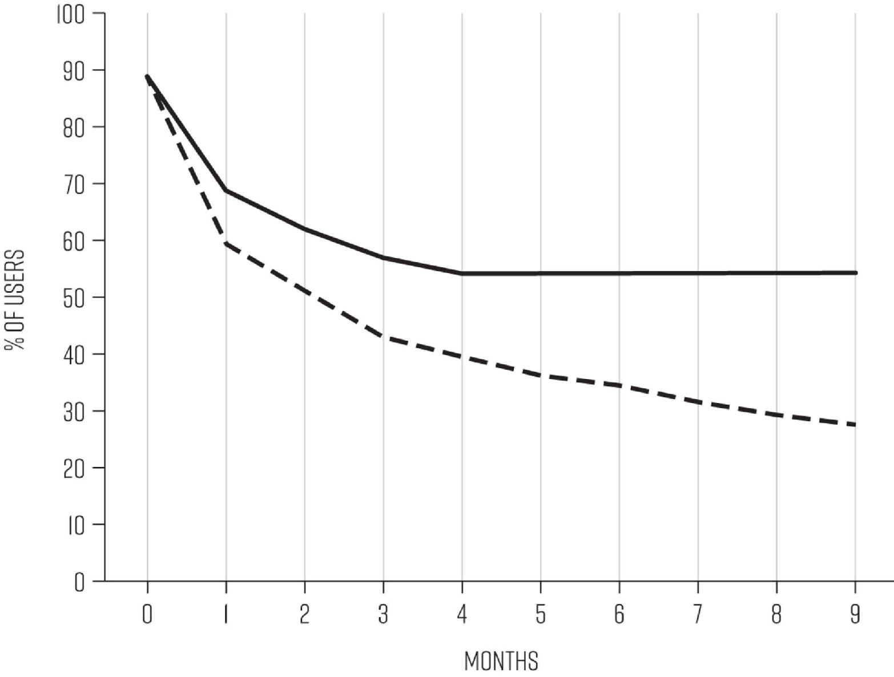
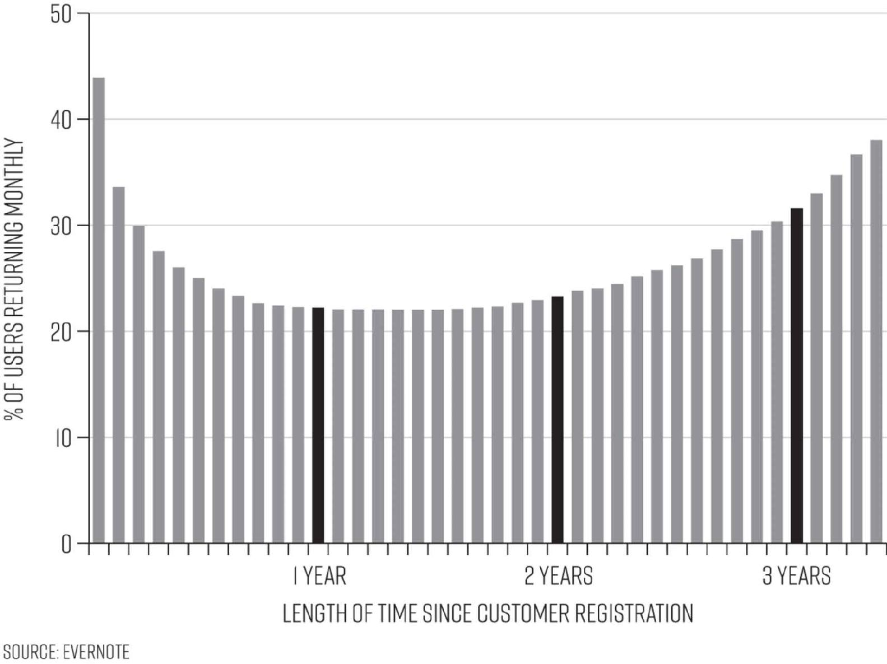
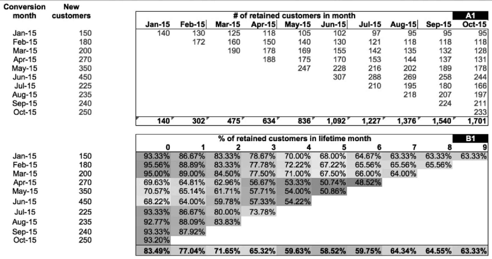
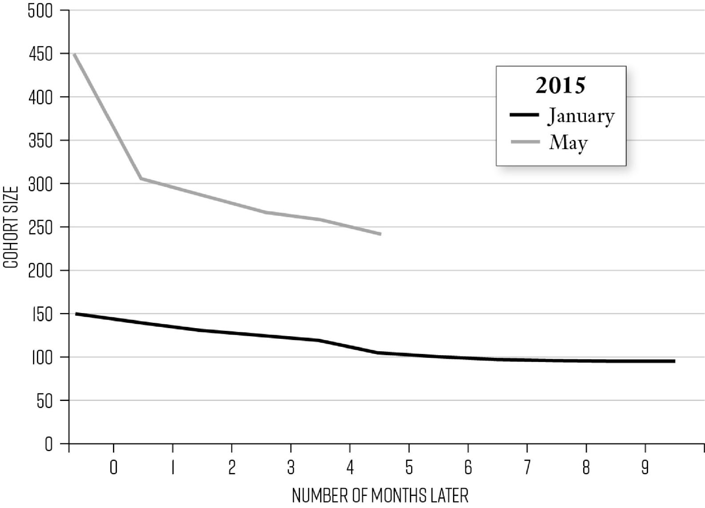
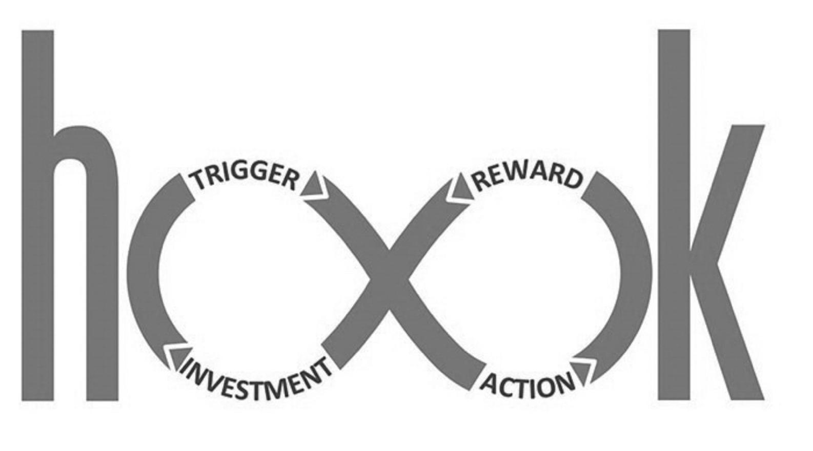
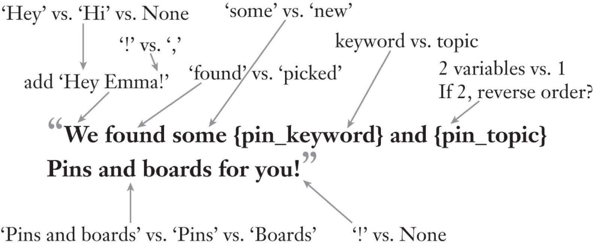

# Chapter Seven: Hacking Retention

Legendary business expert Peter Drucker famously wrote many years ago that the purpose of business is to create and keep a customer.[1](part0017_split_008.html#c07-fnt1) But even though no one would argue with the famous business maxim, the fact is that for most businesses, the rate of customer *churn*—the rate of loss of new users—is appalling.

This is unfortunate because high retention is generally the deciding factor in achieving strong profitability, for any kind of company. As we mentioned briefly in Chapter Four, widely cited research by Frederick Reichheld of Bain & Company has shown that a 5 percent increase in customer retention rates increases profits by anywhere from 25 to 95 percent.[2](part0017_split_008.html#c07-fnt2) The flip side is that *losing* customers comes at great cost. One reason is that, as we learned in Chapter Five, it takes so much money to acquire a new customer, especially at a time when advertising costs are skyrocketing due to a surge in competition for prime online real estate. And the more you have to spend up front to attract new customers, the more costly the loss of each customer becomes—making retaining customers that much more essential, both for recouping your spending on expensive ad campaigns and for preventing customers from defecting to the competition.

Homejoy, a home cleaning start-up, once had a bright future, raising more than $64 million from some of Silicon Valley’s best investors. But the company is a prime example of the danger of poor retention. Despite having attracted an impressive number of initial customers through an aggressive promotional discounting strategy, Homejoy failed to live up to its promise, delivering service that customers described as “hit or miss.” In addition, many customers couldn’t swallow a steep jump in price from a promotional first cleaning, at a special discounted price, to the regular price for the service; the result being that only 15 to 20 percent of customers ended up ordering a second cleaning. Meanwhile, Homejoy’s competitors were achieving retention rates double those numbers. Making matters still worse, the company had spent heavily on customer acquisition. This combination of high acquisition costs and low retention led to its rapid demise.[3](part0017_split_008.html#c07-fnt3)

Amazon, in contrast, is perhaps the gold standard example of retention prowess. The company’s subscription program, Amazon Prime, has been a particular triumph in retaining customers, largely due to the two-day free shipping included on thousands of items, but also many ancillary benefits that have been added to the program, such as its video and music streaming services. Seventy-three percent of free trial subscribers convert to paying subscribers, and ninety-one percent of first-year subscribers renew for a second year. What’s even more impressive is that retention continues to increase the longer customers have been subscribers, with the renewal rate for customers heading into their third year in the program at an almost unheard-of high of 96 percent.[4](part0017_split_008.html#c07-fnt4)

[*OceanofPDF.com*](https://oceanofpdf.com)

## **THE COMPOUNDING VALUE OF RETENTION**

It should go without saying that the longer you retain customers, the more opportunity you have to earn more revenue from them, whether that’s from selling them more items or services, from ongoing subscription renewals, or from bringing in more advertising revenue due to advertisers wanting to target your large and loyal customer base. If you consider the fact that subscribers in Amazon’s Prime program purchase more than twice as much as non–Prime members, it becomes easy to imagine the compounding gains in revenue one can see from high retention rates. In fact, some analysts believe that without Amazon Prime, the company would not be profitable.

Increasing the average revenue you earn per customer in turn allows you to invest more in growth, creating a virtuous cycle. This is both because strong retention generates higher current earnings and because it allows you to predict better that your future earnings will be strong. Amazon’s reliable earnings per subscriber have allowed the company to invest significantly in continuing to build up the Prime program, such as by adding original programming to its video streaming service. The longer you retain customers, the more you can learn about them and their needs and desires, and thus the better you can tailor services and promotions to them, which of course allows you to earn more from them. When Amazon launched Prime, some analysts argued that the company would be spending too much on free two-day shipping and discounts for Prime-eligible items and therefore the program would be unsustainable. But Amazon saw that with so many subscribers renewing and spending far above average, the program was on a highly profitable trajectory.

Yet another benefit of higher retention is that it allows you to see stronger results from both word of mouth and your viral marketing efforts, because the longer users stay with your product, the more opportunities they’ll have to talk about it and even to show it to friends and others.

[*OceanofPDF.com*](https://oceanofpdf.com)

## **HOMING IN ON BEST BETS FAST**

Given the increasingly high costs of customer acquisition and the ever more heated competition most businesses are up against these days, it’s vital that companies are attuned to problems with their customer retention and work to stop defections, or what marketers call churn, as early as possible. Growth hacking is the ideal means of achieving this. To give just a quick example, let’s return to the grocery app team. What if, by keeping close track of customer data, the team identifies a slide in usage by a large number of customers after the first month or so of use, a fate far too familiar for mobile apps. Where should they begin trying to get more customers to stay actively engaged in using the app? Should the team increase the number of mobile notifications it sends its users to entice them to come back? Should they offer special pricing and savings available only within the app on popular items? Perhaps they should build some new features, like the successful shopping list, to increase the utility of the app. All of these ideas might work, but they all involve significant costs, and in addition, the team must be sensitive about not annoying users with too many promotional messages or triggers. As discussed in the last chapter, more mobile notifications could spur short-term use but might quickly lose their luster as people tired of the interruptions. In-app promotions might lead to increased purchasing by loyal app shoppers but not reach most of the customers the team wants to reengage, because those people aren’t on the app much, if at all. Building new features is expensive and there’s no guarantee that users will become more regularly active and for the longer term due to them.

Growth hacking allows teams to quickly choose which out of such a set of ideas to start testing first, and rapidly produce results that clarify how to move forward. The grocery app team could easily test all three of the ideas above in short order. The email notifications and app promotions are a snap to create, and an idea for a new feature can be rapidly tested by surveying customers about how appealing it would be to them or building a quick prototype to test with a set of users. Perhaps they would decide to experiment first with sending more email notifications, and within only a few weeks, they might be able to learn that sending one additional mobile notification per week led to only 10 percent of lapsed users to returning to the app, but that if two more notifications were sent in a week, 35 percent of them returned. They might then go ahead and schedule sending the two additional notifications to all lapsed users the next week. Meanwhile, the responses to the new feature prototype might be so positive that the team could convince the product development group to fast-track work on it, and that might begin to improve retention shortly after it’s introduced.

These results would, of course, only be the beginning of nonstop crafting and testing of hacks to boost retention, the topic of this chapter.

[*OceanofPDF.com*](https://oceanofpdf.com)

## **WHAT DRIVES RETENTION?**

Before we get into more specifics about how to apply the growth hacking process to improve retention, it’s important to return to a brief consideration of the basics of what builds customer loyalty and keeps customers coming back.

—

As discussed in Chapter Two, retaining customers most fundamentally depends upon providing them with a product or service of high quality that continually addresses a need of theirs, or perhaps simply delights them, and which they come to regard as a must-have. We also discussed there that a great measure of having achieved product/market fit is a stable retention curve. Recall that this looks like the black line in the graph below, versus the gray line, which indicates that an increasing number of customers have been abandoning the product over time.

STABLE VS. DECLINING RETENTION

Now, in focusing on hacking retention, we will look closely at what growth teams should be doing to assure that retention at the very least remains stable, or ideally, how they can work to increase retention from that baseline over time. First, it’s important to highlight that even after having initially achieved a stable retention curve, a company may begin to see its retention erode, for various reasons. Perhaps a competitive product has come out and is stealing users away, or perhaps an existing competitor has launched a new feature or promotion that has the same effect. Another key reason customers defect over time is that a company is not communicating with them optimally; the company hasn’t found the right sorts of messages to be sending to them, with the right frequency, to keep the app “top of mind,” leaving them ripe for the picking by competitors. Companies may also be failing to take advantage of opportunities to build loyalty by working to create a regular habit or strong feeling in customers that they are appreciated and understood. Or perhaps the need the company fills is no longer an urgent one for its customers, or is being fulfilled in a way that is more satisfying or convenient, as might happen when the technology in the product has become outdated or obsolete.

Growth teams are perfectly equipped to look for early warning signs of erosion in retention. But they shouldn’t stop there. Teams ought to apply the rapid experimentation process to pushing retention higher and higher, as Amazon has achieved with its Prime subscribers. A stable curve is by no means the be-all and end-all of retention. Take a look at the figure below, which Evernote calls its Smile Graph, showing that the longer people use Evernote, the more likely they are to continue using it.[5](part0017_split_008.html#c07-fnt5)

EVERNOTE’S SMILE GRAPH

Evernote’s retention graph looks that way essentially because the service’s usefulness improves over time. The core value is enhanced the longer you use Evernote because as a note-keeping product, the more information that is saved within it, the more likely people are to return to access those ideas and notes and add more to them. Many successful digital products achieve a growing retention rate over time: whether it’s for Instagram, which becomes more valuable the more photos you post and people you follow, or a business product such as QuickBooks, which gets more valuable to the company the more financial data stored within it, which, remember, is referred to as *stored value*.

Companies with the opportunity to capitalize on the power of stored value have an advantage in increasing retention over time, but no company, even those with this built-in opportunity, can simply assume that customers will continue to be actively engaged. They must steadily work to improve their offerings for customers. Just think about how many new features and services Facebook has offered since its launch and how many different kinds of notifications and prompts they’ve devised to keep you using the service. From adding live video and slideshows, to prompting you to share news about your favorite sports teams or letting you know when you have a Facebook anniversary with a friend, the company continually works to improve how engaged and retained its customer base is. Any kind of company can, and should, work to keep increasing the value it’s delivering to customers and their level of engagement over time.

[*OceanofPDF.com*](https://oceanofpdf.com)

## **THE THREE PHASES OF RETENTION**

The methods for retaining users evolve according to the phase of retention the user is in. Brian Balfour, whom we’ve met earlier, highlights that retention breaks down into three phases: initial, medium, and long-term.[6](part0017_split_008.html#c07-fnt6) The ***initial retention period*** is the critical time during which a new user either becomes convinced to keep using or buying a product or service, or goes dormant after one or a few visits. Think of the initial retention rate as a measure of the immediate stickiness of the product. There is no fixed definition of the initial retention period; it might be as short as a day for a mobile app, or a week or two for a social network. For a software as a service (SaaS) product, the initial retention period might be more like a month or quarter, whereas for e-commerce companies it is often the first 90 days.[7](part0017_split_008.html#c07-fnt7) You should determine this period for your product based on both the data you can get about the standards for products of your type across the sector you’re in and by your own analysis of the behavior of your own customers over time.

The good news about this period is that research shows that users who get more value from a product during the initial period of use are more likely to stick around longer term. Also, generally, there’s lots of opportunity to improve the user’s experience in this phase. This was the main impetus behind the start of the growth team at HubSpot, as explained by cofounder and CTO Dharmesh Shah. “The *reason* we decided to kick off a growth team in the first place was that we felt there was a lot of low-hanging fruit in our trials/onboarding process.”[8](part0017_split_008.html#c07-fnt8) We covered the work of the HubSpot team in improving its onboarding process in the activation chapter, and this initial retention phase is essentially an extension of activation; think of it as assuring that customers or users are *truly* active; that they haven’t just given your product a cursory once-over and then lost interest.

It might seem to make better sense to just consider this as part of the activation process, but the distinction is meaningful. For many products, solidifying the appreciation of the value of a product or service requires new customers returning for an additional experience with it a certain number of times within a certain time period. For example, Pinterest might determine from analysis of user data that if a new user doesn’t return to the site at least three times within the first two weeks after signing up, they are highly likely to abandon use. This means that the growth team would want to work intensely on getting them back that minimum number of times within that time frame, and anyone who has signed up for Pinterest will find that the company is indeed vigorous in encouraging return visits beginning right after initial sign-up.

Once new users have crossed the threshold of initial retention, they move into the ***medium retention phase***, a period when the interest in a product’s novelty often fades. The core mission for growth teams in retaining users who are in this midterm phase is to make using a product a habit; working to create such a sense of satisfaction from the product or service that over time, users don’t need to be prodded to use it again because they have incorporated the use of the product into their routine. Think of the Snapchat user who constantly checks her friends’ stories while having breakfast and again after dinner. Or the Amazon shopper who always thinks of searching there first for any given product he’s looking for, no prodding required. In the coming sections, we’ll introduce a little about the psychology of habit formation and then introduce tactics growth teams can employ for increasing the number of initially retained users who become habitual ones.

Then, we’ll move on to the tactics for ***long-term retention***. This is the phase in which growth teams can help to assure that a product keeps offering customers more value. Teams must experiment with ways to keep improving the product, helping product development teams to determine the timing for introducing enhancements of existing features or entirely new features. The key here is to keep refreshing the customer’s perception of the product as must-have.[9](part0017_split_008.html#c07-fnt9)

[*OceanofPDF.com*](https://oceanofpdf.com)

## **WHAT DOES GOOD RETENTION LOOK LIKE?**

Before we get into the specifics of how to improve retention in each of these phases, it’s important to discuss the data that growth teams must be tracking and how they should be parsing it in order to find opportunities for hacks to try. First, different companies will want to measure their retention rate in different ways. This is due to the fact that the frequency with which customers return to purchase items or use a service will in large part be determined by the nature of the product or service. Some things we need or want often, and others much less so. While Facebook wants users to be returning daily, Apple knows that purchasers of an iPhone will likely not buy a new phone for several years (except for the raving fans who always immediately purchase the newest version), so it won’t know if a given iPhone buyer has been retained until perhaps three years, maybe more. This is a key reason that Apple’s evolution into a provider of the services people use with their products in addition to the devices themselves, was such a brilliant growth tactic; it allowed the company to capitalize a great deal more on its retained customers in between product releases. The frequency with which buyers search for listings on sites like Zillow also varies from how often diners search Yelp for restaurant recommendations, just as the search and purchase frequency for customers looking for mattresses will differ from those looking for a new pair of shoes.

For e-commerce, the basic metric of retention is the *repurchase rate* of customers, which might, for example, be the number of times customers make a purchase per month. Many e-commerce companies, for example, measure the repurchase rate per 90 days, but again, this time frame varies depending on the product sold. Since most people shop for groceries at least once a week, our grocery app team would want to be looking for more frequent purchases, say, every ten days or so, as a sign of healthy retention.

The key point is that in crafting your retention metrics, it’s important to benchmark your results against the best information you can get from market research about the typical retention rates for your kind of product or service, and any information you can find about the performance of successful companies you are competing with. These benchmarks are the only way to tell whether what you’re seeing with your customers is typical, better, or worse than expected. A company like Airbnb can never expect to get as much engagement and retention as a social network, so these benchmarks become important in pinpointing how your retention is faring. Sources such as industry publications, trade associations, and research companies Forrester and Gartner can offer industry-specific insights.

While we’ve so far discussed retention in terms of the customers you keep, it’s also critical to track the flip side, the customers who defect, or churn, from your business each week or month. Your churn rate is essentially the inverse of your retention rate; so, for example, Costco’s 91 percent membership retention rate is also a 9 percent annual churn rate.[10](part0017_split_008.html#c07-fnt10) Some churn is unavoidable, even for the best-loved products. But clearly, for all businesses, the lower rate of churn, the better.

[*OceanofPDF.com*](https://oceanofpdf.com)

## **IDENTIFY AND CHART YOUR COHORTS**

Once you’ve determined the metrics you will use for measuring your retention rate, the next step is to break your retention data down more finely, determining the specific rate for various subgroups of users, through a technique called *cohort analysis*. This allows you to probe more deeply into your data to make discoveries about why those who are staying are doing so—and why others are not.

You can break users down into many different types of cohorts. The most basic way is by the time of acquisition, meaning the date they signed up or first purchased from you. This is most often done by month, but as said above, for some business types it might be important to identify them by week or day. This may sound like drudge work, but the power this process gives a team to identify issues with retention makes it well worth the effort. Tracking groups of customers by the date of their initial acquisition allows teams to discover the overall health of the customer base. As sales and marketing efforts ramp up, are the customers that are acquired today being retained at as high a rate as some of the earlier customers, or vice versa? If the company is successfully bringing in lots of new users, which means that sales or new sign-ups are improving nicely, churn can easily get hidden if you’re not tracking retention by time acquired.

Problematic trends can also be uncovered with this type of cohort analysis. For example, a growth team might discover a particularly high churn of users who were acquired during a particular campaign effort, or during a particular time of year. Or they may find that engagement stays high during the first two months, but during the third month after acquisition, a large number in each cohort go dormant.

To see how this might be revealed, and how the growth team would then have valuable information for figuring out why, let’s say that a video streaming service for which users pay a month-to-month fee, and can cancel their subscription any given month, has decided to break down the new users it acquires by the month they are signed up. Take a look at the following table and graph that display this data. We should note that the spreadsheets displaying retention data by cohort can be a little daunting to read, so it’s sometimes helpful to also translate the data into the format of retention curves for each cohort, which can make it easier to see patterns worth investigating in the data.

COHORT TRACKING WORKSHEET

*Chart via Christoph Janz*[11](part0017_split_008.html#c07-fnt11)

To the left of the table, you can see the number of customers signed up each month. These are the groups of cohorts that we want to track over time. In the body of the table, the top part tracks the absolute number of users in each of those cohorts who are retained each month. You can see that of the 150 new customers who signed up in January, 140 were still retained in February, 130 in March, followed by fairly steady drop-offs each month, until the cohort stabilizes at around 95 subscribers who remain paying for the service in July through October. Following down the chart, you can see that the customers who sign up in February and March exhibit similar retention rates.

In April, May, and June, however, something dramatically different occurs. The first thing to notice is that the number of new customers acquired in each month jumps dramatically from the high 100s to a new high of 450 in June. If the team managing this company’s growth were only looking at new customer acquisition, they would be ecstatic because they dramatically grew how many people were signing up for the service each month. But by looking more closely, it’s clear that these April through June cohorts are not being retained as well as previous ones. Among customers who joined during those months, the data shows a sharp decline in retention after the initial month of sign-up, and their numbers show no sign of stabilizing as the ones in January through March did.

To make this data more visual for reporting dashboards, the team may convert these cohort charts into retention curve graphs. To simplify it we’ve shown just two cohorts on this graph, one for the January group and one for May, but growth teams often look at every curve from every month on the same graph. You can see how different the curves are below, and May’s continues to point downward while January’s has leveled off.

COMPARING COHORTS SHOWS BIG DIFFERENCE

Clearly the growth team that’s been presented with this data has something important to learn about what happened in those three months. The April, May, and June cohorts show a precipitous drop in retention right after initial sign-up. To begin to investigate why the drop-off occurred, they should dig more deeply into the troubled cohorts.

This pattern might be seen when a company runs a new ad campaign that brings in lots of new customers for whom the product is not actually particularly well suited. Perhaps the campaign offered a steep promotional discount, and when prices increased lots of these new customers quickly abandoned ship. Or maybe they decided to advertise in a new channel to reach a particular demographic better, say, running a campaign on radio targeted at stay-at-home moms. Maybe the ads were very effective, hitting a sweet spot for those moms, but once those moms watched a couple of movies with their kids they realized that the selection of that kind of movie wasn’t very rich and so rather than renew, they canceled. Knowing the correlation between the ad campaign and the drop in retention gives the growth team valuable information for experiments to try: clearly, these moms are good candidates as new customers, but before targeting them so aggressively again, the service should add more movies that will appeal to them to its inventory. Or perhaps the existing movie inventory needs to be better highlighted to these customers as soon as they join. Or, there could be an issue that’s not as readily apparent to the team causing this churn. The team should follow up on this observation by surveying these churned customers to ask them why they canceled, with a set of questions to test their hypothesis that the selection of movies available was what indeed caused them to unsubscribe.

Breaking down users by month acquired is only the beginning of cohort analysis, however. You’ll also want to create many other sets of cohorts, such as the specific channel that brought the new customers to your product—for example, by a customer referral program versus a paid ad campaign, and so on. Another distinguishing factor might be the numbers of visits to your website or purchases made. For the video streaming growth team, then, cohorts might include breakdowns by number of shows or series watched in the first month, by subscribers who have watched particular series, or by number of days in a month that someone uses the service. Parsing the data this way would allow them to look for correlations between frequency of use of the service and the rate of retention, as well as whether there are particular movies or shows that are leading to higher retention.

To consider how the breakdowns might be done for a different business model, say, e-commerce, our grocery app team might break customers down into cohorts by those who have only made one purchase within the first month from signing up, those who have made two purchases in that time, those who have made three purchases, and those who have made four or more. By tracking the retention of these cohorts for six months, the team might discover that making three purchases within a month after first sign-up is a tipping point that leads to much higher retention, which would point them toward experiments focused on getting shoppers to increase the number of purchases that first month.

It’s important to note that tracking retention by cohorts and in the many ways suggested above requires more sophisticated analytics capabilities than basic Web analytics tools, like Google Analytics, offer. A data analyst can put together these reports relatively easily, assuming that your user database has been set up to allow for separating out users by the right set of variables. But if you don’t have a dedicated data analyst, you can use one of a number of programs, such as Mixpanel, Kissmetrics, or Amplitude. While Google Analytics has recently added some cohort analysis capability, these more robust tools allow you to do much more refined analysis such as the one above, and they are easy for anyone to use.

[*OceanofPDF.com*](https://oceanofpdf.com)

## **HACKING INITIAL RETENTION**

Once you’ve analyzed the cohort data to identify drop-off points in initial retention, and deployed surveys to probe into the causes of the defections, you can begin to experiment with solutions. The hacks for improving initial retention will be essentially the same as those introduced for improving activation, as this period is really a prolonging of the activation experience. Refining the new user experience and getting users to experience the product’s core value as quickly as possible are two of the most important strategies at this stage. The use of triggers, such as the mobile notifications and emails, can also be effective in helping to cement the usefulness and value of the product in the user’s mind. However, as we discussed in the last chapter, growth teams should not fall into the trap of relying only on triggers to keep people coming back in this initial stage; they’ve got to also keep their eye on the experience the product is offering and any refinements that could be made (for a refresher on these tactics, turn back to Chapter Six).

[*OceanofPDF.com*](https://oceanofpdf.com)

## **BUILDING HABITS**

Recall that the core goal during the medium phase of retention is to solidify users’ commitment to your product by making the use of it habitual for them. For some products, this means making use a daily or weekly habit, while for others, the use might be much less frequent than we tend to think of as being habitual, but simply means that regardless of frequency, whenever that customer wants to buy a product or use a service of the type you sell, they turn to you rather than a competitor. They are, in other words, loyal to you.

The key to habit formation is convincing customers of the *ongoing rewards* they will receive from returning to your product or service. In *Hooked,* customer behavior researcher Nir Eyal explains how the most engaging products do this, which is through a process he describes in his Hook Model (depicted below), or what’s referred to in growth hacking as an *engagement loop*. Here is where the external triggers we talked about in the activation stage—like mobile notifications, emails, and in-app prompts—come in again. They will serve as the prompts to action that kick off those powerful engagement loops that lead to habit formation. Here, growth teams should work to identify the optimal number, method, and cadence of triggers needed to build habits, and keep those habits reinforced.

*Hook Model by Nir Eyal*[12](part0017_split_008.html#c07-fnt12)

To understand how habit formation works, think of the psychology of joining a gym. When people first decide they want to get in shape, they often need an external trigger to psych themselves up to go and work out, maybe setting alarms in their calendar or committing to a schedule with a trainer or friend. But once they receive enough of the rewards from going—feeling healthier, seeing how their muscles are firming up and their weight dropping—many people don’t need these external prompts anymore. The same basic process is involved when people regularly check Facebook while having breakfast, when they post Instagram on their way home from work, or turn to Yelp when considering a place to meet up with a friend for a meal. The mere act of having breakfast, or driving home, or choosing a restaurant, becomes the internal, subconscious trigger: no other prompting needed.

Amazon’s Prime program is the quintessential case of powerful habit creation. Recall that many analysts predicted the program would fail because the free shipping would be too expensive for Amazon to sustain. It’s easy to understand why they were wrong when you consider the nature of the program with the Hook Model in mind. First, Prime offers two essential, and very compelling, rewards every single time subscribers purchase an item included in the program—meaningful savings in the form of free shipping and instant gratification with two-day delivery. The program also creates a reward for members when they shop by validating the decision they made to invest in the $99 Prime subscription in the first place. Every time they make a purchase and are shown how much they’ve saved due to the free shipping (and often additional savings from the item list price), they say to themselves, *See, the $99 is so worth it because I’m saving so much*. In fact, Vijay Ravindran, the director of Amazon’s ordering systems, told Brad Stone, the author of *The Everything Store,* that the subscription fee “[w]as never about the seventy-nine dollars. It was really about changing people’s mentality so they wouldn’t shop anywhere else.”[13](part0017_split_008.html#c07-fnt13) Indeed, the Prime program proved so habit forming that, according to a *Businessweek* story, while Amazon had forecast that it would take two years to break even on the program, it did so within just three months.[14](part0017_split_008.html#c07-fnt14)

The engagement loop with Amazon Prime is clear and continues to reinforce itself with repeated use, which is why it works so well. Of course this model won’t work for everyone; growth teams should map out their own engagement loop based on the core value their product delivers, and then set out to measure, monitor, and optimize it. By using data and experimenting with triggers that lead to the most valuable rewards for customers, the team can ascertain how to build habit formation around their product. For example, the video streaming service team could measure the effectiveness of triggers that lead to discovery of new shows compared with triggers that lead to completion of series or shows already in progress.

One general rule that holds true across most product types is that improving the perceived value of the rewards leads to greater retention. To make a product or service more habit forming, growth teams should experiment with providing customers with a range of rewards, and encouraging them to take action to receive them; the more action taken, the greater rewards, and the greater perceived value. They should do cohort analysis about which customers are using the product most avidly and what features they’re using most, and also which features provide the greatest reward and subsequent retention rate. The team should also identify which customers are less active who might be motivated to make more use of the product if only they were exposed to more compelling rewards.

The video streaming service, for example, could break subscribers into cohorts by the amount of viewing time. That analysis might reveal that a group of avid users are watching several episodes of shows all in one viewing; in other words, that they are binge watching, a new viewer habit that Netflix has capitalized on well. This discovery might lead the growth team to consider how the company might create a new type of reward by allowing customers to do more binge watching, as Netflix did when it started to offer its original series for viewing all at once rather than making episodes available one at a time. The team might also analyze what types of series are the most popular for bingeing and experiment with highlighting similar series that have proven to also be great for bingeing.

[*OceanofPDF.com*](https://oceanofpdf.com)

## **OFFER REWARDS BOTH TANGIBLE AND EXPERIENTIAL**

Many popular strategies for offering rewards to customers are focused on allowing them to “earn” savings, or sending them coupons or cash vouchers or gifts. This is especially true in retail businesses, which have a long-established repertoire of such tactics. These are powerful rewards, and teams should definitely experiment with an array of them. But it’s also important to experiment with offering rewards that are not about money or savings, but instead about the *experience* customers have with your product. And in fact, some of the most habit-forming rewards are the intangible ones. There are many kinds of rewards to experiment with in this category. There are social rewards, such as Facebook’s “Like” feature, which has been a strong driver in making the posting of photos and comments habitual. Similarly, frequent-flier programs have long used social rewards such as improved status, access to exclusive lounges, and preferential boarding order, and found them to be far stronger motivators of loyalty than discounted airfare. Teams should be creative about thinking of ideas for such nontangible rewards to offer, and they should also experiment with blending both tangible rewards and experiential and social ones.

In keeping with the principle of incentive/market fit, rewards should be tied to the value your specific product provides to customers, but there are three noteworthy strategies for offering customers rewards beyond special offers and discounts that have proven powerful in boosting habit formation and retention (among other growth levers) in recent years. While by no means exhaustive, these examples are representative of the broad and scalable strategies available.

### 1. BRAND AMBASSADOR PROGRAMS

These programs generally combine the power of social rewards with that of tangible ones. By designating members as high-status users, these programs confer social recognition, and most also offer a series of perks.

The Yelp Elite Squad program has been one of the most successful at using this approach to increase retention. By offering special recognition to those who are first to review a business, as well as letting other users give kudos for reviews that are useful, funny, or just plain “cool,” Yelp confers powerful social benefits that incentivize users to keep coming back to write more reviews.

Yelp conferred the “Elite Status” as a reward for its most engaged users, and the company explains that doing so is “…our way of recognizing and rewarding yelpers who are active evangelists and role models, both on and off the site….Members of the Squad are recognized with a shiny Elite badge on their account profile, as well as offered perks like invites and early entrance to Yelp events.”[15](part0017_split_008.html#c07-fnt15) The results are impressive; a study of Yelp by Northeastern University economics professor Zhongmin Wang found that while only between 5 and 10 percent of the users of leading competitors, Citysearch and Yahoo! Local, contributed six or more reviews to those sites, more than 65 percent of Yelp users had contributed that number or more, and that a full 44 percent of reviews on the site were contributed by Yelp Elites.[16](part0017_split_008.html#c07-fnt16)

Web companies aren’t the only ones who have taken advantage of ambassador programs to spur loyalty and customer retention. Restaurants, hotels, credit card providers, and many retailers have a long history of success with programs that smartly pair social rewards, such as the feeling of belonging, community, and status, with more tangible ones. The American Express Centurion card, better known as the Amex Black card, is the quintessential example. Coveted by many as the ultimate status symbol, the card is limited in the number of people who have it (a requirement of spending and paying off at least $350,000 per year on your Amex account ensures it), shrouded in secrecy about exactly what the benefits are, and comes with loads of perks (such as exclusive offers, travel and concierge services) that make even the wealthiest American Express customers feel special.[17](part0017_split_008.html#c07-fnt17)

A particularly impressive recent example of such a program is the one that the fast-growing media company theSkimm, which provides daily news, hand-curated for professional women, has used to grow its way to 3.5 million daily readers.[18](part0017_split_008.html#c07-fnt18) To become a “Skimm’basador,” readers must refer 10 friends to the service, and are rewarded not only with public recognition on the site, but also with perks such as branded T-shirts, handbags, and cellphone cases, networking opportunities, and birthday shout-outs in the daily newsletters.[19](part0017_split_008.html#c07-fnt19)

### 2. RECOGNITION OF ACHIEVEMENTS

All customers appreciate recognition from companies, whether that recognition is big or small. One great way to show them this recognition is by recognizing some achievement or action or what’s called in marketing circles the *behavioral email*. One kind is when a customer has passed a milestone, such as when Fitbit sends you a congratulatory notification upon recording your 10,000th step in a day or when Runkeeper sends emails when you’ve hit your first 10-miler, or clocked your longest- or fastest-ever trip. Similarly, Medium, the publication platform founded by Twitter cofounder Evan Williams, sends an email when an article you publish on the site receives 50 or 100 recommendations. These achievement notifications are fixtures in most referral programs as well, sending an email when a friend joins and encouraging you to invite additional friends.[20](part0017_split_008.html#c07-fnt20)

These notifications can also alert you about the actions of other users that essentially constitute an achievement for you, such as when LinkedIn sends an email that you’ve been endorsed by someone and when Twitter sends word that someone has liked or retweeted a post of yours. Facebook and Instagram have made particularly smart use of this dynamic, using mobile notifications to both let users know when their Facebook friends join Instagram and also to encourage users to “like” photos posted on Instagram by other users, particularly those who haven’t added a new picture in a while. Both types of notifications drive retention in two ways: by bringing users back to Instagram to see what their friends are up to, and by rewarding new users by increasing the number of new followers, likes, and comments they get on Instagram.

### 3. CUSTOMIZATION OF THE RELATIONSHIP

With the ever-ballooning databases of customer information being built by companies and powerful new tools for analyzing that data available, a company’s ability to serve customer needs and desires more precisely—even individually—has been vastly improved. Shouvick Mukherjee, the vice president of product and engineering at @WalmartLabs, notes that one of the most important shifts in growth for the company has been the transformation from a traditional “one-to-many” marketing mindset, to one of delivering fully customized, one-to-one experiences. Companies can now, for example, customize email communications and product recommendations specifically to each customer, no matter how many millions of individuals shop with them. This mass personalization is “about understanding the customer, understanding the business you are in, and making sure that you are building a perfect match,” Mukherjee says.[21](part0017_split_008.html#c07-fnt21)

This technique, much of which was pioneered by Amazon, has been made possible by the development of such large data sets about customers and programming that they enable systems to efficiently search through them to extract a customer’s information about his or her preferences. Personalization can be based not only on information customers have provided, or on their activity on the company’s website or in its app, but also on data about their wider behavior on the Web, which is readily obtainable from data providers such as Demandbase. Many companies offer personalization technology, such as Salesforce Marketing Cloud, Optimizely, and HubSpot.

Cara Harshman, a former content manager at Optimizely, has shared how the company improved a number of metrics, including activation and retention, by delivering a personalized home page experience to their most important audiences. The company went from having one home page to more than 26 variations based on key accounts, time of day visiting the site, business vertical, and more. A person visiting from the *New York Times* offices, for example, will see a message specific to how Optimizely can help publishers, while someone from, say, Microsoft will see information about how Optimizely can help technology and software companies, and so on.[22](part0017_split_008.html#c07-fnt22)

The next wave of personalization is being powered by machine learning algorithms. Machine learning is exactly what it sounds like. Rather than humans making the rules about which customizations to make, the software uses customer responses to refine and improve the customizations. This technology is sophisticated, but it is rapidly being made more accessible. For example, at Inman, Morgan’s team customizes which news stories users receive in their weekly newsletter, delivering a unique, highly relevant newsletter to each subscriber. This customization is enhanced by data from a company called Boomtrain, which uses machine learning tied to personalization to continually optimize the newsletter’s relevance, without Morgan’s team taking any additional action. It’s just one of a number of companies offering this type of service. Open source software such as the Machine Learning Library (or MLlib for short), offered by Apache Spark, can be used by teams to build their own software to achieve the same result.

As we touched on briefly in Chapter One, Pinterest’s growth team has been experimenting heavily with machine learning customization and optimization, and have built a program, which they call Copytune, that allows the team to rapidly test dozens of variants of notifications sent to users, across more than 30 languages, with the program picking winning versions and teeing up subsequent tests on its own. The graphic below shows just how intricate this testing can be. The program tested messages with every one of the variations diagrammed. The results of the program have been extraordinary, driving the growth of users who return to the site each month (monthly active users, or MAUs) by a high single-digit percentage, which, given Pinterest’s massive user base of more than 100 million, translates into millions more people using Pinterest actively each month, and an untold amount of additional revenue generated from the advertising that gets served to all of those additional visitors.[23](part0017_split_008.html#c07-fnt23)

EXAMPLE OF COMPONENT VARIATIONS

*Pinterest Copytune Optimization*

Teams that want to experiment with personalization can start by doing so with the triggers they’re sending customers. Most email marketing software allows for a variety of personalization options. These can be as simple as inserting the recipients’ names in a message, but can also include delivering different content and offers based on their past behavior. Our grocery app team could create different emails to send to customers who’ve made only one purchase, customers who haven’t purchased at all, and customers who average more than $100. By starting this way, growth teams can get some early data on how effective custom experiences may be and then decide to invest further if results warrant doing so.

[*OceanofPDF.com*](https://oceanofpdf.com)

## **MORE VALUE *COMING SOON***

If you’ve ever purchased a gadget or device in its “1.0” version, or been involved in the selection of enterprise software such as Salesforce or Oracle, you’ve experienced the power of the promise of new features as a retention hook. Communicating to customers that some new features or product offerings are just around the corner, and telling them how they’ll benefit, can be a powerful inducement for them to stick with you. This works particularly well for SaaS products, videogames, and content providers like Hulu and HBO. Netflix uses this tactic effectively in spacing out the release of new seasons of their original series like *House of Cards* and *Orange Is the New Black* to make sure you keep your subscription active as you await the next show to binge-watch. Salesforce similarly holds the release of their big product updates to new yearly events—one in the summer and one in the winter—to keep customers subscribed with the promise of must-have new features. Apple, too, has employed the tactic brilliantly, by keeping customers anxiously awaiting the day when they can upgrade to the shiniest new object the company puts out.

Bing Gordon, a venture capitalist at Kleiner Perkins Caufield & Byers, shared how powerful the “Coming Soon” hack can be when he recounted a conversation that he had with HBO chief executive Chris Albrecht. Albrecht had okayed the production of *Rome,* an original production that is famous for being one of the most expensive shows ever made for television, with a per episode cost of $9 million. When Gordon asked Albrecht if the exorbitant cost was tough to swallow for a show that ultimately didn’t draw a ton of viewership, the HBO CEO shared with Gordon the power of “Coming Soon” by revealing that HBO experienced almost no customer churn between the time the show was announced and the first episode aired; subscribers, it turned out, were intent on sticking around to see what the fuss around the new show was all about—even if many didn’t end up ultimately watching it. Indeed, for those two intervening months the company experienced near-zero customer churn, with those captured revenues more than paying for the cost of production.[24](part0017_split_008.html#c07-fnt24)

Of course there’s the potential to irritate customers if you seem to be baiting them by promising a fabulous new thing but making them wait too long for it. This is another reason why experimenting is so important: it can help teams calibrate the timing of these notifications. For example, the team working to boost retention for the video streaming company might learn that the company has just made a deal for the rights to an extremely popular series that hasn’t been previously available. The show won’t be available for three months, but they might decide to see whether notifications that it’s coming spur more subscription renewals in the next few months leading up to its release. Then, a simple A/B test could be run with email notifications to viewers who watched shows like it. The control group would have a typical experience, while the experiment group would receive one or a series of email messages about the new show “coming soon.” The retention of these two groups could be compared to get the quantitative impact of the test. If the “Coming Soon” message resonates and retains more of the subscribers who view that show and others like it, the growth team can move forward with making the “Coming Soon” strategy a permanent part of the customer communications.

[*OceanofPDF.com*](https://oceanofpdf.com)

## **LONG-TERM RETENTION**

Once you’ve achieved strong retention for a good base of users, the next step is to focus on continuing to keep them happy and highly active over the long haul. Here we recommend a two-pronged approach that involves (1) optimizing the current set of product features, notifications, and subsequent rewards from repeated use; and (2) introducing a steady stream of new features over a long period of time. Getting this balance right is extremely important. Too many companies make the mistake of introducing too many new features too rapidly, called *feature bloat* by product teams. This often results in making products overcomplicated and actually obscuring their core value. In a 2005 study, researchers for the Marketing Science Institute, Debora Viana Thompson, Rebecca Hamilton, and Roland Rust, found that companies routinely hurt long-term retention by packing too many features into a product, explaining “that choosing the number of features that maximizes initial choice results in the inclusion of too many features, potentially decreasing customer lifetime value.” They concluded that “firms should consider having a larger number of more specialized products, each with a limited number of features, rather than loading all possible features into one product.”[25](part0017_split_008.html#c07-fnt25)

David Pogue, a technology columnist, brought this painful reality to light in a 2006 TED talk in which he showed the cringe-inducing screenshot below indicating what the Microsoft Word screen would look like with every toolbar option turned on.

MICROSOFT WORD TOOLBAR OVERLOAD[26](part0017_split_008.html#c07-fnt26)

Timing the rollout of new features can be particularly challenging with online products, in part because they’re so much easier to launch than physical products. People become attached to how products look and work, and rolling out changes too quickly or abruptly can result in backlash. Look no farther than the outcry over Instagram’s new algorithmic timeline or Twitter altering the visual elements involved in bookmarking tweets by changing the icon from a star to a heart, and renaming the action from “Fav” to “Like,” as just two recent examples.

Growth teams can play a pivotal role in evaluating the appeal of planned new features by experimenting with offering customers prototypes or beta versions. New features should be road tested with a very small percentage of users, as these experiments create rafts of data that help companies refine new features before making them widely available. While the product teams in most organizations are responsible for designing new features, the growth team will undoubtedly come up with new feature ideas for the product team to try from the constant surveying and data analysis they conduct. Similarly, data that the team synthesizes can uncover new product optimization opportunities that may not have been discovered in market research or strategic planning. In other words, all members of the growth team should constantly be looking for opportunities both to refine features for maximum retention and to introduce new ones.

To see how this works, let’s return to the grocery app team and see how they could collaborate with the grocery chain’s product team to introduce an important new feature. The product group has been working on a prototype of a major new feature for the app: a meal planner. The feature uses past purchase history from users and the popularity of items offered in the app to recommend whole meals to buy, making the purchase of the necessary ingredients a breeze. All the shopper has to do is input the number of people to be served and with one click, the items are added, in the appropriate quantities, to the shopper’s cart. The growth team works with the product team and marketing group to agree on a testing strategy for offering the planner to a select number of customers as well as for experiments to improve its use among those that have access to the new feature. For example, the growth team could use the data about how effective free delivery is in driving retention to suggest that the meal planner should be programmed to recommend recipes with items that, when ordered, will result in a purchase over the free-delivery threshold. They might also experiment with triggers to notify users when new meal recommendations become available in the app. The team should also experiment with when and how to roll out the planner to customers, as well as how to communicate about any changes to the feature to those customers using the beta version.

[*OceanofPDF.com*](https://oceanofpdf.com)

## **ONGOING ONBOARDING**

As new features are added, and also as more discoveries are made about how the most avid and satisfied of your customers are using your product, it’s important to continue to educate your customers about the value they can be deriving from your product. The ideal scenario is one in which you are leading them on a continuous journey of discovery. So another important element of long-term retention is figuring out how to move your users along a learning curve. This developmental process—called *ongoing onboarding*—is similar to how you would learn any subject, such as an instrument or language or technical skill: by starting with small, simple objectives and then building on your mastery incrementally over time. The same choreographed progression should be built into any new features customers need to master to get the most value out of their product. User experience designer Harry Brignull calls this process *ramp up*.

As users become more experienced at using your product, features they haven’t used yet—and new ones being introduced—should be brought to their attention, gradually and in a way that allows them to tackle learning a new feature only after having achieved mastery of the previous one. Brignull highlights the way in which Google Analytics uses a series of progressive notifications to drive the user deeper into the product experience as one of the better examples of this ramp up. “[T]hey monitor user behavior, they have a decision-making engine that works out what notification to show, and they track which actions are completed, to make way for new ones,” says Brignull.

All ongoing onboarding messaging can be tested by growth teams, such as by sending email to test groups with different versions of explanations and imagery explaining the features being promoted. If email messages prove effective in driving more use of the features, the team might then experiment with including highlights about the features in the product itself, such as by adding a promotional video about a feature to the landing pages of several other features.

[*OceanofPDF.com*](https://oceanofpdf.com)

## **RESURRECTING “ZOMBIE” CUSTOMERS**

Winning back users who’ve abandoned a product is called *resurrection* in growth circles. The growth hacking process can again help you discover experiments to run to win back “zombie customers” who have disappeared off your radar. The first thing to do, of course, is investigate why people disappear in the first place. Getting to the bottom of this can be done quite simply by interviewing people who canceled or no longer use your product about why they left. For example, when Evernote was struggling with their retention, their growth team found that one of the big reasons people stopped using the service was that when they purchased a new computer or phone, they didn’t immediately install the app again on their new device.

Dan Wolchonok, product manager at HubSpot, says the first step in considering experiments to try based on zombie customer feedback is to understand whether the reasons people leave are ones that you can actually control or address.[27](part0017_split_008.html#c07-fnt27) For example, if our grocery app team learns, as Evernote did, that one of the biggest reasons people stop using the app is because they don’t install the app after they get a new phone, the team can design new email and retargeting ads encouraging people to reinstall the app if the team notices a period of prolonged inactivity. However, if people are leaving because the grocery chain doesn’t carry an important brand that they want to buy, the growth team may not be able to prevent their churn. In that event, the best the team can do is alert the purchasing department of the high demand for that brand (which they certainly should, as the absence of the brand may be stymieing not only the retention rates for the app, but the growth of the chain overall).

Most of the work of resurrecting past known customers is done through emails and advertisements. When teams notice that a customer’s purchasing or a user’s activity has dropped to zero, after some designated time—which the team should experiment to determine—these people should be added to a *resurrection flow,* which means that they should be sent a series of email communications or targeted ads designed to win them back, often by reminding them of the aha moment, or core value that once drew them to the product. By creating specific custom email and push notification campaigns just for customers who have become detached or inactive, companies can sometimes bring them back in considerable numbers; and because these customers already are familiar with and have experienced the aha moment of the product, this can often be done with less cost and effort than it would take to recruit brand-new customers.

At Inman, for example, Morgan identified users who had read articles on the site in the past, but hadn’t visited in three weeks. Because many subscribers pay monthly, he hypothesized that those who don’t visit the site at least once monthly would be more likely to cancel their accounts. So the team ran a test wherein they emailed those users with the most important news of the previous weeks accompanied by a call to action to come back to the site. Of those who received the email notification, 29.4 percent more returned to the site than those in the control group who didn’t receive a follow-up email.

Of course, as with any targeted email notification or advertising strategy, such efforts can be overdone. First and foremost you’ll want to make sure to experiment with frequency, duration, and wording of your messaging to ensure that you aren’t annoying or further alienating your lost customers with pleading “come back” messages; doing so will only tarnish their view of you and dash all hopes of their returning to you in the future. At some point, companies should accept that a user simply isn’t coming back and stop sending notifications. Sometimes, they will end up coming back on their own for reasons entirely out of your control, maybe because a friend talked about how much she liked the product (which was what Twitter discovered was behind a large number of “comatose” users returning to their service), or because she took a new job for which the product would be useful, or because the competitor she fled to went out of business, or failed to deliver continuous improvements, or a celebrity, or maybe their boss, started using the product, and so forth.

Attempts to resurrect such “cold” customers may seem low priority. There’s no question that if your retention is suffering, your first area of focus should be on early retention of new users. But remember that every customer who is ultimately retained represents ongoing opportunities to earn more revenue for your company, so efforts at resurrection are valuable. Now, to look closely at methods for taking the best advantage of the opportunities to earn more revenue from increasing retention, let’s move on to explore how growth hacking can help companies earn more from each customer.

[*OceanofPDF.com*](https://oceanofpdf.com)

The ultimate goal of acquiring, activating, and retaining customers is, of course, to earn revenue from them. Ideally, you want to earn more revenue from each customer over time, which is referred to as increasing the *lifetime value (LTV)* of customers. So in this chapter, we’ll focus specifically on this mission of earning more money from the base of customers you have. Growth hacking offers many ways to devise experiments for optimizing earnings from your customer base. We’ve noted that many growth teams fail to capitalize on these tactics, focusing mostly on acquisition and customer activation. But in doing so, they’re leaving considerable growth potential on the table. We hope this chapter changes that.

The basic means of increasing revenue per customer vary according to a company’s business model. If you’re a retail company, greater monetization of your customer base is fundamentally achieved by persuading customers to purchase more of whatever it is you sell. If you’re a software as a service (SaaS) company, it is achieved by getting more subscribers to renew their subscriptions, and to do so for more years, as well as by persuading more of them to upgrade to higher-fee levels of service (or in the special case of freemium services, by getting more users to upgrade to paid plans). If your revenue comes from selling advertising space, then driving revenue higher comes essentially from creating more available space to sell and convincing more advertisers to purchase and to pay more for the space they purchase. Each of these models require different tactics, but in all cases growth teams should start with the same fundamental diagnostic process to generate ideas for experiments to try for boosting earnings.

[*OceanofPDF.com*](https://oceanofpdf.com)
