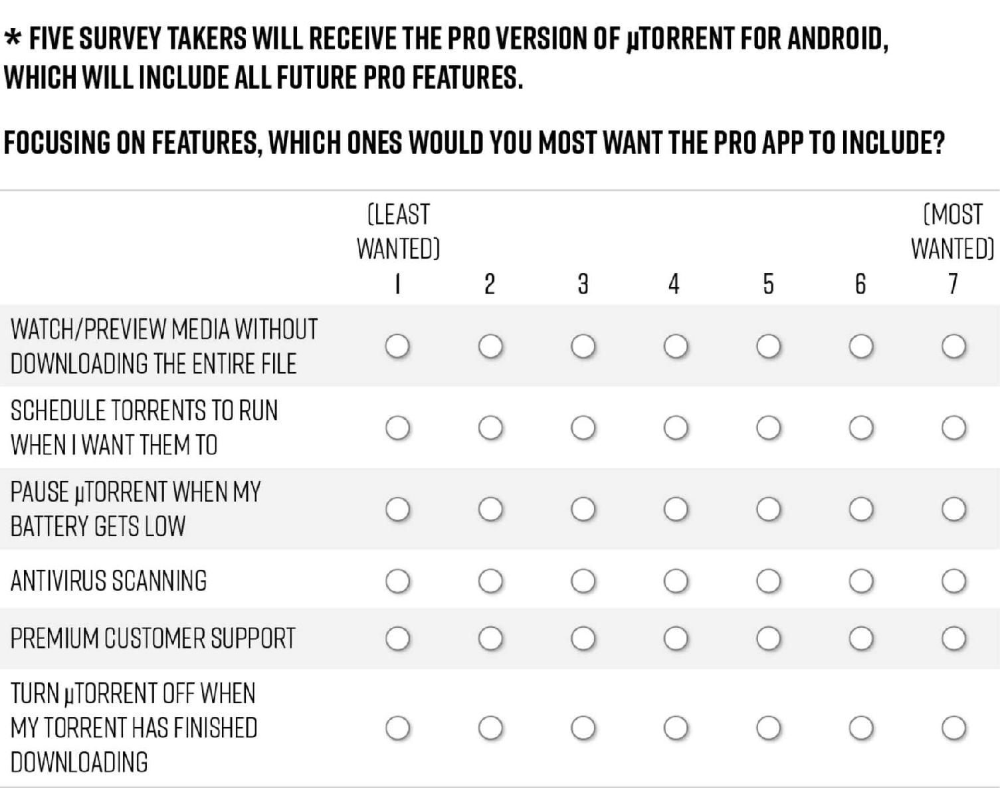
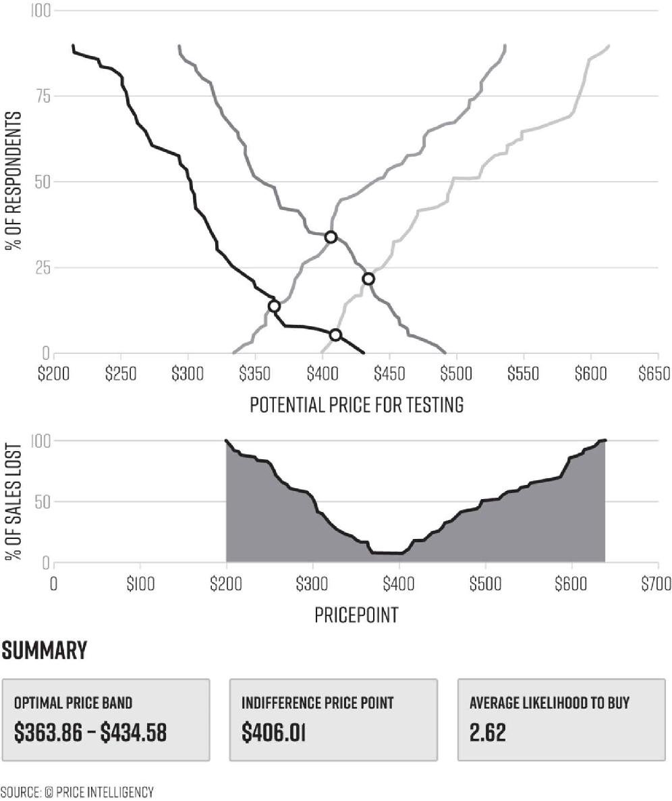
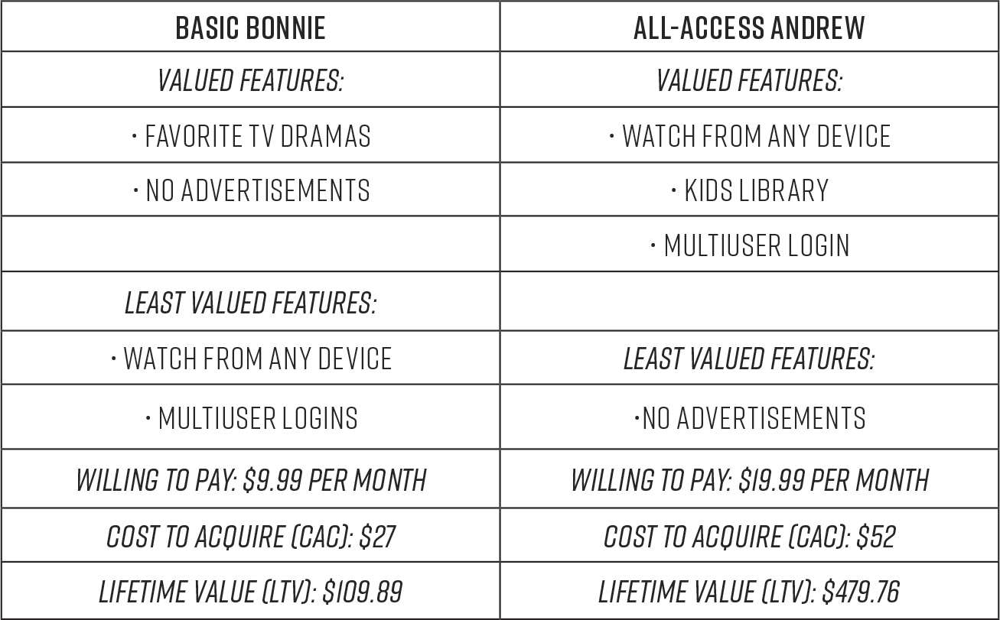
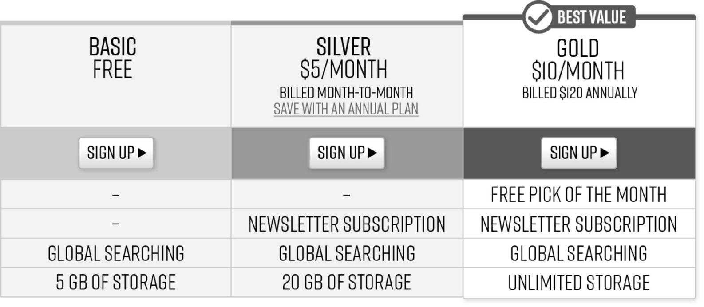
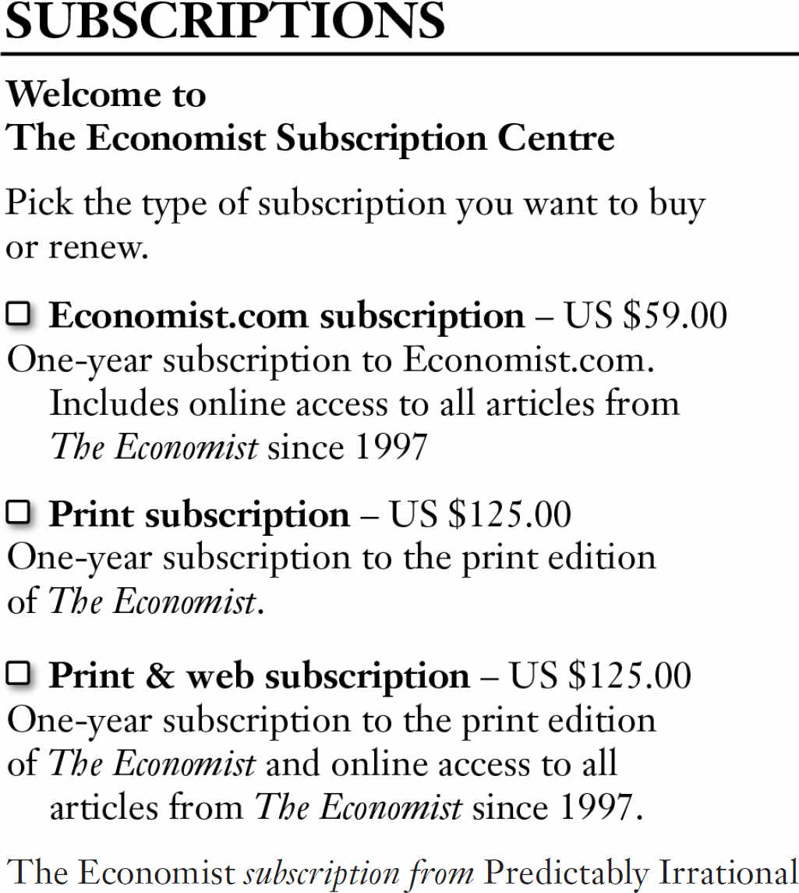

# Chapter Eight: Hacking Monetization

The ultimate goal of acquiring, activating, and retaining customers is, of course, to earn revenue from them. Ideally, you want to earn more revenue from each customer over time, which is referred to as increasing the *lifetime value (LTV)* of customers. So in this chapter, we’ll focus specifically on this mission of earning more money from the base of customers you have. Growth hacking offers many ways to devise experiments for optimizing earnings from your customer base. We’ve noted that many growth teams fail to capitalize on these tactics, focusing mostly on acquisition and customer activation. But in doing so, they’re leaving considerable growth potential on the table. We hope this chapter changes that.

The basic means of increasing revenue per customer vary according to a company’s business model. If you’re a retail company, greater monetization of your customer base is fundamentally achieved by persuading customers to purchase more of whatever it is you sell. If you’re a software as a service (SaaS) company, it is achieved by getting more subscribers to renew their subscriptions, and to do so for more years, as well as by persuading more of them to upgrade to higher-fee levels of service (or in the special case of freemium services, by getting more users to upgrade to paid plans). If your revenue comes from selling advertising space, then driving revenue higher comes essentially from creating more available space to sell and convincing more advertisers to purchase and to pay more for the space they purchase. Each of these models require different tactics, but in all cases growth teams should start with the same fundamental diagnostic process to generate ideas for experiments to try for boosting earnings.

## **MAP YOUR MONETIZATION FUNNEL**

As with all growth hacking efforts, the first step is to perform data analysis that will help you home in on the highest-potential experiments. When it comes to monetization, analysis starts by returning to the basic mapping of the entire customer journey, which, recall from Chapter Six the team should create when it first starts the growth hacking process. The goal at this stage is to highlight all of the opportunities in the journey—from acquisition to retention—for earning revenue from customers. You should also identify all junctures along the way that are presenting barriers to generating revenue, such as friction in the payment process.

For retail companies this mapping is often referred to as the purchase funnel, and the particularly important junctures for increasing revenue are screens displaying items for sale, the shopping cart, and the payment page. For SaaS companies, particularly important junctures are the page or pages explaining the features and prices of different services or plan levels and pages promoting add-ons and upgrades. And for companies that generate their revenue from advertising sales, the most important junctures are all pages where the company has an opportunity to display ads, whether or not the company is as of yet doing so.

The next step after doing this basic mapping is to analyze where in the customer journey the company is making the most money, and where there seem to be *pinch points,* meaning steps where potential earnings are lost, which vary by model. By identifying high-value pages and features within a product, website, or app, growth teams can experiment with ways to generate even more revenue from them, while identifying those pinch points with poor conversion rates and high friction will generate ideas for patching up revenue leaks.

Each of these different business models has typical pinch points within the customer journey. For e-commerce companies, the steps between selecting an item to completing the purchase are a danger zone, with many purchases often abandoned along the way; as a study conducted in early 2016 by Monetate (a service that provides customization capabilities for e-commerce companies) found, while approximately 9.6 percent of website visitors add an item to a shopping cart, only slightly less than 3 percent of them go ahead and make a purchase.[1](part0017_split_009.html#c08-fnt1) For SaaS businesses, the pages displaying the options for plans and their prices are often underoptimized, hurting rates of purchase. For advertising-revenue-driven companies, ads that are too intrusive and turn users off, or that are not visible or compelling in their message or design, are common monetization sinkholes.

These common pinch points are good starting points for assessment, but doing a more detailed analysis of your particular monetization funnel is vital and will almost surely surface additional weak spots specific to your product for the growth team to experiment with. For example, an online retailer might find that some of its product pages are inspiring fewer purchases than industry research about sales for those categories indicates they should be generating. The growth team would likely then decide to focus on experimenting with hacks to boost sales in those categories. Or for a content provider or media company driven by ad revenue, the analysis might reveal that video ads in a particular ad space are not performing nearly as well as the text ads in that space. The growth team might then choose to focus on improving the performance of video ads, by experimenting with their size and placement or the nature of the video itself, such as its length, its call to action, or whether it includes captions or not, among other potential changes.

For a SaaS company the analysis might show a pinch point in the step from free trial sign-up to paid subscription. Digging into causes of the drop-off, analysis may uncover that users who don’t make use of a particular feature during their free trial period are half as likely to purchase the lucrative enterprise plan than those who do. The team might decide to focus on experiments to increase the rate at which trial customers use that feature to lead to more purchases when the trial period ends.

As far as the tools for doing this mapping, many of the common analytics packages that we’ve mentioned so far offer the ability to display simple purchase funnels for e-commerce companies. And advertising services such as DoubleClick provide software for ad response analysis to Web-based companies selling ad space. But the complete mapping of all of the steps in your company’s monetization funnel will often require additional work by a data analyst.

## **HOW MUCH ARE YOU MAKING FROM COHORTS?**

In analyzing your customer data to assess opportunities you also want to divide customers into a number of cohorts, as you did for hacking retention. This time, however, the emphasis is on how much *revenue* groups account for. Thus the first set of cohorts to break out are the higher-profit versus lower-profit customers. For a subscription service, these will generally break down by the level of subscription plan. For an e-commerce company, you can break customers into groups according to how much they spend per year (or month, or week, depending on your model) on purchases. For an ad-revenue-based company, the breakdown will be a little more complex. Because the level of users’ engagement is one of the primary factors in determining the number of ads the company can show and the rate they can charge advertisers for space, ad-based companies should track not only the *average revenue per user (ARPU),* which is the most basic monetization metric for this business model, but also look to segment specific groups of users according to their degree of engagement, and specifically their engagement with ads, such as the amount of time spent on the site or in the app, the number of pages or screens viewed per session, and other engagement metrics that will be specific to the company (such as number of videos a user watches).[2](part0017_split_009.html#c08-fnt2)

In addition to these revenue-related breakdowns, growth teams should again break customers down into many other groups, as was also recommended for hacking retention. These should include, but not be limited to, groups by location, age and gender, types of items purchased or features used, the source through which the customer was acquired (such as from a Google ad or from a referral program), the type of device they used to access the site or app (desktop vs. mobile, Microsoft Windows vs. Apple), the Web browser used, the number of visits to the site or app in a given time period, and the date of their first purchase or action taken. But again, instead of looking for patterns in retention rates, at this stage you want to look for correlations to revenue being made from each of these groups, which will provide ideas for experiments.

To give an example, HotelTonight, a mobile app that allows customers to book last-minute hotel rooms at a significant discount, made an important and unexpected discovery when they analyzed the purchase behavior of their customers based on how they connected to the app (that is, either over Wi-Fi or via 3G or 4G cellular connections). Their hypothesis for the rather confusing finding that customers who connected via 3G or 4G booked at twice the rate of those using the app over Wi-Fi (after all, shouldn’t it be easier to book on Wi-Fi?) was that comparison shopping on *other* travel sites was easier over Wi-Fi than over a spotty data connection; that with spotty data the sluggish competitive websites were too slow and unreliable, leading those customers to more readily book with HotelTonight rather than doing the comparison shopping that could have easily been done over fast Wi-Fi. Using this insight, HotelTonight focused its advertising to target only users who weren’t using Wi-Fi to connect to the Web, and drove higher purchase rates from new customers who saw their ads as a result.[3](part0017_split_009.html#c08-fnt3)

For e-commerce companies, particularly important cohort groupings to look at beyond how much they spend on purchases include number of items purchased, the average amount of a customer’s order, the types of items they purchase, the date of their first purchase, the number of times they make a purchase within a selected time frame (say, per month or per year), and also the time of month or year they typically purchase. So, for example, consider a team that discovers that 55 percent of customers who make one purchase within 90 days go on to spend $500 or more over the next 12 months, whereas 95 percent of customers who make two purchases within 90 days reach or exceed $500 spent over the same period. They might design a series of experiments to encourage all users who make one purchase to buy again within 90 days, such as by offering a steep discount or special perk (such as free shipping), just to those users, via an email sent after 30 days, and then again via a follow-up email sent after 60 days.

For advertising-revenue-model businesses, a more refined breakdown of the user base allows companies to experiment with ways of further monetizing the ad space that already generates high engagement, as well as increasing ad performance—and thus revenue—in spaces where engagement is soft. For example, the growth team for a media company could find that readers who spend at least two minutes on a site are three times as likely to click on an ad as those who spend less time. Armed with that knowledge, they could devise a series of experiments to increase the amount of time the lower-use readers spend on the site, such as by improving the selection of articles they are shown after finishing the one they’re reading. Alternatively, if they were to find that many readers are spending large amounts of time on pages that don’t have particularly effective advertisements on them, such as on the video gallery page or on long-form articles, they could devise experiments with new types of ads on these pages and with alternative placements, such as between videos or embedded in articles to appear as readers progress through them.

For SaaS companies, whose customers tend to be businesses, particularly important cohorts to investigate are the different types of business, as some businesses will have deeper pockets than others, making them more willing to purchase the higher-ticket plans and add-on features. For example, when the growth team at SurveyMonkey, which provides a survey service that can be used by many different kinds of companies for many different purposes—everything from marketing teams doing market research, to customer service teams measuring customer satisfaction, to students running surveys for research papers, among many others—did this analysis, Elena Verna, who leads the company’s growth efforts, and her team discovered (perhaps not surprisingly) that users from educational institutions and nonprofits, as well as college students, were not purchasing the premium services at nearly the rate of other groups of users. So they experimented with offering specially discounted plans to these groups in order to earn more revenue from them by converting them from free to paid customers at a higher rate.

The features of software customers will be the most inclined to pay for will also likely differ by cohorts. For example, a large corporation may have its own internal customer relationship management software system, and therefore be willing to pay a premium for software that explicitly integrates into that existing system, whereas a start-up without established systems may value getting more capabilities out of the box, but not care much about system integrations.

If a product or service is offered internationally, companies should also be sure to look at monetization by country, since different countries have different norms about the types of payment options, and also the fees charged, for services. For example, users in Germany may be more likely to purchase using a specific set of payment options, which are different from the preferred payment method in Russia, resulting in markedly different monetization rates for each country. By the same token, certain business models may be better understood in one country compared to another. Subscription businesses are well understood in the United States, for example, but may be less well received in other countries. Growth teams can experiment with offering different sets of options to different countries to increase monetization within each.[4](part0017_split_009.html#c08-fnt4)

## **LEARNING WHO YOUR CUSTOMERS ARE**

As we’ve seen already, there are numerous ways to segment your customer base to find new insights. And one of the first steps for growth teams trying to better monetize that base is to identify the general groupings of customers who share similar characteristics. These may be that they share the same location, same experience, spend roughly the same amount of money, have the same needs from your product, or a combination of factors (many of which we’ve identified in our potential cohort breakouts). The goal of creating these groupings is to better generate ideas for ways to satisfy customers’ specific wants and needs. Many marketers will be familiar with the exercise of creating *personas,* which are fictional dossiers of a representative customer from each group, for this very purpose. For example, at Inman, we have identified four primary types of customers: new real estate agents with less than three years’ experience; agents with five to ten years of experience; real estate brokers; and franchise and technology executives. These general groupings represent the large common clusters in our customer base, and our growth team has focused on designing experiments such as customized email communications, landing pages, and promotional offerings to drive increased revenue from each group.

## **ASK CUSTOMERS WHAT BENEFITS THEY WANT**

Growth teams should also again make use of surveys and find out directly from customers what improvements in the product, such as possible new features, new plan levels, or perhaps improved selection of items for sale, each of your key customer segments would most like to see. It should go without saying that at the very core of the mission of increasing revenue is providing customers with the services and products they find most appealing and that best serve their needs. And, of course, those desires may differ by different groups of customers.

It should also go without saying that one of the best ways of driving up the volume of your customers’ purchases is to offer them additional items to purchase or features to pay for. (Or, for ad-based models, additional experiences and content to consume more time and engage them further.) Earlier we covered the danger of feature creep, and now it’s important to emphasize the flip side, which is that it’s generally important for companies to steadily, and very judiciously, introduce new items to buy or features to use in order to keep growing revenue. Just think of how relentlessly Amazon has increased the number of categories of items it sells and the choices within those categories, and how vigorously Facebook has continued to introduce new features. The key to making good additions is to focus intensely on offering customers the *benefits* they find most valuable and are willing to pay for, not just bolting on more choices that the company conjectures customers will want.

Growth teams should systematically present ideas for new product or feature offerings to customers through surveys, and then experiment with those products or features before going wide with them. A great example is the survey question that follows that the BitTorrent team sent out to users in order to decide which of a number of possible new features to build. Note that rather than asking users open-ended questions, BitTorrent presents users with a range of benefits and asks which would be most valuable. You can incentivize responses while at the same time validate that users actually want the features they say they do by offering to give a few survey respondents a free copy of the product with the new features included, as you can see BitTorrent did.

SURVEYING USERS ABOUT NEW FEATURES

By asking respondents to rank each option, you may well end up with a couple or a few good choices for next offerings, which the growth team can suggest be added to the product development roadmap schedule. The BitTorrent team went ahead with developing the battery saver feature largely on the basis that it got the strongest responses in this survey, and as a result drove a 47 percent increase in daily revenue. The auto-shutdown feature, which also got a strong response, was subsequently tested as well and, after finding favorable response, was introduced to all app users and increased daily revenue 20 percent.[5](part0017_split_009.html#c08-fnt5)

## **USING DATA AND ALGORITHMS TO CUSTOMIZE OFFERINGS TO CUSTOMERS’ WANTS AND NEEDS**

In Chapter Seven, we discussed personalization as a tactic for building a stronger relationship with customers and thereby helping you retain them. Personalization is also a good monetization tactic, and particularly effective are customized recommendations, usually delivered on the site or in the app while a customer is visiting, and also through email and mobile push messages. Amazon is, once again, a leading practitioner, having developed one of the most powerful “recommendation engines,” the term for the algorithmic programs that customize which items are recommended to you while browsing the site. The selections are based on a combination of a customer’s search history and buying habits, and data about the habits of other shoppers like that customer. All Amazon shoppers in effect see their own version of Amazon with a unique experience tailored to their preferences.

Some recommendation engines, such as Amazon’s, as well as those deployed by Google and Netflix, are incredibly complex, but many are based on relatively simple math. As Colin Zima, the chief analytics officer at Looker, a business intelligence software, explains, it can be relatively easy to generate recommendations based on a simple formula called a *Jaccard index,* or *Jaccard similarity coefficient,* which determines how similar two products are to each other. This helps to recommend additional items that a customer might want to buy because the software has calculated that the items, when purchased, are often purchased together.

JACCARD INDEX

While the formula looks a bit intimidating, in reality it is straightforward. What the equation says is that the similarity between two items, A and B, is equal to the size of the *intersection* of A and B divided by the *union* of A and B. Let’s use our grocery app to walk through a quick example of how it works. Let’s say they want to test the hypothesis that recommending products that are typically purchased together in the app will increase the average order size of each shopping trip. In order to make these recommendations effective, they need to calculate the likelihood that people who purchase one product, such as peanut butter, will also purchase the recommended one, such as jelly, is greater than that likelihood for other product combinations. The team will want to recommend items that are most often purchased together to increase the likelihood that shoppers accept a recommendation and add that additional product to their shopping cart.

The intersection size in the Jaccard index is how many people buy both peanut butter and jelly together, while the union is how many people bought either peanut butter and jelly independently. For example, if you find that 30 people have purchased both peanut butter and jelly together, while 100 people have purchased either peanut butter or jelly independently, you’ll get a Jaccard similarity score of 0.3, which is actually quite high as these scores go. In contrast, the score for peanut butter and, for example, laundry detergent will almost surely be much lower.

This calculation can be done for a host of combinations of every item in the store, creating powerful recommendations that lead to more purchases. And with the best recommendation engines, these product suggestions will only get better and more personalized over time because the more customers shop, the more data is available not just about what an individual customer has purchased, but also about common patterns among a large pool of shoppers. The grocery app recommendation engine might, for example, recommend seltzer water and limes when a shopper puts Red Bull in her shopping cart—even if that shopper has no history of buying any of those products—based on data that shows most people buying Red Bull are purchasing mixers for vodka.[6](part0017_split_009.html#c08-fnt6)

## **DON’T BE INTRUSIVE**

An important word of caution about customizing is that it can backfire if you’re not sensitive about how you’re doing it. If you seem to be prying too deeply into people’s lives, customization becomes, for lack of a better word, creepy. A notorious case is that of the big-box retailer Target inadvertently outing a teenage woman for a pregnancy that she was trying to hide from her parents. The company targeted her with coupons for baby clothing and cribs, and as reporter Charles Duhigg recounted in the *New York Times Magazine,* the girl’s father stormed into the store and confronted a manager, fuming: “She’s still in high school, and you’re sending her coupons for baby clothes and cribs? Are you trying to encourage her to get pregnant?” When the manager called to apologize a few days later, the father reacted very differently. “I had a talk with my daughter,” the man said. “It turns out there’s been some activities in my house I haven’t been completely aware of. She’s due in August. I owe you an apology.” Regardless of the father’s forgiveness, the much-reported story ignited a firestorm among Target customers and consumer rights advocates, who saw the data mining and personalization as an unforgivable intrusion into private life.[7](part0017_split_009.html#c08-fnt7)

You can just as quickly turn people off if you miss the mark about what they would like to see from you. When customers receive suggestions that aren’t appealing, whether from a clothing retailer recommending clothing in a style that’s not their taste, or from Netflix recommending a genre of movie they hate, they are apt to not only be unimpressed, they may even be offended. Think of when you receive a birthday gift from a close friend—or worse, from a spouse—that is not at all your taste. Getting personalization wrong can dramatically hurt revenue rather than improve it.

This is another reason that the experimentation growth teams are set up to do is so vital. A good way to test how effective any planned customization will be is to start by sending personalized email and text notifications to just a small segment of customers to gauge their response and effectiveness. By starting this way, growth teams can get some early data on how effective custom experiences may be and then decide to invest further if results warrant doing so. Most email marketing software allows for a variety of personalization options, ranging from simply inserting the recipients’ names in a message to the ability to deliver different messages and offers based on their past behavior.

Our grocery app team, for example, could send a free delivery coupon to customers who’ve made only one purchase, seeking to spur an additional purchase, and then if that test was successful, the team could experiment with building in notifications in the app itself, promoting free delivery to all users who have made at least one purchase.

## **OPTIMIZING YOUR PRICING**

One of the trickiest issues in growing revenue has always been determining how to price products and services—price them too low and you’re leaving revenue on the table, but price them too high and you’re losing revenue by turning away customers. Companies can get it wrong in a multitude of ways, from not doing enough analysis before setting initial pricing, to running experiments on pricing too infrequently, to pricing above what the market will pay or being too quick to lower prices when they shouldn’t. Growth teams can be of great assistance with getting pricing right by working with product and finance teams to conduct surveys and customer research to find the optimal pricing range to start experimenting within.

Companies selling physical goods have a relatively straightforward path when it comes to setting prices. They need to account for the production or purchase of the items they’re selling, plus the associated costs of marketing and delivering those products to the customer, all while making a profit. But even within this equation, growth teams can experiment based on the information they’ve gained about the purchase behavior and lifetime value of customers. They can also take inspiration from the many principles that have been found to trigger purchases in retail over decades of study. For example, in his book *Priceless: The Myth of Fair Value (and How to Take Advantage of It)* William Poundstone cites the power of using “charm prices,” those that purposefully end with a 9 or 99 or 98 or 95 instead of the full round dollar amount. Hard as it may be to believe, those pricing strategies actually work; Poundstone writes, “In 8 studies published from 1987 to 2004, charm prices were reported to boost sales by an average of 24 percent relative to nearby prices.”[8](part0017_split_009.html#c08-fnt8)

Additional psychologically rooted tactics such as anchoring the value of an item compared with others for sale, and including the dollar sign on prices shown, can all impact behavior. As with anything, these strategies won’t work for every product and every purchaser, but with so many options, a growth team has plenty of opportunities for the continual testing and optimization of pricing to improve revenue growth.

While pricing a physical item is relatively straightforward, what about a piece of software that is delivered over the Web and doesn’t have raw materials costs? Patrick Campbell, CEO of Price Intelligently, offers a wealth of advice about best practices for finding the pricing sweet spot for SaaS products, and suggests starting with, as we’ve recommended with many other growth initiatives, sending out a survey that asks the recipients not only what features are most important to them—but also how much they are willing to pay, by asking the following four questions in the following order:

• At what price point does [your product] become too expensive that you’d never consider purchasing it?

• At what price point does [your product] start to become expensive, but you’d still consider purchasing it?

• At what price point does [your product] start to become a really good deal?

• At what price point does [your product] start to become too cheap that you’d question the quality of it?[9](part0017_split_009.html#c08-fnt9)

The responses will give you a range of prices that people think are too high, too low, and just right, which the growth team should map onto a graph like this:

HOW MUCH ARE YOUR CUSTOMERS WILLING TO PAY?

The roughly diamond-shaped terrain in the middle of the graph is the ideal testing range for your pricing experiments. Of course the customer responses shouldn’t be the only data taken into consideration; a complex set of factors must be considered in pricing, such as the costs of production and distribution, marketing, and general overhead, as well as market research about competing products. And the range of prices that growth teams should run experiments with must be determined in collaboration with, and be approved by, the finance team, and by executive leadership.

Some would also argue that asking customers directly for a price only gives you “lowball” insights, because the customers will always be looking out for their own interest. Yet, even for those who feel pricing can’t be directly gleaned from customers, most agree that using customer feedback in the form of surveys and interviews should at the very least be used to guide you in deciding what you’re charging for the product—as well as who your target customer is who will be willing to pay that price. And, in fact, that’s why the experimental approach to pricing is so critical. Too many companies set a price and then treat it as if it’s set in stone, when in reality the team should be continually experimenting with it just as they do with other elements of the business. Whether you choose to use the exact wording of the pricing questions listed above, modify them to fit your specific needs, or come up with entirely new ones of your own, the key is to leverage customer feedback to inform your ongoing experimentation.

You’ll then want to combine this pricing research with the feature research we covered earlier to create a matrix of the features that people find most valuable and the price points for which they’re willing to pay. This gives you what Campbell calls *persona/pricing fit,* which helps you confidently build product plans and pricing that meet the needs and expectations of the buyers in your audience.

Let’s return to the hypothetical video streaming company we met in Chapter Seven to see how this works in practice. Through surveying and cohort analysis, they may have identified two very different types of customers using the service: a group that only wants the basic ability to watch shows and movies when they want, without ads, and another group, which wants a much more robust entertainment experience. As discussed earlier, the growth team comes up with prototypical customers that represent each group: Basic Bonnie represents the customer type that is no-frills and wants simple video streaming, while All-Access Andrew represents a customer who wants (and is willing to pay for) all the bells and whistles the service offers.

Understanding these differences in preferences will give the growth team areas of experimentation to explore. For example, since some customers are willing to pay a good deal more than the basic $9.99 monthly subscription, the team might experiment with offering some of these customers an even higher-priced plan, which might give them access to watch on more devices, or allow more family members access to the service at once.

No matter what product you are trying to monetize, as you create options for customers, you want to be sure that your pricing is in proportion to the value they are getting from the use of your product. And in the case of certain products, most notably software, often you should charge according to usage. For example, HubSpot’s marketing software charges for the number of contacts stored in its databases, because that is a good metric of the use that customers are making of the service and the value they are deriving from it. If instead Hubspot charged per user account a company signs up for, a likely outcome would be that companies would sign up for just a couple of accounts and have many employees share them, which would mean that the revenue HubSpot made was out of proportion with the use of the product. Unbounce charges for the number of visitors that come to the landing pages created through the software, and SurveyMonkey charges for the number of responses collected through their survey software; both are metrics directly tied to the value users are getting from the services. These metrics on which charges to customers are based are called *value metrics*.

To determine your value metric, Campbell recommends asking yourself three questions:

1. Does the value metric align with where your customer perceives value?

2. Does the metric scale as the customer uses the product more?

3. Is it easy to understand?[10](part0017_split_009.html#c08-fnt10)

SurveyMonkey’s value metric clearly meets these criteria; it’s easy to understand why they charge based on the number of answers that surveys produce, because the more answers that result from a survey, the higher the value of that survey is, and, obviously, this value scales up the more surveys a user creates and sends.

But it’s not enough to just set the right prices; equally important is how you present and communicate those prices to customers on your pricing page and elsewhere. If your model involves multiple pricing options, it’s important that the features of the various plans can be easily compared with one another so that customers can evaluate readily whether or not the extra charge for any given plan above the basic level is worthwhile to them. They should be able to see all of the basic features in the list of features for each plan, and then the added benefits of each plan should be clearly listed. You can see this in action on this hypothetical pricing page that follows.

Growth teams working on ad-revenue-based products should experiment with the pricing of the advertising units. Experiments should be run with different ad unit types—such as with standard banner ads, those that include animation or interactive elements (i.e., rich ads) versus video ads—and also with their placement to compare user engagement. With that data about engagement in hand, teams can experiment with the payment models for various ad space offerings, such as plans based on a price per user who clicks on an ad, pay per view, or perhaps the affiliate model, according to which the ad space provider is paid a referral fee for users who click through an advertisement and then take an action or make a purchase on the advertiser’s site.

TYPICAL SAAS PRICING PAGE

But remember, once pricing is set, it should not be checked off the list and never revisited. Like all other growth levers we’ve covered so far, pricing should be continually experimented with. We recommend that growth teams for SaaS products run tests of pricing changes at least once a fiscal quarter, whereas e-commerce companies are advised to experiment much more fluidly and continuously with pricing, as Amazon does. Called *dynamic pricing,* this strategy draws on data about many different factors, such as inventory, seasonality, time of day, a shopper’s past purchase history, the type of computer they’re using, and more, to continuously change and test different prices in order to arrive at the one that results in the most purchases at the highest profit. But beware: as with personalization, dynamic pricing can backfire if done wrong, as the travel website Orbitz learned when news broke that users who shopped for travel deals on the site using a Mac computer were routinely shown higher-priced hotels and travel packages than those who accessed the site on a PC. Indeed, Orbitz research had shown that Mac users were willing and able to spend up to 30 percent more on hotel rooms, and the company used the data to extract more revenue from them.[11](part0017_split_009.html#c08-fnt11) Needless to say that upon learning this, Mac customers were not pleased.

Ad-based growth teams should be optimizing pricing in a similarly fluid way. The largest advertising platforms, such as Google and Facebook, use an auction model to set the value of their ad inventory, which essentially means that when advertisers want to place an ad they set a bid price for what they’re willing to pay, then the site gives the ad space to the highest bidder (this is a dramatic oversimplification; the auction processes are dauntingly complex). When that bidder’s budget is exhausted, often by hitting a daily cap or other restriction, the next highest bidder is given the inventory, and so on, until all available inventory is used. These companies also use elements such as ad quality and customer response to factor into which advertisers get what space and which ads are shown more prominently, which is a strong incentive for advertisers to make higher-quality ads. That is, of course, in the interests of both the advertiser and the advertising platform. Smaller publishers who don’t have this kind of bidding system should continuously experiment with pricing of their inventory based on supply and demand to drive the best revenue growth.

## **PRICING RELATIVITY**

As teams collaborate with management to craft pricing experiments, a number of findings about pricing that have been established by long practice and research should be considered. One of these is *pricing relativity,* which is the principle that people’s perceptions of prices are influenced by the prices of other options they are offered. In his seminal book *Predictably Irrational,* Dan Ariely describes an experiment that revealed just how much consumers’ decisions about the price they would like to pay are affected by the set of options they have to choose from. The idea for the experiment was born when Ariely noticed that *The* *Economist* magazine was using a rather perplexing pricing plan for subscriptions: the online-only edition for $59 per year, the print edition of the magazine for $125 per year, or the print-and-Web combo also for $125.

Intrigued by the two differing subscription options offered at the same price, Ariely gave the subscription page pictured above to a group of 100 students at MIT and asked them to choose an option. Understandably, they all either chose the Web-only edition or the print-and-Web edition, with 84 percent choosing the latter package. He then removed the middle, print-only option (which nobody chose) and then asked a fresh batch of 100 students to make a choice between just two options. Suddenly the results were astonishingly different. Now, 68 percent of the students (as compared with the 16 percent) chose the first, lower-priced Web-only option. Why? Because simply seeing that middle option gave potential customers a much easier way to compare the value of each offer, and many saw that they were essentially getting the Web subscription for free—what a deal!—leading them to choose the higher-priced option. The middle package is sometimes called a *decoy package* and can be a powerful way to drive customers to higher-priced products.[12](part0017_split_009.html#c08-fnt12)

SUBSCRIPTION OPTIONS

Digital marketer Steve Young used this decoy product to profound effect at SmartShoot, a marketplace that connects professional videographers and photographers with people who need their services. Originally, when the company offered two options, a monthly option and an annual option, 40 percent of visitors bought the annual plan and the remainder purchased a monthly package. Young and team hypothesized that by offering a slightly inferior (and slightly cheaper) offer to their $299 plan they could leverage the pricing relativity phenomenon and drive more annual purchases. So they added a decoy product that cost just $10 less than the $299 plan and severely limited the features available. As a result, their conversion rate soared by 233 percent with 86 percent of buyers choosing the $299 annual product.[13](part0017_split_009.html#c08-fnt13)

The lesson is unmistakable: teams should experiment with a product option that is priced to help customers better understand the relative value of the items and plans you hope to sell.

## **LESS IS NOT ALWAYS MORE**

When trying to increase purchase volume, the impulse to lower the price can be powerful. Lower prices do often lead to a higher volume of sales—but not necessarily. In some cases, lowering the price can actually hurt sales or at least fail to provide the boost in demand hoped for. That’s why it’s so important to experiment with lowering prices before going ahead and making them available to your whole customer base.

At Qualaroo, we boosted our revenue significantly by conducting experiments that showed us we should actually *raise* prices. We started out with the hypothesis that if we improved the features of the freemium version of the online survey widget that Qualaroo sells, more of those who started using it would be more willing to upgrade to the paid version so they could also get the extended features and additional surveying capability. But that hypothesis failed; the improved free version generated no uptick whatsoever in paid product sales. We then hypothesized that perhaps our target customers had little sensitivity to the price and feature combinations, so we reversed course and experimented with *higher* prices, and as it turned out, our second hypothesis was right: by charging more, we made the product more appealing to large customers who were looking for best-in-class product, not necessarily the lowest-cost option. Psychologist and bestselling author Robert Cialdini explains this phenomenon: he says this is the result of people using price as a signal for quality, and it’s particularly common in markets such as technology and professional services. And indeed we found it to hold true as we proceeded to raise prices three times over the course of the next year and a half, driving big revenue growth and opening up access to a whole new market of much bigger companies who wanted the surveying capabilities.

Even if you aren’t selling a Web service or a tech product, the point is that your customers might be less price sensitive than you think—and the growth hacking process provides a simple way of figuring out just how price sensitive they actually are. This doesn’t just apply to the pricing of the products and services being sold, but also to the discounts being given to customers to take action. At Inman, the team tested giving a discount to visitors who were abandoning their purchase in the middle of checking out by offering a limited-time 25 percent off their purchase to complete the checkout process. Not surprisingly, this discount drove a significant lift over offering no discount at all, increasing the rate at which people completed the purchase by 39 percent. But when they ran another test, testing the 25 percent discount against a 10 percent discount, they found that the smaller discount still converted roughly the same amount of additional customers—and by offering a smaller discount they were able to improve the revenue captured from the sign-up process by 18.9 percent.

## **PROCEED WITH CAUTION**

While testing pricing is critical, it can also be tricky because customers generally don’t react well to noticeable changes in prices. So the growth team must ensure that the customer experience remains consistent; for example, once customers see an experimental variant of a pricing page they should always see that variant on subsequent visits. To understand how shifting pricing and features can turn off potential customers, just imagine how you feel when you see something you paid $100 for listed just the next day for $75!

Another challenge specific to products that are sold by a sales team is that it can be difficult to coordinate pricing tests with the reps who are actively working to close prospects (and who may receive a higher commission when a product is priced higher). Sales teams must also always know which version of the page the visitor is seeing (just think of how embarrassing and detrimental it could be to have a salesperson offering one price, while a prospect is seeing an experimental pricing page that looks completely different or has different pricing), which means connecting the growth team experiments with the sales team’s internal customer management database. Building connections between the two can be done by the software team or by connecting third party tools such as Optimizely and Salesforce with a technology such as Zapier or Segment, which act as plumbing to send data between disparate technology systems.

A final challenge is that growth teams often don’t have the individual authority to test changes to pricing on their own, as it requires the coordinated effort of the product, finance, and sales teams (if the company uses a sales-based model). Therefore, it’s essential the pricing and discounting tests are done in a considered, well-coordinated fashion, ensuring that all stakeholders in all parts of the business are aware of the various pricing experiments being run and their impact on both the user experience and other critical business metrics, such as margin, recurring revenue, and average order size for each customer.

## **THE PENNY GAP**

At the opposite end of the pricing consideration is the challenge that arises when customers have become so used to getting products like yours for free—as is often the case for online software or apps—they don’t want to pay anything for it at all. Venture capitalist Josh Kopelman dubbed this pricing conundrum the *penny gap,* which refers to the large difference consumers perceive between a product being free and paying even a small amount for it.

In fact, in some cases, particularly with Web or digital products, the friction of asking people to pay even a small amount can be so great that sometimes offering your product for free is actually cheaper than the cost of paying to acquire a customer who is willing to pay for it. Moreover, monetizing free users through ads, or by charging for add-on features, can be extremely lucrative. Take the case of Stuart K. Hall’s 7 Minute Workout app. After promoting the app as a pay-up-front product for a few weeks, sending out press releases with promo codes with minimal effect on downloads, Hall decided to make the app free to see what would happen. Within three days, the app’s downloads had grown to an average of 72,000 per day, or around 2,500 times what they had been for the paid app. It became the number one fitness iPhone app in forty-nine countries. But it wasn’t just downloads that surged; the app’s revenue soared as well. That was because when Hall made his app free, he added in-app purchases by way of a pro upgrade that provided workout tracking and customization. These few simple upgrade features led to a 300 percent increase in overall revenue, even though 97 percent of users didn’t pay anything to use the app.[14](part0017_split_009.html#c08-fnt14)

The fact is, if your product is a mobile app, you may not really have any option but to offer it for free. A quick look at revenue for the top-grossing iOS games makes this case. At the time of this writing, of the highest-grossing games in Apple’s App Store, not one of the top 50 games is a pay-up-front product. They are all free for download and either make their money from ads or charge for in-app upgrades to unlock additional features.[15](part0017_split_009.html#c08-fnt15)

If your primary source of monetization is add-ons and upgrades, it’s even more critical to optimize your strategy for persuading more of the free users to upgrade. Luckily, several tactics have already been developed that growth teams can experiment with. One is displaying features that are only available to paid users while free users are making use of the product. Spotify, the popular music streaming app, does this brilliantly, by displaying some of its premium features within the free user experience. When free users try to access these features, they encounter a call to action to unlock the premium features by upgrading from the free version of the software to a paid subscription.

Beyond offering premium features for purchase, growth teams can experiment with charging a subscription price for upgraded versions, or introduce virtual goods or in-app currency, a strategy that many popular games—from Candy Crush to Pokémon Go—have successfully used to drive monetization. Electronic Arts is one prominent game company that offers a variety of games that use digital currencies that allow game players to advance more quickly in the games or to add characters to them and more. These in-game virtual goods are so popular that they contributed more than $173 million in revenue for Electronic Arts in its fiscal Q4 of 2015.[16](part0017_split_009.html#c08-fnt16) And this strategy doesn’t apply just to games. There are examples of everything—from dating apps to photo apps and beyond—that offer virtual currency as a monetization strategy. For example, the popular dating app Coffee Meets Bagel sells “beans”—a currency that can be used to do things like get a second chance with a missed match, or see the identity of friends a user shares with a potential match.

Growth teams should also experiment with *combinations* of the ways in which they can generate revenue for a freemium product. Many successful apps use a mix of advertising, referral fees, and sponsorships to generate revenue. Teams may also consider monetizing user data and activity by selling access to it. For example, an app may charge other companies for access to its user activity via a subscription model, or via revenue sharing, such as by partnering with an online retailer to sell goods within the app.

In all cases, the growth team should let data lead the way, measuring what’s working and what customers are interested in paying for, and experimenting to meet those needs and maximize the revenue over time.

## **BONE UP ON CONSUMER PSYCHOLOGY**

Surveys can be powerful to uncover what people are willing to pay for, but we all know that consumers are not always rational or predictable. They say they want one thing, yet pay for another. So while customer feedback is a powerful way to come up with hacks for experimentation, understanding the psychology of consumer behavior is enormously valuable in monetizing those customers, and in growing revenue.

A wealth of fascinating research has provided powerful insights into the psychology of why people make purchases that growth teams can use as inspirations for experiments to increase earnings. Daniel Kahneman, the Nobel Prize–winning psychologist who has studied and written extensively about behavioral economics, shared many such insights in his book *Thinking, Fast and Slow*. Similarly, economist Daniel Ariely covers eye-opening experiments he has conducted about how consumers make purchasing decisions, such as we saw earlier with *The* *Economist* subscription example in his book *Predictably Irrational.* Another fascinating look at how consumers make choices is *The Art of Choosing,* by one of the world’s leading specialists on the psychology of choice, economist Sheena Iyengar. A deep dive on all that these researchers—and many others who have conducted important work in the field—have uncovered about consumer behavior is outside the scope of this chapter, but we recommend that you consult these books to learn more and generate new revenue ideas to experiment with.

However, here we will offer a revisit of Robert Cialdini’s six principles for influencing consumer behavior, which we discussed in Chapter Five in regard to activating customers, and look at how they can be used to inspire hacks to try for monetization as well.

### THE PRINCIPLE OF RECIPROCITY

In essence, this is the principle that we as humans are hardwired to return a favor. Companies and marketers can put the power of reciprocity with growth experiments that center around *giving* before asking for a commitment to purchase.

Costco is a master at applying this principle, making in-store samples and demonstrations a highlight of the shopping experience at the chain. Company spokesman Giovanni DeMeo has said that some of the product demonstrations have increased purchasing by as much as an astonishing 2,000 percent, in part because when customers feel that they have received something for free—whether it’s a slice of pastrami or a tutorial on how to use a state-of-the-art veggie peeler—they feel compelled to reciprocate with a purchase.[17](part0017_split_009.html#c08-fnt17) The HubSpot marketing grader that we discussed earlier uses this principle as well. It gives you a robust analysis of your website for free, because growth experiments have shown that you are likely more inclined to talk to a HubSpot salesperson, subscribe to their emails, or recommend the brand as a result. Giving away webinars, videos, whitepapers, and other content can also trigger this reciprocity, as can free upgrades to shipping costs and timing and on-the-spot discounts for e-commerce. In fact, the freemium model in SaaS is also a take on reciprocity, in that they are giving a set of free features away with the expectation that some people will upgrade as a result of their successful use and need of the product.

### THE PRINCIPLE OF COMMITMENT AND CONSISTENCY

Recall that Cialdini found that once we’ve taken an action we are likely to take another one that is consistent with that previous action. It’s why car salesmen are instructed to get potential buyers to initial a term sheet with no binding obligation, because the act of initialing one piece of paper makes you more likely to sign the purchase documents for the car later in the process. This same idea is used by the eyeglass retailer Warby Parker. Its home-try-on program lets prospective customers select and receive up to five sets of eyeglasses to try on before buying. Once you have a pair of their glasses on your face, it’s unlikely that you *won’t* move forward with the purchase.

You can use this principle to drive revenue by asking users to make small commitments up front to lead to larger purchases later on. Amazon uses this principle with their Wish List feature. They know that when you add books or items to your Wish List, you are more likely to buy the item because you have already acknowledged your desire to do so. As another example, sending a customer who recently purchased something on your site a quick follow-up with an incentive to make another purchase can lead to additional purchases from people who want to be consistent with their earlier purchase decision. Even asking a recent shopper if they’ll buy again from you in the future can be enough to trigger additional purchases down the line.

### THE PRINCIPLE OF SOCIAL PROOF

The desire to follow social norms or conform to the behavior of others is among the most powerful motivators to purchase. Cialdini highlights the case of Her Majesty’s Revenue & Customs (England’s version of the IRS), who in 2009 faced an incredible amount of unpaid debts from citizens behind on their taxes. Their collection efforts in the form of mailings were proving ineffective, so the HMRC teamed up with Cialdini’s coauthor Steve Martin to try a new approach leveraging the power of social proof that proved incredibly simple and effective. The HMRC added a single sentence to the collection letters to a pilot group of delinquent taxpayers: a statement of the fact that most UK residents pay their taxes fully and on time. As a result, collections jumped from 57 to 86 percent in the pilot group, which added up to collections of 560 million pounds (out of the outstanding 650 million pounds) of tax money. Simply reminding people of the social norms around paying their taxes produced a staggering improvement.[18](part0017_split_009.html#c08-fnt18)

Too many companies get social proof wrong, featuring unbelievable or nonspecific testimonials to try to persuade customers to buy higher-priced items, such as a restaurant that might include a testimonial on the back of their menu like “Best steak in town. Love it!” Yet this can actually *dissuade* shoppers from ordering that higher-priced item by raising doubts about the authenticity of the claim. Conversion expert Angie Schottmuller identifies seven core factors that make reviews and testimonials effective, for which she coined the acronym CRAVENS, which stands for Credible, Relevant, Attractive, Visual, Enumerated, Nearby purchase points, and Specific.[19](part0017_split_009.html#c08-fnt19)

Flower delivery shop daFlores drove revenue higher when they added a testimonial that met these simple criteria to their e-commerce site. The original version of the site displayed some text-based testimonials, but after discovering that new visitors didn’t know much about their brand, they replaced those testimonials with an image that celebrated the company’s 600,000 Facebook fans. Turned out that showcasing their large social following in a credible, relevant, attractive, enumerated, visual way resulted in a 44 percent increase in revenue from shoppers who likely felt in better company shopping on a site with so many happy customers.[20](part0017_split_009.html#c08-fnt20)

One monetization opportunity for growth teams is to increase the visibility of social proof along the conversion path to purchase. Adding testimonials, the logos of prominent customers, the results garnered from users of your product, and the number of people currently shopping or booking on your website are all ways to validate the decision-making process of your customers with information based on what other users have already done. For example, ModCloth, the women’s online retailer, uses their Be the Buyer program to let users decide which styles and sizes of clothes to sell, but they also indicate these items with a badge to indicate to shoppers that these are “buyer approved” items. Those with the Be the Buyer badge sell at twice the rate of other items on the site.[21](part0017_split_009.html#c08-fnt21)

### THE PRINCIPLE OF AUTHORITY

Research shows that we are more likely to trust experts and people in positions of authority than an average person. Even the inclusion of subtle language that indicates authority can increase purchase behavior, as Kaya Skin Clinic proved when they generated a 22 percent increase in sales simply by adding the word *expert* to their call to action on their website, which then read “I want an expert opinion. Sign me up!”[22](part0017_split_009.html#c08-fnt22)

The principle of authority explains why one out of every four television commercials features celebrity endorsements, and why brands founded by celebrities—like actress Jessica Alba’s Honest Company—have been so successful. Depending on your industry and budget, celebrity endorsements may be out of scope, but each niche has influencers and tastemakers who have credibility within the audiences you’re targeting. Growth teams can experiment with featuring such influencers to drive improved revenue growth through the principle of authority.

### THE PRINCIPLE OF LIKING

We also buy more when a product or service is recommended by people we like. Airbnb leveraged the principle of liking when they reengineered their friend referral program by including a photo of the person sending the referral with the invite. The addition of this personal touch was part of the reason why their new referral program saw a 300 percent increase per day in sign-ups and nights booked from friend referrals to Airbnb.[23](part0017_split_009.html#c08-fnt23)

If you’re looking for experiments to try to leverage the principle of liking, consider using images of real people—like your salespeople, or your customers—on your website. In addition, friendly, welcoming copy on your landing pages can trigger a similar response. Recall how Nasty Gal’s founder, Sophia Amoruso, took poorly selling items and styled them on the site’s most popular models to stoke sales? This is liking in action. The good news is that many of these changes don’t require massive technical overhauls, and can be quick experiments the growth team can run to generate higher volume or purchases or to drive people to higher-priced items.

### THE PRINCIPLE OF SCARCITY

When we feel like we’re going to miss out, we’re more likely to take action. Booking.com uses the principle of scarcity to increase revenue exceptionally well. The travel deals site shows deals that you’ve already missed, letting visitors know that these deals won’t be around forever. They also show how many other people have booked the deals today, how many rooms are left at the hotels, and even how many people are looking at the listing at that moment—another trigger that says to customers, “You better buy now, before it’s too late.”

Using scarcity as a purchasing tactic is about triggering the *fear of missing out* (or *FOMO*) in your shoppers. You can run experiments that limit the time of promotions, show remaining inventory when there are only a few of each item left, limit the number of appointment spots available to book through for consultants, or limit the number of people who can take advantage of a special offer. When something is about to sell out, is hard to get, a deal is expiring, or your customers may miss out one way or another, you’re more likely to make the sale than otherwise.

—

Having now made the full circuit through the four key types of experimentation for driving growth—acquisition, activation, retention, and monetization—in the next, and final, chapter, we’ll explore how vital it is for growth teams to continue to work on all of these fronts to avoid falling into the common trap of growth stalls: lulls in growth that can, and often do, spell disaster, even for leading brands. Remember, growth teams should never rest on their laurels. In a twist on the old adage “You snooze, you lose,” today’s hypercompetitive business environment assures that if you stall, you will fall.

As we’ve seen throughout the book, driving growth is a job that is never truly done. The breakout companies that sustain their success are those who constantly push for more, leveraging their success, capitalizing on new opportunities, and creating a virtuous cycle of growth.

In 2017 the Facebook growth team will celebrate its 10-year anniversary. Going from a team of five tasked with reversing the social network’s slowing adoption, to multiple teams, across numerous initiatives, responsible for sustaining the seemingly unstoppable growth of the largest social network of all time, the growth team has been instrumental to Facebook’s extraordinary growth over that decade, breaking all preconceived notions about just how large an online community could become. The company now serves more than one billion people per day,[1](part0017_split_010.html#c09-fnt1) with plenty of room for further growth around the world, and untold opportunities yet to be discovered for increasing revenue from that massive user base. Moreover, the unrelenting growth both in the number of users and in their level of engagement, has been the fuel of the company’s strong support among financial investors and the public market who have rewarded it with plentiful capital to fund innovation, including long-term moonshot bets like the company’s foray into virtual reality with the purchase of device maker Oculus, and its Internet Everywhere initiative, which includes an audacious plan to deliver wireless Internet to remote corners of the globe with solar-powered drone aircraft. That’s what we mean when we talk about a virtuous growth cycle.

Whether yours is a growth team of 5 people or 500, and whether you work for a company valued in the millions or one that is still getting off the ground, you, too, can follow their example of continuously and relentlessly experimenting on all fronts with new ways to push growth.

